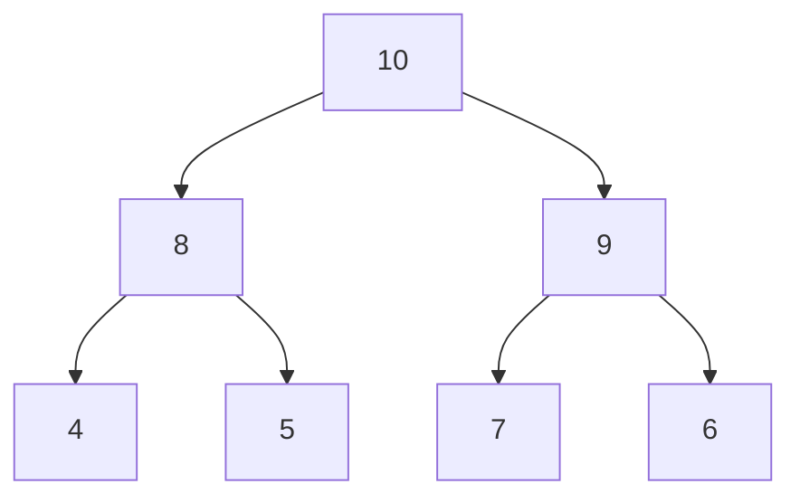

import Tabs from '@theme/Tabs';
import TabItem from '@theme/TabItem';

# 🌲 Advanced Data Structures: Heaps

## Overview

A Heap is a specialized tree-based data structure that satisfies the heap property. In a max heap, for any given node I, the value of I is greater than or equal to the values of its children. In a min heap, the value of I is less than or equal to the values of its children.

### Real World Analogy
Think of a corporate hierarchy where each manager (node) has a higher rank (priority) than their direct reports (child nodes). In a min heap, imagine a priority queue at a hospital emergency room, where patients with the most critical conditions (lowest priority number) are attended to first.

## 🔑 Key Concepts

### Components
1. **Complete Binary Tree**: The underlying structure
2. **Heap Property**: Order relationship between parent and children
3. **Array Implementation**: Efficient representation using arrays

### Types
1. **Max Heap**: Parent larger than children
2. **Min Heap**: Parent smaller than children
3. **Binary Heap**: Each node has at most two children

### Operations
- **Insert**: O(log n)
- **Extract Min/Max**: O(log n)
- **Peek**: O(1)
- **Heapify**: O(n)

### Visual Representation



## 💻 Implementation

### Binary Max Heap Implementation

<Tabs>
  <TabItem value="java" label="Java">
```java
public class MaxHeap {
    private int[] heap;
    private int size;
    private int capacity;

    public MaxHeap(int capacity) {
        this.capacity = capacity;
        this.size = 0;
        this.heap = new int[capacity];
    }

    private int parent(int index) {
        return (index - 1) / 2;
    }

    private int leftChild(int index) {
        return 2 * index + 1;
    }

    private int rightChild(int index) {
        return 2 * index + 2;
    }

    private void swap(int i, int j) {
        int temp = heap[i];
        heap[i] = heap[j];
        heap[j] = temp;
    }

    public void insert(int value) {
        if (size >= capacity) {
            throw new IllegalStateException("Heap is full");
        }

        heap[size] = value;
        siftUp(size);
        size++;
    }

    private void siftUp(int index) {
        while (index > 0 && heap[parent(index)] < heap[index]) {
            swap(index, parent(index));
            index = parent(index);
        }
    }

    public int extractMax() {
        if (size == 0) {
            throw new IllegalStateException("Heap is empty");
        }

        int max = heap[0];
        heap[0] = heap[size - 1];
        size--;
        siftDown(0);

        return max;
    }

    private void siftDown(int index) {
        int maxIndex = index;
        int left = leftChild(index);
        int right = rightChild(index);

        if (left < size && heap[left] > heap[maxIndex]) {
            maxIndex = left;
        }

        if (right < size && heap[right] > heap[maxIndex]) {
            maxIndex = right;
        }

        if (index != maxIndex) {
            swap(index, maxIndex);
            siftDown(maxIndex);
        }
    }

    public int peek() {
        if (size == 0) {
            throw new IllegalStateException("Heap is empty");
        }
        return heap[0];
    }
}
```
  </TabItem>
  <TabItem value="go" label="Go">
```go
package heap

type MaxHeap struct {
    heap     []int
    size     int
    capacity int
}

func NewMaxHeap(capacity int) *MaxHeap {
    return &MaxHeap{
        heap:     make([]int, capacity),
        size:     0,
        capacity: capacity,
    }
}

func (h *MaxHeap) parent(index int) int {
    return (index - 1) / 2
}

func (h *MaxHeap) leftChild(index int) int {
    return 2*index + 1
}

func (h *MaxHeap) rightChild(index int) int {
    return 2*index + 2
}

func (h *MaxHeap) swap(i, j int) {
    h.heap[i], h.heap[j] = h.heap[j], h.heap[i]
}

func (h *MaxHeap) Insert(value int) error {
    if h.size >= h.capacity {
        return fmt.Errorf("heap is full")
    }

    h.heap[h.size] = value
    h.siftUp(h.size)
    h.size++
    return nil
}

func (h *MaxHeap) siftUp(index int) {
    for index > 0 && h.heap[h.parent(index)] < h.heap[index] {
        h.swap(index, h.parent(index))
        index = h.parent(index)
    }
}

func (h *MaxHeap) ExtractMax() (int, error) {
    if h.size == 0 {
        return 0, fmt.Errorf("heap is empty")
    }

    max := h.heap[0]
    h.heap[0] = h.heap[h.size-1]
    h.size--
    h.siftDown(0)

    return max, nil
}

func (h *MaxHeap) siftDown(index int) {
    maxIndex := index
    left := h.leftChild(index)
    right := h.rightChild(index)

    if left < h.size && h.heap[left] > h.heap[maxIndex] {
        maxIndex = left
    }

    if right < h.size && h.heap[right] > h.heap[maxIndex] {
        maxIndex = right
    }

    if index != maxIndex {
        h.swap(index, maxIndex)
        h.siftDown(maxIndex)
    }
}

func (h *MaxHeap) Peek() (int, error) {
    if h.size == 0 {
        return 0, fmt.Errorf("heap is empty")
    }
    return h.heap[0], nil
}
```
  </TabItem>
</Tabs>

## 🔄 Related Patterns

1. **Priority Queue**
    - Built on top of heaps
    - Natural implementation for task scheduling

2. **Binary Search Tree**
    - Complements heaps for different use cases
    - Better for range queries and ordered traversal

3. **Graph Algorithms**
    - Used in Dijkstra's algorithm
    - Essential for path finding implementations

## ⚙️ Best Practices

### Configuration
1. **Initial Capacity**
    - Choose based on expected data size
    - Consider growth patterns

2. **Type Selection**
    - Max heap vs Min heap based on requirements
    - Consider customized comparison for objects

### Monitoring
1. **Size Tracking**
2. **Operation Latency**
3. **Memory Usage**
4. **Rebalancing Frequency**

### Testing
1. **Edge Cases**
    - Empty heap
    - Single element
    - Full capacity
2. **Performance Tests**
    - Large datasets
    - Random vs ordered input
3. **Property Validation**
    - Heap invariant
    - Size constraints

## 🚫 Common Pitfalls

1. **Incorrect Heap Property**
    - Impact: Invalid priority ordering
    - Solution: Validate heap property after operations

2. **Memory Leaks**
    - Impact: Growing memory usage
    - Solution: Proper capacity management

3. **Performance Degradation**
    - Impact: Slow operations
    - Solution: Regular rebalancing

## 🎯 Use Cases

### 1. Task Scheduler
Example implementation:

<Tabs>
  <TabItem value="java" label="Java">
```java
public class TaskScheduler {
    private MaxHeap priorityQueue;

    public TaskScheduler(int capacity) {
        this.priorityQueue = new MaxHeap(capacity);
    }

    public void addTask(int priority) {
        priorityQueue.insert(priority);
    }

    public int getNextTask() {
        return priorityQueue.extractMax();
    }

    public boolean hasTask() {
        return priorityQueue.size > 0;
    }
}
```
  </TabItem>
  <TabItem value="go" label="Go">
```go
type TaskScheduler struct {
    priorityQueue *MaxHeap
}

func NewTaskScheduler(capacity int) *TaskScheduler {
    return &TaskScheduler{
        priorityQueue: NewMaxHeap(capacity),
    }
}

func (ts *TaskScheduler) AddTask(priority int) error {
    return ts.priorityQueue.Insert(priority)
}

func (ts *TaskScheduler) GetNextTask() (int, error) {
    return ts.priorityQueue.ExtractMax()
}

func (ts *TaskScheduler) HasTask() bool {
    return ts.priorityQueue.size > 0
}
```
  </TabItem>
</Tabs>

### 2. Event Processing System
- Use: Processing events by priority
- Benefits: Efficient priority management
- Application: Real-time systems

### 3. Memory Management
- Use: Memory allocation/deallocation
- Benefits: Quick access to largest/smallest blocks
- Application: Operating systems

## 🔍 Deep Dive Topics

### Thread Safety
1. **Concurrent Access**
    - Lock-based synchronization
    - Lock-free implementations
    - Atomic operations

### Distributed Systems
1. **Distributed Heap**
    - Partition strategies
    - Synchronization methods
    - Network considerations

### Performance Optimization
1. **Cache Efficiency**
    - Memory layout
    - Array access patterns
    - Branch prediction

## 📚 Additional Resources

### Libraries
1. Java PriorityQueue
2. Go container/heap
3. Boost.Heap (C++)

### References
1. "Introduction to Algorithms" by CLRS
2. "Advanced Data Structures" by Peter Brass
3. "The Art of Computer Programming, Vol. 3" by Donald Knuth

### Tools
1. Heap Visualizers
2. Performance Profilers
3. Testing Frameworks

## ❓ FAQs

1. **Q: When should I use a heap instead of a sorted array?**
   A: Use heaps when you need efficient insertion and extraction of the min/max element, with O(log n) operations.

2. **Q: How does a heap compare to a binary search tree?**
   A: Heaps are better for priority queue operations but don't support efficient searching or ordered traversal.

3. **Q: Can I implement a heap with more than two children per node?**
   A: Yes, these are called d-ary heaps, where d is the number of children per node.

4. **Q: How do I handle custom objects in a heap?**
   A: Implement a custom comparator to define the priority relationship between objects.

5. **Q: What's the space complexity of a binary heap?**
   A: O(n) where n is the number of elements, as it's stored as a complete binary tree.
