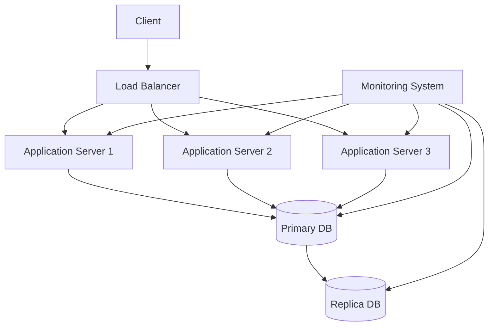

# Distributed Systems: Availability 📊
**Version:** 1.0.0  
**Last Updated:** 2024-04-20    
**Status:** Production Ready

## Executive Summary 📋

System availability is a critical metric in distributed systems that measures the percentage of time a system remains operational under normal conditions. This documentation provides comprehensive guidance on designing, implementing, and maintaining highly available distributed systems.

### Key Benefits
- Increased system reliability
- Reduced downtime
- Better user experience
- Business continuity
- Competitive advantage

### Target Audience
- System Architects
- DevOps Engineers
- SRE Teams
- Platform Engineers
- Technical Leaders

## Overview and Problem Statement 🎯

### Definition
Availability in distributed systems refers to the probability that a system is operational and accessible when required. It is typically measured as:

```
Availability = (Total Time - Downtime) / Total Time × 100%
```

### Common Availability Levels
- 99% ("two nines"): 87.6 hours downtime/year
- 99.9% ("three nines"): 8.76 hours downtime/year
- 99.99% ("four nines"): 52.56 minutes downtime/year
- 99.999% ("five nines"): 5.26 minutes downtime/year

### Business Impact
Low availability can result in:
- Revenue loss
- Customer dissatisfaction
- Reputation damage
- Regulatory compliance issues
- Operational inefficiencies

## Detailed Solution/Architecture 🏗️

### Core Components

1. **Redundancy Systems**
   - Hardware redundancy
   - Software redundancy
   - Data redundancy
   - Network redundancy

2. **Load Balancing**
   - Algorithm-based distribution
   - Health checking
   - Session persistence
   - Traffic management

3. **Failure Detection**
   - Heartbeat mechanisms
   - Health checks
   - Monitoring systems
   - Alerting systems

### Architecture Diagram



## Technical Implementation 💻

### High Availability Patterns

1. **Active-Passive Pattern**

```python
class HighAvailabilityCluster:
    def __init__(self):
        self.active_node = None
        self.passive_node = None
        self.heartbeat_interval = 5  # seconds

    def setup_nodes(self, active, passive):
        self.active_node = active
        self.passive_node = passive
        self.start_heartbeat()

    def start_heartbeat(self):
        while True:
            if not self.check_node_health(self.active_node):
                self.failover_to_passive()
            time.sleep(self.heartbeat_interval)

    def failover_to_passive(self):
        temp = self.active_node
        self.active_node = self.passive_node
        self.passive_node = temp
        self.notify_failover()
```

2. **Circuit Breaker Pattern**

```python
class CircuitBreaker:
    def __init__(self, failure_threshold=5, reset_timeout=60):
        self.failure_count = 0
        self.failure_threshold = failure_threshold
        self.reset_timeout = reset_timeout
        self.last_failure_time = None
        self.state = "CLOSED"

    def execute(self, func):
        if self.state == "OPEN":
            if time.time() - self.last_failure_time > self.reset_timeout:
                self.state = "HALF-OPEN"
            else:
                raise Exception("Circuit breaker is OPEN")

        try:
            result = func()
            if self.state == "HALF-OPEN":
                self.state = "CLOSED"
                self.failure_count = 0
            return result
        except Exception as e:
            self.handle_failure()
            raise e

    def handle_failure(self):
        self.failure_count += 1
        if self.failure_count >= self.failure_threshold:
            self.state = "OPEN"
            self.last_failure_time = time.time()
```

## Performance Metrics & Optimization 📊

### Key Metrics

1. **Availability Metrics**
   - System uptime
   - Mean Time Between Failures (MTBF)
   - Mean Time To Recovery (MTTR)
   - Error rates
   - Response times

2. **Monitoring Implementation**

```python
class AvailabilityMonitor:
    def __init__(self):
        self.metrics = {}
        self.start_time = time.time()

    def record_downtime(self, duration):
        current_time = time.time()
        total_time = current_time - self.start_time
        
        self.metrics['total_downtime'] = self.metrics.get('total_downtime', 0) + duration
        self.metrics['availability'] = ((total_time - self.metrics['total_downtime']) 
                                     / total_time * 100)

    def get_availability_report(self):
        return {
            'availability_percentage': self.metrics['availability'],
            'total_downtime': self.metrics['total_downtime'],
            'monitoring_period': time.time() - self.start_time
        }
```

## Security & Compliance 🔒

### Security Patterns

1. **Authentication and Authorization**
```python
class SecurityManager:
    def __init__(self):
        self.auth_providers = []
        self.access_controls = {}

    def add_auth_provider(self, provider):
        self.auth_providers.append(provider)

    def authenticate(self, credentials):
        for provider in self.auth_providers:
            if provider.authenticate(credentials):
                return True
        return False

    def check_access(self, user, resource):
        if resource not in self.access_controls:
            return False
        return user in self.access_controls[resource]
```

## Anti-Patterns ⚠️

1. **Single Point of Failure**
   - Not implementing redundancy
   - Relying on a single data center
   - Using a single network provider

2. **Improper Timeout Handling**
```python
# Bad Practice ❌
def fetch_data():
    response = service.call()  # No timeout specified
    return response

# Good Practice ✅
def fetch_data():
    try:
        response = service.call(timeout=5)
        return response
    except TimeoutError:
        return fallback_response()
```

## Best Practices & Guidelines 📝

1. **Design Principles**
   - Implement redundancy at all levels
   - Use asynchronous operations where possible
   - Implement proper monitoring and alerting
   - Design for failure
   - Use circuit breakers
   - Implement proper timeout handling

2. **Implementation Guidelines**
```python
class HighAvailabilityService:
    def __init__(self):
        self.circuit_breaker = CircuitBreaker()
        self.retry_policy = RetryPolicy(max_retries=3)
        self.load_balancer = LoadBalancer()
        self.monitor = AvailabilityMonitor()

    @retry_policy
    def execute_request(self, request):
        return self.circuit_breaker.execute(
            lambda: self.load_balancer.route_request(request)
        )
```

## Operational Excellence 🎯

### Monitoring Setup

1. **Metrics Collection**
```python
class MetricsCollector:
    def __init__(self):
        self.metrics_store = {}

    def record_metric(self, name, value, timestamp=None):
        if timestamp is None:
            timestamp = time.time()
        
        if name not in self.metrics_store:
            self.metrics_store[name] = []
            
        self.metrics_store[name].append({
            'value': value,
            'timestamp': timestamp
        })

    def get_metrics(self, name, start_time=None, end_time=None):
        if name not in self.metrics_store:
            return []
            
        metrics = self.metrics_store[name]
        
        if start_time:
            metrics = [m for m in metrics if m['timestamp'] >= start_time]
        if end_time:
            metrics = [m for m in metrics if m['timestamp'] <= end_time]
            
        return metrics
```

## References 📚

1. Academic Papers
   - "Designing Data-Intensive Applications" by Martin Kleppmann
   - "The Art of Scalability" by Martin L. Abbott and Michael T. Fisher

2. Industry Standards
   - ISO/IEC 25010:2011 (System and Software Quality Requirements)
   - ITIL Service Design
   - AWS Well-Architected Framework

3. Online Resources
   - Cloud provider best practices
   - Industry blogs and case studies
   - Technical documentation

