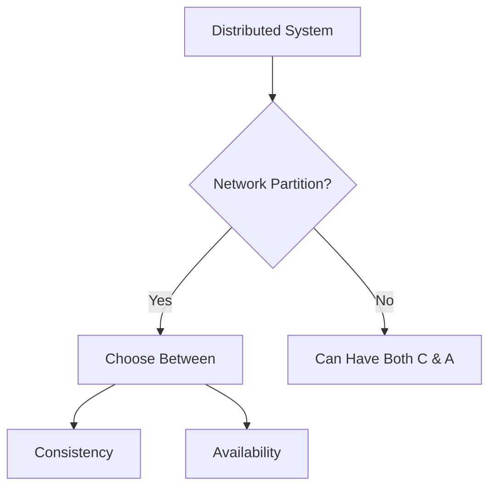

# CAP Theorem in Distributed Systems 🔄
**Version:** 1.0.0  
**Last Updated:** 2024-04-20   
**Status:** Production Ready

## Executive Summary 📋

The CAP theorem, formulated by Eric Brewer, states that a distributed system can only provide two out of three guarantees simultaneously: Consistency, Availability, and Partition Tolerance. This fundamental theorem guides architectural decisions in distributed systems design.

### Key Benefits
- Clear framework for system trade-offs
- Architectural decision guidance
- Risk assessment framework
- Performance optimization insights
- Reliability planning

### Target Audience
- System Architects
- Distributed Systems Engineers
- Database Engineers
- Cloud Architects
- Technical Leaders

## Overview and Problem Statement 🎯

### Definition
The CAP theorem states that in any distributed data store, you can only achieve two out of these three properties:
- **Consistency (C)**: All nodes see the same data at the same time
- **Availability (A)**: Every request receives a response
- **Partition Tolerance (P)**: System continues to operate despite network partitions

### Business Impact
Understanding CAP theorem impacts:
- System architecture decisions
- Service level agreements (SLAs)
- Data consistency requirements
- Operational costs
- User experience

## CAP Theorem Deep Dive 🔍

### System States Diagram



### CAP Combinations

1. **CP Systems (Consistency + Partition Tolerance)**
   - Example: Traditional banking systems
   - Prioritize data correctness
   - May become unavailable during partitions

2. **AP Systems (Availability + Partition Tolerance)**
   - Example: Content delivery networks
   - Always available
   - May serve stale data

3. **CA Systems (Consistency + Availability)**
   - Not practical in distributed systems
   - Only possible in single-node systems

## Technical Implementation 💻

### 1. CP System Implementation

```python
class CPSystem:
    def __init__(self):
        self.nodes = []
        self.quorum_size = 0
        self.lock = threading.Lock()

    def write_data(self, key, value):
        with self.lock:
            active_nodes = self.get_active_nodes()
            if len(active_nodes) < self.quorum_size:
                raise ConsistencyError("Cannot achieve quorum")
            
            success_count = 0
            for node in active_nodes:
                try:
                    node.write(key, value)
                    success_count += 1
                except NetworkPartitionError:
                    continue
                
            if success_count < self.quorum_size:
                self.rollback(key)
                raise ConsistencyError("Write failed")
            
            return True

    def read_data(self, key):
        active_nodes = self.get_active_nodes()
        if len(active_nodes) < self.quorum_size:
            raise ConsistencyError("Cannot achieve quorum")
        
        values = []
        for node in active_nodes:
            try:
                values.append(node.read(key))
            except NetworkPartitionError:
                continue
                
        if len(values) < self.quorum_size:
            raise ConsistencyError("Read failed")
            
        return self.resolve_conflicts(values)
```

### 2. AP System Implementation

```python
class APSystem:
    def __init__(self):
        self.nodes = []
        self.vector_clock = VectorClock()
        self.conflict_resolution = None

    async def write_data(self, key, value):
        write_success = False
        for node in self.nodes:
            try:
                await node.write_async(key, value, self.vector_clock.get())
                write_success = True
            except NetworkPartitionError:
                continue
        
        if not write_success:
            raise AllNodesDownError("No nodes available for write")
        
        # Background reconciliation
        asyncio.create_task(self.reconcile_nodes())
        return True

    async def read_data(self, key):
        for node in self.nodes:
            try:
                value = await node.read_async(key)
                return value
            except NetworkPartitionError:
                continue
        
        raise AllNodesDownError("No nodes available for read")

    async def reconcile_nodes(self):
        for node in self.nodes:
            try:
                await node.sync_data()
            except Exception:
                continue
```

## Trade-off Analysis 📊

### Decision Matrix

```python
class CAPAnalyzer:
    def analyze_requirements(self, requirements):
        scores = {
            'CP': 0,
            'AP': 0,
            'CA': 0
        }
        
        # Analyze consistency requirements
        if requirements.get('data_accuracy') > 0.9:
            scores['CP'] += 2
            scores['CA'] += 2
        
        # Analyze availability requirements
        if requirements.get('uptime') > 0.999:
            scores['AP'] += 2
            scores['CA'] += 2
        
        # Analyze partition tolerance requirements
        if requirements.get('geographic_distribution'):
            scores['CP'] += 1
            scores['AP'] += 1
            scores['CA'] -= 2
        
        return max(scores.items(), key=lambda x: x[1])[0]
```

## Best Practices 📝

### 1. System Design Patterns

```python
class DistributedSystemDesigner:
    def __init__(self):
        self.cap_analyzer = CAPAnalyzer()
        self.patterns = {
            'CP': CPSystemPattern(),
            'AP': APSystemPattern()
        }

    def design_system(self, requirements):
        cap_choice = self.cap_analyzer.analyze_requirements(requirements)
        pattern = self.patterns[cap_choice]
        
        return {
            'architecture': pattern.get_architecture(),
            'consistency_model': pattern.get_consistency_model(),
            'availability_model': pattern.get_availability_model(),
            'partition_handling': pattern.get_partition_handling()
        }
```

### 2. Monitoring Implementation

```python
class CAPMonitor:
    def __init__(self):
        self.metrics = {}
        self.thresholds = {
            'consistency_lag': 1000,  # ms
            'availability': 0.999,
            'partition_recovery_time': 5000  # ms
        }

    def monitor_system(self, system):
        metrics = {
            'consistency': self.measure_consistency(system),
            'availability': self.measure_availability(system),
            'partition_tolerance': self.measure_partition_tolerance(system)
        }
        
        self.alert_if_thresholds_exceeded(metrics)
        return metrics

    def measure_consistency(self, system):
        # Implement consistency checking logic
        pass

    def measure_availability(self, system):
        # Implement availability checking logic
        pass

    def measure_partition_tolerance(self, system):
        # Implement partition tolerance checking logic
        pass
```

## Real-world Examples 🌐

### 1. Banking System (CP)
```python
class BankingSystem(CPSystem):
    def transfer_money(self, from_account, to_account, amount):
        with self.lock:
            try:
                self.write_data(f"{from_account}_balance", 
                              self.read_data(f"{from_account}_balance") - amount)
                self.write_data(f"{to_account}_balance", 
                              self.read_data(f"{to_account}_balance") + amount)
                return True
            except ConsistencyError:
                self.rollback_transaction()
                return False
```

### 2. Social Media Feed (AP)
```python
class SocialMediaFeed(APSystem):
    async def post_update(self, user_id, content):
        post_id = generate_uuid()
        await self.write_data(f"post:{post_id}", {
            'user_id': user_id,
            'content': content,
            'timestamp': time.time()
        })
        
        # Async fan-out to followers
        asyncio.create_task(self.fan_out_post(user_id, post_id))
        return post_id
```

## References 📚

1. Academic Papers
   - "Brewer's Conjecture and the Feasibility of Consistent, Available, Partition-Tolerant Web Services"
   - "CAP Twelve Years Later: How the 'Rules' Have Changed"

2. Industry Standards
   - Distributed Systems Design Patterns
   - Cloud Native Computing Foundation Guidelines
   - Database Consistency Models

3. Online Resources
   - System Design Primers
   - Distributed Systems Principles
   - CAP Theorem Analysis Tools
