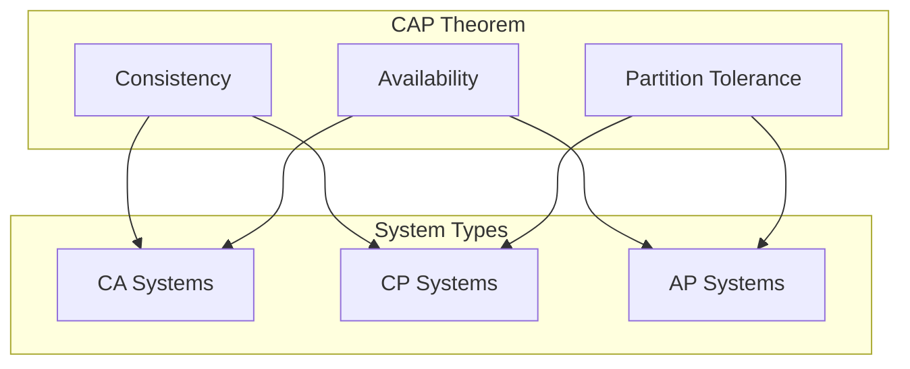

# 🌐 CAP Theorem in Distributed Systems

## 📋 Executive Summary
The CAP theorem, also known as Brewer's theorem, states that a distributed system can only provide two out of three guarantees simultaneously: Consistency, Availability, and Partition Tolerance. Understanding the CAP theorem is crucial for designing reliable distributed systems and making informed architecture decisions.

## 🎯 Overview and Problem Statement

### Definition
The CAP theorem states that in a distributed system, you can only have two of these three properties:
- **Consistency (C)**: All nodes see the same data at the same time
- **Availability (A)**: Every request receives a response
- **Partition Tolerance (P)**: The system continues to operate despite network partitions

### Business Impact
- Helps make informed architectural decisions
- Guides system design trade-offs
- Influences SLA definitions
- Impacts customer experience and business operations

## 🏗️ Architecture & Core Concepts

### Visual Representation


### System Types

1. **CP (Consistency/Partition Tolerance)**
   - Sacrifices availability
   - Example: Traditional banking systems
   ```mermaid
   sequenceDiagram
       participant Client
       participant Node1
       participant Node2
       Client->>Node1: Write Request
       Node1->>Node2: Replicate Data
       Note over Node1,Node2: Wait for consensus
       Node1-->>Client: Confirm Write
   ```

2. **AP (Availability/Partition Tolerance)**
   - Sacrifices consistency
   - Example: Social media feeds
   ```mermaid
   sequenceDiagram
       participant Client
       participant Node1
       participant Node2
       Client->>Node1: Write Request
       Node1-->>Client: Confirm Write
       Note over Node1,Node2: Eventual consistency
       Node1->>Node2: Replicate Data
   ```

3. **CA (Consistency/Availability)**
   - Sacrifices partition tolerance
   - Example: Single-database systems
   - Not practical in distributed systems

## 💻 Technical Implementation

### Example: Implementing CP System
```java
public class CPSystem {
    private final List<Node> nodes;
    private final int requiredAcks;
    
    public boolean write(Data data) {
        int acks = 0;
        for (Node node : nodes) {
            try {
                boolean ack = node.writeData(data);
                if (ack) acks++;
            } catch (NetworkException e) {
                // Handle partition
                return false; // Sacrifice availability
            }
        }
        return acks >= requiredAcks;
    }
}
```

### Example: Implementing AP System
```java
public class APSystem {
    private final List<Node> nodes;
    private final Queue<ReplicationEvent> replicationQueue;
    
    public boolean write(Data data) {
        // Write to local node immediately
        localNode.writeData(data);
        
        // Async replication
        replicationQueue.add(new ReplicationEvent(data));
        
        return true; // Always available
    }
    
    @Async
    private void processReplicationQueue() {
        while (true) {
            ReplicationEvent event = replicationQueue.poll();
            for (Node node : nodes) {
                try {
                    node.writeData(event.getData());
                } catch (NetworkException e) {
                    // Retry later
                    replicationQueue.add(event);
                }
            }
        }
    }
}
```

## 🤔 Decision Criteria & Evaluation

### When to Choose Each Type

#### CP Systems
- **Choose when**:
   - Data consistency is critical (e.g., financial systems)
   - Temporary unavailability is acceptable
   - Strong consistency guarantees are required

#### AP Systems
- **Choose when**:
   - System must remain available
   - Eventually consistent data is acceptable
   - User experience prioritizes availability

### Comparison Matrix

| Aspect | CP Systems | AP Systems | CA Systems |
|--------|------------|------------|------------|
| Consistency | Strong | Eventual | Strong |
| Availability | During partitions | Always | When no partitions |
| Use Cases | Banking, Inventory | Social Media, Content Delivery | Single-node systems |
| Complexity | High | Medium | Low |
| Scalability | Limited | High | Limited |

## ⚠️ Anti-Patterns

### 1. Ignoring Network Partitions
❌ **Wrong**:
```java
public class WrongSystem {
    public void write(Data data) {
        // Assuming network always works
        allNodes.forEach(node -> node.writeData(data));
    }
}
```

✅ **Correct**:
```java
public class CorrectSystem {
    public WriteResult write(Data data) {
        int successfulWrites = 0;
        List<NetworkException> failures = new ArrayList<>();
        
        for (Node node : allNodes) {
            try {
                node.writeData(data);
                successfulWrites++;
            } catch (NetworkException e) {
                failures.add(e);
            }
        }
        
        return new WriteResult(successfulWrites, failures);
    }
}
```

### 2. Assuming Strong Consistency in AP Systems
❌ **Wrong**:
```java
// In an AP system
public Data readLatestData() {
    return nodes.get(0).readData(); // Assuming first node has latest data
}
```

✅ **Correct**:
```java
public Data readDataWithVersion() {
    List<VersionedData> allVersions = nodes.stream()
        .map(Node::readVersionedData)
        .collect(Collectors.toList());
    return reconcileVersions(allVersions);
}
```

## ❓ FAQ

### 1. Can I have all three: C, A, and P?
No, mathematically proven impossible in asynchronous networks.

### 2. Is partition tolerance optional?
No, network partitions will happen in distributed systems. You must handle them.

### 3. What's the difference between strong and eventual consistency?
- Strong: All reads return latest write
- Eventual: All replicas converge over time

## 💡 Best Practices

### 1. Design Principles
- Always design for partition tolerance
- Choose consistency level based on business requirements
- Implement proper monitoring
- Use appropriate consistency models

### 2. Implementation Guidelines
```java
public interface DistributedSystem {
    // Clear consistency guarantees in interface
    WriteResult write(Data data, ConsistencyLevel level);
    ReadResult read(String key, ConsistencyLevel level);
    
    enum ConsistencyLevel {
        STRONG,
        EVENTUAL,
        CAUSAL
    }
}
```

## 📊 Real-world Use Cases

### 1. Banking Systems (CP)
- Account balance updates
- Transaction processing
- Ledger management

### 2. Social Media (AP)
- News feeds
- Status updates
- Comment systems

### 3. E-commerce (Mixed)
- Product catalog (AP)
- Inventory (CP)
- User reviews (AP)

## 📚 References

### Books
- "Designing Data-Intensive Applications" by Martin Kleppmann
- "Distributed Systems" by Maarten van Steen and Andrew S. Tanenbaum

### Academic Papers
- "Brewer's Conjecture and the Feasibility of Consistent, Available, Partition-Tolerant Web Services" by Seth Gilbert and Nancy Lynch
- "CAP Twelve Years Later: How the 'Rules' Have Changed" by Eric Brewer

### Online Resources
- [Amazon DynamoDB's Consistency Model](https://docs.aws.amazon.com/amazondynamodb/latest/developerguide/HowItWorks.ReadConsistency.html)
- [Google Cloud Spanner's Approach to CAP](https://cloud.google.com/spanner/docs/true-time-external-consistency)
- [Apache Cassandra's Tunable Consistency](https://cassandra.apache.org/doc/latest/architecture/dynamo.html)
