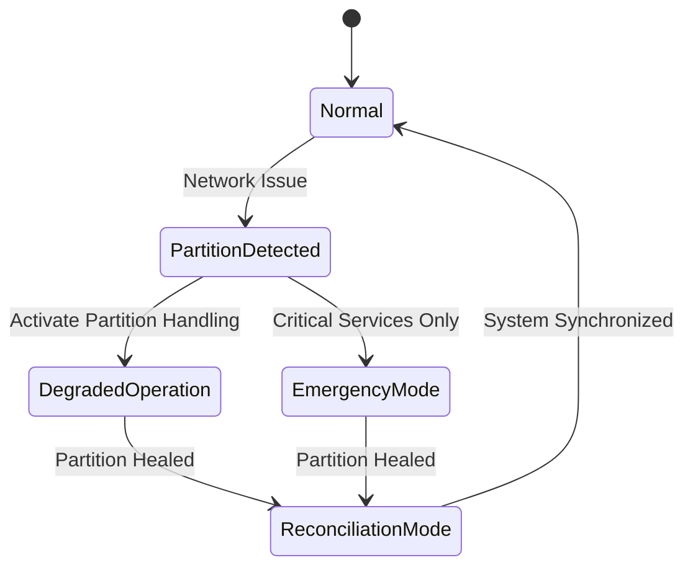

# Partition Tolerance in Distributed Systems 🌐
**Version:** 1.0.0  
**Last Updated:** 2024-04-20  
**Status:** Production Ready

## Executive Summary 📋

Partition Tolerance is the ability of a distributed system to continue operating despite network partitions (communication breakdowns between nodes). This documentation provides comprehensive guidance on implementing and maintaining partition tolerance in distributed systems.

### Key Benefits
- System resilience
- Fault tolerance
- Continued operation during network failures
- Geographic distribution support
- Disaster recovery readiness

### Target Audience
- System Architects
- Network Engineers
- SRE Teams
- Database Engineers
- Cloud Architects

## Overview and Problem Statement 🎯

### Definition
Partition Tolerance refers to a system's ability to continue functioning when network partitions occur, potentially causing message loss or delays between system components.

### Network Partition Types
1. **Complete Partition**
   - No communication between segments
   - Complete isolation of nodes/groups

2. **Partial Partition**
   - Some nodes can communicate
   - Intermittent connectivity

3. **Byzantine Partition**
   - Incorrect/corrupted messages
   - Network manipulation

## Partition Tolerance Architecture 🏗️

### System State Diagram



## Technical Implementation 💻

### 1. Partition Detection System

```python
class PartitionDetector:
    def __init__(self):
        self.nodes = {}
        self.heartbeat_interval = 5  # seconds
        self.partition_threshold = 3  # missed heartbeats

    async def monitor_node(self, node_id):
        missed_heartbeats = 0
        while True:
            try:
                await self.send_heartbeat(node_id)
                missed_heartbeats = 0
            except NetworkError:
                missed_heartbeats += 1
                if missed_heartbeats >= self.partition_threshold:
                    await self.handle_partition(node_id)
            await asyncio.sleep(self.heartbeat_interval)

    async def handle_partition(self, node_id):
        partition_event = PartitionEvent(
            node_id=node_id,
            timestamp=time.time(),
            partition_type=self.detect_partition_type()
        )
        await self.notify_partition_handlers(partition_event)
```

### 2. Partition Handling Strategy

```python
class PartitionHandlingStrategy:
    def __init__(self):
        self.partition_policies = {
            'complete': CompletePartitionPolicy(),
            'partial': PartialPartitionPolicy(),
            'byzantine': ByzantinePartitionPolicy()
        }

    async def handle_partition(self, partition_event):
        policy = self.partition_policies[partition_event.partition_type]
        
        # Execute pre-partition procedures
        await policy.prepare()
        
        # Apply partition-specific handling
        await policy.handle(partition_event)
        
        # Monitor partition status
        asyncio.create_task(self.monitor_partition(partition_event))

    async def monitor_partition(self, partition_event):
        while True:
            if await self.is_partition_healed(partition_event):
                await self.initiate_reconciliation(partition_event)
                break
            await asyncio.sleep(self.check_interval)
```

### 3. Reconciliation System

```python
class ReconciliationManager:
    def __init__(self):
        self.conflict_resolver = ConflictResolver()
        self.sync_manager = SyncManager()

    async def reconcile_partition(self, partition_event):
        # Collect divergent data
        divergent_data = await self.collect_divergent_data(partition_event)
        
        # Resolve conflicts
        resolved_data = await self.conflict_resolver.resolve(divergent_data)
        
        # Synchronize nodes
        await self.sync_manager.synchronize(resolved_data)
        
        # Verify reconciliation
        if await self.verify_reconciliation():
            await self.complete_reconciliation(partition_event)
        else:
            await self.handle_reconciliation_failure(partition_event)

    async def collect_divergent_data(self, partition_event):
        divergent_data = []
        for node in partition_event.affected_nodes:
            node_data = await node.get_data_since(partition_event.timestamp)
            divergent_data.append(node_data)
        return divergent_data
```

## Dealing with Network Partitions 🔧

### 1. Partition Recovery Pattern

```python
class PartitionRecoverySystem:
    def __init__(self):
        self.partition_detector = PartitionDetector()
        self.recovery_strategies = {
            'automatic': AutomaticRecoveryStrategy(),
            'manual': ManualRecoveryStrategy(),
            'phased': PhasedRecoveryStrategy()
        }

    async def recover_from_partition(self, partition_event):
        strategy = self.select_recovery_strategy(partition_event)
        
        try:
            await strategy.execute_recovery(partition_event)
        except RecoveryError as e:
            await self.handle_recovery_failure(e)

    def select_recovery_strategy(self, partition_event):
        if partition_event.is_critical():
            return self.recovery_strategies['manual']
        elif partition_event.is_partial():
            return self.recovery_strategies['automatic']
        else:
            return self.recovery_strategies['phased']
```

### 2. Testing Framework

```python
class PartitionTestingFramework:
    def __init__(self):
        self.network_simulator = NetworkSimulator()
        self.test_scenarios = []

    async def simulate_partition(self, scenario):
        # Setup test environment
        env = await self.setup_test_environment(scenario)
        
        # Inject partition
        await self.network_simulator.create_partition(scenario.partition_config)
        
        # Monitor system behavior
        results = await self.monitor_system_behavior(scenario.duration)
        
        # Validate results
        passed = await self.validate_results(results, scenario.expectations)
        
        return TestReport(scenario, results, passed)

    async def setup_test_environment(self, scenario):
        # Create isolated test network
        network = await self.network_simulator.create_network(scenario.topology)
        
        # Deploy test nodes
        nodes = await self.deploy_test_nodes(network, scenario.node_config)
        
        return TestEnvironment(network, nodes)
```

## Best Practices 📝

### 1. Partition Tolerance Patterns

```python
class PartitionTolerancePatterns:
    @staticmethod
    def implement_circuit_breaker(service):
        return CircuitBreaker(
            service=service,
            failure_threshold=5,
            reset_timeout=60
        )

    @staticmethod
    def implement_bulkhead(service):
        return Bulkhead(
            service=service,
            max_concurrent_calls=10,
            max_queue_size=5
        )

    @staticmethod
    def implement_fallback(service, fallback_handler):
        return FallbackHandler(
            service=service,
            fallback=fallback_handler
        )
```

### 2. Monitoring Implementation

```python
class PartitionMonitor:
    def __init__(self):
        self.metrics = {}
        self.alert_thresholds = {
            'partition_duration': 300,  # seconds
            'recovery_time': 600,      # seconds
            'data_divergence': 0.1     # 10% threshold
        }

    async def monitor_partition_health(self):
        while True:
            current_metrics = await self.collect_metrics()
            await self.analyze_metrics(current_metrics)
            await self.store_metrics(current_metrics)
            await self.check_thresholds(current_metrics)
            await asyncio.sleep(self.monitoring_interval)

    async def collect_metrics(self):
        return {
            'active_partitions': await self.count_active_partitions(),
            'partition_duration': await self.calculate_partition_duration(),
            'data_divergence': await self.measure_data_divergence(),
            'recovery_time': await self.measure_recovery_time()
        }
```

## Testing and Validation 🧪

### 1. Chaos Testing Implementation

```python
class PartitionChaosTest:
    def __init__(self):
        self.chaos_runner = ChaosRunner()
        self.test_scenarios = self.load_test_scenarios()

    async def run_chaos_test(self, scenario):
        # Setup monitoring
        monitor = await self.setup_monitoring()
        
        # Execute chaos scenario
        try:
            await self.chaos_runner.execute_scenario(scenario)
            
            # Collect results
            results = await monitor.collect_results()
            
            # Validate system behavior
            passed = await self.validate_results(results)
            
            return ChaosTestReport(scenario, results, passed)
        finally:
            await self.cleanup()

    async def validate_results(self, results):
        validators = [
            self.validate_data_consistency(),
            self.validate_system_availability(),
            self.validate_recovery_time()
        ]
        
        return all(await asyncio.gather(*validators))
```

## References 📚

1. Academic Papers
   - "Understanding Network Partitions in Distributed Systems"
   - "Partition Tolerance and Recovery in Distributed Databases"
   - "CAP Theorem: Network Partition Handling Strategies"

2. Industry Standards
   - RFC 5737 - Network Partition Protocols
   - Distributed Systems Reliability Standards
   - Cloud Native Computing Foundation Guidelines

3. Online Resources
   - Network Partition Testing Tools
   - Distributed Systems Design Patterns
   - Chaos Engineering Practices
