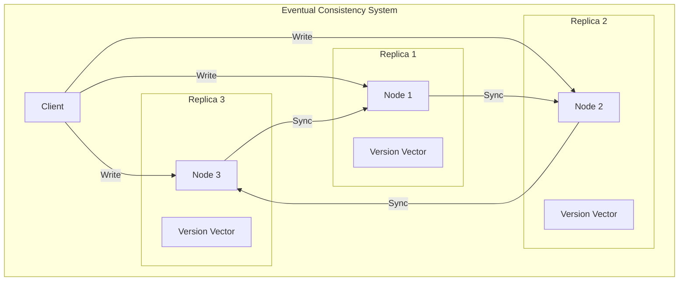
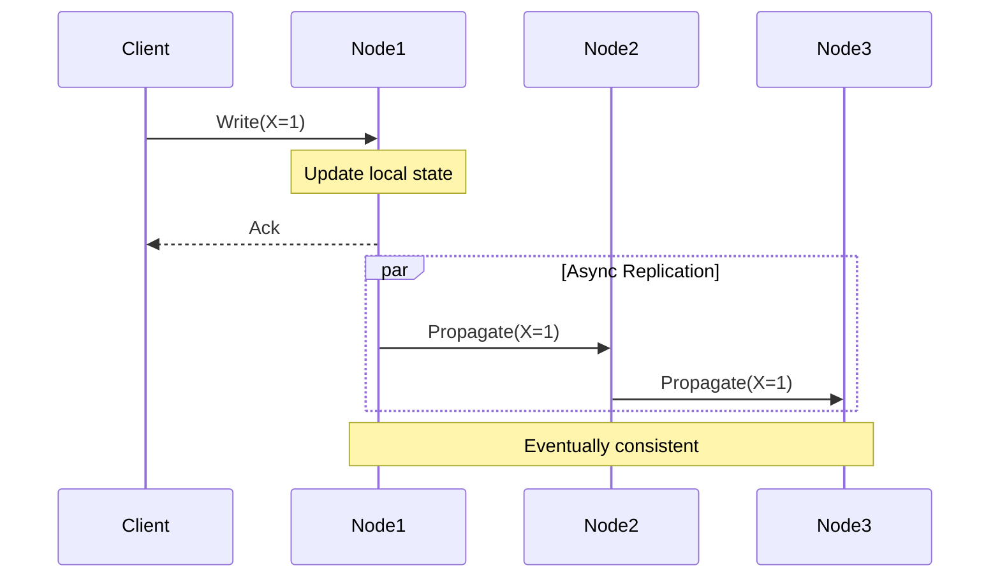

# 🔄 Eventual Consistency in Distributed Systems

## 📋 Overview and Problem Statement

### Definition
Eventual Consistency is a consistency model that guarantees that, given no new updates to a data item, all replicas will eventually return the same value. This means that temporary inconsistencies are allowed, but the system will converge to a consistent state over time.

### Problems It Solves
- High latency in globally distributed systems
- Availability requirements during network partitions
- Scalability limitations of strong consistency
- Performance bottlenecks in distributed databases

### Business Value
- Improved system availability
- Better performance and scalability
- Reduced operational costs
- Enhanced user experience in specific scenarios

## 🏗️ Architecture & Core Concepts

### System Components


### Key Components

1. **Version Vectors**
   - Track update history
   - Detect conflicts
   - Enable reconciliation

2. **Conflict Resolution**
   - Last-Write-Wins (LWW)
   - Custom merge functions
   - Vector clocks

3. **Replication Protocol**
   - Gossip protocol
   - Anti-entropy
   - Read repair

## 💻 Technical Implementation

### Basic Implementation
```java
public class EventuallyConsistentStore<K, V> {
    private final Map<K, VersionedValue<V>> store = new ConcurrentHashMap<>();
    private final String nodeId;
    
    @Data
    class VersionedValue<T> {
        private final T value;
        private final VectorClock vectorClock;
        private final long timestamp;
    }
    
    public void write(K key, V value) {
        VectorClock clock = getOrCreateClock(key);
        clock.increment(nodeId);
        
        store.put(key, new VersionedValue<>(
            value,
            clock,
            System.currentTimeMillis()
        ));
        
        propagateUpdate(key, value, clock);
    }
    
    public Optional<V> read(K key) {
        VersionedValue<V> version = store.get(key);
        if (version == null) {
            return Optional.empty();
        }
        
        // Trigger read repair in background
        asyncReadRepair(key, version);
        
        return Optional.of(version.getValue());
    }
}
```

### Conflict Resolution
```java
public class ConflictResolver<T> {
    public T resolve(List<VersionedValue<T>> conflictingVersions) {
        if (conflictingVersions.isEmpty()) {
            return null;
        }
        
        // Last-Write-Wins strategy
        return conflictingVersions.stream()
            .max(Comparator.comparing(VersionedValue::getTimestamp))
            .map(VersionedValue::getValue)
            .orElse(null);
    }
}
```

### Replication Protocol


## 🤔 Decision Criteria & Evaluation

### When to Use Eventual Consistency

#### Suitable Scenarios
- Social media feeds
- Product reviews
- Analytics data
- Caching systems

#### Unsuitable Scenarios
- Financial transactions
- Medical records
- Stock trading
- Access control systems

### Comparison Matrix

| Aspect | Eventual Consistency | Strong Consistency | Causal Consistency |
|--------|---------------------|-------------------|-------------------|
| Latency | Low | High | Medium |
| Availability | High | Lower | Medium |
| Complexity | Medium | High | High |
| Data Freshness | May be stale | Always fresh | Causally fresh |
| Suitable for | High-scale, AP systems | CP systems | Hybrid systems |

## 📊 Performance Metrics & Optimization

### Key Metrics
1. **Convergence Time**
   - Time to reach consistency
   - Replication lag
   - Conflict rate

2. **Operation Latency**
   - Read latency
   - Write latency
   - Propagation delay

### Monitoring Example
```java
public class MetricsCollector {
    private final Timer convergenceTimer;
    private final Counter conflictCounter;
    
    public void recordConvergence(long startTime) {
        long convergenceTime = System.currentTimeMillis() - startTime;
        convergenceTimer.record(convergenceTime, TimeUnit.MILLISECONDS);
    }
    
    public void recordConflict() {
        conflictCounter.increment();
    }
}
```

## ⚠️ Anti-Patterns

### 1. Assuming Immediate Consistency
❌ **Wrong**:
```java
public class WrongImplementation {
    public void transfer(Account from, Account to, double amount) {
        from.deduct(amount);
        to.add(amount);  // Assumes immediate consistency
    }
}
```

✅ **Correct**:
```java
public class CorrectImplementation {
    public void transfer(Account from, Account to, double amount) {
        TransactionId txId = generateTxId();
        TransactionLog log = new TransactionLog(txId, from, to, amount);
        
        // Two-phase operation
        boolean deducted = from.deduct(amount, txId);
        if (deducted) {
            to.addEventually(amount, txId);
            monitoryEventualConsistency(txId);
        }
    }
}
```

### 2. Ignoring Conflicts
❌ **Wrong**:
```java
public void merge(Data local, Data remote) {
    // Just take the latest timestamp
    if (remote.timestamp > local.timestamp) {
        return remote;
    }
    return local;
}
```

✅ **Correct**:
```java
public Data merge(Data local, Data remote) {
    if (local.vectorClock.isConflicting(remote.vectorClock)) {
        return conflictResolver.resolve(local, remote);
    }
    if (local.vectorClock.isDescendantOf(remote.vectorClock)) {
        return local;
    }
    return remote;
}
```

## ❓ FAQ

### 1. How long until consistency is reached?
Depends on factors like:
- Network latency
- System load
- Replication factor
- Conflict rate

### 2. How to handle concurrent updates?
- Use version vectors
- Implement conflict resolution
- Consider semantic merging

### 3. What about read-after-write consistency?
- Implement session consistency
- Use read-your-writes guarantees
- Consider sticky sessions

## 💡 Best Practices

### 1. Design Principles
- Make operations idempotent
- Use vector clocks for versioning
- Implement proper conflict resolution
- Monitor convergence metrics

### 2. Implementation Guidelines
```java
@Builder
public class EventualConsistencyConfig {
    private final Duration maxConvergenceTime;
    private final int replicationFactor;
    private final ConflictResolutionStrategy strategy;
    private final boolean enableReadRepair;
    private final Duration gossipInterval;
}
```

## 🔍 Troubleshooting Guide

### Common Issues
1. **Slow Convergence**
   - Check network latency
   - Verify replication factor
   - Monitor gossip protocol

2. **High Conflict Rate**
   - Review conflict resolution strategy
   - Check client patterns
   - Analyze write patterns

## 🧪 Testing Strategies

### Chaos Testing
```java
@Test
public void testEventualConsistency() {
    // Setup distributed nodes
    List<Node> nodes = setupNodes();
    
    // Introduce network partition
    networkPartitioner.isolate(nodes.get(0));
    
    // Perform writes to different partitions
    nodes.get(0).write("key", "value1");
    nodes.get(1).write("key", "value2");
    
    // Heal partition
    networkPartitioner.heal();
    
    // Assert convergence
    eventually(() -> {
        String value1 = nodes.get(0).read("key");
        String value2 = nodes.get(1).read("key");
        assertEquals(value1, value2);
    });
}
```

## 🌍 Real-world Use Cases

### 1. Amazon DynamoDB
- Uses configurable consistency levels
- Implements vector clocks
- Provides eventual consistency by default

### 2. Apache Cassandra
- Tunable consistency levels
- Gossip protocol for replication
- Read repair mechanism

### 3. DNS System
- Classic example of eventual consistency
- Hierarchical update propagation
- TTL-based caching

## 📚 References

### Books
- "Designing Data-Intensive Applications" by Martin Kleppmann
- "NoSQL Distilled" by Martin Fowler & Pramod Sadalage

### Papers
- "Dynamo: Amazon's Highly Available Key-value Store"
- "Cassandra - A Decentralized Structured Storage System"

### Online Resources
- [AWS DynamoDB Consistency](https://docs.aws.amazon.com/amazondynamodb/latest/developerguide/HowItWorks.ReadConsistency.html)
- [Apache Cassandra Architecture](https://cassandra.apache.org/doc/latest/architecture/overview.html)
- [Microsoft Azure Cosmos DB Consistency Levels](https://docs.microsoft.com/en-us/azure/cosmos-db/consistency-levels)