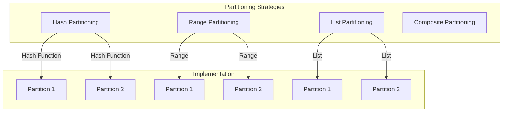
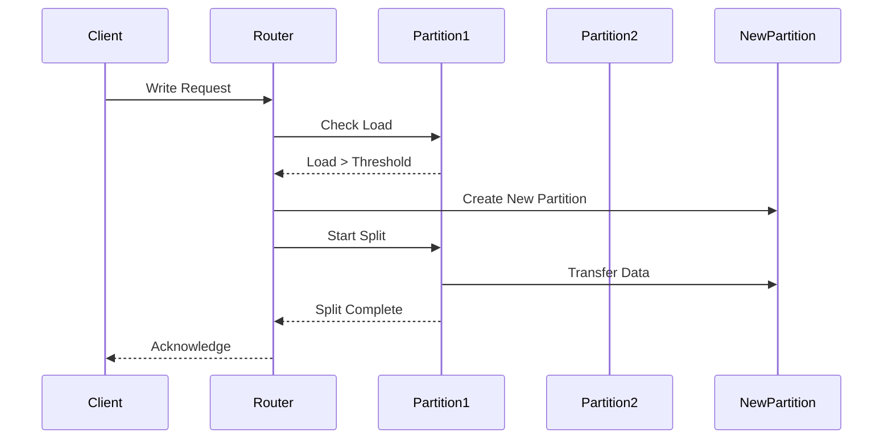

# 🔀 Partitioning in Distributed Systems

## 📋 Overview and Problem Statement

### Definition
Partitioning (also known as sharding) is the practice of dividing a system's data or load across multiple nodes in a distributed system to improve scalability, performance, and manageability.

### Problems It Solves
- Data volume exceeding single node capacity
- Performance bottlenecks
- High throughput requirements
- Geographical data distribution needs
- Single point of failure risks

### Business Value
- Improved scalability
- Better performance
- Higher availability
- Cost optimization
- Geographic compliance

## 🏗️ Architecture & Core Concepts

### Partitioning Strategies



### Key Components

1. **Partition Key Selection**
   - Primary key
   - Composite key
   - Derived key

2. **Partition Placement**
   - Node assignment
   - Replication strategy
   - Geographic distribution

3. **Routing Layer**
   - Request routing
   - Load balancing
   - Partition discovery

## 💻 Technical Implementation

### Hash Partitioning Implementation
```java
public class HashPartitioner<K, V> implements Partitioner<K, V> {
    private final int numPartitions;
    private final List<Node> nodes;
    
    public PartitionInfo getPartition(K key) {
        int bucket = Math.abs(key.hashCode() % numPartitions);
        Node targetNode = nodes.get(bucket % nodes.size());
        return new PartitionInfo(bucket, targetNode);
    }
    
    public void rebalance(List<Node> newNodes) {
        // Consistent hashing implementation
        ConsistentHash<Node> hash = new ConsistentHash<>(newNodes);
        // Rebalance existing partitions
        for (Partition partition : currentPartitions) {
            Node newNode = hash.getNode(partition.getKey());
            if (newNode != partition.getCurrentNode()) {
                migratePartition(partition, newNode);
            }
        }
    }
}
```

### Range Partitioning
```java
public class RangePartitioner<K extends Comparable<K>, V> 
    implements Partitioner<K, V> {
    
    private final NavigableMap<K, PartitionInfo> partitionMap;
    
    public PartitionInfo getPartition(K key) {
        Map.Entry<K, PartitionInfo> entry = 
            partitionMap.floorEntry(key);
        if (entry == null) {
            throw new PartitionNotFoundException(key);
        }
        return entry.getValue();
    }
    
    public void splitPartition(K splitPoint) {
        Map.Entry<K, PartitionInfo> entry = 
            partitionMap.floorEntry(splitPoint);
        if (entry != null) {
            PartitionInfo oldPartition = entry.getValue();
            PartitionInfo newPartition = createNewPartition();
            partitionMap.put(splitPoint, newPartition);
            rebalanceData(oldPartition, newPartition, splitPoint);
        }
    }
}
```

### Dynamic Partitioning System


## 🤔 Decision Criteria & Evaluation

### Partitioning Strategy Selection Matrix

| Strategy | Use Case | Pros | Cons |
|----------|----------|------|------|
| Hash | Uniform distribution needed | Even distribution, Simple | Range queries inefficient |
| Range | Sequential access | Efficient range queries | Potential hotspots |
| List | Categorical data | Logical grouping | Limited flexibility |
| Composite | Complex requirements | Flexible, Balanced | More complex to maintain |

### Performance Considerations
1. **Data Access Patterns**
   - Read/write ratios
   - Query types
   - Access frequency

2. **Data Distribution**
   - Size per partition
   - Growth patterns
   - Skew handling

## 📊 Performance Metrics & Optimization

### Key Metrics
1. **Partition Balance**
```java
public class PartitionMetrics {
    public double calculateSkew(List<Partition> partitions) {
        long avgSize = calculateAverageSize(partitions);
        return partitions.stream()
            .mapToDouble(p -> Math.abs(p.getSize() - avgSize))
            .average()
            .orElse(0.0);
    }
    
    public Map<String, Double> getPartitionStats(
        List<Partition> partitions) {
        return Map.of(
            "min_size", getMinSize(partitions),
            "max_size", getMaxSize(partitions),
            "avg_size", calculateAverageSize(partitions),
            "std_dev", calculateStdDev(partitions)
        );
    }
}
```

## ⚠️ Anti-Patterns

### 1. Poor Partition Key Selection
❌ **Wrong**:
```java
public class PoorPartitioning {
    // Using sequential ID as partition key
    public PartitionInfo getPartition(Long id) {
        return partitions.get((int)(id % partitions.size()));
    }
}
```

✅ **Correct**:
```java
public class GoodPartitioning {
    // Using composite key for better distribution
    public PartitionInfo getPartition(
        String tenant, String region, String id) {
        String partitionKey = String.format("%s:%s:%s", 
            tenant, region, id);
        return consistentHash.getNode(partitionKey);
    }
}
```

### 2. Ignoring Partition Growth
❌ **Wrong**:
```java
public class StaticPartitioning {
    private final int FIXED_PARTITION_COUNT = 10;
    // No provision for growth
}
```

✅ **Correct**:
```java
public class DynamicPartitioning {
    public void monitorAndSplit(Partition partition) {
        if (partition.getSize() > threshold) {
            PartitionSplitPlan plan = createSplitPlan(partition);
            executeSplitPlan(plan);
        }
    }
}
```

## 💡 Best Practices

### 1. Partition Key Design
- Choose keys that distribute evenly
- Consider future growth
- Account for access patterns
- Include business requirements

### 2. Rebalancing Strategy
```java
public class RebalancingStrategy {
    public void rebalance(List<Partition> partitions) {
        // Calculate ideal distribution
        Map<Node, Long> idealLoads = calculateIdealLoads();
        
        // Create movement plan
        List<Movement> movements = planMovements(
            partitions, idealLoads);
        
        // Execute movements with minimal disruption
        executeMovements(movements);
    }
}
```

## 🔍 Troubleshooting Guide

### Common Issues

1. **Data Skew**
   - Monitor partition sizes
   - Track access patterns
   - Implement auto-splitting

2. **Rebalancing Problems**
   - Use consistent hashing
   - Implement gradual rebalancing
   - Monitor system during rebalancing

## 🧪 Testing

```java
@Test
public void testPartitionRebalancing() {
    PartitionManager manager = new PartitionManager();
    
    // Add initial nodes
    manager.addNode("node1");
    manager.addNode("node2");
    
    // Add test data
    for (int i = 0; i < 1000; i++) {
        manager.write(String.valueOf(i), "data" + i);
    }
    
    // Add new node
    manager.addNode("node3");
    
    // Assert balanced distribution
    Map<String, Integer> distribution = 
        manager.getPartitionDistribution();
    assertBalancedDistribution(distribution);
}
```

## 🌍 Real-world Use Cases

### 1. MongoDB
- Uses range-based partitioning
- Automatic chunk splitting
- Balanced shard distribution

### 2. Cassandra
- Consistent hashing
- Virtual nodes
- Token-based partitioning

### 3. DynamoDB
- Adaptive capacity
- Partition management
- Auto-scaling

## 📚 References

### Books
- "Designing Data-Intensive Applications" by Martin Kleppmann
- "Database Internals" by Alex Petrov

### Papers
- "Dynamo: Amazon's Highly Available Key-value Store"
- "Bigtable: A Distributed Storage System for Structured Data"

### Online Resources
- [MongoDB Sharding](https://docs.mongodb.com/manual/sharding/)
- [Cassandra Architecture](https://cassandra.apache.org/doc/latest/architecture/overview.html)
- [DynamoDB Partitioning](https://docs.aws.amazon.com/amazondynamodb/latest/developerguide/HowItWorks.Partitions.html)