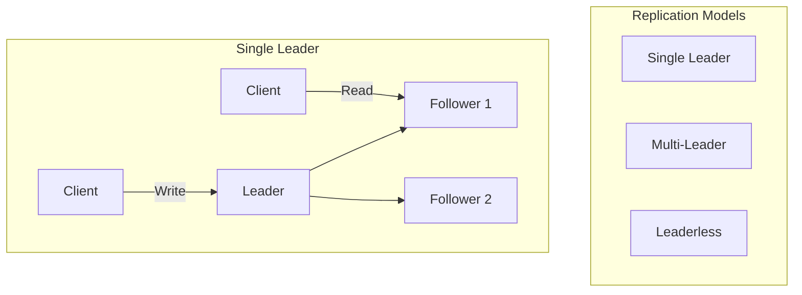
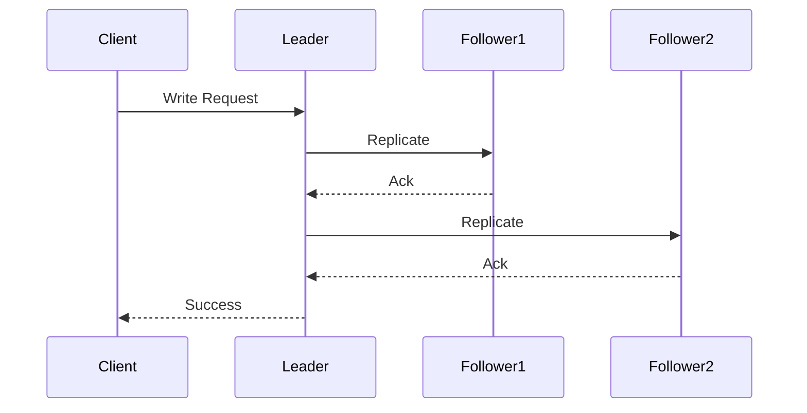
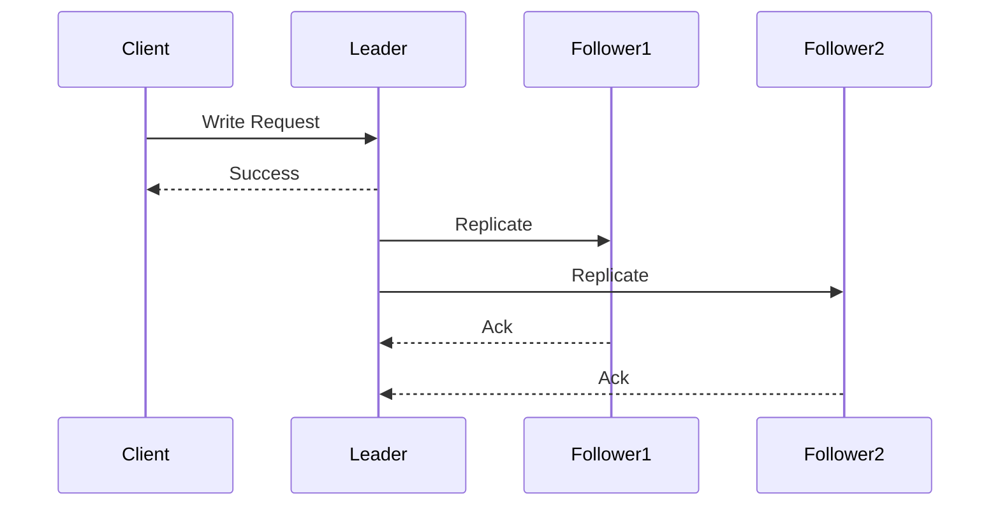

# 🔄 Replication in Distributed Systems

## 📋 Overview and Problem Statement

### Definition
Replication is the process of maintaining multiple copies of data across different nodes in a distributed system to ensure high availability, fault tolerance, and improved performance.

### Problems It Solves
- Single point of failure
- System availability
- Geographic latency
- Read scalability
- Disaster recovery

### Business Value
- Improved system uptime
- Better user experience
- Data durability
- Geographic compliance
- Disaster recovery capabilities

## 🏗️ Architecture & Core Concepts

### Replication Models



### Types of Replication

1. **Synchronous Replication**


2. **Asynchronous Replication**


## 💻 Technical Implementation

### Single-Leader Replication
```java
public class SingleLeaderReplication {
    private final Node leader;
    private final List<Node> followers;
    private final ReplicationMode mode;
    
    public WriteResult write(Data data) {
        // Write to leader
        WriteResult leaderResult = leader.write(data);
        
        if (mode == ReplicationMode.SYNC) {
            // Synchronous replication
            List<CompletableFuture<WriteResult>> futures = 
                followers.stream()
                    .map(f -> CompletableFuture.supplyAsync(
                        () -> f.write(data)))
                    .collect(Collectors.toList());
                    
            // Wait for all followers
            CompletableFuture.allOf(
                futures.toArray(new CompletableFuture[0]))
                .join();
        } else {
            // Asynchronous replication
            followers.forEach(f -> 
                CompletableFuture.runAsync(
                    () -> f.write(data)));
        }
        
        return leaderResult;
    }
}
```

### Multi-Leader Replication
```java
public class MultiLeaderReplication {
    private final List<Node> leaders;
    private final ConflictResolver resolver;
    
    public WriteResult write(Data data, Node sourceLeader) {
        // Write to source leader
        WriteResult result = sourceLeader.write(data);
        
        // Replicate to other leaders
        leaders.stream()
            .filter(l -> l != sourceLeader)
            .forEach(l -> 
                CompletableFuture.runAsync(() -> {
                    try {
                        l.write(data);
                    } catch (ConflictException e) {
                        Data resolvedData = 
                            resolver.resolve(data, e.getConflictingData());
                        l.write(resolvedData);
                    }
                }));
                
        return result;
    }
}
```

### Conflict Resolution
```java
public interface ConflictResolver {
    Data resolve(Data version1, Data version2);
}

public class LastWriteWinsResolver implements ConflictResolver {
    @Override
    public Data resolve(Data version1, Data version2) {
        return version1.getTimestamp() > version2.getTimestamp() 
            ? version1 
            : version2;
    }
}

public class CustomMergeResolver implements ConflictResolver {
    @Override
    public Data resolve(Data version1, Data version2) {
        return mergeFn.apply(version1, version2);
    }
}
```

## 🤔 Decision Criteria & Evaluation

### Replication Strategy Selection Matrix

| Strategy | Use Case | Pros | Cons |
|----------|----------|------|------|
| Single-Leader | Simple writes, read scaling | Simple, consistent | Single write point |
| Multi-Leader | Multi-datacenter | Geographic distribution | Complex conflicts |
| Leaderless | High availability | No leader bottleneck | Complex consistency |

### Performance Impact Matrix

| Aspect | Sync Replication | Async Replication |
|--------|------------------|-------------------|
| Latency | Higher | Lower |
| Consistency | Stronger | Weaker |
| Availability | Lower | Higher |
| Durability | Higher | Lower |

## 📊 Performance Metrics & Optimization

### Key Metrics
```java
public class ReplicationMetrics {
    private final MeterRegistry registry;
    
    public void recordReplicationLag(Duration lag) {
        registry.gauge("replication.lag", lag.toMillis());
    }
    
    public void recordConflicts() {
        registry.counter("replication.conflicts").increment();
    }
    
    public void recordReplicationSuccess() {
        registry.counter("replication.success").increment();
    }
}
```

### Monitoring Implementation
```java
public class ReplicationMonitor {
    private final Duration LAG_THRESHOLD = Duration.ofSeconds(10);
    
    public void monitorReplication(Node leader, List<Node> followers) {
        followers.forEach(follower -> {
            Duration lag = calculateLag(leader, follower);
            if (lag.compareTo(LAG_THRESHOLD) > 0) {
                alertHighLag(follower, lag);
            }
        });
    }
}
```

## ⚠️ Anti-Patterns

### 1. Synchronous Everything
❌ **Wrong**:
```java
public class OverSyncReplication {
    public WriteResult write(Data data) {
        // Wait for ALL replicas
        return CompletableFuture.allOf(
            replicas.stream()
                .map(r -> r.write(data))
                .toArray(CompletableFuture[]::new)
        ).join();
    }
}
```

✅ **Correct**:
```java
public class BalancedReplication {
    public WriteResult write(Data data) {
        // Write synchronously to quorum
        int quorum = (replicas.size() / 2) + 1;
        List<CompletableFuture<WriteResult>> futures = 
            replicas.stream()
                .map(r -> r.write(data))
                .collect(Collectors.toList());
                
        return waitForQuorum(futures, quorum);
    }
}
```

### 2. Ignoring Network Partitions
❌ **Wrong**:
```java
public class UnsafeReplication {
    public void replicate(Data data) {
        // Assuming network always works
        followers.forEach(f -> f.write(data));
    }
}
```

✅ **Correct**:
```java
public class NetworkAwareReplication {
    public void replicate(Data data) {
        followers.forEach(f -> {
            try {
                f.write(data);
            } catch (NetworkException e) {
                replicationQueue.enqueue(
                    new ReplicationEvent(data, f));
            }
        });
    }
}
```

## 💡 Best Practices

### 1. Design Principles
- Choose appropriate consistency levels
- Implement proper monitoring
- Plan for network failures
- Design for scalability

### 2. Implementation Guidelines
```java
public class ReplicationManager {
    private final ConsistencyLevel writeConsistency;
    private final ConsistencyLevel readConsistency;
    private final RetryStrategy retryStrategy;
    
    public WriteResult write(Data data) {
        int requiredAcks = calculateRequiredAcks(writeConsistency);
        return writeWithQuorum(data, requiredAcks);
    }
    
    public ReadResult read(String key) {
        int requiredResponses = 
            calculateRequiredResponses(readConsistency);
        return readWithQuorum(key, requiredResponses);
    }
}
```

## 🔍 Troubleshooting Guide

### Common Issues

1. **Replication Lag**
```java
public class LagDetector {
    public Optional<Duration> detectLag(Node follower) {
        Position leaderPosition = leader.getPosition();
        Position followerPosition = follower.getPosition();
        return calculateLag(leaderPosition, followerPosition);
    }
}
```

2. **Split Brain**
```java
public class SplitBrainDetector {
    public boolean detectSplitBrain() {
        Map<Data, Set<Node>> versions = 
            collectVersions(key);
        return versions.size() > 1;
    }
}
```

## 🧪 Testing

### Replication Test Suite
```java
@Test
public void testReplicationConsistency() {
    ReplicationSystem system = new ReplicationSystem();
    
    // Write data
    system.write("key1", "value1");
    
    // Verify all replicas
    for (Node replica : system.getReplicas()) {
        assertEquals("value1", replica.read("key1"));
    }
}

@Test
public void testNetworkPartition() {
    ReplicationSystem system = new ReplicationSystem();
    NetworkSimulator network = new NetworkSimulator();
    
    // Create network partition
    network.createPartition(system.getReplicas());
    
    // Verify system behavior
    verifySystemBehaviorDuringPartition(system);
}
```

## 🌍 Real-world Use Cases

### 1. PostgreSQL Streaming Replication
- Write-ahead log shipping
- Synchronous/asynchronous modes
- Hot standby capabilities

### 2. MySQL Replication
- Binary log replication
- Group replication
- Semi-synchronous replication

### 3. Cassandra Multi-DC Replication
- Ring architecture
- Tunable consistency
- Cross-datacenter replication

## 📚 References

### Books
- "Designing Data-Intensive Applications" by Martin Kleppmann
- "Database Internals" by Alex Petrov

### Papers
- "Consensus: Bridging Theory and Practice" by Diego Ongaro
- "Chain Replication for Supporting High Throughput and Availability"

### Online Resources
- [PostgreSQL Replication Documentation](https://www.postgresql.org/docs/current/high-availability.html)
- [MySQL Replication Guide](https://dev.mysql.com/doc/refman/8.0/en/replication.html)
- [Cassandra Replication Architecture](https://cassandra.apache.org/doc/latest/architecture/dynamo.html)