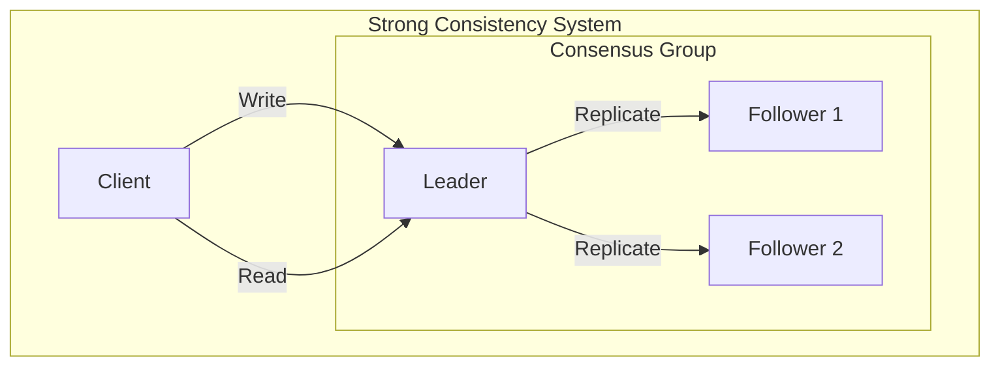
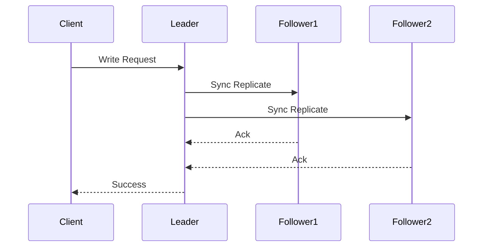
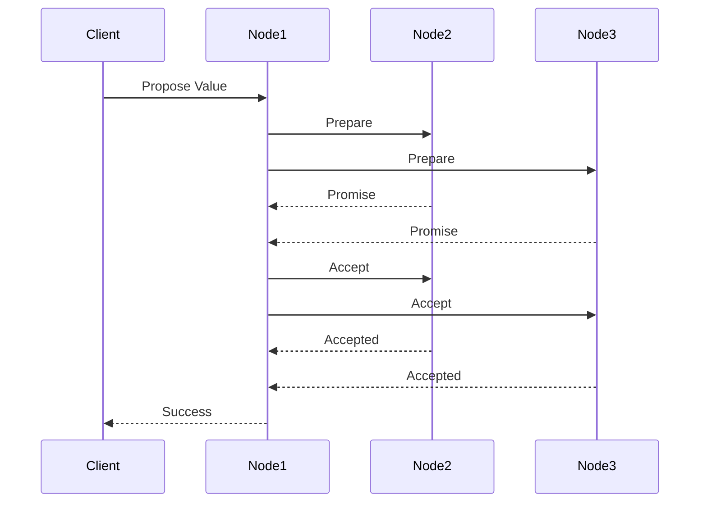

# 🔒 Strong Consistency in Distributed Systems

## 📋 Overview and Problem Statement

### Definition
Strong Consistency (also known as Linearizability) guarantees that all operations appear to execute atomically and in a single total order that is consistent with the real-time ordering of operations.

### Problems It Solves
- Data inconsistency across nodes
- Read-after-write anomalies
- Race conditions
- Concurrent access issues
- Ordering violations

### Business Value
- Data integrity assurance
- Predictable system behavior
- Simplified application logic
- Regulatory compliance
- Transaction accuracy

## 🏗️ Architecture & Core Concepts

### System Components


### Implementation Approaches

1. **Single Leader**


2. **Consensus-based**


## 💻 Technical Implementation

### Basic Strong Consistency Implementation
```java
public class StrongConsistencyManager {
    private final List<Node> nodes;
    private final int quorumSize;
    private final Lock distributedLock;
    
    public WriteResult write(String key, String value) {
        try {
            // Acquire distributed lock
            distributedLock.lock();
            
            // Get quorum
            List<Node> quorum = selectQuorum();
            
            // Prepare phase
            long timestamp = System.currentTimeMillis();
            PrepareResult prepare = prepare(quorum, key, value, timestamp);
            
            if (prepare.isSuccess()) {
                // Commit phase
                return commit(quorum, key, value, timestamp);
            }
            
            throw new ConsistencyException("Failed to achieve consensus");
            
        } finally {
            distributedLock.unlock();
        }
    }
    
    private PrepareResult prepare(
        List<Node> quorum, 
        String key, 
        String value, 
        long timestamp) {
        
        int prepareCount = 0;
        for (Node node : quorum) {
            try {
                if (node.prepare(key, value, timestamp)) {
                    prepareCount++;
                }
            } catch (Exception e) {
                // Handle node failure
            }
        }
        
        return new PrepareResult(
            prepareCount >= quorumSize);
    }
}
```

### Consensus Implementation
```java
public class RaftConsensus implements ConsensusProtocol {
    private Role role = Role.FOLLOWER;
    private long currentTerm = 0;
    private Node votedFor = null;
    private List<LogEntry> log = new ArrayList<>();
    
    @Override
    public AppendEntriesResult appendEntries(
        long term,
        Node leader,
        long prevLogIndex,
        long prevLogTerm,
        List<LogEntry> entries,
        long leaderCommit) {
        
        // Implement Raft append entries logic
        if (term < currentTerm) {
            return AppendEntriesResult.failure(currentTerm);
        }
        
        if (term > currentTerm) {
            currentTerm = term;
            role = Role.FOLLOWER;
            votedFor = null;
        }
        
        // Verify log matching property
        if (!verifyLogMatch(prevLogIndex, prevLogTerm)) {
            return AppendEntriesResult.failure(currentTerm);
        }
        
        // Append new entries
        appendNewEntries(entries, prevLogIndex);
        
        // Update commit index
        updateCommitIndex(leaderCommit);
        
        return AppendEntriesResult.success(currentTerm);
    }
}
```

## 🤔 Decision Criteria & Evaluation

### Consistency Model Comparison Matrix

| Aspect | Strong Consistency | Eventual Consistency | Causal Consistency |
|--------|-------------------|---------------------|-------------------|
| Latency | Higher | Lower | Medium |
| Availability | Lower | Higher | Medium |
| Complexity | High | Low | Medium |
| Use Cases | Financial, ACID | Social, Analytics | Collaborative |
| Network Requirements | High | Low | Medium |

### When to Use Strong Consistency
1. **Financial Systems**
   - Banking transactions
   - Payment processing
   - Account balances

2. **Critical Systems**
   - Medical records
   - Security systems
   - Legal documents

## 📊 Performance Metrics & Optimization

### Key Performance Indicators
```java
public class ConsistencyMetrics {
    private final MetricRegistry metrics;
    
    public void recordLatency(long startTime) {
        long duration = System.currentTimeMillis() - startTime;
        metrics.histogram("consistency.latency").update(duration);
    }
    
    public void recordConsensusRounds(int rounds) {
        metrics.histogram("consensus.rounds").update(rounds);
    }
    
    public void recordQuorumSize(int size) {
        metrics.gauge("quorum.size", () -> size);
    }
}
```

## ⚠️ Anti-Patterns

### 1. Incorrect Quorum Calculation
❌ **Wrong**:
```java
public class IncorrectQuorum {
    // Always using simple majority
    private int calculateQuorum(int nodeCount) {
        return nodeCount / 2 + 1;
    }
}
```

✅ **Correct**:
```java
public class CorrectQuorum {
    private int calculateQuorum(int nodeCount, QuorumType type) {
        switch (type) {
            case WRITE:
                return (nodeCount / 2) + 1;
            case READ:
                return nodeCount - (nodeCount / 2);
            case FAST_PATH:
                return (3 * nodeCount) / 4;
            default:
                throw new IllegalArgumentException();
        }
    }
}
```

### 2. Ignoring Network Partitions
❌ **Wrong**:
```java
public class UnsafeConsistency {
    public void write(Data data) {
        // Assuming all nodes are always available
        nodes.forEach(node -> node.write(data));
    }
}
```

✅ **Correct**:
```java
public class SafeConsistency {
    public WriteResult write(Data data) {
        int successfulWrites = 0;
        List<Exception> failures = new ArrayList<>();
        
        for (Node node : nodes) {
            try {
                node.write(data);
                successfulWrites++;
            } catch (NetworkPartitionException e) {
                failures.add(e);
            }
        }
        
        if (successfulWrites < quorumSize) {
            throw new QuorumNotReachedException(failures);
        }
        
        return new WriteResult(successfulWrites);
    }
}
```

## 💡 Best Practices

### 1. Design Principles
- Use appropriate consensus protocols
- Implement proper failure detection
- Handle network partitions
- Monitor system health

### 2. Implementation Guidelines
```java
public class ConsistencyManager {
    private final ConsensusProtocol consensus;
    private final FailureDetector failureDetector;
    private final QuorumManager quorumManager;
    
    public WriteResult write(Transaction tx) {
        // Verify system health
        if (!failureDetector.isSystemHealthy()) {
            throw new SystemUnhealthyException();
        }
        
        // Get quorum
        Set<Node> quorum = quorumManager.getQuorum();
        
        // Execute consensus protocol
        return consensus.execute(tx, quorum);
    }
}
```

## 🔍 Troubleshooting Guide

### Common Issues

1. **Split Brain**
```java
public class SplitBrainDetector {
    public boolean detectSplitBrain() {
        Set<Node> partition1 = getPartition1Nodes();
        Set<Node> partition2 = getPartition2Nodes();
        
        return partition1.size() >= quorumSize && 
               partition2.size() >= quorumSize;
    }
}
```

2. **Stale Reads**
```java
public class StaleReadDetector {
    public boolean isStaleRead(ReadResult result) {
        return result.getVersion() < 
            getLatestCommittedVersion();
    }
}
```

## 🧪 Testing

### Test Scenarios
```java
@Test
public void testStrongConsistency() {
    ConsistencyManager manager = new ConsistencyManager();
    
    // Write data
    WriteResult write = manager.write("key1", "value1");
    
    // Immediate read should see the write
    ReadResult read = manager.read("key1");
    assertEquals("value1", read.getValue());
    
    // All nodes should have the same value
    for (Node node : manager.getNodes()) {
        assertEquals("value1", node.read("key1").getValue());
    }
}

@Test
public void testNetworkPartition() {
    ConsistencyManager manager = new ConsistencyManager();
    NetworkSimulator network = new NetworkSimulator();
    
    // Create network partition
    network.createPartition();
    
    // Write should fail without quorum
    assertThrows(QuorumNotReachedException.class, 
        () -> manager.write("key1", "value1"));
}
```

## 🌍 Real-world Use Cases

### 1. Google Spanner
- External consistency
- TrueTime API
- Global distribution

### 2. Azure Cosmos DB
- Strong consistency option
- Global distribution
- Multi-region writes

### 3. ZooKeeper
- Atomic broadcasts
- Consensus protocol
- Configuration management

## 📚 References

### Books
- "Designing Data-Intensive Applications" by Martin Kleppmann
- "Distributed Systems" by Maarten van Steen and Andrew S. Tanenbaum

### Papers
- "Impossibility of Distributed Consensus with One Faulty Process" by Fischer, Lynch, and Paterson
- "In Search of an Understandable Consensus Algorithm" by Diego Ongaro and John Ousterhout

### Online Resources
- [Google Spanner Documentation](https://cloud.google.com/spanner/docs)
- [Azure Cosmos DB Consistency Levels](https://docs.microsoft.com/en-us/azure/cosmos-db/consistency-levels)
- [Apache ZooKeeper Documentation](https://zookeeper.apache.org/doc/current/)