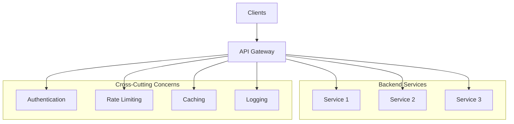
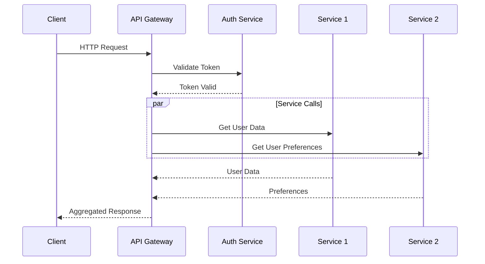

# 🚪 API Gateway Pattern

## 📋 Overview and Problem Statement

### Definition
An API Gateway acts as a single entry point for a system of microservices, handling requests by routing them to appropriate services, aggregating responses, and providing cross-cutting concerns like authentication, monitoring, and rate limiting.

### Problems It Solves
- Multiple endpoint management
- Cross-cutting concerns implementation
- Client-specific API requirements
- Service discovery complexity
- Protocol translation needs
- Backend for Frontend (BFF) requirements

### Business Value
- Simplified client integration
- Enhanced security
- Improved monitoring
- Better resource utilization
- Reduced development time
- Consistent API experience

## 🏗️ Architecture & Core Concepts

### System Components


### Request Flow


## 💻 Technical Implementation

### Basic API Gateway Implementation
```typescript
@Injectable()
export class ApiGateway {
    constructor(
        private readonly serviceRegistry: ServiceRegistry,
        private readonly authService: AuthService,
        private readonly rateLimiter: RateLimiter,
        private readonly cache: CacheService
    ) {}

    async handleRequest(req: Request): Promise<Response> {
        try {
            // Rate limiting
            await this.rateLimiter.checkLimit(req);

            // Authentication
            const authToken = this.extractToken(req);
            await this.authService.validateToken(authToken);

            // Route determination
            const route = this.determineRoute(req);
            
            // Cache check
            const cachedResponse = await this.cache.get(req);
            if (cachedResponse) {
                return cachedResponse;
            }

            // Service discovery
            const service = await this.serviceRegistry
                .getService(route.serviceId);

            // Request forwarding
            const response = await this.forwardRequest(
                service, req);

            // Cache response
            await this.cache.set(req, response);

            return response;
        } catch (error) {
            return this.handleError(error);
        }
    }
}
```

### Request Aggregation
```typescript
class OrderAggregator {
    async getOrderDetails(orderId: string): Promise<OrderDetails> {
        const [order, user, payment] = await Promise.all([
            this.orderService.getOrder(orderId),
            this.userService.getUser(userId),
            this.paymentService.getPaymentInfo(orderId)
        ]);

        return {
            orderId: order.id,
            status: order.status,
            userInfo: {
                name: user.name,
                email: user.email
            },
            paymentStatus: payment.status,
            amount: payment.amount
        };
    }
}
```

### Circuit Breaker Implementation
```typescript
class CircuitBreaker {
    private state: 'CLOSED' | 'OPEN' | 'HALF_OPEN' = 'CLOSED';
    private failures = 0;
    private lastFailure: number = 0;
    
    async executeRequest<T>(
        request: () => Promise<T>
    ): Promise<T> {
        if (this.state === 'OPEN') {
            if (this.shouldRetry()) {
                this.state = 'HALF_OPEN';
            } else {
                throw new Error('Circuit breaker is OPEN');
            }
        }

        try {
            const result = await request();
            this.onSuccess();
            return result;
        } catch (error) {
            this.onFailure();
            throw error;
        }
    }

    private onSuccess(): void {
        this.failures = 0;
        this.state = 'CLOSED';
    }

    private onFailure(): void {
        this.failures++;
        this.lastFailure = Date.now();
        
        if (this.failures >= this.threshold) {
            this.state = 'OPEN';
        }
    }
}
```

## 🤔 Decision Criteria & Evaluation

### Gateway Patterns Comparison

| Pattern | Use Case | Pros | Cons |
|---------|----------|------|------|
| Single Gateway | General purpose | Simple, centralized | Single point of failure |
| BFF | Client-specific needs | Optimized for clients | More maintenance |
| Mesh Gateway | Service mesh | Advanced traffic control | Complex setup |

### When to Use API Gateway

#### Suitable Scenarios
- Microservices architecture
- Multiple client types
- Cross-cutting concerns needed
- Protocol translation required
- Response aggregation needed

#### Unsuitable Scenarios
- Simple monolithic applications
- Single client type
- No cross-cutting concerns
- Direct service communication preferred

## 📊 Performance Metrics & Optimization

### Key Metrics
```typescript
class GatewayMetrics {
    private metrics = new MetricsRegistry();

    recordRequestLatency(route: string, latency: number): void {
        this.metrics.histogram(
            'gateway_request_latency',
            latency,
            { route }
        );
    }

    recordErrorRate(route: string): void {
        this.metrics.counter(
            'gateway_errors_total',
            { route }
        ).inc();
    }

    recordRequestRate(route: string): void {
        this.metrics.counter(
            'gateway_requests_total',
            { route }
        ).inc();
    }
}
```

### Performance Optimization
```typescript
class OptimizedGateway {
    private readonly cache: Cache;
    private readonly connectionPool: ConnectionPool;

    async handleRequest(req: Request): Promise<Response> {
        // Connection pooling
        const connection = await this.connectionPool.acquire();
        
        try {
            // Caching
            const cachedResponse = await this.cache.get(
                this.getCacheKey(req)
            );
            
            if (cachedResponse) {
                return cachedResponse;
            }

            // Request compression
            const compressedReq = await this.compress(req);
            
            // Parallel processing
            const response = await this.processInParallel(
                compressedReq
            );

            return response;
        } finally {
            await this.connectionPool.release(connection);
        }
    }
}
```

## ⚠️ Anti-Patterns

### 1. Chatty Gateway
❌ **Wrong**:
```typescript
class ChattyGateway {
    async getOrderDetails(orderId: string) {
        // Making separate calls for each piece of data
        const order = await this.orderService.getOrder(orderId);
        const user = await this.userService.getUser(order.userId);
        const payment = await this.paymentService
            .getPayment(order.paymentId);
        const shipping = await this.shippingService
            .getShipping(order.shippingId);
        
        return { order, user, payment, shipping };
    }
}
```

✅ **Correct**:
```typescript
class EfficientGateway {
    async getOrderDetails(orderId: string) {
        // Parallel execution of necessary calls
        const [order, user, payment, shipping] = 
            await Promise.all([
                this.orderService.getOrder(orderId),
                this.userService.getUser(userId),
                this.paymentService.getPayment(paymentId),
                this.shippingService.getShipping(shippingId)
            ]);

        return { order, user, payment, shipping };
    }
}
```

### 2. Missing Error Handling
❌ **Wrong**:
```typescript
class UnsafeGateway {
    async handleRequest(req: Request) {
        // Direct forwarding without error handling
        const service = this.serviceRegistry
            .getService(req.path);
        return await service.handle(req);
    }
}
```

✅ **Correct**:
```typescript
class SafeGateway {
    async handleRequest(req: Request) {
        try {
            const service = await this.serviceRegistry
                .getService(req.path);
            
            const response = await Promise.race([
                service.handle(req),
                this.timeout(5000)
            ]);

            return response;
        } catch (error) {
            if (error instanceof TimeoutError) {
                return this.handleTimeout(error);
            }
            if (error instanceof ServiceError) {
                return this.handleServiceError(error);
            }
            return this.handleUnexpectedError(error);
        }
    }
}
```

## 💡 Best Practices

### 1. Security Implementation
```typescript
class SecureGateway {
    async handleRequest(req: Request): Promise<Response> {
        // Rate limiting
        await this.rateLimiter.checkLimit(req);

        // Authentication
        const token = this.extractToken(req);
        const user = await this.authService.validateToken(token);

        // Authorization
        await this.authorizationService
            .checkPermissions(user, req.resource);

        // Input validation
        this.validateInput(req);

        // SSL/TLS verification
        if (!req.isSecure()) {
            throw new SecurityError('SSL required');
        }

        return this.processRequest(req);
    }
}
```

### 2. Caching Strategy
```typescript
class CachingGateway {
    async handleRequest(req: Request): Promise<Response> {
        const cacheKey = this.generateCacheKey(req);
        
        // Check cache
        const cachedResponse = await this.cache.get(cacheKey);
        if (cachedResponse && !this.isStale(cachedResponse)) {
            return cachedResponse;
        }

        // Get fresh data
        const response = await this.fetchFreshData(req);
        
        // Cache with appropriate TTL
        await this.cache.set(
            cacheKey, 
            response, 
            this.getTTL(req)
        );

        return response;
    }
}
```

## 🔍 Troubleshooting Guide

### Common Issues

1. **High Latency**
```typescript
class LatencyMonitor {
    async monitorLatency(req: Request): Promise<void> {
        const start = Date.now();
        
        try {
            await this.processRequest(req);
        } finally {
            const duration = Date.now() - start;
            
            if (duration > this.thresholds.warning) {
                this.alerts.warn(
                    `High latency detected: ${duration}ms`
                );
            }
            
            this.metrics.recordLatency(duration);
        }
    }
}
```

2. **Circuit Breaking**
```typescript
class CircuitBreakerMonitor {
    monitorCircuitBreaker(breaker: CircuitBreaker): void {
        breaker.onStateChange((oldState, newState) => {
            this.logger.warn(
                `Circuit breaker state changed from 
                ${oldState} to ${newState}`
            );
            
            this.metrics.recordStateChange(
                oldState, 
                newState
            );
            
            if (newState === 'OPEN') {
                this.alerts.critical(
                    'Circuit breaker opened'
                );
            }
        });
    }
}
```

## 🧪 Testing Strategies

### Integration Testing
```typescript
describe('API Gateway', () => {
    let gateway: ApiGateway;
    let mockServices: MockServices;

    beforeEach(() => {
        mockServices = new MockServices();
        gateway = new ApiGateway(mockServices);
    });

    it('should aggregate data from multiple services', 
        async () => {
        // Arrange
        const orderId = '123';
        mockServices.orderService
            .expect(orderId)
            .return({ id: orderId });
        mockServices.userService
            .expect('user1')
            .return({ name: 'John' });

        // Act
        const result = await gateway
            .getOrderDetails(orderId);

        // Assert
        expect(result).toHaveProperty('order.id', orderId);
        expect(result).toHaveProperty('user.name', 'John');
    });

    it('should handle service failures gracefully', 
        async () => {
        // Arrange
        mockServices.orderService
            .simulateFailure(new Error('Service down'));

        // Act & Assert
        await expect(gateway.getOrderDetails('123'))
            .rejects
            .toThrow('Fallback response');
    });
});
```

## 🌍 Real-world Use Cases

### 1. Netflix API Gateway
- Client-specific adapters
- Geographic routing
- Fault tolerance
- Request aggregation

### 2. Amazon API Gateway
- Lambda integration
- WebSocket support
- Request/response transformation
- API versioning

### 3. Kong API Gateway
- Plugin architecture
- Service mesh integration
- Rate limiting
- Analytics

## 📚 References

### Books
- "Building Microservices" by Sam Newman
- "Microservices Patterns" by Chris Richardson

### Online Resources
- [Netflix Zuul Documentation](https://github.com/Netflix/zuul)
- [Kong API Gateway Documentation](https://docs.konghq.com/)
- [AWS API Gateway Documentation](https://docs.aws.amazon.com/apigateway/)