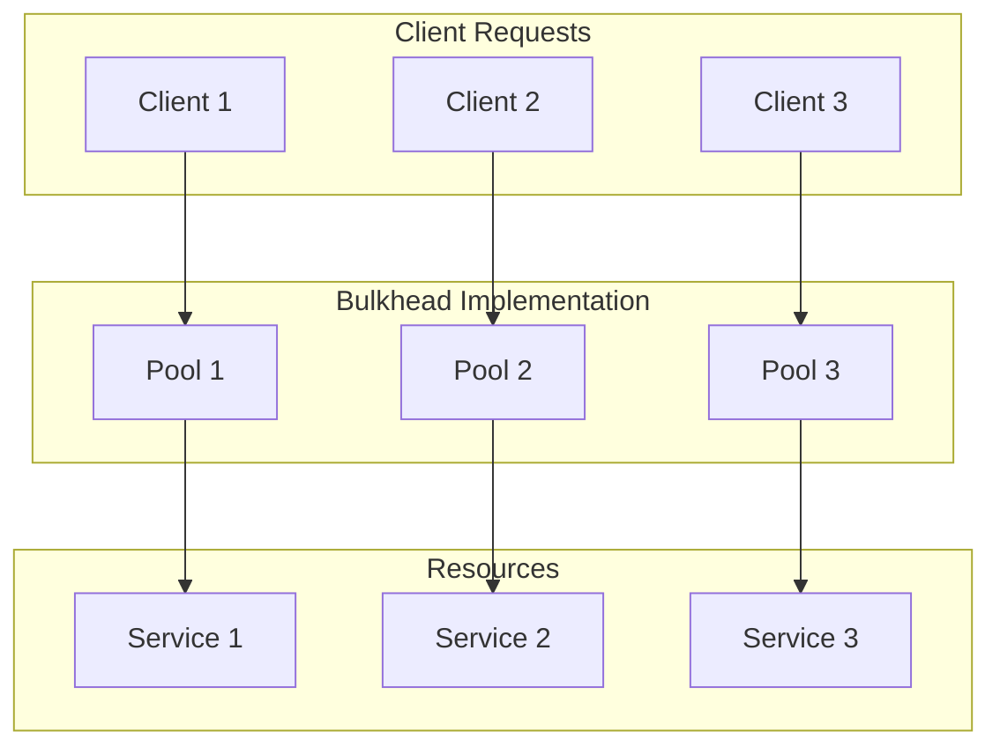
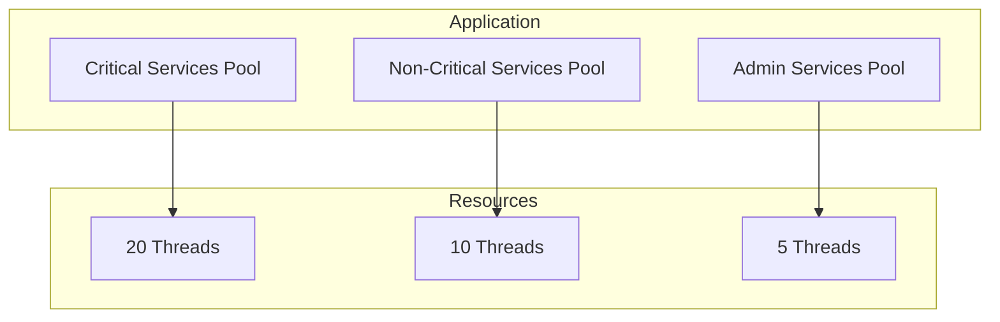
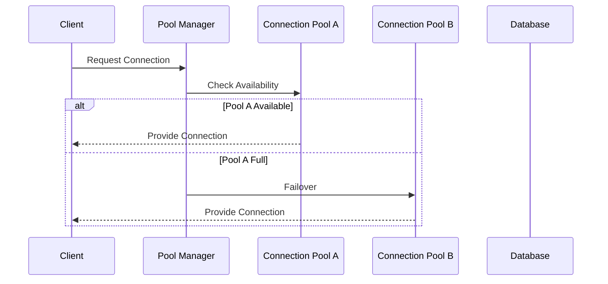

# 🛡️ Bulkhead Pattern

## 📋 Overview and Problem Statement

### Definition
The Bulkhead pattern isolates elements of an application into pools so that if one fails, the others will continue to function. Named after the sectioned partitions (bulkheads) of a ship's hull, this pattern prevents cascading failures in distributed systems.

### Problems It Solves
- Resource exhaustion
- Cascading failures
- System-wide outages
- Noisy neighbor problems
- Performance degradation

### Business Value
- Enhanced system resilience
- Improved fault isolation
- Better resource management
- Increased system availability
- Predictable performance

## 🏗️ Architecture & Core Concepts

### System Components


### Implementation Types

1. **Thread Pool Isolation**


2. **Connection Pool Isolation**


## 💻 Technical Implementation

### Thread Pool Bulkhead
```java
public class ThreadPoolBulkhead {
    private final Map<String, ExecutorService> executors;
    private final Map<String, BulkheadConfig> configs;

    public ThreadPoolBulkhead() {
        this.executors = new ConcurrentHashMap<>();
        this.configs = new ConcurrentHashMap<>();
    }

    public void configure(String poolName, BulkheadConfig config) {
        ExecutorService executor = new ThreadPoolExecutor(
            config.getCoreSize(),
            config.getMaxSize(),
            config.getKeepAliveTime(),
            TimeUnit.MILLISECONDS,
            new ArrayBlockingQueue<>(config.getQueueSize()),
            new ThreadPoolExecutor.CallerRunsPolicy()
        );
        
        executors.put(poolName, executor);
        configs.put(poolName, config);
    }

    public <T> CompletableFuture<T> execute(
        String poolName, 
        Supplier<T> task
    ) {
        ExecutorService executor = executors.get(poolName);
        if (executor == null) {
            throw new IllegalArgumentException(
                "Pool not configured: " + poolName);
        }

        return CompletableFuture.supplyAsync(task, executor);
    }
}

@Data
@Builder
public class BulkheadConfig {
    private int coreSize;
    private int maxSize;
    private int queueSize;
    private long keepAliveTime;
}
```

### Semaphore Bulkhead
```java
public class SemaphoreBulkhead {
    private final Semaphore semaphore;
    private final int maxConcurrentCalls;
    private final int maxWaitTime;

    public SemaphoreBulkhead(
        int maxConcurrentCalls, 
        int maxWaitTime
    ) {
        this.semaphore = new Semaphore(maxConcurrentCalls);
        this.maxConcurrentCalls = maxConcurrentCalls;
        this.maxWaitTime = maxWaitTime;
    }

    public <T> T execute(Supplier<T> task) throws BulkheadException {
        try {
            if (!semaphore.tryAcquire(
                maxWaitTime, 
                TimeUnit.MILLISECONDS)) {
                throw new BulkheadException("Bulkhead full");
            }

            try {
                return task.get();
            } finally {
                semaphore.release();
            }
        } catch (InterruptedException e) {
            Thread.currentThread().interrupt();
            throw new BulkheadException(
                "Thread interrupted while waiting", e);
        }
    }
}
```

### Connection Pool Bulkhead
```java
public class ConnectionPoolBulkhead {
    private final GenericObjectPool<Connection> pool;
    private final MetricRegistry metrics;

    public ConnectionPoolBulkhead(
        ConnectionFactory factory, 
        PoolConfig config
    ) {
        GenericObjectPoolConfig poolConfig = 
            new GenericObjectPoolConfig();
        poolConfig.setMaxTotal(config.getMaxTotal());
        poolConfig.setMaxIdle(config.getMaxIdle());
        poolConfig.setMinIdle(config.getMinIdle());
        poolConfig.setMaxWaitMillis(config.getMaxWaitMillis());

        this.pool = new GenericObjectPool<>(factory, poolConfig);
        this.metrics = new MetricRegistry();
        
        setupMetrics();
    }

    public Connection borrowConnection() 
        throws Exception {
        try {
            return pool.borrowObject();
        } catch (NoSuchElementException e) {
            throw new BulkheadException(
                "Connection pool exhausted", e);
        }
    }

    public void returnConnection(Connection conn) {
        pool.returnObject(conn);
    }

    private void setupMetrics() {
        metrics.gauge(
            "pool.active", 
            () -> pool::getNumActive
        );
        metrics.gauge(
            "pool.idle", 
            () -> pool::getNumIdle
        );
    }
}
```

## 🤔 Decision Criteria & Evaluation

### Bulkhead Pattern Selection Matrix

| Type | Use Case | Pros | Cons |
|------|----------|------|------|
| Thread Pool | CPU-bound tasks | Fine-grained control | Memory overhead |
| Semaphore | I/O-bound tasks | Low overhead | Less control |
| Connection Pool | Database connections | Resource management | Setup complexity |

### When to Use Each Type

#### Thread Pool Bulkhead
- Long-running operations
- CPU-intensive tasks
- When need for separate thread contexts

#### Semaphore Bulkhead
- Quick operations
- I/O-bound operations
- Limited resources

#### Connection Pool Bulkhead
- Database connections
- Network connections
- External service calls

## 📊 Performance Metrics & Optimization

### Key Metrics
```java
public class BulkheadMetrics {
    private final MetricRegistry metrics;

    public void recordExecution(
        String poolName, 
        long duration
    ) {
        metrics.timer(
            "bulkhead.execution.time")
            .update(duration, TimeUnit.MILLISECONDS);
    }

    public void recordRejection(String poolName) {
        metrics.counter(
            "bulkhead.rejections").inc();
    }

    public void recordQueueSize(
        String poolName, 
        int size
    ) {
        metrics.gauge(
            "bulkhead.queue.size", 
            () -> size);
    }
}
```

## ⚠️ Anti-Patterns

### 1. Single Pool for Everything
❌ **Wrong**:
```java
public class SinglePoolService {
    private final ExecutorService executor = 
        Executors.newFixedThreadPool(10);

    public void executeTask(Runnable task) {
        executor.execute(task);  // All tasks share same pool
    }
}
```

✅ **Correct**:
```java
public class MultiPoolService {
    private final Map<String, ExecutorService> pools;

    public MultiPoolService() {
        pools = new HashMap<>();
        pools.put("critical", 
            Executors.newFixedThreadPool(20));
        pools.put("normal", 
            Executors.newFixedThreadPool(10));
        pools.put("background", 
            Executors.newFixedThreadPool(5));
    }

    public void executeTask(
        String priority, 
        Runnable task
    ) {
        pools.get(priority).execute(task);
    }
}
```

### 2. Incorrect Pool Sizing
❌ **Wrong**:
```java
public class OverlyLargePool {
    private final ExecutorService executor = 
        Executors.newFixedThreadPool(1000); // Too many threads
}
```

✅ **Correct**:
```java
public class OptimizedPool {
    private final ExecutorService executor;
    
    public OptimizedPool() {
        int processors = Runtime.getRuntime()
            .availableProcessors();
        int poolSize = calculateOptimalPoolSize(
            processors,
            targetUtilization,
            waitToComputeRatio
        );
        
        executor = Executors.newFixedThreadPool(poolSize);
    }
    
    private int calculateOptimalPoolSize(
        int processors,
        double targetUtilization,
        double waitToComputeRatio
    ) {
        return (int)(processors * targetUtilization * 
            (1 + waitToComputeRatio));
    }
}
```

## 💡 Best Practices

### 1. Pool Configuration
```java
public class BulkheadPoolConfig {
    public static ExecutorService createBoundedPool(
        String poolName,
        int coreSize,
        int maxSize,
        int queueSize
    ) {
        return new ThreadPoolExecutor(
            coreSize,
            maxSize,
            60L, 
            TimeUnit.SECONDS,
            new ArrayBlockingQueue<>(queueSize),
            new ThreadFactory() {
                public Thread newThread(Runnable r) {
                    Thread t = new Thread(r);
                    t.setName(poolName + "-" + t.getId());
                    t.setUncaughtExceptionHandler(
                        (t1, e) -> log.error(
                            "Uncaught exception in pool {}: {}", 
                            poolName, 
                            e
                        )
                    );
                    return t;
                }
            },
            new ThreadPoolExecutor.CallerRunsPolicy()
        );
    }
}
```

### 2. Monitoring and Alerting
```java
public class BulkheadMonitor {
    private final MetricRegistry metrics;
    private final AlertService alertService;

    public void monitorPool(
        ThreadPoolExecutor executor,
        String poolName
    ) {
        metrics.gauge(
            poolName + ".pool.size",
            () -> executor::getPoolSize
        );

        metrics.gauge(
            poolName + ".active.threads",
            () -> executor::getActiveCount
        );

        metrics.gauge(
            poolName + ".queue.size",
            () -> executor.getQueue()::size
        );

        // Alert if queue is near capacity
        if (executor.getQueue().size() > 
            executor.getQueue().remainingCapacity() * 0.8) {
            alertService.sendAlert(
                "Pool " + poolName + " queue is near capacity"
            );
        }
    }
}
```

## 🔍 Troubleshooting Guide

### Common Issues

1. **Thread Pool Exhaustion**
```java
public class ThreadPoolDiagnostics {
    public ThreadPoolStatus diagnose(
        ThreadPoolExecutor executor
    ) {
        return ThreadPoolStatus.builder()
            .activeThreads(executor.getActiveCount())
            .poolSize(executor.getPoolSize())
            .maxPoolSize(executor.getMaximumPoolSize())
            .queueSize(executor.getQueue().size())
            .queueRemainingCapacity(
                executor.getQueue().remainingCapacity())
            .completedTaskCount(
                executor.getCompletedTaskCount())
            .taskCount(executor.getTaskCount())
            .isShutdown(executor.isShutdown())
            .build();
    }
}
```

2. **Connection Pool Monitoring**
```java
public class ConnectionPoolMonitor {
    public ConnectionPoolStatus monitor(
        GenericObjectPool<?> pool
    ) {
        return ConnectionPoolStatus.builder()
            .numActive(pool.getNumActive())
            .numIdle(pool.getNumIdle())
            .maxTotal(pool.getMaxTotal())
            .meanActiveTimeMillis(
                pool.getMeanActiveTimeMillis())
            .meanIdleTimeMillis(
                pool.getMeanIdleTimeMillis())
            .build();
    }
}
```

## 🧪 Testing

### Test Cases
```java
@Test
public void testBulkheadIsolation() {
    ThreadPoolBulkhead bulkhead = new ThreadPoolBulkhead(
        10, 
        20, 
        new ArrayBlockingQueue<>(100)
    );

    // Test normal operation
    CompletableFuture<String> future = bulkhead.execute(
        () -> "Success"
    );
    assertEquals("Success", future.join());

    // Test isolation
    CompletableFuture<String> failingFuture = 
        bulkhead.execute(() -> {
            throw new RuntimeException("Failure");
        });

    assertThrows(
        CompletionException.class, 
        () -> failingFuture.join()
    );

    // Verify other operations still work
    CompletableFuture<String> anotherFuture = 
        bulkhead.execute(() -> "Still working");
    assertEquals("Still working", anotherFuture.join());
}
```

## 🌍 Real-world Use Cases

### 1. Netflix Hystrix
- Thread pool isolation
- Semaphore isolation
- Circuit breaking integration
- Metrics and monitoring

### 2. Azure App Service
- Resource isolation
- Connection pooling
- Request routing

### 3. Amazon ECS
- Task isolation
- Resource boundaries
- Service quotas

## 📚 References

### Books
- "Release It!" by Michael Nygard
- "Implementing Resilient Applications" by Michael T. Fisher

### Online Resources
- [Netflix Hystrix Documentation](https://github.com/Netflix/Hystrix/wiki)
- [Microsoft Azure Bulkhead Pattern](https://docs.microsoft.com/en-us/azure/architecture/patterns/bulkhead)
- [AWS Best Practices](https://aws.amazon.com/architecture/well-architected/)