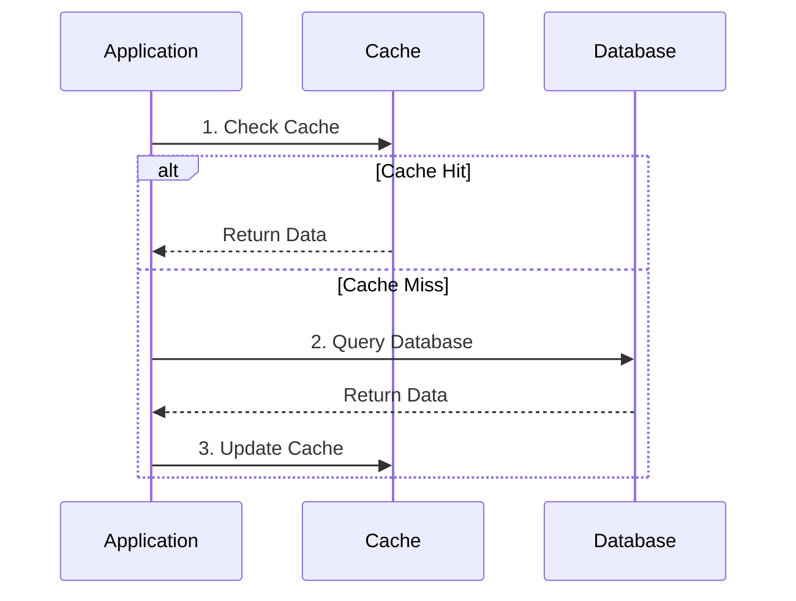
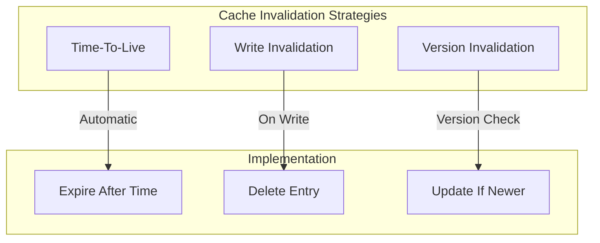

# 🚀 Cache-Aside Pattern

## 📋 Overview and Problem Statement

### Definition
Cache-Aside (also known as Lazy Loading) is a caching pattern where the application first checks the cache for data, and only if it's not found (cache miss) does it query the database, subsequently updating the cache with the retrieved data.

### Problems It Solves
- High database load
- High latency in data retrieval
- Unnecessary database queries
- Scalability bottlenecks
- Cost of repeated queries

### Business Value
- Improved application performance
- Reduced database costs
- Better user experience
- Increased system scalability
- Lower operational costs

## 🏗️ Architecture & Core Concepts

### Basic Flow


### Invalidation Patterns


## 💻 Technical Implementation

### Basic Cache-Aside Implementation
```java
@Service
public class CacheAsideService<K, V> {
    private final Cache<K, V> cache;
    private final DataSource dataSource;
    private final LoadingMetrics metrics;

    public V get(K key) {
        long startTime = System.currentTimeMillis();
        try {
            // Try cache first
            V value = cache.get(key);
            if (value != null) {
                metrics.recordCacheHit();
                return value;
            }

            // Cache miss - get from database
            metrics.recordCacheMiss();
            value = dataSource.get(key);
            if (value != null) {
                cache.put(key, value);
            }
            
            return value;
        } finally {
            metrics.recordLatency(
                System.currentTimeMillis() - startTime);
        }
    }

    public void put(K key, V value) {
        // Write-through
        dataSource.put(key, value);
        cache.invalidate(key);
    }
}
```

### Distributed Cache Implementation
```java
@Service
public class DistributedCacheAside {
    private final RedisTemplate<String, Object> redis;
    private final JdbcTemplate jdbc;
    private final Duration ttl;
    
    public Optional<User> getUser(String userId) {
        String cacheKey = "user:" + userId;
        
        // Try cache first
        User cachedUser = (User) redis.opsForValue()
            .get(cacheKey);
        if (cachedUser != null) {
            return Optional.of(cachedUser);
        }
        
        // Cache miss - get from database
        User user = jdbc.queryForObject(
            "SELECT * FROM users WHERE id = ?",
            new Object[]{userId},
            userRowMapper
        );
        
        if (user != null) {
            // Update cache with TTL
            redis.opsForValue().set(
                cacheKey, 
                user, 
                ttl
            );
        }
        
        return Optional.ofNullable(user);
    }
}
```

### Concurrent Cache-Aside
```java
@Service
public class ConcurrentCacheAside {
    private final Cache<String, Future<User>> cache;
    private final UserRepository repository;
    
    public User getUser(String userId) throws Exception {
        Future<User> future = cache.get(userId, key -> {
            try {
                return executorService.submit(() -> {
                    User user = repository.findById(userId);
                    if (user == null) {
                        throw new UserNotFoundException(userId);
                    }
                    return user;
                });
            } catch (Exception e) {
                throw new CompletionException(e);
            }
        });
        
        try {
            return future.get(timeout, TimeUnit.MILLISECONDS);
        } catch (TimeoutException e) {
            cache.invalidate(userId);
            throw e;
        }
    }
}
```

## 🤔 Decision Criteria & Evaluation

### Caching Strategy Comparison

| Strategy | Pros | Cons | Use Case |
|----------|------|------|----------|
| Cache-Aside | Simple, flexible | Potential stale data | General purpose |
| Write-Through | Consistent data | Higher write latency | Write-heavy |
| Write-Behind | Best performance | Risk of data loss | High-performance |
| Read-Through | Simple for apps | Cache provider dependent | Read-heavy |

### Performance Characteristics
```java
public class CachePerformanceMonitor {
    private final MetricRegistry metrics;
    
    public void recordMetrics(
        String operation,
        boolean cacheHit,
        long latency
    ) {
        metrics.counter(
            operation + ".cache." + 
            (cacheHit ? "hit" : "miss")
        ).inc();
        
        metrics.histogram(
            operation + ".latency"
        ).update(latency);
    }
}
```

## ⚠️ Anti-Patterns

### 1. Cache Stampede
❌ **Wrong**:
```java
public class StampedeVulnerable {
    public User getUser(String id) {
        User user = cache.get(id);
        if (user == null) {
            // Multiple threads can hit database simultaneously
            user = database.get(id);
            cache.put(id, user);
        }
        return user;
    }
}
```

✅ **Correct**:
```java
public class StampedeProtected {
    private final LoadingCache<String, User> cache;
    
    public StampedeProtected() {
        cache = Caffeine.newBuilder()
            .maximumSize(10_000)
            .expireAfterWrite(Duration.ofMinutes(5))
            .build(key -> {
                // Only one thread will load value
                return database.get(key);
            });
    }
    
    public User getUser(String id) {
        return cache.get(id);
    }
}
```

### 2. Missing Error Handling
❌ **Wrong**:
```java
public class ErrorProne {
    public Data getData(String key) {
        try {
            return cache.get(key);
        } catch (Exception e) {
            return database.get(key);
            // Cache remains inconsistent
        }
    }
}
```

✅ **Correct**:
```java
public class ErrorHandling {
    public Data getData(String key) {
        try {
            return cache.get(key);
        } catch (CacheException e) {
            metrics.recordError("cache", e);
            try {
                Data data = database.get(key);
                cache.put(key, data);  // Restore cache
                return data;
            } catch (Exception dbError) {
                metrics.recordError("database", dbError);
                throw new ServiceException(
                    "Unable to retrieve data", dbError);
            }
        }
    }
}
```

## 💡 Best Practices

### 1. Cache Configuration
```java
@Configuration
public class CacheConfig {
    @Bean
    public Cache<String, User> userCache() {
        return Caffeine.newBuilder()
            .maximumSize(10_000)
            .expireAfterWrite(Duration.ofMinutes(10))
            .recordStats()
            .build();
    }
    
    @Bean
    public CacheMetricsCollector metricsCollector(
        Cache<String, User> cache
    ) {
        return new CacheMetricsCollector(cache);
    }
}
```

### 2. Error Handling and Resilience
```java
public class ResilientCacheAside {
    private final CircuitBreaker circuitBreaker;
    
    public User getUser(String id) {
        return circuitBreaker.executeWithFallback(
            () -> getUserWithCache(id),
            throwable -> getUserDirect(id)
        );
    }
    
    private User getUserWithCache(String id) {
        User user = cache.get(id);
        if (user == null) {
            user = database.get(id);
            cache.put(id, user);
        }
        return user;
    }
    
    private User getUserDirect(String id) {
        // Direct database access when cache fails
        return database.get(id);
    }
}
```

## 🔍 Troubleshooting Guide

### Common Issues

1. **Cache Coherency**
```java
public class CacheCoherencyMonitor {
    public void checkCoherency(String key) {
        Data cacheData = cache.get(key);
        Data dbData = database.get(key);
        
        if (!Objects.equals(cacheData, dbData)) {
            metrics.recordIncoherency(key);
            logger.warn(
                "Cache incoherency detected for key: {}", 
                key
            );
            
            // Auto-heal
            cache.put(key, dbData);
        }
    }
}
```

2. **Cache Performance**
```java
public class CachePerformanceMonitor {
    public CacheStats getStats() {
        return CacheStats.builder()
            .hitRate(cache.stats().hitRate())
            .missRate(cache.stats().missRate())
            .loadExceptionRate(
                cache.stats().loadExceptionRate())
            .averageLoadPenalty(
                cache.stats().averageLoadPenalty())
            .evictionCount(
                cache.stats().evictionCount())
            .build();
    }
}
```

## 🧪 Testing

### Cache Testing
```java
@Test
public void testCacheAside() {
    CacheAsideService<String, User> service = 
        new CacheAsideService<>(cache, database);
    
    // First call - should hit database
    User user1 = service.get("user1");
    verify(database, times(1)).get("user1");
    verify(cache, times(1)).put("user1", user1);
    
    // Second call - should hit cache
    User user2 = service.get("user1");
    verify(database, times(1)).get("user1");
    assertEquals(user1, user2);
    
    // After expiration - should hit database again
    cache.invalidate("user1");
    User user3 = service.get("user1");
    verify(database, times(2)).get("user1");
}
```

## 🌍 Real-world Use Cases

### 1. Redis Cache-Aside
- Session storage
- API response caching
- Database query caching
- Rate limiting

### 2. Content Delivery Networks (CDN)
- Static asset caching
- Edge caching
- Dynamic content caching

### 3. Memcached
- Object caching
- Page caching
- Session caching

## 📚 References

### Books
- "Designing Data-Intensive Applications" by Martin Kleppmann
- "High Performance Browser Networking" by Ilya Grigorik

### Online Resources
- [Redis Documentation](https://redis.io/documentation)
- [Memcached Wiki](https://github.com/memcached/memcached/wiki)
- [AWS ElastiCache Best Practices](https://aws.amazon.com/elasticache/redis/)
