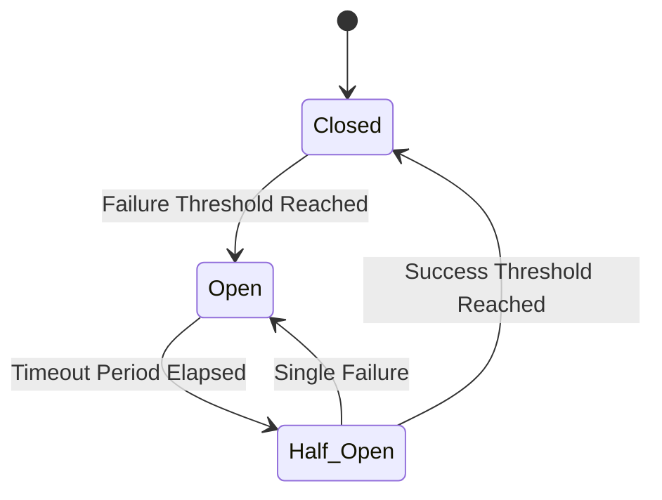
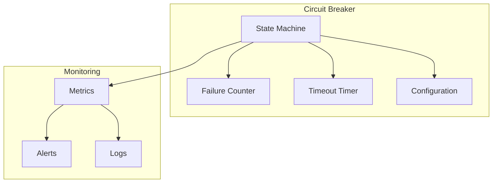

# 🔌 Circuit Breaker Pattern

## 📋 Overview and Problem Statement

### Definition
The Circuit Breaker pattern prevents cascading failures by monitoring for failures and encapsulating the logic of preventing a failure from constantly recurring.

### Problems It Solves
- Cascading failures in distributed systems
- Resource exhaustion
- Unresponsive service handling
- Unnecessary load on failing services
- Long response times during failures

### Business Value
- Improved system resilience
- Better user experience during partial outages
- Reduced system recovery time
- Protected system resources
- Faster failure detection

## 🏗️ Architecture & Core Concepts

### States and Transitions


### System Components


## 💻 Technical Implementation

### Basic Circuit Breaker
```java
public class CircuitBreaker {
    private final long timeout;
    private final long failureThreshold;
    private final long resetTimeout;
    
    private State state;
    private long failures;
    private long lastFailureTime;
    private final AtomicReference<State> stateRef;
    private final MetricRegistry metrics;

    public enum State {
        CLOSED,
        OPEN,
        HALF_OPEN
    }

    public <T> T execute(Supplier<T> supplier) throws Exception {
        if (!canExecute()) {
            throw new CircuitBreakerOpenException();
        }

        try {
            T result = supplier.get();
            onSuccess();
            return result;
        } catch (Exception e) {
            onFailure();
            throw e;
        }
    }

    private boolean canExecute() {
        State currentState = stateRef.get();
        
        if (currentState == State.CLOSED) {
            return true;
        }

        if (currentState == State.OPEN) {
            if (hasTimeoutExpired()) {
                stateRef.compareAndSet(State.OPEN, State.HALF_OPEN);
                return true;
            }
            return false;
        }

        // HALF_OPEN - allow one request
        return true;
    }

    private void onSuccess() {
        State currentState = stateRef.get();
        if (currentState == State.HALF_OPEN) {
            stateRef.compareAndSet(State.HALF_OPEN, State.CLOSED);
            failures = 0;
            metrics.counter("circuit.closed").inc();
        }
    }

    private void onFailure() {
        failures++;
        lastFailureTime = System.currentTimeMillis();

        if (failures >= failureThreshold) {
            stateRef.set(State.OPEN);
            metrics.counter("circuit.opened").inc();
        }
    }
}
```

### Advanced Implementation with Sliding Window
```java
public class SlidingWindowCircuitBreaker {
    private final Queue<Long> failureTimestamps;
    private final int windowSize;
    private final int failureThreshold;
    private final Duration windowDuration;
    
    public synchronized boolean allowRequest() {
        long now = System.currentTimeMillis();
        
        // Remove old timestamps
        while (!failureTimestamps.isEmpty() && 
               failureTimestamps.peek() < now - windowDuration.toMillis()) {
            failureTimestamps.poll();
        }
        
        return failureTimestamps.size() < failureThreshold;
    }
    
    public synchronized void recordFailure() {
        failureTimestamps.offer(System.currentTimeMillis());
        
        if (failureTimestamps.size() >= failureThreshold) {
            transitionToOpen();
        }
    }
}
```

### Circuit Breaker with Retry Policy
```java
public class CircuitBreakerWithRetry {
    private final CircuitBreaker circuitBreaker;
    private final RetryPolicy retryPolicy;
    
    public <T> T executeWithRetry(Supplier<T> supplier) {
        return retryPolicy.execute(() -> {
            try {
                return circuitBreaker.execute(supplier);
            } catch (CircuitBreakerOpenException e) {
                // Don't retry if circuit is open
                throw new NonRetryableException(e);
            } catch (Exception e) {
                // Retry other exceptions based on policy
                throw new RetryableException(e);
            }
        });
    }
}
```

## 🤔 Decision Criteria & Evaluation

### Circuit Breaker Types Comparison

| Type | Pros | Cons | Use Case |
|------|------|------|----------|
| Count-Based | Simple to implement | Less accurate | Basic protection |
| Time-Based | More precise | More complex | Production systems |
| Hybrid | Best accuracy | Most complex | Critical systems |

### Implementation Comparison Matrix

| Feature | Simple | Advanced | Enterprise |
|---------|---------|-----------|------------|
| Failure Detection | Count-based | Time-window | ML-based |
| State Management | In-memory | Distributed | Hierarchical |
| Monitoring | Basic metrics | Detailed metrics | Full observability |
| Recovery | Fixed timeout | Adaptive | Self-healing |

## 📊 Performance Metrics & Optimization

### Key Metrics
```java
public class CircuitBreakerMetrics {
    private final MetricRegistry metrics;
    
    public void recordExecution(String operation, State state) {
        metrics.counter(
            String.format("circuit_breaker.%s.%s", 
                operation, 
                state.name().toLowerCase())
        ).inc();
    }
    
    public void recordLatency(String operation, long duration) {
        metrics.histogram(
            String.format("circuit_breaker.%s.latency", 
                operation)
        ).update(duration);
    }
    
    public void recordStateTransition(State from, State to) {
        metrics.counter(
            String.format("circuit_breaker.transition.%s_to_%s",
                from.name().toLowerCase(),
                to.name().toLowerCase())
        ).inc();
    }
}
```

## ⚠️ Anti-Patterns

### 1. Global Circuit Breaker
❌ **Wrong**:
```java
public class GlobalCircuitBreaker {
    private static final CircuitBreaker INSTANCE = 
        new CircuitBreaker();
    
    public static CircuitBreaker getInstance() {
        return INSTANCE;  // Single breaker for all operations
    }
}
```

✅ **Correct**:
```java
public class ServiceCircuitBreakers {
    private final Map<String, CircuitBreaker> breakers;
    
    public CircuitBreaker getBreaker(String service) {
        return breakers.computeIfAbsent(service,
            k -> new CircuitBreaker(
                getConfigForService(service)
            ));
    }
}
```

### 2. Incorrect Failure Counting
❌ **Wrong**:
```java
public class SimpleFailureCounter {
    private int failures = 0;
    
    public void recordFailure() {
        failures++;  // No time window consideration
    }
}
```

✅ **Correct**:
```java
public class WindowedFailureCounter {
    private final Queue<Long> failures = new LinkedList<>();
    private final Duration window;
    
    public void recordFailure() {
        long now = System.currentTimeMillis();
        failures.offer(now);
        
        // Remove old failures
        while (!failures.isEmpty() && 
               failures.peek() < now - window.toMillis()) {
            failures.poll();
        }
    }
    
    public int getFailureCount() {
        return failures.size();
    }
}
```

## 💡 Best Practices

### 1. Configuration Management
```java
public class CircuitBreakerConfig {
    @Builder
    public static class Config {
        private final int failureThreshold;
        private final Duration windowDuration;
        private final Duration openStateTimeout;
        private final Predicate<Throwable> failureCondition;
        private final List<Class<? extends Throwable>> ignoredExceptions;
    }
    
    public static Config forHttpService() {
        return Config.builder()
            .failureThreshold(5)
            .windowDuration(Duration.ofMinutes(1))
            .openStateTimeout(Duration.ofSeconds(30))
            .failureCondition(e -> e instanceof IOException)
            .ignoredExceptions(Arrays.asList(
                ValidationException.class))
            .build();
    }
}
```

### 2. Monitoring and Alerting
```java
public class CircuitBreakerMonitor {
    private final AlertService alertService;
    private final MetricRegistry metrics;
    
    public void monitorStateTransitions(
        String service,
        State oldState,
        State newState
    ) {
        metrics.counter(
            "circuit_breaker.state_change"
        ).inc();
        
        if (newState == State.OPEN) {
            alertService.sendAlert(
                String.format(
                    "Circuit breaker opened for service: %s",
                    service
                )
            );
        }
    }
}
```

## 🧪 Testing Strategies

### Circuit Breaker Tests
```java
@Test
public void testCircuitBreakerStates() {
    CircuitBreaker breaker = new CircuitBreaker(
        CircuitBreakerConfig.builder()
            .failureThreshold(2)
            .timeout(Duration.ofSeconds(1))
            .build()
    );
    
    // Test transition to open
    simulateFailures(breaker, 2);
    assertEquals(State.OPEN, breaker.getState());
    
    // Test half-open after timeout
    await().atMost(2, TimeUnit.SECONDS)
        .until(() -> breaker.getState() == State.HALF_OPEN);
    
    // Test successful recovery
    breaker.execute(() -> "success");
    assertEquals(State.CLOSED, breaker.getState());
}

@Test
public void testConcurrentAccess() {
    CircuitBreaker breaker = new CircuitBreaker();
    ExecutorService executor = 
        Executors.newFixedThreadPool(10);
    
    List<Future<?>> futures = new ArrayList<>();
    for (int i = 0; i < 100; i++) {
        futures.add(executor.submit(() -> {
            try {
                breaker.execute(() -> {
                    // Simulate work
                    Thread.sleep(10);
                    return null;
                });
            } catch (Exception e) {
                // Expected for some calls
            }
        }));
    }
    
    // Verify all calls complete without errors
    futures.forEach(f -> {
        try {
            f.get();
        } catch (Exception e) {
            fail("Unexpected error: " + e);
        }
    });
}
```

## 🌍 Real-world Use Cases

### 1. Netflix Hystrix
- Service protection
- Fallback mechanisms
- Real-time monitoring
- Dashboard visualization

### 2. Azure Circuit Breaker
- Microservices protection
- Auto-scaling integration
- Retry policies
- Telemetry integration

### 3. Spring Circuit Breaker
- Declarative circuit breaking
- Integration with Spring Cloud
- Multiple backend support
- Metrics exposure

## 📚 References

### Books
- "Release It!" by Michael Nygard
- "Building Microservices" by Sam Newman

### Online Resources
- [Netflix Hystrix Wiki](https://github.com/Netflix/Hystrix/wiki)
- [Microsoft Circuit Breaker Pattern](https://docs.microsoft.com/en-us/azure/architecture/patterns/circuit-breaker)
- [Martin Fowler's Circuit Breaker](https://martinfowler.com/bliki/CircuitBreaker.html)