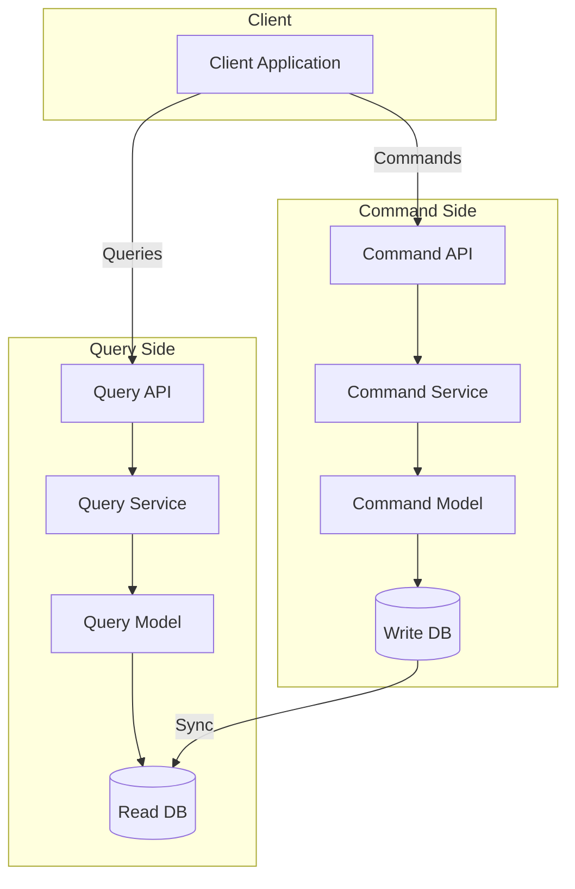
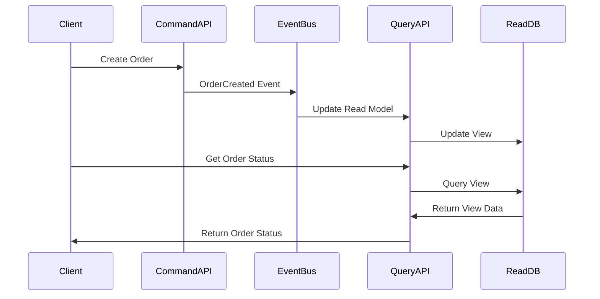

# 🔄 Command Query Responsibility Segregation (CQRS)

## 📋 Overview and Problem Statement

### Definition
CQRS is an architectural pattern that separates read (Query) and write (Command) operations for a data store, allowing them to be handled by different models, scaled independently, and optimized for their specific use cases.

### Problems It Solves
- Complex domain logic handling
- Performance bottlenecks in read/write operations
- Scalability challenges
- Mixed concerns in domain models
- Optimization difficulties for different workloads

### Business Value
- Improved scalability
- Better performance
- Enhanced maintainability
- Specialized optimization
- Independent scaling of read/write operations

## 🏗️ Architecture & Core Concepts

### High-Level Architecture


### Event Flow


## 💻 Technical Implementation

### Command Side Implementation
```java
// Command
@Value
public class CreateOrderCommand {
    String orderId;
    String customerId;
    List<OrderItem> items;
    BigDecimal totalAmount;
}

// Command Handler
@Service
public class CreateOrderCommandHandler {
    private final OrderRepository repository;
    private final EventBus eventBus;

    public void handle(CreateOrderCommand command) {
        // Validate command
        validateCommand(command);

        // Create and save order
        Order order = Order.create(
            command.getOrderId(),
            command.getCustomerId(),
            command.getItems()
        );
        repository.save(order);

        // Publish event
        eventBus.publish(new OrderCreatedEvent(order));
    }
}

// Domain Model
@Entity
public class Order {
    @Id
    private String id;
    private String customerId;
    @OneToMany(cascade = CascadeType.ALL)
    private List<OrderItem> items;
    private OrderStatus status;

    public void process() {
        validateState();
        this.status = OrderStatus.PROCESSING;
    }

    public void complete() {
        validateState();
        this.status = OrderStatus.COMPLETED;
    }
}
```

### Query Side Implementation
```java
// Query Model
@Document
public class OrderView {
    private String id;
    private String customerId;
    private List<OrderItemView> items;
    private OrderStatus status;
    private BigDecimal totalAmount;
}

// Query Service
@Service
public class OrderQueryService {
    private final OrderViewRepository repository;

    public OrderView getOrder(String orderId) {
        return repository.findById(orderId)
            .orElseThrow(() -> 
                new OrderNotFoundException(orderId));
    }

    public List<OrderView> getCustomerOrders(
        String customerId
    ) {
        return repository.findByCustomerId(customerId);
    }

    public List<OrderView> findOrdersByStatus(
        OrderStatus status
    ) {
        return repository.findByStatus(status);
    }
}

// Event Handler
@Service
public class OrderEventHandler {
    private final OrderViewRepository repository;

    @EventHandler
    public void on(OrderCreatedEvent event) {
        OrderView view = new OrderView(event.getOrder());
        repository.save(view);
    }

    @EventHandler
    public void on(OrderStatusChangedEvent event) {
        OrderView view = repository.findById(
            event.getOrderId())
            .orElseThrow();
        view.setStatus(event.getNewStatus());
        repository.save(view);
    }
}
```

### Event Synchronization
```java
@Service
public class EventSynchronizer {
    private final EventStore eventStore;
    private final List<EventHandler> handlers;

    @Scheduled(fixedRate = 1000)
    public void synchronize() {
        List<Event> events = eventStore
            .getUnprocessedEvents();
        
        for (Event event : events) {
            try {
                processEvent(event);
                eventStore.markAsProcessed(event);
            } catch (Exception e) {
                handleSyncError(event, e);
            }
        }
    }

    private void processEvent(Event event) {
        handlers.stream()
            .filter(h -> h.canHandle(event))
            .forEach(h -> h.handle(event));
    }
}
```

## 🤔 Decision Criteria & Evaluation

### When to Use CQRS

#### Suitable Scenarios
- Complex domain logic
- Different read/write workloads
- Scalability requirements
- Event-driven architectures
- Multiple read representations

#### Unsuitable Scenarios
- Simple CRUD operations
- Small applications
- Limited domain complexity
- Tight consistency requirements

### Comparison Matrix

| Aspect | Traditional N-Tier | CQRS | Event Sourcing + CQRS |
|--------|-------------------|------|----------------------|
| Complexity | Low | Medium | High |
| Scalability | Limited | Good | Excellent |
| Consistency | Immediate | Eventually | Eventually |
| Performance | Moderate | Good | Very Good |
| Maintenance | Simple | Moderate | Complex |

## 📊 Performance Metrics & Optimization

### Key Metrics
```java
@Service
public class CQRSMetrics {
    private final MeterRegistry registry;

    public void recordCommandExecution(
        String commandType,
        long duration
    ) {
        registry.timer("commands.execution",
            "type", commandType)
            .record(duration, TimeUnit.MILLISECONDS);
    }

    public void recordQueryExecution(
        String queryType,
        long duration
    ) {
        registry.timer("queries.execution",
            "type", queryType)
            .record(duration, TimeUnit.MILLISECONDS);
    }

    public void recordEventProcessing(
        String eventType,
        long duration
    ) {
        registry.timer("events.processing",
            "type", eventType)
            .record(duration, TimeUnit.MILLISECONDS);
    }
}
```

## ⚠️ Anti-Patterns

### 1. Shared Models
❌ **Wrong**:
```java
// Using same model for commands and queries
@Entity
public class Order {
    // Used for both read and write
    private String id;
    private String customerId;
    private List<OrderItem> items;
    private OrderStatus status;
}
```

✅ **Correct**:
```java
// Command Model
@Entity
public class Order {
    @Id
    private String id;
    private String customerId;
    @OneToMany
    private List<OrderItem> items;
    private OrderStatus status;

    public void process() {
        // Business logic
    }
}

// Query Model
@Document
public class OrderView {
    private String id;
    private String customerId;
    private List<OrderItemView> items;
    private OrderStatus status;
    private Summary summary;
}
```

### 2. Synchronous Updates
❌ **Wrong**:
```java
@Service
public class OrderService {
    public void createOrder(CreateOrderCommand cmd) {
        // Save to write DB
        Order order = orderRepository.save(
            new Order(cmd));
        
        // Immediately update read model
        orderViewRepository.save(
            new OrderView(order));
    }
}
```

✅ **Correct**:
```java
@Service
public class OrderService {
    public void createOrder(CreateOrderCommand cmd) {
        // Save to write DB
        Order order = orderRepository.save(
            new Order(cmd));
        
        // Publish event for async processing
        eventBus.publish(
            new OrderCreatedEvent(order));
    }
}

@Service
public class OrderViewUpdater {
    @EventHandler
    public void on(OrderCreatedEvent event) {
        orderViewRepository.save(
            new OrderView(event.getOrder()));
    }
}
```

## 💡 Best Practices

### 1. Event Design
```java
public interface Event {
    String getEventId();
    String getAggregateId();
    LocalDateTime getTimestamp();
    int getVersion();
}

@Value
public class OrderCreatedEvent implements Event {
    String eventId = UUID.randomUUID().toString();
    String aggregateId;
    LocalDateTime timestamp = LocalDateTime.now();
    int version;
    
    String customerId;
    List<OrderItem> items;
    BigDecimal totalAmount;
}
```

### 2. Command Validation
```java
@Service
public class CommandValidator {
    public void validate(Command command) {
        ValidationResult result = new ValidationResult();

        // Structural validation
        validateStructure(command, result);

        // Business rules validation
        validateBusinessRules(command, result);

        if (result.hasErrors()) {
            throw new ValidationException(result);
        }
    }
}
```

## 🔍 Troubleshooting Guide

### Common Issues

1. **Event Processing Failures**
```java
@Service
public class EventProcessingMonitor {
    public void monitorEventProcessing(
        String eventId,
        ProcessingStatus status
    ) {
        if (status == ProcessingStatus.FAILED) {
            // Log failure
            logger.error("Event processing failed: {}", 
                eventId);
            
            // Alert if critical
            if (isHighPriorityEvent(eventId)) {
                alertService.sendAlert(
                    "Critical event processing failure: " + 
                    eventId);
            }
            
            // Retry strategy
            retryService.scheduleRetry(eventId);
        }
    }
}
```

2. **Consistency Issues**
```java
@Service
public class ConsistencyChecker {
    public void checkConsistency() {
        List<String> aggregateIds = 
            repository.getAllAggregateIds();
            
        for (String id : aggregateIds) {
            WriteModel writeModel = 
                writeRepository.findById(id);
            ReadModel readModel = 
                readRepository.findById(id);
                
            if (!isConsistent(writeModel, readModel)) {
                handleInconsistency(id);
            }
        }
    }
}
```

## 🧪 Testing

### Testing Strategy
```java
@Test
public class OrderCommandHandlerTest {
    private OrderCommandHandler handler;
    private EventBus eventBus;
    private OrderRepository repository;

    @Test
    public void testCreateOrder() {
        // Arrange
        CreateOrderCommand command = 
            new CreateOrderCommand(/*...*/);

        // Act
        handler.handle(command);

        // Assert
        verify(repository).save(any(Order.class));
        verify(eventBus).publish(
            any(OrderCreatedEvent.class));
    }
}

@Test
public class OrderViewHandlerTest {
    private OrderViewHandler handler;
    private OrderViewRepository repository;

    @Test
    public void testOrderCreatedEventHandling() {
        // Arrange
        OrderCreatedEvent event = 
            new OrderCreatedEvent(/*...*/);

        // Act
        handler.on(event);

        // Assert
        verify(repository).save(any(OrderView.class));
    }
}
```

## 🌍 Real-world Use Cases

### 1. E-commerce Platform
- Order processing
- Inventory management
- Customer analytics
- Reporting systems

### 2. Financial Systems
- Transaction processing
- Account management
- Reporting and analytics
- Regulatory compliance

### 3. Content Management
- Content publishing
- Content delivery
- Analytics and reporting
- Search functionality

## 📚 References

### Books
- "Implementing Domain-Driven Design" by Vaughn Vernon
- "CQRS Journey" by Microsoft patterns & practices

### Online Resources
- [Martin Fowler's CQRS](https://martinfowler.com/bliki/CQRS.html)
- [Microsoft CQRS Pattern](https://docs.microsoft.com/en-us/azure/architecture/patterns/cqrs)
- [Greg Young's CQRS Documents](https://cqrs.files.wordpress.com/2010/11/cqrs_documents.pdf)