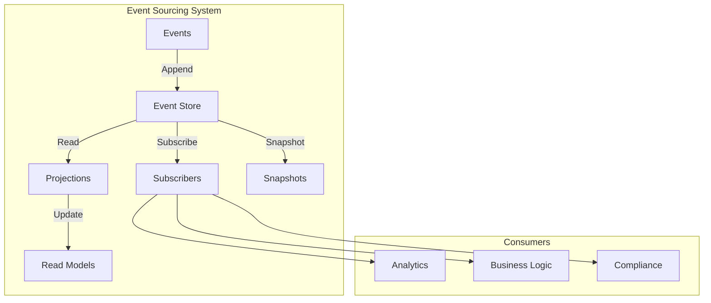
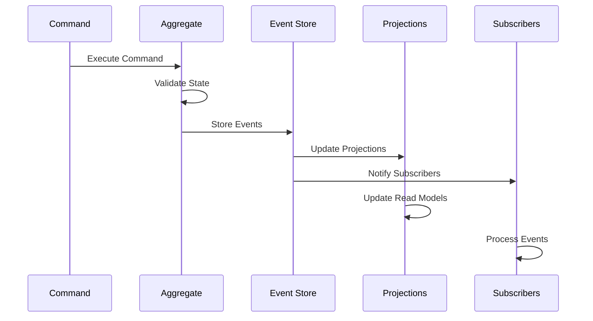

# 📝 Event Sourcing Pattern

## 📋 Overview and Problem Statement

### Definition
Event Sourcing is a pattern that stores all changes to an application's state as a sequence of events, allowing for complete reconstruction of the system state from those events.

### Problems It Solves
- Loss of historical state information
- Audit trail requirements
- Complex data recovery
- State recreation needs
- Temporal query challenges
- Domain event tracking

### Business Value
- Complete audit history
- Time travel capabilities
- Enhanced debugging
- Reliable event replay
- Improved compliance
- Better analytics

## 🏗️ Architecture & Core Concepts

### System Components


### Event Flow


## 💻 Technical Implementation

### Basic Event Store
```java
public class EventStore {
    private final JdbcTemplate jdbc;
    private final ObjectMapper objectMapper;
    
    public void append(String streamId, List<Event> events, 
                      int expectedVersion) {
        jdbc.execute("BEGIN TRANSACTION");
        try {
            // Check version
            int currentVersion = getVersion(streamId);
            if (currentVersion != expectedVersion) {
                throw new ConcurrencyException();
            }

            // Store events
            for (Event event : events) {
                storeEvent(streamId, event, ++currentVersion);
            }

            jdbc.execute("COMMIT");
        } catch (Exception e) {
            jdbc.execute("ROLLBACK");
            throw e;
        }
    }

    public List<Event> getEvents(String streamId) {
        return jdbc.query(
            "SELECT * FROM events WHERE stream_id = ? ORDER BY version",
            (rs, rowNum) -> deserializeEvent(rs),
            streamId
        );
    }

    private Event deserializeEvent(ResultSet rs) 
        throws SQLException {
        String eventData = rs.getString("event_data");
        String eventType = rs.getString("event_type");
        Class<? extends Event> eventClass = 
            getEventClass(eventType);
        return objectMapper.readValue(eventData, eventClass);
    }
}
```

### Event-Sourced Aggregate
```java
public abstract class EventSourcedAggregate {
    protected int version = -1;
    private final List<Event> changes = new ArrayList<>();

    protected void applyChange(Event event) {
        applyChange(event, true);
    }

    private void applyChange(Event event, boolean isNew) {
        handle(event);
        if (isNew) {
            changes.add(event);
        }
    }

    public void loadFromHistory(List<Event> history) {
        history.forEach(e -> applyChange(e, false));
        version = history.size() - 1;
    }

    public List<Event> getUncommittedChanges() {
        return changes;
    }

    public void markChangesAsCommitted() {
        changes.clear();
    }

    protected abstract void handle(Event event);
}

public class Order extends EventSourcedAggregate {
    private String orderId;
    private String customerId;
    private OrderStatus status;
    private List<OrderItem> items;

    public void createOrder(
        String orderId, 
        String customerId, 
        List<OrderItem> items
    ) {
        applyChange(new OrderCreatedEvent(
            orderId, 
            customerId, 
            items
        ));
    }

    @Override
    protected void handle(Event event) {
        if (event instanceof OrderCreatedEvent) {
            handle((OrderCreatedEvent) event);
        } else if (event instanceof OrderShippedEvent) {
            handle((OrderShippedEvent) event);
        }
    }

    private void handle(OrderCreatedEvent event) {
        this.orderId = event.getOrderId();
        this.customerId = event.getCustomerId();
        this.items = event.getItems();
        this.status = OrderStatus.CREATED;
    }
}
```

### Projection Engine
```java
@Service
public class ProjectionEngine {
    private final EventStore eventStore;
    private final Map<String, Projection> projections;
    private final ExecutorService executor;

    public void project(String streamId) {
        List<Event> events = eventStore.getEvents(streamId);
        for (Event event : events) {
            projections.values().parallelStream()
                .forEach(p -> p.handle(event));
        }
    }
}

public interface Projection {
    void handle(Event event);
    void reset();
}

@Component
public class OrderSummaryProjection implements Projection {
    private final JdbcTemplate jdbc;

    @Override
    public void handle(Event event) {
        if (event instanceof OrderCreatedEvent) {
            handleOrderCreated((OrderCreatedEvent) event);
        }
    }

    private void handleOrderCreated(OrderCreatedEvent event) {
        jdbc.update(
            "INSERT INTO order_summary (order_id, customer_id, status) " +
            "VALUES (?, ?, ?)",
            event.getOrderId(),
            event.getCustomerId(),
            OrderStatus.CREATED.name()
        );
    }
}
```

### Snapshot Strategy
```java
public class SnapshotStrategy<T extends EventSourcedAggregate> {
    private final EventStore eventStore;
    private final SnapshotStore snapshotStore;
    private final int snapshotFrequency;

    public T loadAggregate(String aggregateId, 
                          Class<T> aggregateType) {
        // Try to load from snapshot
        Optional<Snapshot<T>> snapshot = 
            snapshotStore.getLatest(aggregateId);
        
        T aggregate;
        int fromVersion;

        if (snapshot.isPresent()) {
            aggregate = snapshot.get().getAggregate();
            fromVersion = snapshot.get().getVersion();
        } else {
            aggregate = createNewAggregate(aggregateType);
            fromVersion = 0;
        }

        // Load events after snapshot
        List<Event> events = eventStore.getEventsAfterVersion(
            aggregateId, 
            fromVersion
        );
        aggregate.loadFromHistory(events);

        return aggregate;
    }

    public void saveAggregate(T aggregate, String aggregateId) {
        List<Event> uncommittedChanges = 
            aggregate.getUncommittedChanges();
        eventStore.append(
            aggregateId, 
            uncommittedChanges, 
            aggregate.getVersion()
        );

        if (shouldTakeSnapshot(aggregate)) {
            snapshotStore.save(new Snapshot<>(
                aggregateId,
                aggregate,
                aggregate.getVersion()
            ));
        }

        aggregate.markChangesAsCommitted();
    }

    private boolean shouldTakeSnapshot(T aggregate) {
        return aggregate.getVersion() % snapshotFrequency == 0;
    }
}
```

## 🤔 Decision Criteria & Evaluation

### When to Use Event Sourcing

#### Suitable Scenarios
- Audit requirements
- Complex business domains
- Historical analysis needs
- Regulatory compliance
- Debugging requirements

#### Unsuitable Scenarios
- Simple CRUD operations
- Real-time reporting needs
- Limited domain complexity
- Resource-constrained environments

### Comparison Matrix

| Aspect | Traditional Storage | Event Sourcing | Event Sourcing + CQRS |
|--------|-------------------|----------------|----------------------|
| Complexity | Low | High | Very High |
| Audit Trail | Limited | Complete | Complete |
| Query Flexibility | Limited | High | Very High |
| Storage Requirements | Low | High | Very High |
| Recovery Capabilities | Limited | Excellent | Excellent |

## 📊 Performance Metrics & Optimization

### Key Metrics
```java
public class EventSourcingMetrics {
    private final MeterRegistry registry;

    public void recordEventStored(String eventType) {
        registry.counter(
            "events.stored",
            "type", eventType
        ).increment();
    }

    public void recordProjectionLatency(
        String projectionName,
        long duration
    ) {
        registry.timer(
            "projection.latency",
            "name", projectionName
        ).record(Duration.ofMillis(duration));
    }

    public void recordSnapshotCreation(
        String aggregateType,
        long duration
    ) {
        registry.timer(
            "snapshot.creation",
            "type", aggregateType
        ).record(Duration.ofMillis(duration));
    }
}
```

## ⚠️ Anti-Patterns

### 1. Mutable Events
❌ **Wrong**:
```java
public class MutableEvent {
    private Date timestamp;
    private String data;

    public void updateTimestamp() {  // Events should be immutable
        this.timestamp = new Date();
    }
}
```

✅ **Correct**:
```java
@Value
public class ImmutableEvent {
    String eventId = UUID.randomUUID().toString();
    String aggregateId;
    int version;
    LocalDateTime timestamp = LocalDateTime.now();
    String data;
}
```

### 2. Large Event Payloads
❌ **Wrong**:
```java
public class LargeEvent {
    private byte[] completeDocumentSnapshot;  // Too large
    private List<CompleteCustomerData> allCustomers;  // Too much
}
```

✅ **Correct**:
```java
public class RightSizedEvent {
    private String documentId;
    private Set<String> changedFields;
    private Map<String, String> changes;
}
```

## 💡 Best Practices

### 1. Event Design
```java
public interface DomainEvent {
    String getEventId();
    String getAggregateId();
    int getVersion();
    LocalDateTime getTimestamp();
    String getEventType();
}

@Value
public class OrderCreatedEvent implements DomainEvent {
    String eventId = UUID.randomUUID().toString();
    String aggregateId;
    int version;
    LocalDateTime timestamp = LocalDateTime.now();
    String eventType = "OrderCreated";
    
    // Business properties
    String customerId;
    List<OrderItem> items;
    BigDecimal totalAmount;
}
```

### 2. Event Store Implementation
```java
public interface EventStore {
    void append(String streamId, List<Event> events, 
               int expectedVersion);
    List<Event> getEvents(String streamId);
    List<Event> getEventsAfterVersion(String streamId, 
                                     int version);
    void subscribe(String streamId, EventHandler handler);
}

@Component
public class PostgresEventStore implements EventStore {
    private final JdbcTemplate jdbc;
    private final ObjectMapper objectMapper;
    private final PublishSubject<Event> eventBus;

    @Override
    public void append(String streamId, List<Event> events, 
                      int expectedVersion) {
        TransactionTemplate tx = new TransactionTemplate();
        tx.execute(status -> {
            int currentVersion = getVersion(streamId);
            if (currentVersion != expectedVersion) {
                throw new ConcurrencyException();
            }

            for (Event event : events) {
                storeEvent(streamId, event, ++currentVersion);
                eventBus.onNext(event);
            }
            return null;
        });
    }
}
```

## 🔍 Troubleshooting Guide

### Common Issues

1. **Event Store Performance**
```java
public class EventStoreMonitor {
    public void monitorPerformance() {
        // Monitor write performance
        Timer writeTimer = metrics.timer("eventstore.write");
        
        // Monitor read performance
        Timer readTimer = metrics.timer("eventstore.read");
        
        // Monitor storage growth
        Gauge storageGauge = metrics.gauge(
            "eventstore.size",
            storage::getSize
        );
        
        // Alert on issues
        if (writeTimer.getSnapshot().get95thPercentile() > 
            threshold) {
            alertService.alert("Write performance degraded");
        }
    }
}
```

2. **Projection Recovery**
```java
public class ProjectionRecovery {
    public void recover(String projectionName) {
        Projection projection = projections.get(projectionName);
        projection.reset();
        
        eventStore.getEvents()
            .forEach(event -> {
                try {
                    projection.handle(event);
                } catch (Exception e) {
                    logger.error(
                        "Error recovering projection: {}", 
                        e.getMessage()
                    );
                }
            });
    }
}
```

## 🧪 Testing

### Event Sourcing Tests
```java
@Test
public void testOrderAggregate() {
    // Arrange
    Order order = new Order();
    String orderId = UUID.randomUUID().toString();
    String customerId = "customer123";
    List<OrderItem> items = Arrays.asList(
        new OrderItem("item1", 2),
        new OrderItem("item2", 1)
    );

    // Act
    order.createOrder(orderId, customerId, items);

    // Assert
    List<Event> uncommittedChanges = 
        order.getUncommittedChanges();
    assertEquals(1, uncommittedChanges.size());
    assertTrue(uncommittedChanges.get(0) 
        instanceof OrderCreatedEvent);

    OrderCreatedEvent event = 
        (OrderCreatedEvent) uncommittedChanges.get(0);
    assertEquals(orderId, event.getOrderId());
    assertEquals(customerId, event.getCustomerId());
    assertEquals(items, event.getItems());
}

@Test
public void testEventReplay() {
    // Arrange
    List<Event> history = Arrays.asList(
        new OrderCreatedEvent("order1", "customer1", items),
        new OrderShippedEvent("order1")
    );

    // Act
    Order order = new Order();
    order.loadFromHistory(history);

    // Assert
    assertEquals("order1", order.getOrderId());
    assertEquals(OrderStatus.SHIPPED, order.getStatus());
}
```

## 🌍 Real-world Use Cases

### 1. Banking Systems
- Transaction history
- Account balances
- Audit trails
- Compliance reporting

### 2. E-commerce
- Order processing
- Inventory management
- Customer history
- Price changes

### 3. Version Control Systems
- Code repository
- Change tracking
- Branch management

## 📚 References

### Books
- "Event Sourcing & CQRS" by Greg Young
- "Implementing Domain-Driven Design" by Vaughn Vernon

### Online Resources
- [Microsoft Event Sourcing Pattern](https://docs.microsoft.com/en-us/azure/architecture/patterns/event-sourcing)
- [Event Store Documentation](https://eventstore.org/docs/)
- [Axon Framework Documentation](https://docs.axoniq.io/reference-guide/)

