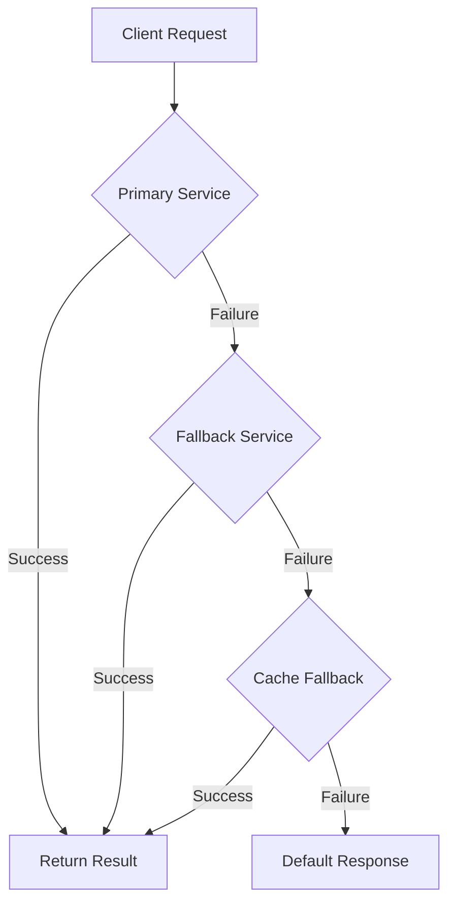
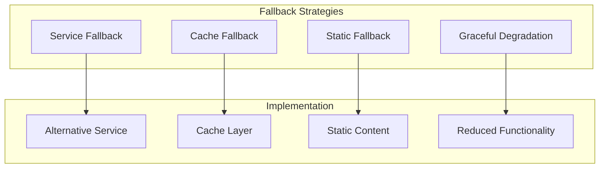

# 🔄 Fallback Pattern

## 📋 Overview and Problem Statement

### Definition
The Fallback pattern provides alternative functionality when a service fails, ensuring system availability by gracefully degrading functionality rather than failing completely.

### Problems It Solves
- Service unavailability
- Network failures
- Resource exhaustion
- Timeout issues
- Service degradation
- System resilience

### Business Value
- Improved availability
- Enhanced user experience
- Reduced downtime costs
- Better fault tolerance
- Increased reliability

## 🏗️ Architecture & Core Concepts

### Fallback Flow


### Fallback Types


## 💻 Technical Implementation

### Basic Fallback Pattern
```java
public class FallbackService<T> {
    private final PrimaryService<T> primaryService;
    private final FallbackService<T> fallbackService;
    private final Cache<String, T> cache;
    private final T defaultResponse;

    public T executeWithFallback(String key) {
        try {
            // Try primary service
            return primaryService.execute(key);
        } catch (Exception e) {
            log.warn("Primary service failed, trying fallback", e);
            
            try {
                // Try fallback service
                return fallbackService.execute(key);
            } catch (Exception fe) {
                log.warn("Fallback service failed, trying cache", fe);
                
                // Try cache
                T cachedValue = cache.get(key);
                if (cachedValue != null) {
                    return cachedValue;
                }
                
                // Return default response
                log.warn("All fallbacks failed, using default");
                return defaultResponse;
            }
        }
    }
}
```

### Advanced Fallback Implementation
```java
@Service
public class ResilientService {
    private final ServiceRegistry registry;
    private final CircuitBreaker circuitBreaker;
    private final Cache<String, Response> cache;
    private final MetricsCollector metrics;

    public Response executeWithFallback(Request request) {
        return Failsafe.with(
            fallback(request),
            circuitBreaker,
            retryPolicy
        ).get(() -> executeRequest(request));
    }

    private Fallback<Response> fallback(Request request) {
        return Fallback.<Response>builder()
            .handle(Exception.class)
            .withFallback(() -> serviceFallback(request))
            .withFallback(() -> cacheFallback(request))
            .withFallback(() -> staticFallback(request))
            .build();
    }

    private Response serviceFallback(Request request) {
        Service backupService = registry.getBackupService();
        try {
            return backupService.execute(request);
        } catch (Exception e) {
            metrics.recordFallbackFailure("service");
            throw e;
        }
    }

    private Response cacheFallback(Request request) {
        try {
            Response cached = cache.get(request.getKey());
            if (cached != null) {
                metrics.recordFallbackSuccess("cache");
                return cached;
            }
            throw new CacheMissException();
        } catch (Exception e) {
            metrics.recordFallbackFailure("cache");
            throw e;
        }
    }

    private Response staticFallback(Request request) {
        metrics.recordFallbackSuccess("static");
        return Response.defaultResponse();
    }
}
```

### Fallback Chain with Priorities
```java
public class FallbackChain<T> {
    private final List<FallbackProvider<T>> providers;
    
    public T execute(String key) {
        List<Exception> failures = new ArrayList<>();
        
        for (FallbackProvider<T> provider : providers) {
            try {
                if (provider.canHandle(key)) {
                    T result = provider.get(key);
                    if (result != null) {
                        return result;
                    }
                }
            } catch (Exception e) {
                failures.add(e);
                continue;
            }
        }
        
        throw new FallbackChainException(
            "All fallbacks failed", 
            failures
        );
    }
}

interface FallbackProvider<T> {
    boolean canHandle(String key);
    T get(String key) throws Exception;
    int getPriority();
}
```

## 🤔 Decision Criteria & Evaluation

### Fallback Strategy Selection Matrix

| Strategy | Use Case | Pros | Cons |
|----------|----------|------|------|
| Service | Alternative endpoints | Full functionality | Higher cost |
| Cache | Read operations | Fast response | Stale data |
| Static | UI components | Always available | Limited functionality |
| Degraded | Complex operations | Partial functionality | Reduced features |

### Performance Impact
```java
public class FallbackMetrics {
    private final MeterRegistry registry;

    public void recordFallbackAttempt(
        String strategy,
        boolean success,
        long duration
    ) {
        registry.counter(
            "fallback.attempts",
            "strategy", strategy,
            "outcome", success ? "success" : "failure"
        ).increment();

        registry.timer(
            "fallback.duration",
            "strategy", strategy
        ).record(duration, TimeUnit.MILLISECONDS);
    }
}
```

## ⚠️ Anti-Patterns

### 1. Cascading Fallbacks
❌ **Wrong**:
```java
public class UnboundedFallback {
    public Response execute() {
        try {
            return primary.execute();
        } catch (Exception e1) {
            try {
                return secondary.execute();
            } catch (Exception e2) {
                try {
                    return tertiary.execute();
                } catch (Exception e3) {
                    // Endless chain of fallbacks
                }
            }
        }
    }
}
```

✅ **Correct**:
```java
public class BoundedFallback {
    public Response execute() {
        return Failsafe.with(
            Fallback.<Response>builder()
                .withFallback(this::secondaryExecute)
                .withFallback(this::tertiaryExecute)
                .withFallback(Response::getDefault)
                .build()
        ).get(this::primaryExecute);
    }
}
```

### 2. Silent Failures
❌ **Wrong**:
```java
public class SilentFallback {
    public Data getData() {
        try {
            return service.getData();
        } catch (Exception e) {
            // Silently return empty data
            return new Data();
        }
    }
}
```

✅ **Correct**:
```java
public class MonitoredFallback {
    public Data getData() {
        try {
            return service.getData();
        } catch (Exception e) {
            metrics.recordFailure(e);
            log.warn("Service failed, using fallback", e);
            return createFallbackData();
        }
    }
}
```

## 💡 Best Practices

### 1. Fallback Configuration
```java
@Configuration
public class FallbackConfig {
    @Bean
    public FallbackRegistry fallbackRegistry(
        List<FallbackProvider<?>> providers
    ) {
        return new FallbackRegistry(
            providers.stream()
                .sorted(Comparator.comparingInt(
                    FallbackProvider::getPriority))
                .collect(Collectors.toList())
        );
    }
}
```

### 2. Monitoring and Alerting
```java
public class FallbackMonitor {
    private final AlertService alertService;
    private final MetricsCollector metrics;

    public void monitorFallbacks() {
        // Monitor fallback rate
        double fallbackRate = metrics.getFallbackRate();
        if (fallbackRate > threshold) {
            alertService.sendAlert(
                "High fallback rate detected: " + fallbackRate
            );
        }

        // Monitor fallback latency
        double avgLatency = metrics.getFallbackLatency();
        if (avgLatency > latencyThreshold) {
            alertService.sendAlert(
                "High fallback latency: " + avgLatency
            );
        }
    }
}
```

## 🔍 Troubleshooting Guide

### Common Issues

1. **Fallback Chain Performance**
```java
public class FallbackDiagnostics {
    public FallbackReport diagnose(String serviceId) {
        return FallbackReport.builder()
            .primaryLatency(measurePrimaryLatency())
            .fallbackLatency(measureFallbackLatency())
            .successRate(calculateSuccessRate())
            .failureDistribution(getFailureDistribution())
            .resourceUtilization(getResourceMetrics())
            .build();
    }
}
```

2. **Cache Consistency**
```java
public class CacheFallbackValidator {
    public void validateCache() {
        List<String> inconsistencies = new ArrayList<>();
        
        for (String key : cache.keys()) {
            if (!isValid(cache.get(key))) {
                inconsistencies.add(key);
            }
        }
        
        if (!inconsistencies.isEmpty()) {
            handleInconsistencies(inconsistencies);
        }
    }
}
```

## 🧪 Testing

### Fallback Testing
```java
@Test
public void testFallbackChain() {
    // Arrange
    FallbackService service = new FallbackService(
        primary,
        secondary,
        cache
    );

    // Act & Assert
    
    // Test primary service failure
    when(primary.execute()).thenThrow(new ServiceException());
    when(secondary.execute()).thenReturn("fallback");
    
    assertEquals("fallback", service.execute());

    // Test complete failure
    when(primary.execute()).thenThrow(new ServiceException());
    when(secondary.execute()).thenThrow(new ServiceException());
    when(cache.get(any())).thenReturn(null);
    
    assertEquals("default", service.execute());
}

@Test
public void testFallbackMetrics() {
    // Arrange
    MetricsCollector metrics = new MetricsCollector();
    FallbackService service = new FallbackService(
        primary,
        secondary,
        cache,
        metrics
    );

    // Act
    service.execute();

    // Assert
    verify(metrics).recordFallbackAttempt(
        eq("primary"),
        eq(false),
        anyLong()
    );
}
```

## 🌍 Real-world Use Cases

### 1. E-commerce Platform
- Product recommendations
- Search functionality
- Shopping cart
- Payment processing

### 2. Content Delivery
- Image serving
- Video streaming
- Static content
- Dynamic content

### 3. API Gateway
- Service routing
- Response caching
- Rate limiting
- Authentication

## 📚 References

### Books
- "Release It!" by Michael Nygard
- "Building Microservices" by Sam Newman

### Online Resources
- [Netflix Hystrix Wiki](https://github.com/Netflix/Hystrix/wiki)
- [Microsoft Azure Fallback Pattern](https://docs.microsoft.com/en-us/azure/architecture/patterns/fallback)
- [Failsafe Documentation](https://jodah.net/failsafe/)