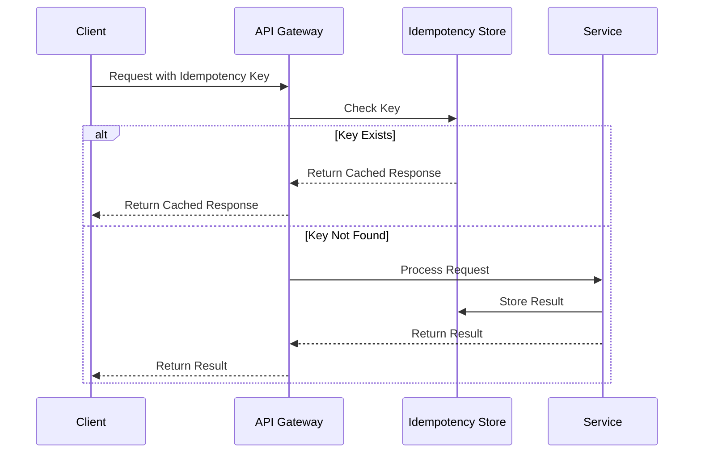
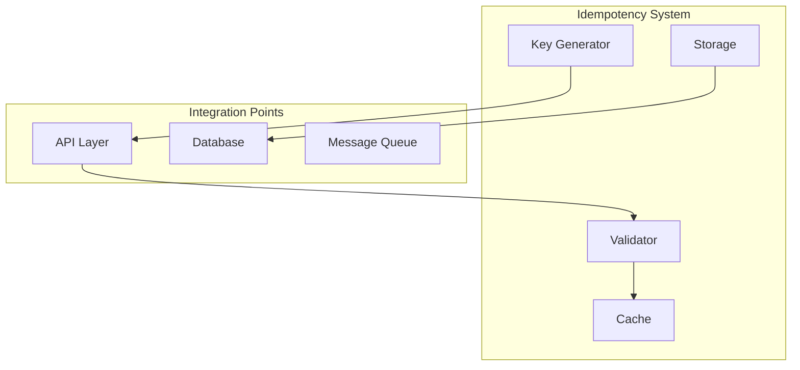

# 🔄 Idempotency Pattern

## 📋 Overview and Problem Statement

### Definition
Idempotency ensures that multiple identical requests have the same effect as a single request, making operations safe to retry without unintended side effects.

### Problems It Solves
- Duplicate requests
- Network failures
- Retry scenarios
- Double-processing
- Transaction consistency
- Message delivery guarantees

### Business Value
- Data consistency
- System reliability
- Safe retries
- Reduced errors
- Better user experience
- Transaction safety

## 🏗️ Architecture & Core Concepts

### Idempotency Flow


### System Components


## 💻 Technical Implementation

### Basic Idempotency Handler
```java
@Service
public class IdempotencyHandler {
    private final Cache<String, ResponseRecord> responseCache;
    private final IdempotencyKeyGenerator keyGenerator;
    
    public <T> T execute(
        String idempotencyKey, 
        Supplier<T> operation
    ) {
        // Check for existing response
        ResponseRecord<T> existing = responseCache.get(
            idempotencyKey);
        if (existing != null) {
            return existing.getResponse();
        }

        // Execute operation with locking
        synchronized (idempotencyKey.intern()) {
            // Double-check after acquiring lock
            existing = responseCache.get(idempotencyKey);
            if (existing != null) {
                return existing.getResponse();
            }

            T result = operation.get();
            responseCache.put(
                idempotencyKey, 
                new ResponseRecord<>(result)
            );
            return result;
        }
    }
}
```

### Distributed Idempotency Implementation
```java
@Service
public class DistributedIdempotencyService {
    private final RedisTemplate<String, String> redis;
    private final ObjectMapper objectMapper;
    private final Duration lockTimeout;

    public <T> T executeIdempotently(
        String key,
        Supplier<T> operation,
        Class<T> responseType
    ) throws Exception {
        String lockKey = "lock:" + key;
        String resultKey = "result:" + key;

        try {
            // Try to acquire distributed lock
            boolean locked = redis.opsForValue()
                .setIfAbsent(lockKey, "locked", lockTimeout);

            if (!locked) {
                // Check for existing result
                String cachedResult = redis.opsForValue()
                    .get(resultKey);
                if (cachedResult != null) {
                    return objectMapper.readValue(
                        cachedResult, 
                        responseType
                    );
                }
                throw new ConcurrentExecutionException();
            }

            // Execute operation
            T result = operation.get();

            // Store result
            redis.opsForValue().set(
                resultKey,
                objectMapper.writeValueAsString(result),
                lockTimeout
            );

            return result;
        } finally {
            redis.delete(lockKey);
        }
    }
}
```

### Message Processing Idempotency
```java
@Service
public class IdempotentMessageProcessor {
    private final ProcessedMessageRepository repository;
    private final MessageProcessor processor;

    @Transactional
    public void processMessage(Message message) {
        String messageId = message.getMessageId();

        // Check if already processed
        if (repository.exists(messageId)) {
            log.info("Message {} already processed", messageId);
            return;
        }

        try {
            // Process message
            processor.process(message);

            // Mark as processed
            repository.save(new ProcessedMessage(
                messageId,
                ProcessingStatus.COMPLETED,
                LocalDateTime.now()
            ));
        } catch (Exception e) {
            repository.save(new ProcessedMessage(
                messageId,
                ProcessingStatus.FAILED,
                LocalDateTime.now()
            ));
            throw e;
        }
    }
}
```

## 🤔 Decision Criteria & Evaluation

### Idempotency Strategy Comparison

| Strategy | Use Case | Pros | Cons |
|----------|----------|------|------|
| Token-based | API requests | Simple to implement | Token management overhead |
| Natural Keys | Business operations | No additional IDs | May not always be available |
| Timestamp-based | Time-series data | Natural ordering | Clock sync issues |
| UUID-based | Distributed systems | No coordination needed | Storage overhead |

### Implementation Comparison Matrix

| Aspect | In-Memory | Distributed Cache | Database |
|--------|-----------|------------------|-----------|
| Performance | Fastest | Fast | Slower |
| Durability | None | Configurable | High |
| Scalability | Limited | Good | Excellent |
| Complexity | Low | Medium | High |

## ⚠️ Anti-Patterns

### 1. Incorrect Key Generation
❌ **Wrong**:
```java
public class WeakIdempotencyKey {
    public String generateKey(Request request) {
        // Using timestamp alone is not idempotent
        return String.valueOf(System.currentTimeMillis());
    }
}
```

✅ **Correct**:
```java
public class StrongIdempotencyKey {
    public String generateKey(Request request) {
        return String.format("%s:%s:%s",
            request.getOperationType(),
            request.getResourceId(),
            request.getClientId()
        );
    }
}
```

### 2. Missing Cleanup
❌ **Wrong**:
```java
public class LeakyIdempotencyStore {
    private final Map<String, Response> responses = 
        new HashMap<>();

    public void store(String key, Response response) {
        responses.put(key, response); // Never cleaned up
    }
}
```

✅ **Correct**:
```java
public class ManagedIdempotencyStore {
    private final Cache<String, Response> responses;

    public ManagedIdempotencyStore() {
        this.responses = Caffeine.newBuilder()
            .expireAfterWrite(Duration.ofHours(24))
            .maximumSize(10_000)
            .build();
    }

    public void store(String key, Response response) {
        responses.put(key, response);
    }
}
```

## 💡 Best Practices

### 1. Key Generation
```java
public class IdempotencyKeyGenerator {
    public String generateKey(Request request) {
        // Combine multiple factors for uniqueness
        String payload = String.format("%s:%s:%s:%s",
            request.getClientId(),
            request.getOperationType(),
            request.getResourceId(),
            request.getTimestamp()
        );
        
        // Create cryptographic hash
        return DigestUtils.sha256Hex(payload);
    }
}
```

### 2. Response Caching
```java
@Service
public class IdempotencyResponseCache {
    private final Cache<String, CachedResponse> cache;

    @Value
    public class CachedResponse {
        String responseBody;
        HttpStatus status;
        Map<String, String> headers;
        LocalDateTime timestamp;
    }

    public void cacheResponse(
        String key, 
        ResponseEntity<?> response
    ) {
        CachedResponse cached = new CachedResponse(
            serializeBody(response.getBody()),
            response.getStatusCode(),
            extractHeaders(response.getHeaders()),
            LocalDateTime.now()
        );
        cache.put(key, cached);
    }
}
```

## 🔍 Troubleshooting Guide

### Common Issues

1. **Race Conditions**
```java
public class RaceConditionDetector {
    private final MetricRegistry metrics;

    public void detectRaceConditions(String key) {
        long concurrentAttempts = metrics
            .counter("idempotency.concurrent.attempts")
            .getCount();
            
        if (concurrentAttempts > threshold) {
            log.warn("Potential race condition detected for key: {}", 
                key);
            alertService.sendAlert(
                "High concurrent attempts for idempotency key: " + 
                key);
        }
    }
}
```

2. **Key Collisions**
```java
public class CollisionDetector {
    public void detectCollisions(String key) {
        List<String> similarKeys = findSimilarKeys(key);
        if (!similarKeys.isEmpty()) {
            log.warn("Potential key collision detected: {}", 
                similarKeys);
            metrics.counter("idempotency.collisions").inc();
        }
    }
}
```

## 🧪 Testing

### Idempotency Tests
```java
@Test
public void testIdempotentExecution() {
    // Arrange
    IdempotencyHandler handler = new IdempotencyHandler();
    AtomicInteger counter = new AtomicInteger();
    String key = "test-key";

    // Act
    IntStream.range(0, 10).parallel().forEach(i -> {
        handler.execute(key, () -> {
            return counter.incrementAndGet();
        });
    });

    // Assert
    assertEquals(1, counter.get());
}

@Test
public void testConcurrentRequests() {
    // Arrange
    IdempotencyHandler handler = new IdempotencyHandler();
    int threadCount = 100;
    CountDownLatch latch = new CountDownLatch(threadCount);
    Set<String> results = ConcurrentHashMap.newKeySet();

    // Act
    for (int i = 0; i < threadCount; i++) {
        new Thread(() -> {
            String result = handler.execute("key", 
                () -> UUID.randomUUID().toString());
            results.add(result);
            latch.countDown();
        }).start();
    }

    latch.await();

    // Assert
    assertEquals(1, results.size());
}
```

## 🌍 Real-world Use Cases

### 1. Payment Processing
- Transaction deduplication
- Payment confirmations
- Refund processing

### 2. Order Management
- Order submissions
- Status updates
- Inventory adjustments

### 3. Message Processing
- Event handling
- Queue processing
- Webhook delivery

## 📚 References

### Books
- "Designing Data-Intensive Applications" by Martin Kleppmann
- "Building Event-Driven Microservices" by Adam Bellemare

### Online Resources
- [AWS API Gateway Idempotency](https://docs.aws.amazon.com/apigateway/latest/developerguide/api-gateway-lambda-authorizer-output.html)
- [Stripe API Idempotency](https://stripe.com/docs/api/idempotent_requests)
- [Microsoft's Idempotency Patterns](https://docs.microsoft.com/en-us/azure/architecture/patterns/idempotency)
