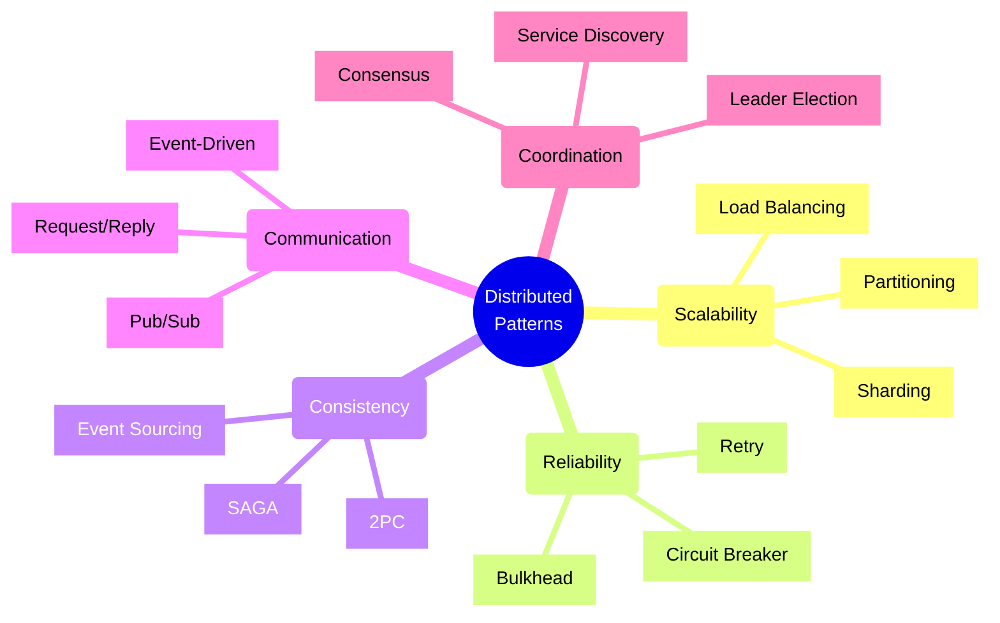

# 🌐 Introduction to Distributed System Patterns

## 1. Overview and Problem Statement

### Definition
Distributed system patterns are reusable solutions to common problems in designing, implementing, and maintaining systems where components run on different networked computers and communicate to achieve common goals.

### Core Challenges Addressed
- Reliability and fault tolerance
- Scalability and performance
- Consistency and data integrity
- System complexity
- Network unreliability
- Component coordination

### Business Value
- Improved system resilience
- Better resource utilization
- Enhanced scalability
- Reduced operational costs
- Faster time to market
- Improved maintainability

## 2. 🏗️ Foundational Patterns Categories



## 3. 💻 Core Pattern Examples

### Circuit Breaker Pattern Example (Java)

```java
public class CircuitBreaker {
    private final long timeout;
    private final long retryTimePeriod;
    private final AtomicInteger failureCount = new AtomicInteger(0);
    private final AtomicReference<State> state = new AtomicReference<>(State.CLOSED);
    private AtomicLong lastFailureTime;

    public enum State {
        OPEN, HALF_OPEN, CLOSED
    }

    public CircuitBreaker(long timeout, long retryTimePeriod) {
        this.timeout = timeout;
        this.retryTimePeriod = retryTimePeriod;
        this.lastFailureTime = new AtomicLong(0);
    }

    public <T> T execute(Supplier<T> operation) throws Exception {
        if (!canExecute()) {
            throw new CircuitBreakerOpenException();
        }

        try {
            T result = operation.get();
            reset();
            return result;
        } catch (Exception e) {
            handleFailure();
            throw e;
        }
    }

    private boolean canExecute() {
        State currentState = state.get();
        if (currentState == State.CLOSED) {
            return true;
        }

        if (currentState == State.OPEN) {
            if (System.currentTimeMillis() - lastFailureTime.get() >= retryTimePeriod) {
                state.compareAndSet(State.OPEN, State.HALF_OPEN);
                return true;
            }
            return false;
        }

        return true; // HALF_OPEN
    }

    private void handleFailure() {
        failureCount.incrementAndGet();
        lastFailureTime.set(System.currentTimeMillis());
        if (failureCount.get() >= threshold) {
            state.set(State.OPEN);
        }
    }

    private void reset() {
        failureCount.set(0);
        state.set(State.CLOSED);
    }
}
```

### Service Discovery Pattern Example (Python)

```python
from typing import Dict, List, Optional
import requests
from datetime import datetime

class ServiceRegistry:
    def __init__(self):
        self.services: Dict[str, List[ServiceInstance]] = {}
        
    def register(self, service_name: str, instance: 'ServiceInstance') -> None:
        if service_name not in self.services:
            self.services[service_name] = []
        self.services[service_name].append(instance)
        
    def unregister(self, service_name: str, instance: 'ServiceInstance') -> None:
        if service_name in self.services:
            self.services[service_name].remove(instance)
            
    def get_instances(self, service_name: str) -> List['ServiceInstance']:
        return self.services.get(service_name, [])

class ServiceInstance:
    def __init__(self, host: str, port: int, health_check_url: str):
        self.host = host
        self.port = port
        self.health_check_url = health_check_url
        self.last_heartbeat = datetime.now()
        
    def is_healthy(self) -> bool:
        try:
            response = requests.get(self.health_check_url)
            return response.status_code == 200
        except:
            return False
        
    def update_heartbeat(self) -> None:
        self.last_heartbeat = datetime.now()
```

## 4. 🤔 Pattern Selection Framework

### Decision Matrix

| Pattern Category | When to Use | Key Benefits | Tradeoffs |
|-----------------|-------------|--------------|-----------|
| Scalability | High load, Growing data | Better performance, Resource optimization | Added complexity |
| Reliability | Critical systems, Fault intolerance | System stability, Error handling | Performance overhead |
| Consistency | Transaction management, Data integrity | Data correctness, Atomicity | Reduced availability |
| Communication | Service interaction, Event handling | Loose coupling, Flexibility | Message guarantee complexity |
| Coordination | Resource management, Leadership | Organized operations, Clear hierarchy | Network overhead |

### Selection Process
1. Identify core requirements
2. Evaluate system constraints
3. Assess operational capacity
4. Consider maintenance implications
5. Analyze failure modes

## 5. ⚡ Key Implementation Considerations

### Common Challenges

1. **Network Partitions**
    - Implement timeout mechanisms
    - Use circuit breakers
    - Handle partial failures
    - Maintain consistency

2. **State Management**
    - Consider eventual consistency
    - Implement idempotency
    - Handle concurrent updates
    - Manage distributed transactions

3. **Monitoring and Debugging**
```java
public class DistributedPatternMetrics {
    private final MeterRegistry registry;
    
    public void recordLatency(String pattern, long duration) {
        registry.timer("pattern.latency",
            "type", pattern
        ).record(Duration.ofMillis(duration));
    }
    
    public void recordFailure(String pattern, String reason) {
        registry.counter("pattern.failures",
            "type", pattern,
            "reason", reason
        ).increment();
    }
}
```

## 6. ✅ Best Practices

### Design Principles
1. **Single Responsibility**
    - Each pattern should address one specific concern
    - Avoid pattern overloading
    - Maintain clear boundaries

2. **Loose Coupling**
    - Minimize direct dependencies
    - Use asynchronous communication
    - Implement service discovery

3. **Resilience**
    - Plan for failure
    - Implement retries
    - Use timeouts
    - Handle partial failures

### Implementation Guidelines

```java
public class PatternImplementationGuide {
    // 1. Clear Configuration
    @Configuration
    public class PatternConfig {
        @Value("${pattern.timeout}")
        private Duration timeout;
        
        @Value("${pattern.retries}")
        private int retries;
    }
    
    // 2. Error Handling
    public class PatternException extends RuntimeException {
        private final ErrorCode code;
        private final String details;
    }
    
    // 3. Monitoring
    @Aspect
    public class PatternMonitoring {
        @Around("@annotation(PatternOperation)")
        public Object monitor(ProceedingJoinPoint joinPoint) {
            // Implementation
        }
    }
}
```

## 7. 🚫 Common Anti-patterns

### Mistakes to Avoid

1. **Distributed Monolith**
```java
// Wrong: Tight coupling
public class ServiceA {
    private final ServiceB serviceB;
    private final ServiceC serviceC;
    
    public void operation() {
        serviceB.operation();
        serviceC.operation();
    }
}

// Better: Loose coupling
public class ServiceA {
    private final EventBus eventBus;
    
    public void operation() {
        eventBus.publish(new OperationEvent());
    }
}
```

2. **Synchronous Coupling**
```java
// Wrong: Synchronous calls
public Response handleRequest() {
    ServiceResponse resp1 = service1.call();
    ServiceResponse resp2 = service2.call();
    return combine(resp1, resp2);
}

// Better: Asynchronous
public CompletableFuture<Response> handleRequest() {
    return CompletableFuture.allOf(
        service1.callAsync(),
        service2.callAsync()
    ).thenApply(this::combine);
}
```

## 8. 🌟 Real-world Applications

### Netflix
- Circuit Breaker (Hystrix)
- Service Discovery (Eureka)
- Load Balancing (Ribbon)

### Amazon
- Event-Driven Architecture
- Sharding
- Eventual Consistency

### Google
- Consensus (Chubby)
- Distributed Locking
- Global Distribution

## 9. 📚 Learning Path

### Foundation Level
1. Basic distributed concepts
2. CAP theorem
3. Consistency models
4. Communication patterns

### Intermediate Level
1. Failure handling
2. State management
3. Performance optimization
4. Monitoring strategies

### Advanced Level
1. Pattern composition
2. Custom pattern design
3. Performance tuning
4. System evolution

## 10. 📖 References

### Books
- "Designing Distributed Systems" by Brendan Burns
- "Pattern-Oriented Software Architecture" by Buschmann et al.
- "Building Microservices" by Sam Newman

### Papers
- "Time, Clocks, and the Ordering of Events in a Distributed System" by Leslie Lamport
- "The Byzantine Generals Problem" by Lamport, Shostak, and Pease

### Online Resources
- [Martin Fowler's Blog](https://martinfowler.com/articles/patterns-of-distributed-systems/)
- [Microsoft Azure Architecture Center](https://docs.microsoft.com/en-us/azure/architecture/patterns/)
- [AWS Architecture Blog](https://aws.amazon.com/blogs/architecture/)