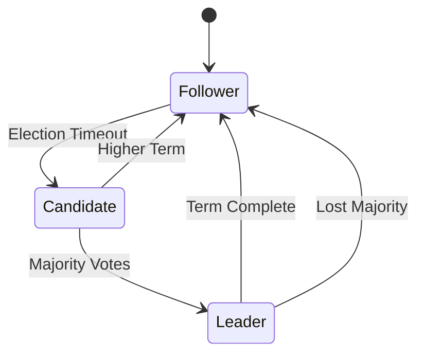

# 👑 Leader Election in Distributed Systems

## 1. Overview and Problem Statement

### Definition
Leader Election is a process in distributed systems where nodes collectively identify and designate a single node as the leader to coordinate specific tasks or maintain system consistency.

### Problems Solved
- Coordination of distributed operations
- Prevention of split-brain scenarios
- Resource allocation management
- Conflict resolution
- System configuration management

### Business Value
- High availability
- System consistency
- Reduced operational complexity
- Automated failover
- Enhanced reliability

## 2. 🏗️ Detailed Architecture

### Core Concepts
1. **Candidate State**: Node eligible for leadership
2. **Leader State**: Node currently serving as leader
3. **Follower State**: Non-leader active nodes
4. **Term**: Leadership duration period
5. **Quorum**: Minimum nodes needed for consensus

### Implementation Types



1. **Bully Algorithm**
    - Highest ID becomes leader
    - Simple implementation
    - High message complexity

2. **Ring Algorithm**
    - Nodes arranged in logical ring
    - Election messages pass through ring
    - Ordered election process

3. **Raft Consensus**
    - Term-based leadership
    - Log replication
    - Strong consistency guarantees

## 3. 💻 Technical Implementation

### Raft Leader Election Implementation (Go)

```go
type Node struct {
    ID        int
    State     NodeState
    Term      int
    VotedFor  int
    IsLeader  bool
    Peers     []string
    HeartbeatC chan struct{}
    timeout   time.Duration
    mu        sync.Mutex
}

func (n *Node) StartElection() {
    n.mu.Lock()
    n.State = Candidate
    n.Term++
    currentTerm := n.Term
    n.VotedFor = n.ID
    n.mu.Unlock()
    
    votes := 1
    voteCh := make(chan bool)
    
    // Request votes from all peers
    for _, peer := range n.Peers {
        go func(peer string) {
            request := &RequestVoteRequest{
                Term:         currentTerm,
                CandidateID: n.ID,
            }
            response := n.requestVote(peer, request)
            voteCh <- response.VoteGranted
        }(peer)
    }
    
    // Count votes
    for i := 0; i < len(n.Peers); i++ {
        if <-voteCh {
            votes++
            if votes > len(n.Peers)/2 {
                n.becomeLeader()
                return
            }
        }
    }
}
```

### ZooKeeper Leader Election Example (Java)

```java
public class ZooKeeperLeaderElection {
    private final String path = "/election";
    private final ZooKeeper zk;
    private final String nodeId;
    private String leaderId;
    
    public ZooKeeperLeaderElection(ZooKeeper zk, String nodeId) {
        this.zk = zk;
        this.nodeId = nodeId;
    }
    
    public void participate() throws KeeperException, InterruptedException {
        // Create ephemeral sequential node
        String znodePath = zk.create(
            path + "/node_", 
            nodeId.getBytes(),
            ZooDefs.Ids.OPEN_ACL_UNSAFE,
            CreateMode.EPHEMERAL_SEQUENTIAL
        );
        
        while (true) {
            List<String> children = zk.getChildren(path, false);
            Collections.sort(children);
            
            String smallest = children.get(0);
            String leaderId = new String(
                zk.getData(path + "/" + smallest, false, null)
            );
            
            if (nodeId.equals(leaderId)) {
                becomeLeader();
                return;
            } else {
                // Watch the next smallest node
                int index = children.indexOf(znodePath.substring(path.length() + 1));
                String watchPath = path + "/" + children.get(index - 1);
                
                Stat stat = zk.exists(watchPath, event -> {
                    if (event.getType() == EventType.NodeDeleted) {
                        participate();
                    }
                });
                
                if (stat == null) {
                    // Node is already gone, retry election
                    participate();
                }
            }
        }
    }
}
```

### etcd Leader Election Example (Python)

```python
import etcd3
from threading import Event

class EtcdLeaderElection:
    def __init__(self, client: etcd3.client, election_key: str):
        self.client = client
        self.election_key = election_key
        self.lease = None
        self.is_leader = False
        self.leadership_lost = Event()
    
    def run_for_leadership(self, ttl: int = 10):
        """Attempt to become leader with a lease TTL."""
        self.lease = self.client.lease(ttl)
        
        try:
            # Try to create key with lease
            success = self.client.put_if_not_exists(
                self.election_key,
                value=b'leader',
                lease=self.lease
            )
            
            if success:
                self.is_leader = True
                self._maintain_leadership()
            else:
                self._watch_leader()
                
        except Exception as e:
            if self.lease:
                self.lease.revoke()
            raise e
    
    def _maintain_leadership(self):
        """Keep leadership by refreshing lease."""
        def refresh_callback():
            try:
                self.lease.refresh()
            except Exception:
                self.is_leader = False
                self.leadership_lost.set()
        
        self.lease.grant_lease_callback = refresh_callback
    
    def _watch_leader(self):
        """Watch for leader key deletion."""
        def watch_callback(event):
            if event.type == 'DELETE':
                self.run_for_leadership()
        
        watch_id = self.client.add_watch_callback(
            self.election_key,
            watch_callback
        )
        return watch_id
```

## 4. 🤔 Decision Criteria & Evaluation

### Comparison Matrix

| Algorithm | Complexity | Fault Tolerance | Message Overhead | Best For |
|-----------|------------|-----------------|------------------|----------|
| Bully | O(n²) | Limited | High | Small clusters |
| Ring | O(n) | Moderate | Medium | Ordered systems |
| Raft | O(n) | High | Low | General purpose |
| ZooKeeper | O(log n) | High | Low | Large clusters |

### Selection Factors
1. Cluster size
2. Network reliability
3. Consistency requirements
4. Failover speed needs
5. Operational complexity tolerance

## 5. ⚡ Performance Metrics & Optimization

### KPIs
- Election time
- Leadership stability
- Message overhead
- Failover time
- Split-brain incidents

### Monitoring Implementation

```java
@Component
public class LeaderElectionMetrics {
    private final MeterRegistry registry;
    
    public LeaderElectionMetrics(MeterRegistry registry) {
        this.registry = registry;
    }
    
    public void recordElectionDuration(long durationMs) {
        registry.timer("election.duration")
               .record(Duration.ofMillis(durationMs));
    }
    
    public void recordLeadershipChange(String oldLeader, String newLeader) {
        registry.counter("leadership.changes").increment();
        registry.gauge("leader.uptime", 
            Tags.of("leader", newLeader), 
            System.currentTimeMillis());
    }
}
```

## 8. ❌ Anti-Patterns

### Common Mistakes

1. **Insufficient Failure Detection**
```java
// Wrong: Simple timeout-based detection
public boolean isLeaderAlive() {
    return System.currentTimeMillis() - lastHeartbeat < timeout;
}

// Better: Multiple failure detection mechanisms
public boolean isLeaderAlive() {
    return isHeartbeatValid() && 
           isNetworkStable() && 
           hasQuorumConsensus();
}
```

2. **No Split-Brain Prevention**
```java
// Wrong: No quorum check
public void becomeLeader() {
    this.isLeader = true;
    notifyPeers();
}

// Better: Quorum-based leadership
public void becomeLeader() {
    if (getActiveNodes() > getTotalNodes() / 2) {
        this.isLeader = true;
        notifyQuorum();
    }
}
```

## 9. ❓ FAQ Section

### Q: How to handle network partitions?
A: Implement quorum-based decision making:

```java
public class PartitionTolerantElection {
    private final int totalNodes;
    private final Set<Node> activeNodes;
    
    public boolean hasQuorum() {
        return activeNodes.size() > totalNodes / 2;
    }
    
    public void handlePartition() {
        if (!hasQuorum()) {
            stepDown();
            waitForQuorum();
        }
    }
}
```

## 10. ✅ Best Practices & Guidelines

### Design Principles
1. Always use unique node IDs
2. Implement proper failure detection
3. Maintain leadership terms
4. Use heartbeat mechanisms
5. Implement quorum-based decisions

### Leadership Management Example

```java
public class LeadershipManager {
    private final AtomicLong term = new AtomicLong(0);
    private final AtomicReference<String> currentLeader = new AtomicReference<>();
    
    public boolean proposeLeadership(String nodeId, long proposedTerm) {
        return term.get() < proposedTerm && 
               term.compareAndSet(term.get(), proposedTerm) &&
               currentLeader.compareAndSet(currentLeader.get(), nodeId);
    }
    
    public void maintainLeadership() {
        if (isLeader() && hasQuorum()) {
            sendHeartbeat();
            updateTerm();
        }
    }
}
```

## 11. 🔧 Troubleshooting Guide

### Common Issues

1. **Frequent Leader Changes**
```java
public class LeadershipStabilizer {
    private final int MIN_LEADERSHIP_DURATION = 5000; // ms
    private long lastLeadershipChange;
    
    public boolean shouldInitiateElection() {
        if (System.currentTimeMillis() - lastLeadershipChange < MIN_LEADERSHIP_DURATION) {
            return false;  // Prevent frequent changes
        }
        return !hasStableLeader();
    }
}
```

## 13. 🌟 Real-world Use Cases

### Kubernetes
- Uses etcd for leader election
- Controls controller manager
- Manages scheduler leadership
- Handles master node selection

### Apache ZooKeeper
- Built-in leader election
- Used by Kafka for controller election
- Manages configuration distribution
- Handles cluster coordination

## 14. 📚 References and Additional Resources

### Books
- "Distributed Systems for Practitioners" by Dimos Raptis
- "Designing Distributed Systems" by Brendan Burns

### Documentation
- [etcd Documentation](https://etcd.io/docs/latest/)
- [ZooKeeper Documentation](https://zookeeper.apache.org/doc/current/recipes.html#sc_leaderElection)
- [Raft Specification](https://raft.github.io/raft.pdf)

### Articles
- [Raft Leader Election Explained](https://eli.thegreenplace.net/2020/implementing-raft-part-1-elections/)
- [Leader Election in Distributed Systems](https://martinfowler.com/articles/patterns-of-distributed-systems/leader-election.html)

