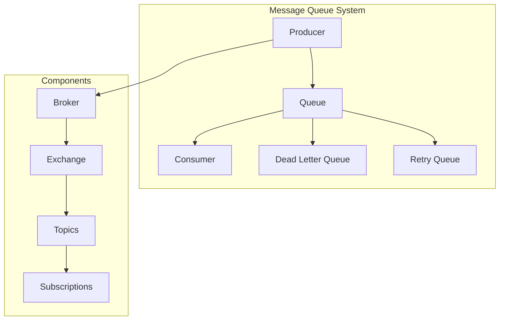
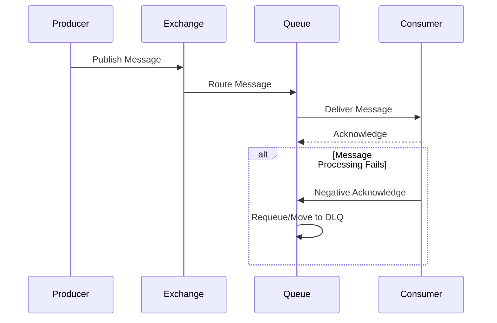

# 📨 Message Queues Pattern

## 📋 Overview and Problem Statement

### Definition
Message Queues are components that enable asynchronous communication between services by temporarily storing messages until consuming services process them.

### Problems It Solves
- Coupling between services
- Peak load handling
- Service availability dependencies
- Data consistency across services
- Synchronous processing bottlenecks

### Business Value
- System resilience
- Improved scalability
- Better performance
- Workload decoupling
- Peak load management

## 🏗️ Architecture & Core Concepts

### Message Queue Components


### Message Flow Patterns


## 💻 Technical Implementation

### Producer Implementation
```java
public class MessageProducer {
    private final RabbitTemplate rabbitTemplate;
    private final String exchange;
    private final String routingKey;
    private final ObjectMapper objectMapper;

    public void sendMessage(Message message) {
        try {
            // Add metadata
            MessageWrapper wrapper = new MessageWrapper(
                message,
                UUID.randomUUID().toString(),
                LocalDateTime.now(),
                1
            );

            // Convert and send
            String payload = objectMapper.writeValueAsString(
                wrapper);
            
            rabbitTemplate.convertAndSend(
                exchange,
                routingKey,
                payload,
                this::addMessageHeaders
            );
            
            log.info("Message sent: {}", wrapper.getMessageId());
        } catch (Exception e) {
            handleSendError(message, e);
        }
    }

    private Message addMessageHeaders(Message message) {
        MessageProperties props = message.getMessageProperties();
        props.setContentType("application/json");
        props.setDeliveryMode(MessageDeliveryMode.PERSISTENT);
        return message;
    }
}
```

### Consumer Implementation
```java
@Service
public class MessageConsumer {
    private final ObjectMapper objectMapper;
    private final RetryPolicy retryPolicy;
    private final MetricRegistry metrics;

    @RabbitListener(
        queues = "${queue.name}",
        containerFactory = "retryableListenerFactory"
    )
    public void handleMessage(
        String payload,
        Channel channel,
        @Header(AmqpHeaders.DELIVERY_TAG) long tag
    ) {
        Timer.Context timer = metrics.timer("message.processing")
            .time();
            
        try {
            // Deserialize message
            MessageWrapper wrapper = objectMapper.readValue(
                payload, 
                MessageWrapper.class
            );

            // Process with retry policy
            retryPolicy.execute(() -> 
                processMessage(wrapper));

            // Acknowledge success
            channel.basicAck(tag, false);
            
            metrics.counter("message.processed").inc();
        } catch (Exception e) {
            handleProcessingError(channel, tag, payload, e);
        } finally {
            timer.stop();
        }
    }

    private void handleProcessingError(
        Channel channel,
        long tag,
        String payload,
        Exception e
    ) {
        try {
            if (shouldRetry(e)) {
                // Negative acknowledge and requeue
                channel.basicNack(tag, false, true);
                metrics.counter("message.requeued").inc();
            } else {
                // Move to DLQ
                channel.basicNack(tag, false, false);
                metrics.counter("message.deadlettered").inc();
            }
        } catch (IOException ioe) {
            log.error("Error handling failed message", ioe);
        }
    }
}
```

### Queue Configuration
```java
@Configuration
public class QueueConfig {
    @Bean
    public Queue mainQueue() {
        return QueueBuilder.durable("main.queue")
            .withArgument("x-dead-letter-exchange", "dlx")
            .withArgument("x-dead-letter-routing-key", "dlq")
            .withArgument("x-message-ttl", 60000)
            .build();
    }

    @Bean
    public Queue deadLetterQueue() {
        return QueueBuilder.durable("dead.letter.queue")
            .build();
    }

    @Bean
    public Exchange deadLetterExchange() {
        return ExchangeBuilder.directExchange("dlx")
            .durable(true)
            .build();
    }

    @Bean
    public Binding deadLetterBinding() {
        return BindingBuilder.bind(deadLetterQueue())
            .to(deadLetterExchange())
            .with("dlq")
            .noargs();
    }
}
```

## 🤔 Decision Criteria & Evaluation

### Message Queue Comparison Matrix

| Feature | RabbitMQ | Apache Kafka | ActiveMQ | Amazon SQS |
|---------|----------|--------------|----------|------------|
| Message Persistence | Yes | Yes | Yes | Yes |
| Delivery Guarantee | At-least-once | Exactly-once | At-least-once | At-least-once |
| Max Message Size | 128MB | 1MB | 1GB | 256KB |
| Ordering | Per Queue | Per Partition | Per Queue | Best Effort |
| Scalability | Good | Excellent | Good | Excellent |
| Use Case | Traditional MQ | Event Streaming | Traditional MQ | Cloud Native |

### Performance Characteristics
```java
public class QueuePerformanceMonitor {
    private final MetricRegistry metrics;

    public void recordMetrics() {
        // Message rate
        metrics.meter("messages.produced.rate");
        metrics.meter("messages.consumed.rate");

        // Queue depth
        metrics.gauge("queue.depth", 
            () -> getQueueDepth());

        // Processing time
        metrics.histogram("message.processing.time");

        // Error rates
        metrics.meter("messages.error.rate");
        metrics.meter("messages.retry.rate");
    }
}
```

## ⚠️ Anti-Patterns

### 1. Message Without Correlation ID
❌ **Wrong**:
```java
public void sendMessage(String payload) {
    // No correlation ID or tracking
    template.convertAndSend("queue", payload);
}
```

✅ **Correct**:
```java
public void sendMessage(String payload) {
    String correlationId = UUID.randomUUID().toString();
    
    template.convertAndSend("queue", payload, message -> {
        MessageProperties props = message.getMessageProperties();
        props.setCorrelationId(correlationId);
        props.setTimestamp(new Date());
        return message;
    });
    
    log.info("Sent message with correlation ID: {}", 
        correlationId);
}
```

### 2. No Dead Letter Queue
❌ **Wrong**:
```java
public void handleMessage(Message message) {
    try {
        processMessage(message);
    } catch (Exception e) {
        // Message is lost
        log.error("Failed to process message", e);
    }
}
```

✅ **Correct**:
```java
public void handleMessage(
    Message message, 
    Channel channel, 
    long deliveryTag
) {
    try {
        processMessage(message);
        channel.basicAck(deliveryTag, false);
    } catch (Exception e) {
        // Move to DLQ after retry limit
        if (getRetryCount(message) >= maxRetries) {
            channel.basicNack(deliveryTag, false, false);
            metrics.counter("messages.deadlettered").inc();
        } else {
            // Requeue for retry
            channel.basicNack(deliveryTag, false, true);
            metrics.counter("messages.requeued").inc();
        }
    }
}
```

## 💡 Best Practices

### 1. Message Design
```java
@Value
public class Message {
    @NotNull
    String messageId;
    
    @NotNull
    String correlationId;
    
    @NotNull
    LocalDateTime timestamp;
    
    String type;
    
    @NotNull
    String payload;
    
    Map<String, String> headers;
    
    Integer retryCount;
    
    @JsonIgnore
    public boolean shouldRetry() {
        return retryCount < maxRetries;
    }
}
```

### 2. Error Handling
```java
public class MessageErrorHandler implements ErrorHandler {
    private final DeadLetterService deadLetterService;
    private final MetricRegistry metrics;
    
    @Override
    public void handleError(Throwable t) {
        if (t instanceof RecoverableException) {
            handleRecoverableError((RecoverableException) t);
        } else {
            handleNonRecoverableError(t);
        }
    }
    
    private void handleRecoverableError(
        RecoverableException e
    ) {
        metrics.counter("errors.recoverable").inc();
        // Implement retry logic
    }
    
    private void handleNonRecoverableError(Throwable t) {
        metrics.counter("errors.non.recoverable").inc();
        deadLetterService.moveToDeadLetter(
            getCurrentMessage(), 
            t
        );
    }
}
```

## 🔍 Troubleshooting Guide

### Common Issues

1. **Message Build-up**
```java
public class QueueMonitor {
    private final AlertService alertService;
    
    public void monitorQueueDepth() {
        long depth = getQueueDepth();
        long rate = getProcessingRate();
        
        if (depth > threshold) {
            alertService.sendAlert(
                String.format(
                    "Queue depth %d exceeds threshold %d",
                    depth,
                    threshold
                )
            );
            
            // Scale consumers if needed
            scaleConsumers(depth, rate);
        }
    }
}
```

2. **Slow Consumers**
```java
public class ConsumerMonitor {
    public void monitorConsumers() {
        Map<String, ConsumerStats> stats = 
            getConsumerStats();
            
        for (Map.Entry<String, ConsumerStats> entry : 
            stats.entrySet()) {
            
            if (entry.getValue().getProcessingTime() > 
                threshold) {
                handleSlowConsumer(entry.getKey());
            }
        }
    }
}
```

## 🧪 Testing

### Queue Testing
```java
@Test
public void testMessageDelivery() {
    // Arrange
    String messageId = UUID.randomUUID().toString();
    Message message = createTestMessage(messageId);
    CountDownLatch latch = new CountDownLatch(1);
    
    // Act
    producer.sendMessage(message);
    
    // Assert
    assertTrue(latch.await(5, TimeUnit.SECONDS));
    verify(consumer).received(messageId);
}

@Test
public void testDeadLetterQueue() {
    // Arrange
    Message message = createTestMessage();
    makeConsumerFail();
    
    // Act
    producer.sendMessage(message);
    
    // Assert
    verify(deadLetterQueue, timeout(1000))
        .received(message.getMessageId());
}
```

## 🌍 Real-world Use Cases

### 1. E-commerce Order Processing
- Order placement
- Inventory updates
- Shipping notifications
- Payment processing

### 2. Real-time Analytics
- Event collection
- Data processing
- Metrics aggregation
- Report generation

### 3. IoT Data Processing
- Device data collection
- Sensor readings
- Command distribution
- Status updates

## 📚 References

### Books
- "Enterprise Integration Patterns" by Gregor Hohpe
- "Designing Data-Intensive Applications" by Martin Kleppmann

### Online Resources
- [RabbitMQ Documentation](https://www.rabbitmq.com/documentation.html)
- [Apache Kafka Documentation](https://kafka.apache.org/documentation/)
- [Amazon SQS Documentation](https://docs.aws.amazon.com/sqs/)
