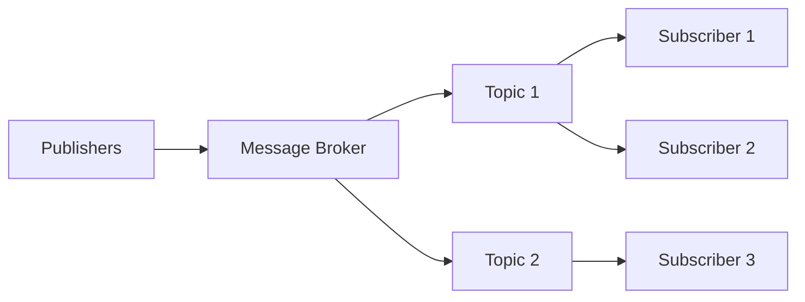

# 📦 Distributed Patterns: Publisher-Subscriber Pattern

## 1. Overview and Problem Statement 🎯

### Definition
The Publisher-Subscriber (Pub/Sub) pattern is a messaging pattern where senders of messages (publishers) do not send messages directly to specific receivers (subscribers). Instead, messages are categorized into classes and published to a message broker or event bus, without knowledge of which subscribers may exist.

### Problems Solved
- Decoupling message senders from receivers
- Enabling asynchronous communication
- Supporting one-to-many message distribution
- Handling back-pressure in distributed systems
- Managing system scalability

### Business Context & Value
- **Scalability**: Easy addition/removal of publishers and subscribers
- **Reliability**: Message persistence and guaranteed delivery
- **Flexibility**: Dynamic system configuration
- **Maintainability**: Isolated components are easier to maintain
- **Cost Efficiency**: Better resource utilization through asynchronous processing

## 2. Detailed Solution/Architecture 🏗️

### Core Concepts
1. **Publisher**: Produces messages/events
2. **Subscriber**: Consumes messages/events
3. **Message Broker**: Intermediary managing message routing
4. **Topic/Channel**: Category for message classification
5. **Message**: Data payload with metadata

### Key Components


### Implementation Types
1. **Topic-Based**
    - Messages published to specific topics
    - Subscribers receive all messages from subscribed topics

2. **Content-Based**
    - Messages filtered based on attributes
    - More flexible but higher overhead

3. **Hybrid**
    - Combines topic and content filtering
    - Balances flexibility and performance

## 3. Technical Implementation 💻

### Basic Implementation (Python)
```python
from abc import ABC, abstractmethod
from typing import Dict, List, Any
from dataclasses import dataclass
from datetime import datetime
import uuid

@dataclass
class Message:
    id: str
    topic: str
    payload: Any
    timestamp: datetime
    metadata: Dict = None

class MessageBroker:
    def __init__(self):
        self.topics: Dict[str, List[Subscriber]] = {}
        
    def create_topic(self, topic: str) -> None:
        if topic not in self.topics:
            self.topics[topic] = []
            
    def publish(self, topic: str, payload: Any) -> None:
        if topic not in self.topics:
            raise ValueError(f"Topic {topic} does not exist")
            
        message = Message(
            id=str(uuid.uuid4()),
            topic=topic,
            payload=payload,
            timestamp=datetime.now()
        )
        
        for subscriber in self.topics[topic]:
            subscriber.receive(message)
            
    def subscribe(self, topic: str, subscriber: 'Subscriber') -> None:
        if topic not in self.topics:
            self.create_topic(topic)
        self.topics[topic].append(subscriber)
        
    def unsubscribe(self, topic: str, subscriber: 'Subscriber') -> None:
        if topic in self.topics:
            self.topics[topic].remove(subscriber)

class Subscriber(ABC):
    @abstractmethod
    def receive(self, message: Message) -> None:
        pass

# Example Usage
class LoggingSubscriber(Subscriber):
    def receive(self, message: Message) -> None:
        print(f"Received message: {message.payload} on topic: {message.topic}")

# Implementation
broker = MessageBroker()
subscriber = LoggingSubscriber()

broker.subscribe("logs", subscriber)
broker.publish("logs", "System startup completed")
```

### Implementation with Redis
```python
import redis
import json
from typing import Callable

class RedisPubSub:
    def __init__(self, host='localhost', port=6379):
        self.redis_client = redis.Redis(host=host, port=port)
        self.pubsub = self.redis_client.pubsub()
        
    def publish(self, channel: str, message: dict) -> None:
        self.redis_client.publish(channel, json.dumps(message))
        
    def subscribe(self, channel: str, callback: Callable) -> None:
        self.pubsub.subscribe(**{channel: callback})
        
    def start_listening(self) -> None:
        for message in self.pubsub.listen():
            if message['type'] == 'message':
                data = json.loads(message['data'])
                print(f"Received: {data}")

# Usage
def message_handler(message):
    data = json.loads(message['data'])
    print(f"Processing message: {data}")

pubsub = RedisPubSub()
pubsub.subscribe('notifications', message_handler)
pubsub.publish('notifications', {'event': 'user_login', 'user_id': 123})
```

## 4. Decision Criteria & Evaluation 📊

### When to Use Pub/Sub
- Event-driven architectures
- Loose coupling requirements
- Broadcast communications
- Asynchronous processing needs
- Scalable message distribution

### Comparison Matrix

| Feature | Pub/Sub | Point-to-Point | Request-Reply |
|---------|---------|----------------|---------------|
| Coupling | Low | High | Medium |
| Scalability | High | Low | Medium |
| Message Retention | Optional | Usually No | No |
| Delivery Guarantee | At-least-once | Once | Once |
| Performance | High | Medium | Medium |

### Limitations
- Message ordering challenges
- Eventual consistency
- Increased system complexity
- Potential message duplication
- Monitoring complexity

## 5. Performance Metrics & Optimization ⚡

### Key Performance Indicators
1. Message Latency
2. Throughput (messages/second)
3. Subscriber Processing Time
4. Message Queue Length
5. Error/Retry Rates

### Optimization Techniques
1. **Message Batching**
```python
class BatchingPublisher:
    def __init__(self, batch_size=100):
        self.batch_size = batch_size
        self.message_batch = []
        
    def add_to_batch(self, message):
        self.message_batch.append(message)
        if len(self.message_batch) >= self.batch_size:
            self.flush()
            
    def flush(self):
        if self.message_batch:
            # Publish batch
            self.message_batch = []
```

2. **Message Compression**
```python
import gzip
import json

def compress_message(message: dict) -> bytes:
    return gzip.compress(json.dumps(message).encode())

def decompress_message(compressed_data: bytes) -> dict:
    return json.loads(gzip.decompress(compressed_data).decode())
```

## 8. Anti-Patterns ⚠️

### Common Mistakes
1. **Tight Coupling**
```python
# ❌ Bad: Direct dependency
class Publisher:
    def __init__(self, subscriber):
        self.subscriber = subscriber
        
    def publish(self, message):
        self.subscriber.process(message)

# ✅ Good: Using message broker
class Publisher:
    def __init__(self, message_broker):
        self.broker = message_broker
        
    def publish(self, topic, message):
        self.broker.publish(topic, message)
```

2. **Missing Error Handling**
```python
# ❌ Bad: No error handling
def process_message(message):
    do_something(message)

# ✅ Good: With error handling
def process_message(message):
    try:
        do_something(message)
    except Exception as e:
        log_error(e)
        requeue_message(message)
```

## 9. FAQ Section ❓

### Q: How to handle message ordering?
A: Implement sequence numbers and resequencing:
```python
@dataclass
class OrderedMessage(Message):
    sequence_number: int
    
class OrderedSubscriber(Subscriber):
    def __init__(self):
        self.buffer = {}
        self.next_sequence = 0
        
    def receive(self, message: OrderedMessage):
        self.buffer[message.sequence_number] = message
        self.process_buffer()
        
    def process_buffer(self):
        while self.next_sequence in self.buffer:
            message = self.buffer.pop(self.next_sequence)
            self.process_message(message)
            self.next_sequence += 1
```

### Q: How to implement retry logic?
A: Use exponential backoff:
```python
import time
from functools import wraps

def retry_with_backoff(retries=3, backoff_in_seconds=1):
    def decorator(func):
        @wraps(func)
        def wrapper(*args, **kwargs):
            for i in range(retries):
                try:
                    return func(*args, **kwargs)
                except Exception as e:
                    if i == retries - 1:
                        raise
                    wait = (backoff_in_seconds * 2 ** i)
                    time.sleep(wait)
            return None
        return wrapper
    return decorator
```

## 10. Best Practices & Guidelines 📝

### Design Principles
1. Keep messages self-contained
2. Use meaningful topic names
3. Implement dead letter queues
4. Monitor message flow
5. Handle backpressure

### Security Considerations
```python
from cryptography.fernet import Fernet

class SecurePublisher:
    def __init__(self):
        self.key = Fernet.generate_key()
        self.cipher_suite = Fernet(self.key)
        
    def encrypt_message(self, message: str) -> bytes:
        return self.cipher_suite.encrypt(message.encode())
        
    def publish(self, topic: str, message: str):
        encrypted_message = self.encrypt_message(message)
        self.broker.publish(topic, encrypted_message)
```

## 11. Troubleshooting Guide 🔧

### Common Issues
1. Message Loss
    - Implement acknowledgments
    - Use persistent storage
    - Monitor queue size

2. Performance Degradation
    - Monitor subscriber health
    - Implement circuit breakers
    - Scale horizontally

### Monitoring Implementation
```python
import prometheus_client as prom

class MonitoredPublisher:
    def __init__(self):
        self.published_messages = prom.Counter(
            'published_messages_total',
            'Total messages published'
        )
        self.publish_latency = prom.Histogram(
            'publish_latency_seconds',
            'Message publish latency'
        )
        
    def publish(self, topic, message):
        with self.publish_latency.time():
            result = super().publish(topic, message)
            self.published_messages.inc()
        return result
```

## 14. References and Additional Resources 📚

### Documentation
- [Redis Pub/Sub Documentation](https://redis.io/topics/pubsub)
- [Apache Kafka Documentation](https://kafka.apache.org/documentation/)
- [RabbitMQ Documentation](https://www.rabbitmq.com/documentation.html)

### Books
- "Enterprise Integration Patterns" by Gregor Hohpe
- "Designing Data-Intensive Applications" by Martin Kleppmann

### Articles
- [AWS SNS Documentation](https://aws.amazon.com/sns/)
- [Google Cloud Pub/Sub](https://cloud.google.com/pubsub/docs)