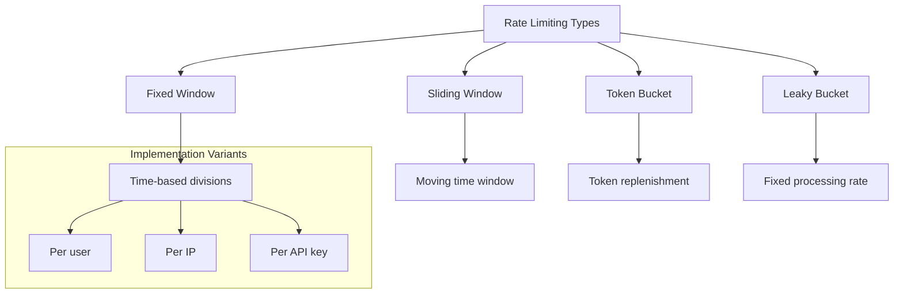

# 🚦 Distributed Patterns: Rate Limiting

## 1. Overview and Problem Statement 🎯

### Definition
Rate limiting is a strategy to control the rate of requests or operations in a distributed system. It limits the number of requests a sender can make within a specific time window, preventing system overload and ensuring fair resource usage.

### Problems Solved
- Prevent system overload
- Protect against DDoS attacks
- Ensure fair resource allocation
- Control costs
- Maintain service quality
- Handle traffic spikes

### Business Value
- **System Stability**: Prevents cascading failures
- **Cost Control**: Manages resource consumption
- **Service Quality**: Maintains consistent performance
- **Security**: Protects against abuse
- **Compliance**: Meets SLA requirements

## 2. Detailed Solution/Architecture 🏗️

### Core Concepts
1. **Request Rate**: Number of requests per time unit
2. **Time Window**: Period for rate measurement
3. **Burst Allowance**: Temporary exceeding of limits
4. **Throttling Response**: Action when limit exceeded

### Implementation Types



## 3. Technical Implementation 💻

### 1. Fixed Window Counter (Redis)

```python
import redis
from datetime import datetime
from typing import Optional

class FixedWindowRateLimiter:
    def __init__(self, redis_client: redis.Redis, window_size: int = 60, max_requests: int = 100):
        self.redis = redis_client
        self.window_size = window_size
        self.max_requests = max_requests
    
    def is_allowed(self, key: str) -> bool:
        current_window = self._get_current_window()
        window_key = f"ratelimit:{key}:{current_window}"
        
        pipe = self.redis.pipeline()
        pipe.incr(window_key)
        pipe.expire(window_key, self.window_size)
        current_count = pipe.execute()[0]
        
        return current_count <= self.max_requests
    
    def _get_current_window(self) -> int:
        return int(datetime.now().timestamp() / self.window_size)

# Usage Example
limiter = FixedWindowRateLimiter(redis.Redis())
if limiter.is_allowed("user:123"):
    process_request()
else:
    return_rate_limit_exceeded()
```

### 2. Token Bucket Algorithm

```python
import time
from dataclasses import dataclass
from threading import Lock

@dataclass
class TokenBucket:
    capacity: int
    refill_rate: float
    tokens: float = 0.0
    last_refill: float = time.time()
    lock: Lock = Lock()
    
    def consume(self, tokens: int = 1) -> bool:
        with self.lock:
            self._refill()
            
            if self.tokens >= tokens:
                self.tokens -= tokens
                return True
            return False
    
    def _refill(self):
        now = time.time()
        delta = now - self.last_refill
        self.tokens = min(
            self.capacity,
            self.tokens + delta * self.refill_rate
        )
        self.last_refill = now

class TokenBucketRateLimiter:
    def __init__(self):
        self.buckets = {}
    
    def is_allowed(self, key: str, tokens: int = 1) -> bool:
        if key not in self.buckets:
            self.buckets[key] = TokenBucket(
                capacity=100,
                refill_rate=10  # tokens per second
            )
        return self.buckets[key].consume(tokens)
```

### 3. Sliding Window with Redis

```python
from typing import List, Tuple
import time

class SlidingWindowRateLimiter:
    def __init__(self, redis_client: redis.Redis, window_size: int = 60, max_requests: int = 100):
        self.redis = redis_client
        self.window_size = window_size
        self.max_requests = max_requests
    
    def is_allowed(self, key: str) -> bool:
        now = time.time()
        window_start = now - self.window_size
        
        pipe = self.redis.pipeline()
        request_key = f"requests:{key}"
        
        # Remove old requests
        pipe.zremrangebyscore(request_key, 0, window_start)
        # Add new request
        pipe.zadd(request_key, {str(now): now})
        # Count requests in window
        pipe.zcard(request_key)
        # Set expiry
        pipe.expire(request_key, self.window_size)
        
        _, _, count, _ = pipe.execute()
        return count <= self.max_requests
```

### 4. Distributed Rate Limiter (with Redis Cluster)

```python
from typing import List
import aioredis
import asyncio

class DistributedRateLimiter:
    def __init__(self, redis_nodes: List[str], window_size: int = 60, max_requests: int = 100):
        self.redis_nodes = [aioredis.Redis.from_url(url) for url in redis_nodes]
        self.window_size = window_size
        self.max_requests = max_requests
    
    async def is_allowed(self, key: str) -> bool:
        shard = self._get_shard(key)
        window_key = f"ratelimit:{key}:{self._get_current_window()}"
        
        async with shard.pipeline() as pipe:
            await pipe.incr(window_key)
            await pipe.expire(window_key, self.window_size)
            current_count = (await pipe.execute())[0]
            
        return current_count <= self.max_requests
    
    def _get_shard(self, key: str) -> aioredis.Redis:
        shard_index = hash(key) % len(self.redis_nodes)
        return self.redis_nodes[shard_index]
    
    def _get_current_window(self) -> int:
        return int(time.time() / self.window_size)
```

## 4. Performance Considerations ⚡

### Optimization Techniques

1. **Local Caching**
```python
from cachetools import TTLCache

class CachedRateLimiter:
    def __init__(self, redis_client: redis.Redis):
        self.redis = redis_client
        self.cache = TTLCache(maxsize=10000, ttl=1)
    
    def is_allowed(self, key: str) -> bool:
        if key in self.cache:
            return self.cache[key]
            
        result = self._check_redis_rate_limit(key)
        self.cache[key] = result
        return result
```

2. **Batch Processing**
```python
class BatchRateLimiter:
    def __init__(self, redis_client: redis.Redis, batch_size: int = 100):
        self.redis = redis_client
        self.batch_size = batch_size
        self.pending_requests = []
    
    async def add_request(self, key: str):
        self.pending_requests.append(key)
        if len(self.pending_requests) >= self.batch_size:
            await self.process_batch()
    
    async def process_batch(self):
        pipe = self.redis.pipeline()
        for key in self.pending_requests:
            self._add_to_pipeline(pipe, key)
        results = await pipe.execute()
        self.pending_requests = []
        return results
```

## 5. Anti-Patterns ⚠️

### Common Mistakes

1. **Incorrect Time Window Handling**
```python
# ❌ Bad: Race condition in window calculation
def is_allowed(self, key: str) -> bool:
    now = time.time()
    count = self.redis.get(key) or 0
    if count < self.max_requests:
        self.redis.incr(key)
        return True
    return False

# ✅ Good: Atomic window handling
def is_allowed(self, key: str) -> bool:
    with self.redis.pipeline() as pipe:
        pipe.incr(key)
        pipe.expire(key, self.window_size)
        count = pipe.execute()[0]
        return count <= self.max_requests
```

2. **Missing Error Handling**
```python
# ❌ Bad: No error handling
def check_rate_limit(self, key: str) -> bool:
    return self.redis.incr(key) <= self.max_requests

# ✅ Good: With error handling
def check_rate_limit(self, key: str) -> bool:
    try:
        return self.redis.incr(key) <= self.max_requests
    except redis.RedisError:
        # Fail open or closed based on requirements
        logger.error("Rate limiter failed")
        return self.fail_open
```

## 6. Best Practices 📝

### Implementation Guidelines

1. **Graceful Degradation**
```python
class ResilientRateLimiter:
    def __init__(self, redis_client: redis.Redis, fail_open: bool = False):
        self.redis = redis_client
        self.fail_open = fail_open
        self.circuit_breaker = CircuitBreaker()
    
    def is_allowed(self, key: str) -> bool:
        if not self.circuit_breaker.is_healthy():
            return self.fail_open
            
        try:
            return self._check_rate_limit(key)
        except Exception as e:
            self.circuit_breaker.record_failure()
            return self.fail_open
```

2. **Clear Error Response**
```python
from dataclasses import dataclass
from datetime import datetime

@dataclass
class RateLimitResponse:
    allowed: bool
    remaining: int
    reset_time: datetime
    retry_after: Optional[int] = None

class RateLimiter:
    def check_rate_limit(self, key: str) -> RateLimitResponse:
        remaining = self._get_remaining(key)
        reset_time = self._get_reset_time(key)
        
        return RateLimitResponse(
            allowed=remaining > 0,
            remaining=remaining,
            reset_time=reset_time,
            retry_after=self._calculate_retry_after(reset_time)
        )
```

## 7. Testing Strategies 🧪

### Unit Testing
```python
import pytest
from freezegun import freeze_time

class TestRateLimiter:
    @pytest.fixture
    def limiter(self):
        redis_client = MockRedis()
        return FixedWindowRateLimiter(redis_client)
    
    def test_basic_rate_limiting(self, limiter):
        # Test basic functionality
        assert limiter.is_allowed("test_key")
        
    def test_limit_exceeded(self, limiter):
        # Exceed the limit
        for _ in range(100):
            limiter.is_allowed("test_key")
        assert not limiter.is_allowed("test_key")
    
    @freeze_time("2024-01-01 00:00:00")
    def test_window_reset(self, limiter):
        # Test window reset
        assert limiter.is_allowed("test_key")
        with freeze_time("2024-01-01 00:01:00"):
            assert limiter.is_allowed("test_key")
```

### Load Testing
```python
import asyncio
import aiohttp
import time

async def load_test_rate_limiter(url: str, requests: int, concurrent: int):
    async def make_request():
        async with aiohttp.ClientSession() as session:
            start = time.time()
            async with session.get(url) as response:
                duration = time.time() - start
                return response.status, duration
    
    tasks = [make_request() for _ in range(requests)]
    results = await asyncio.gather(*tasks)
    return analyze_results(results)
```

## 8. Monitoring and Observability 📊

### Metrics Collection
```python
from prometheus_client import Counter, Histogram

class MonitoredRateLimiter:
    def __init__(self):
        self.requests_total = Counter(
            'rate_limiter_requests_total',
            'Total number of requests handled'
        )
        self.requests_limited = Counter(
            'rate_limiter_requests_limited',
            'Number of requests rate limited'
        )
        self.request_duration = Histogram(
            'rate_limiter_request_duration_seconds',
            'Time spent processing rate limit request'
        )
    
    def is_allowed(self, key: str) -> bool:
        self.requests_total.inc()
        with self.request_duration.time():
            allowed = self._check_rate_limit(key)
            if not allowed:
                self.requests_limited.inc()
            return allowed
```

## 9. References and Resources 📚

### Documentation
- [Redis Rate Limiting Documentation](https://redis.io/commands/INCR)
- [AWS API Gateway Rate Limiting](https://docs.aws.amazon.com/apigateway/latest/developerguide/api-gateway-request-throttling.html)
- [Google Cloud Rate Limiting](https://cloud.google.com/architecture/rate-limiting-strategies-techniques)

### Articles and Papers
- "Rate-Limiting Strategies and Techniques" by Martin Fowler
- "Building a Distributed Rate Limiter" by Stripe Engineering
- "Rate Limiting in Distributed Systems" by Netflix Technology Blog

### Books
- "Cloud Native Patterns" by Cornelia Davis
- "Designing Distributed Systems" by Brendan Burns
