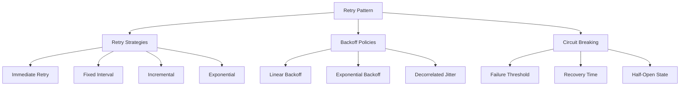

# 🔄 Distributed Patterns: Retry Pattern

## 1. Overview and Problem Statement 🎯

### Definition
The Retry Pattern enables applications to handle transient failures by transparently retrying failed operations. This pattern helps improve application stability and resilience in distributed systems where temporary failures are common.

### Problems Solved
- Transient network failures
- Temporary service unavailability
- Database deadlocks
- Rate limiting issues
- Resource contention
- Service throttling

### Business Value
- **Improved Reliability**: Automatic recovery from transient failures
- **Higher Availability**: Reduced system downtime
- **Better User Experience**: Transparent error handling
- **Cost Efficiency**: Reduced manual intervention
- **System Resilience**: Graceful handling of temporary issues

## 2. Detailed Solution/Architecture 🏗️

### Core Concepts



### Key Components
1. **Retry Policy**: Rules for when and how to retry
2. **Backoff Strategy**: Delay calculation between retries
3. **Circuit Breaker**: Prevents unnecessary retries
4. **Timeout Management**: Controls operation duration
5. **Error Classification**: Determines retryable errors

## 3. Technical Implementation 💻

### 1. Basic Retry Implementation

```python
from typing import Callable, TypeVar, Optional
from dataclasses import dataclass
import time
import random
import logging

T = TypeVar('T')

@dataclass
class RetryConfig:
    max_attempts: int = 3
    initial_delay: float = 1.0
    max_delay: float = 60.0
    exponential_base: float = 2
    jitter: bool = True

class RetryableError(Exception):
    """Base class for retryable errors"""
    pass

class RetryHandler:
    def __init__(self, config: RetryConfig = RetryConfig()):
        self.config = config
        self.logger = logging.getLogger(__name__)
    
    def execute(self, operation: Callable[[], T]) -> T:
        last_exception = None
        
        for attempt in range(self.config.max_attempts):
            try:
                return operation()
            except RetryableError as e:
                last_exception = e
                if attempt == self.config.max_attempts - 1:
                    raise
                    
                delay = self._calculate_delay(attempt)
                self.logger.warning(f"Operation failed (attempt {attempt + 1}/{self.config.max_attempts}). "
                                  f"Retrying in {delay:.2f} seconds...")
                time.sleep(delay)
        
        raise last_exception if last_exception else RuntimeError("Retry failed")
    
    def _calculate_delay(self, attempt: int) -> float:
        delay = min(
            self.config.initial_delay * (self.config.exponential_base ** attempt),
            self.config.max_delay
        )
        
        if self.config.jitter:
            delay = random.uniform(0, delay)
            
        return delay

# Usage Example
def fetch_data(url: str) -> dict:
    retry_handler = RetryHandler(RetryConfig(max_attempts=3))
    
    def operation():
        response = requests.get(url)
        if response.status_code == 429:  # Rate limited
            raise RetryableError("Rate limited")
        return response.json()
    
    return retry_handler.execute(operation)
```

### 2. Advanced Retry with Circuit Breaker

```python
from enum import Enum
from datetime import datetime, timedelta
from threading import Lock

class CircuitState(Enum):
    CLOSED = "CLOSED"
    OPEN = "OPEN"
    HALF_OPEN = "HALF_OPEN"

class CircuitBreaker:
    def __init__(self, failure_threshold: int = 5, recovery_time: int = 60):
        self.failure_threshold = failure_threshold
        self.recovery_time = recovery_time
        self.failures = 0
        self.last_failure_time: Optional[datetime] = None
        self.state = CircuitState.CLOSED
        self.lock = Lock()
        
    def record_failure(self):
        with self.lock:
            self.failures += 1
            self.last_failure_time = datetime.now()
            
            if self.failures >= self.failure_threshold:
                self.state = CircuitState.OPEN
    
    def record_success(self):
        with self.lock:
            self.failures = 0
            self.state = CircuitState.CLOSED
    
    def can_execute(self) -> bool:
        with self.lock:
            if self.state == CircuitState.CLOSED:
                return True
                
            if self.state == CircuitState.OPEN:
                if self._should_attempt_recovery():
                    self.state = CircuitState.HALF_OPEN
                    return True
                return False
                
            return True  # HALF_OPEN state
    
    def _should_attempt_recovery(self) -> bool:
        if not self.last_failure_time:
            return True
            
        recovery_due_time = self.last_failure_time + timedelta(seconds=self.recovery_time)
        return datetime.now() >= recovery_due_time

class AdvancedRetryHandler:
    def __init__(self, 
                 retry_config: RetryConfig = RetryConfig(),
                 circuit_breaker: Optional[CircuitBreaker] = None):
        self.retry_config = retry_config
        self.circuit_breaker = circuit_breaker or CircuitBreaker()
        self.logger = logging.getLogger(__name__)
    
    def execute(self, operation: Callable[[], T]) -> T:
        if not self.circuit_breaker.can_execute():
            raise Exception("Circuit breaker is open")
        
        last_exception = None
        
        for attempt in range(self.retry_config.max_attempts):
            try:
                result = operation()
                self.circuit_breaker.record_success()
                return result
            except RetryableError as e:
                last_exception = e
                self.circuit_breaker.record_failure()
                
                if attempt == self.retry_config.max_attempts - 1:
                    raise
                
                delay = self._calculate_delay(attempt)
                self.logger.warning(f"Operation failed (attempt {attempt + 1}/{self.retry_config.max_attempts}). "
                                  f"Retrying in {delay:.2f} seconds...")
                time.sleep(delay)
        
        raise last_exception if last_exception else RuntimeError("Retry failed")
```

### 3. Decorators for Retry Logic

```python
from functools import wraps
import asyncio

def retry(max_attempts: int = 3, retryable_exceptions: tuple = (Exception,)):
    def decorator(func):
        @wraps(func)
        def wrapper(*args, **kwargs):
            for attempt in range(max_attempts):
                try:
                    return func(*args, **kwargs)
                except retryable_exceptions as e:
                    if attempt == max_attempts - 1:
                        raise
                    time.sleep(2 ** attempt)
            return None
        return wrapper
    return decorator

def async_retry(max_attempts: int = 3, retryable_exceptions: tuple = (Exception,)):
    def decorator(func):
        @wraps(func)
        async def wrapper(*args, **kwargs):
            for attempt in range(max_attempts):
                try:
                    return await func(*args, **kwargs)
                except retryable_exceptions as e:
                    if attempt == max_attempts - 1:
                        raise
                    await asyncio.sleep(2 ** attempt)
            return None
        return wrapper
    return decorator

# Usage Example
@retry(max_attempts=3, retryable_exceptions=(RetryableError,))
def fetch_data(url: str) -> dict:
    response = requests.get(url)
    if response.status_code == 429:
        raise RetryableError("Rate limited")
    return response.json()
```

### 4. Backoff Strategies

```python
from abc import ABC, abstractmethod
import random

class BackoffStrategy(ABC):
    @abstractmethod
    def get_delay(self, attempt: int) -> float:
        pass

class FixedBackoff(BackoffStrategy):
    def __init__(self, delay: float):
        self.delay = delay
    
    def get_delay(self, attempt: int) -> float:
        return self.delay

class ExponentialBackoff(BackoffStrategy):
    def __init__(self, initial_delay: float, base: float = 2, max_delay: float = 60):
        self.initial_delay = initial_delay
        self.base = base
        self.max_delay = max_delay
    
    def get_delay(self, attempt: int) -> float:
        delay = self.initial_delay * (self.base ** attempt)
        return min(delay, self.max_delay)

class DecorrelatedJitterBackoff(BackoffStrategy):
    def __init__(self, initial_delay: float, max_delay: float = 60):
        self.initial_delay = initial_delay
        self.max_delay = max_delay
    
    def get_delay(self, attempt: int) -> float:
        current_delay = min(self.max_delay, self.initial_delay * (2 ** attempt))
        return random.uniform(self.initial_delay, current_delay)
```

## 4. Best Practices and Guidelines 📝

### 1. Error Classification

```python
from enum import Enum

class ErrorCategory(Enum):
    RETRYABLE = "RETRYABLE"
    NON_RETRYABLE = "NON_RETRYABLE"
    TIMEOUT = "TIMEOUT"

class ErrorClassifier:
    def __init__(self):
        self.retryable_errors = {
            ConnectionError,
            TimeoutError,
            RetryableError
        }
        
    def classify_error(self, error: Exception) -> ErrorCategory:
        if isinstance(error, self.retryable_errors):
            return ErrorCategory.RETRYABLE
        if isinstance(error, TimeoutError):
            return ErrorCategory.TIMEOUT
        return ErrorCategory.NON_RETRYABLE
```

### 2. Monitoring and Logging

```python
from dataclasses import dataclass
from datetime import datetime

@dataclass
class RetryMetrics:
    operation_name: str
    start_time: datetime
    end_time: datetime
    attempts: int
    success: bool
    final_error: Optional[Exception] = None

class MonitoredRetryHandler:
    def __init__(self, retry_config: RetryConfig):
        self.retry_config = retry_config
        self.metrics: List[RetryMetrics] = []
        
    def execute(self, operation: Callable[[], T], operation_name: str) -> T:
        start_time = datetime.now()
        attempts = 0
        final_error = None
        
        try:
            result = self._execute_with_retry(operation)
            success = True
            return result
        except Exception as e:
            success = False
            final_error = e
            raise
        finally:
            self.metrics.append(RetryMetrics(
                operation_name=operation_name,
                start_time=start_time,
                end_time=datetime.now(),
                attempts=attempts,
                success=success,
                final_error=final_error
            ))
```

## 5. Anti-Patterns ⚠️

### Common Mistakes

1. **Infinite Retries**
```python
# ❌ Bad: No maximum retry limit
def bad_retry(operation):
    while True:
        try:
            return operation()
        except Exception:
            time.sleep(1)

# ✅ Good: Limited retries
def good_retry(operation, max_attempts=3):
    for attempt in range(max_attempts):
        try:
            return operation()
        except Exception as e:
            if attempt == max_attempts - 1:
                raise
            time.sleep(2 ** attempt)
```

2. **Missing Timeout**
```python
# ❌ Bad: No timeout
def bad_retry_request(url: str):
    return requests.get(url)

# ✅ Good: With timeout
def good_retry_request(url: str, timeout: float = 5.0):
    return requests.get(url, timeout=timeout)
```

## 6. Testing Strategies 🧪

### Unit Testing

```python
import pytest
from unittest.mock import Mock, patch

class TestRetryHandler:
    @pytest.fixture
    def handler(self):
        return RetryHandler(RetryConfig(max_attempts=3))
    
    def test_successful_operation(self, handler):
        operation = Mock(return_value="success")
        result = handler.execute(operation)
        assert result == "success"
        assert operation.call_count == 1
    
    def test_retry_on_failure(self, handler):
        operation = Mock(side_effect=[RetryableError(), RetryableError(), "success"])
        result = handler.execute(operation)
        assert result == "success"
        assert operation.call_count == 3
    
    def test_max_retries_exceeded(self, handler):
        operation = Mock(side_effect=RetryableError())
        with pytest.raises(RetryableError):
            handler.execute(operation)
        assert operation.call_count == 3
```

### Integration Testing

```python
import aiohttp
import asyncio

async def test_retry_with_real_service():
    async with aiohttp.ClientSession() as session:
        handler = RetryHandler()
        
        async def operation():
            async with session.get('http://api.example.com/data') as response:
                if response.status == 429:
                    raise RetryableError("Rate limited")
                return await response.json()
        
        try:
            result = await handler.execute(operation)
            assert result is not None
        except Exception as e:
            assert isinstance(e, RetryableError)
```

## 7. Performance Considerations ⚡

### Optimization Techniques

1. **Adaptive Retry Delays**
```python
class AdaptiveBackoff(BackoffStrategy):
    def __init__(self, initial_delay: float, max_delay: float = 60):
        self.initial_delay = initial_delay
        self.max_delay = max_delay
        self.success_rate = 1.0
        
    def get_delay(self, attempt: int) -> float:
        base_delay = self.initial_delay * (2 ** attempt)
        adjusted_delay = base_delay * (1 / self.success_rate)
        return min(adjusted_delay, self.max_delay)
    
    def update_success_rate(self, success: bool):
        alpha = 0.1  # Learning rate
        self.success_rate = (1 - alpha) * self.success_rate + alpha * (1 if success else 0)
```