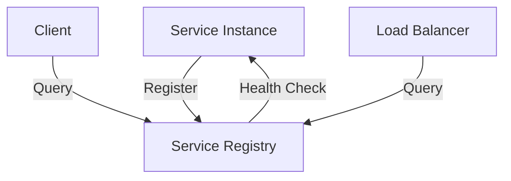

# 🔍 Service Discovery in Distributed Systems

## 1. Overview and Problem Statement

### Definition
Service Discovery is a mechanism that enables services in a distributed system to locate and communicate with each other without hardcoding location information like hostnames or IP addresses.

### Problems Solved
- Dynamic IP allocation in cloud environments
- Automatic scaling of services
- Load balancing across service instances
- Handling service failures and recovery
- Service location transparency

### Business Value
- Improved system reliability and availability
- Reduced operational overhead
- Enhanced scalability
- Lower maintenance costs
- Faster deployment cycles

## 2. 🏗️ Detailed Architecture

### Core Concepts
1. **Service Registry**: Central database maintaining service locations
2. **Service Registration**: Process of adding service instance to registry
3. **Service Discovery**: Process of finding service instances
4. **Health Checking**: Monitoring service availability

### Implementation Types
1. **Client-side Discovery**
    - Clients query registry directly
    - Higher client complexity
    - More flexible routing

2. **Server-side Discovery**
    - Load balancer queries registry
    - Simpler client implementation
    - Additional infrastructure required

### Key Components


## 3. 💻 Technical Implementation

### Client-side Discovery Example (Java/Spring Cloud)

```java
@Configuration
public class ServiceDiscoveryConfig {
    @Bean
    @LoadBalanced
    public RestTemplate restTemplate() {
        return new RestTemplate();
    }
}

@Service
public class UserService {
    @Autowired
    private RestTemplate restTemplate;
    
    public User getUser(Long id) {
        // Service name instead of hardcoded URL
        return restTemplate.getForObject(
            "http://user-service/users/" + id,
            User.class
        );
    }
}
```

### Server Registration Example (Netflix Eureka)

```java
@SpringBootApplication
@EnableEurekaClient
public class UserServiceApplication {
    public static void main(String[] args) {
        SpringApplication.run(UserServiceApplication.class, args);
    }
}

// application.yml
eureka:
  client:
    serviceUrl:
      defaultZone: http://localhost:8761/eureka/
  instance:
    preferIpAddress: true
```

### Implementation Considerations
- Service registration timeout
- Health check frequency
- Cache TTL
- Failure detection threshold
- Circuit breaking patterns

## 4. 🤔 Decision Criteria & Evaluation

### Comparison Matrix

| Feature | Client-side | Server-side |
|---------|------------|-------------|
| Client Complexity | High | Low |
| Infrastructure | Simple | Complex |
| Flexibility | High | Medium |
| Performance | Better | Good |
| Maintenance | Complex | Simple |

### When to Use What

**Client-side Discovery**
- Microservices architectures
- Polyglot environments
- Need for client-specific routing

**Server-side Discovery**
- Traditional architectures
- Homogeneous environments
- Simple client requirements

## 5. ⚡ Performance Metrics & Optimization

### KPIs
- Service resolution time
- Cache hit ratio
- Registry query latency
- Health check response time
- Registration time

### Optimization Techniques
1. **Caching**
```java
@Configuration
public class DiscoveryCacheConfig {
    @Bean
    public LoadBalancerClient loadBalancerClient() {
        return RibbonLoadBalancerClient.builder()
            .withCacheManager(new ConcurrentMapCacheManager())
            .withCacheTtl(Duration.ofMinutes(1))
            .build();
    }
}
```

2. **Batching Health Checks**
```java
@Configuration
public class HealthCheckConfig {
    @Bean
    public HealthCheckHandler healthCheckHandler() {
        CompositeHealthCheckHandler handler = new CompositeHealthCheckHandler();
        handler.setBatchSize(10);
        handler.setInterval(Duration.ofSeconds(30));
        return handler;
    }
}
```

## 8. ❌ Anti-Patterns

### Common Mistakes

1. **Hardcoded Service URLs**
```java
// Wrong
public class UserService {
    private final String SERVICE_URL = "http://192.168.1.100:8080";
    // ...
}

// Correct
@Value("${user.service.name}")
private String userServiceName;
```

2. **Missing Circuit Breakers**
```java
// Wrong
public User getUser(Long id) {
    return restTemplate.getForObject(serviceUrl + "/users/" + id, User.class);
}

// Correct
@CircuitBreaker(name = "userService")
public User getUser(Long id) {
    return restTemplate.getForObject(serviceUrl + "/users/" + id, User.class);
}
```

## 9. ❓ FAQ Section

### Q: How do you handle service versioning?
A: Use service metadata to include version information:
```yaml
eureka:
  instance:
    metadata-map:
      version: 1.0.0
```

### Q: How to implement blue-green deployment?
A: Use service metadata and routing rules:
```java
@Bean
public RouteLocator customRouteLocator(RouteLocatorBuilder builder) {
    return builder.routes()
        .route("user-service", r -> r.path("/users/**")
            .and().metadata("version", "blue")
            .uri("lb://user-service"))
        .build();
}
```

## 10. ✅ Best Practices & Guidelines

### Security
1. Secure service registry access
2. Use TLS for service communication
3. Implement authentication
4. Enable access logs

### Scaling
1. Replicate service registry
2. Use consistent hashing
3. Implement backpressure
4. Cache service locations

### Code Example
```java
@Configuration
@EnableWebSecurity
public class ServiceDiscoverySecurityConfig {
    @Bean
    public SecurityWebFilterChain springSecurityFilterChain(ServerHttpSecurity http) {
        return http
            .csrf().disable()
            .authorizeExchange()
            .pathMatchers("/eureka/**").authenticated()
            .and()
            .httpBasic()
            .and()
            .build();
    }
}
```

## 11. 🔧 Troubleshooting Guide

### Common Issues

1. **Service Not Registering**
    - Check network connectivity
    - Verify registry endpoint
    - Check service configuration
    - Review logs for registration errors

2. **Service Resolution Failures**
```java
@Slf4j
@Component
public class ServiceResolutionErrorHandler {
    @EventListener
    public void handleServiceResolutionError(ServiceResolutionErrorEvent event) {
        log.error("Failed to resolve service: {}", event.getServiceId());
        // Implement retry or fallback logic
    }
}
```

## 13. 🌟 Real-world Use Cases

### Netflix
- Uses Eureka for service discovery
- Handles thousands of services
- Supports multiple regions
- Implements client-side discovery

### Amazon
- Uses AWS Cloud Map
- Integrates with Route 53
- Supports DNS and API-based discovery
- Implements health checking

## 14. 📚 References and Additional Resources

### Books
- "Building Microservices" by Sam Newman
- "Designing Distributed Systems" by Brendan Burns

### Documentation
- [Spring Cloud Netflix](https://spring.io/projects/spring-cloud-netflix)
- [Consul Documentation](https://www.consul.io/docs)
- [Eureka Wiki](https://github.com/Netflix/eureka/wiki)

### Articles
- [Martin Fowler on Service Discovery](https://martinfowler.com/articles/microservices.html)
- [Netflix Tech Blog - Service Discovery](https://netflixtechblog.com/)
