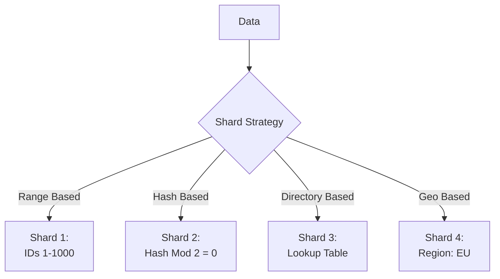

# 🔄 Database Sharding in Distributed Systems

## 1. Overview and Problem Statement

### Definition
Database sharding is a data partitioning strategy that distributes data across multiple databases to achieve horizontal scalability, improved performance, and higher availability.

### Problems Solved
- Database size limitations
- Query performance bottlenecks
- Single point of failure risks
- I/O capacity constraints
- Geographic data distribution needs

### Business Value
- Improved application performance
- Enhanced scalability
- Better availability
- Reduced infrastructure costs
- Geographic optimization
- Regulatory compliance support

## 2. 🏗️ Detailed Architecture

### Core Concepts

1. **Shard Key**: The attribute used to determine data distribution
2. **Partition Function**: Algorithm that maps shard key to specific shard
3. **Shard Map**: Maintains mapping between data ranges and shards
4. **Query Router**: Directs queries to appropriate shards

### Implementation Types



1. **Range-Based Sharding**
    - Data divided by value ranges
    - Good for sequential access
    - Risk of uneven distribution

2. **Hash-Based Sharding**
    - Data distributed using hash function
    - Even distribution
    - Loses range query efficiency

3. **Directory-Based Sharding**
    - Lookup table determines location
    - Flexible distribution
    - Additional lookup overhead

## 3. 💻 Technical Implementation

### Range-Based Sharding Example (Python/SQLAlchemy)

```python
from sqlalchemy import create_engine
from datetime import datetime

class ShardedCustomerRepository:
    def __init__(self):
        self.shard_map = {
            (0, 1000000): create_engine('postgresql://shard1'),
            (1000001, 2000000): create_engine('postgresql://shard2'),
            (2000001, float('inf')): create_engine('postgresql://shard3')
        }
    
    def get_shard(self, customer_id: int):
        for (min_id, max_id), engine in self.shard_map.items():
            if min_id <= customer_id <= max_id:
                return engine
        raise ValueError(f"No shard found for customer_id: {customer_id}")
    
    def get_customer(self, customer_id: int):
        shard = self.get_shard(customer_id)
        with shard.connect() as conn:
            result = conn.execute(
                "SELECT * FROM customers WHERE id = %s",
                (customer_id,)
            )
            return result.fetchone()
```

### Hash-Based Sharding Example (Java/Spring)

```java
@Service
public class ShardedUserService {
    private final List<DataSource> shards;
    private final int SHARD_COUNT = 4;
    
    @Autowired
    public ShardedUserService(List<DataSource> shards) {
        this.shards = shards;
    }
    
    private DataSource getShardByUserId(String userId) {
        int shardIndex = Math.abs(userId.hashCode() % SHARD_COUNT);
        return shards.get(shardIndex);
    }
    
    @Transactional
    public void createUser(User user) {
        DataSource shard = getShardByUserId(user.getId());
        JdbcTemplate jdbc = new JdbcTemplate(shard);
        
        jdbc.update(
            "INSERT INTO users (id, name, email) VALUES (?, ?, ?)",
            user.getId(), user.getName(), user.getEmail()
        );
    }
}
```

### Consistent Hashing Implementation

```java
public class ConsistentHash<T> {
    private final HashFunction hashFunction;
    private final int numberOfReplicas;
    private final SortedMap<Integer, T> circle = new TreeMap<>();

    public ConsistentHash(HashFunction hashFunction, int numberOfReplicas, 
                         Collection<T> nodes) {
        this.hashFunction = hashFunction;
        this.numberOfReplicas = numberOfReplicas;

        for (T node : nodes) {
            add(node);
        }
    }

    public void add(T node) {
        for (int i = 0; i < numberOfReplicas; i++) {
            circle.put(hashFunction.hash(node.toString() + i), node);
        }
    }

    public T get(Object key) {
        if (circle.isEmpty()) {
            return null;
        }
        
        int hash = hashFunction.hash(key);
        if (!circle.containsKey(hash)) {
            SortedMap<Integer, T> tailMap = circle.tailMap(hash);
            hash = tailMap.isEmpty() ? circle.firstKey() : tailMap.firstKey();
        }
        return circle.get(hash);
    }
}
```

## 4. 🤔 Decision Criteria & Evaluation

### Comparison Matrix

| Sharding Type | Pros                                         | Cons                                               | Best For                                   |
|---------------|----------------------------------------------|----------------------------------------------------|--------------------------------------------|
| Range-Based | - Simple implementation- Good for range queries | - Potential hotspots- Uneven distribution          | - Time-series data- Geographic data        |
| Hash-Based | - Even distribution- Predictable performance | - Poor range query performance- Complex resharding | - User data- General purpose               |
| Directory-Based | - Flexible mapping- Dynamic resharding  | - Lookup overhead- Additional complexity           | - Dynamic workloads- Complex routing needs |

### Key Considerations
1. Data distribution pattern
2. Query patterns
3. Scaling requirements
4. Consistency needs
5. Operational complexity

## 5. ⚡ Performance Metrics & Optimization

### KPIs
- Query latency per shard
- Data distribution balance
- Cross-shard query frequency
- Shard size growth rate
- Rebalancing frequency

### Monitoring Example (Prometheus/Grafana)

```java
@Component
public class ShardingMetrics {
    private final MeterRegistry registry;
    
    public ShardingMetrics(MeterRegistry registry) {
        this.registry = registry;
    }
    
    public void recordShardOperation(String shardId, String operation, long duration) {
        registry.timer("shard.operation", 
            "shard", shardId,
            "operation", operation
        ).record(Duration.ofMillis(duration));
    }
    
    public void updateShardSize(String shardId, long size) {
        registry.gauge("shard.size", 
            Tags.of("shard", shardId), 
            size
        );
    }
}
```

## 8. ❌ Anti-Patterns

### Common Mistakes

1. **Cross-Shard Joins**
```sql
-- Wrong: Requires expensive cross-shard operation
SELECT u.*, o.* 
FROM users u 
JOIN orders o ON u.id = o.user_id
WHERE u.region = 'EU';

-- Better: Denormalize or use application-side joins
SELECT u.* FROM users u WHERE u.region = 'EU';
SELECT o.* FROM orders o WHERE o.user_id IN (...);
```

2. **Poor Shard Key Selection**
```java
// Wrong: Using frequently updated field as shard key
public class User {
    @ShardKey
    private String lastLoginTime;  // Bad choice
}

// Better: Use immutable or slowly changing field
public class User {
    @ShardKey
    private String userId;  // Good choice
}
```

## 9. ❓ FAQ Section

### Q: How to handle resharding?
A: Implement a gradual migration strategy:

```java
@Service
public class ReshardingService {
    private final ShardingStrategy oldStrategy;
    private final ShardingStrategy newStrategy;
    
    public void migrateData(String shardKey) {
        // 1. Write to both old and new locations
        DataSource oldShard = oldStrategy.getShard(shardKey);
        DataSource newShard = newStrategy.getShard(shardKey);
        
        // 2. Migrate existing data
        migrateExistingData(oldShard, newShard, shardKey);
        
        // 3. Verify consistency
        verifyDataConsistency(oldShard, newShard, shardKey);
        
        // 4. Switch reads to new shard
        updateShardingStrategy(newStrategy);
    }
}
```

## 10. ✅ Best Practices & Guidelines

### Design Principles
1. Choose immutable shard keys
2. Minimize cross-shard operations
3. Plan for data growth
4. Implement proper monitoring
5. Design for resharding

### Shard Management Example

```java
@Configuration
public class ShardingConfiguration {
    @Bean
    public ShardManager shardManager() {
        return ShardManager.builder()
            .withReplicationFactor(3)
            .withConsistentHashing(true)
            .withRebalanceThreshold(0.2)  // 20% imbalance triggers rebalance
            .withMonitoring(true)
            .build();
    }
}
```

## 11. 🔧 Troubleshooting Guide

### Common Issues

1. **Data Hotspots**
```java
@Component
public class HotspotDetector {
    private final Map<String, AtomicInteger> accessCounts = new ConcurrentHashMap<>();
    
    public void recordAccess(String shardKey) {
        accessCounts.computeIfAbsent(shardKey, k -> new AtomicInteger())
                   .incrementAndGet();
    }
    
    @Scheduled(fixedRate = 60000)
    public void detectHotspots() {
        accessCounts.entrySet().stream()
            .filter(e -> e.getValue().get() > HOTSPOT_THRESHOLD)
            .forEach(this::handleHotspot);
    }
}
```

## 13. 🌟 Real-world Use Cases

### Instagram
- Uses range-based sharding
- Shards by user ID
- Handles billions of photos
- Implements ID generation strategy

### GitHub
- Uses functional partitioning
- Shards by repository
- Implements custom tooling
- Uses Consul for coordination

## 14. 📚 References and Additional Resources

### Books
- "Designing Data-Intensive Applications" by Martin Kleppmann
- "Database Internals" by Alex Petrov

### Documentation
- [MongoDB Sharding](https://docs.mongodb.com/manual/sharding/)
- [MySQL Sharding](https://dev.mysql.com/doc/refman/8.0/en/sharding.html)
- [PostgreSQL Partitioning](https://www.postgresql.org/docs/current/ddl-partitioning.html)

### Articles
- [Instagram's Sharding Strategy](https://instagram-engineering.com/sharding-ids-at-instagram-1cf5a71e5a5c)
- [Uber's Schemaless Sharding](https://eng.uber.com/schemaless-part-one/)

