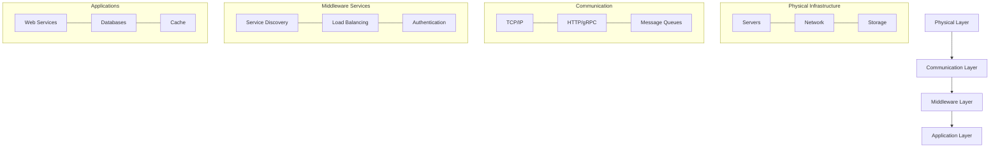

# 🌐 Distributed Systems: A Comprehensive Introduction

## 1. Overview and Problem Statement 🎯

### Definition
A distributed system is a collection of independent computers that appears to its users as a single coherent system. These autonomous components communicate and coordinate actions by passing messages to achieve common goals.

### Problems Solved
- **Scalability**: Handle growing workloads
- **Reliability**: Continue functioning despite failures
- **Resource Sharing**: Efficiently utilize available resources
- **Geographic Distribution**: Serve users across different locations
- **Cost Effectiveness**: Better resource utilization

### Business Value
- **High Availability**: 24/7 service operation
- **Fault Tolerance**: Continued operation despite failures
- **Lower Latency**: Faster response times for users
- **Cost Optimization**: Better resource utilization
- **Global Reach**: Serve users worldwide effectively

## 2. Core Concepts and Architecture 🏗️

### Fundamental Characteristics
1. **Concurrency**: Components execute simultaneously
2. **Lack of Global Clock**: No single source of time
3. **Independent Failures**: Components can fail independently
4. **Message-Based Communication**: Components interact via messages

### System Models



### Key Components
1. **Nodes**: Individual computers/servers
2. **Network**: Communication infrastructure
3. **Protocols**: Rules for communication
4. **Data Storage**: Distributed storage systems
5. **Coordination**: Services managing cooperation

## 3. Technical Implementation 💻

### Basic Distributed System Example (Python)

```python
from dataclasses import dataclass
from typing import List, Dict, Any
import threading
import socket
import json
import time

@dataclass
class Node:
    id: str
    host: str
    port: int
    neighbors: List['Node'] = None
    
    def __post_init__(self):
        self.neighbors = self.neighbors or []
        self.state: Dict[str, Any] = {}
        self.socket = socket.socket(socket.AF_INET, socket.SOCK_STREAM)
        
class DistributedSystem:
    def __init__(self, node: Node):
        self.node = node
        self.message_handlers = {}
        self.running = False
        
    def start(self):
        self.running = True
        self.node.socket.bind((self.node.host, self.node.port))
        self.node.socket.listen(10)
        
        # Start listener thread
        listener = threading.Thread(target=self._listen)
        listener.daemon = True
        listener.start()
        
    def _listen(self):
        while self.running:
            conn, addr = self.node.socket.accept()
            handler = threading.Thread(target=self._handle_connection, args=(conn,))
            handler.daemon = True
            handler.start()
            
    def _handle_connection(self, conn):
        try:
            data = conn.recv(1024)
            if data:
                message = json.loads(data.decode())
                self._process_message(message)
        finally:
            conn.close()
            
    def send_message(self, target: Node, message: Dict):
        with socket.socket(socket.AF_INET, socket.SOCK_STREAM) as s:
            s.connect((target.host, target.port))
            s.send(json.dumps(message).encode())
            
    def broadcast(self, message: Dict):
        for neighbor in self.node.neighbors:
            self.send_message(neighbor, message)
            
    def register_handler(self, message_type: str, handler):
        self.message_handlers[message_type] = handler
        
    def _process_message(self, message: Dict):
        message_type = message.get('type')
        if message_type in self.message_handlers:
            self.message_handlers[message_type](message)
```

### Implementation Considerations
1. **Network Partitions**
```python
class PartitionHandler:
    def __init__(self, timeout_ms: int = 5000):
        self.timeout_ms = timeout_ms
        self.last_heartbeat = {}
        
    def check_partition(self, node_id: str) -> bool:
        if node_id not in self.last_heartbeat:
            return True
        return (time.time() - self.last_heartbeat[node_id]) * 1000 > self.timeout_ms
        
    def record_heartbeat(self, node_id: str):
        self.last_heartbeat[node_id] = time.time()
```

2. **Consensus Implementation**
```python
class ConsensusProtocol:
    def __init__(self, node_id: str, nodes: List[str]):
        self.node_id = node_id
        self.nodes = nodes
        self.current_term = 0
        self.voted_for = None
        self.log = []
        
    def request_vote(self, term: int, candidate_id: str) -> bool:
        if term < self.current_term:
            return False
        
        if self.voted_for is None or self.voted_for == candidate_id:
            self.voted_for = candidate_id
            return True
            
        return False
```

## 4. Key Challenges and Solutions 🔧

### 1. Time and Ordering
```python
from threading import Lock
import time

class LogicalClock:
    def __init__(self):
        self.time = 0
        self.lock = Lock()
        
    def get_time(self) -> int:
        with self.lock:
            return self.time
            
    def increment(self) -> int:
        with self.lock:
            self.time += 1
            return self.time
            
    def update(self, received_time: int):
        with self.lock:
            self.time = max(self.time, received_time) + 1
```

### 2. Consistency Models
1. **Strong Consistency**: All nodes see the same data at the same time
2. **Eventual Consistency**: All nodes will eventually converge to the same data
3. **Causal Consistency**: Causally related operations are seen in the same order

```python
class ConsistencyManager:
    def __init__(self, consistency_model: str):
        self.model = consistency_model
        self.version_vectors = {}
        
    def update(self, key: str, value: Any, node_id: str):
        if self.model == "strong":
            return self._strong_update(key, value)
        elif self.model == "eventual":
            return self._eventual_update(key, value, node_id)
            
    def _strong_update(self, key: str, value: Any):
        # Implement 2PC or 3PC protocol
        pass
        
    def _eventual_update(self, key: str, value: Any, node_id: str):
        if node_id not in self.version_vectors:
            self.version_vectors[node_id] = 0
        self.version_vectors[node_id] += 1
```

## 5. Performance Considerations ⚡

### Key Metrics
1. **Latency**: Message transmission time
2. **Throughput**: Messages processed per second
3. **Bandwidth**: Network capacity utilization
4. **Scalability**: System growth capabilities

### Performance Monitoring
```python
class PerformanceMonitor:
    def __init__(self):
        self.metrics = {
            'latency': [],
            'throughput': [],
            'message_count': 0,
            'error_count': 0
        }
        
    def record_latency(self, start_time: float):
        latency = time.time() - start_time
        self.metrics['latency'].append(latency)
        
    def calculate_throughput(self, window_size: int = 60):
        recent_messages = self.metrics['message_count']
        return recent_messages / window_size
        
    def record_error(self):
        self.metrics['error_count'] += 1
```

## 8. Anti-Patterns ⚠️

### Common Mistakes

1. **Ignoring Network Failures**
```python
# ❌ Bad: Assuming network is reliable
def send_message(self, message):
    self.socket.send(message)

# ✅ Good: Handling network failures
def send_message(self, message, retries=3):
    for attempt in range(retries):
        try:
            self.socket.send(message)
            return True
        except socket.error as e:
            if attempt == retries - 1:
                raise
            time.sleep(2 ** attempt)
    return False
```

2. **Synchronous Operations**
```python
# ❌ Bad: Blocking operations
def process_request(self, request):
    result = expensive_operation()
    return result

# ✅ Good: Asynchronous operations
async def process_request(self, request):
    result = await expensive_operation()
    return result
```

## 9. Best Practices 📝

### Design Principles
1. **Fault Tolerance**: Design for failure
2. **Scalability**: Plan for growth
3. **Simplicity**: Avoid unnecessary complexity
4. **Monitoring**: Implement comprehensive monitoring
5. **Testing**: Test distributed scenarios

### Implementation Guidelines
```python
class DistributedSystemBestPractices:
    def __init__(self):
        self.circuit_breaker = CircuitBreaker()
        self.retry_policy = RetryPolicy()
        self.monitor = PerformanceMonitor()
        
    async def execute_operation(self, operation):
        if self.circuit_breaker.is_open():
            raise ServiceUnavailableError()
            
        try:
            with self.monitor.track_operation():
                result = await self.retry_policy.execute(operation)
                return result
        except Exception as e:
            self.circuit_breaker.record_failure()
            raise
```

## 10. Testing Strategies 🧪

### Unit Testing
```python
import unittest
from unittest.mock import Mock

class TestDistributedSystem(unittest.TestCase):
    def setUp(self):
        self.node = Node("test_node", "localhost", 8000)
        self.system = DistributedSystem(self.node)
        
    def test_message_handling(self):
        mock_handler = Mock()
        self.system.register_handler("TEST", mock_handler)
        
        message = {"type": "TEST", "data": "test"}
        self.system._process_message(message)
        
        mock_handler.assert_called_once_with(message)
```

### Integration Testing
```python
class TestDistributedSystemIntegration(unittest.TestCase):
    def setUp(self):
        self.nodes = [
            Node("node1", "localhost", 8001),
            Node("node2", "localhost", 8002),
            Node("node3", "localhost", 8003)
        ]
        self.systems = [DistributedSystem(node) for node in self.nodes]
        
    def test_message_propagation(self):
        for system in self.systems:
            system.start()
            
        message = {"type": "BROADCAST", "data": "test"}
        self.systems[0].broadcast(message)
        
        # Wait for message propagation
        time.sleep(1)
        
        # Verify message received by all nodes
        for system in self.systems[1:]:
            self.assertIn(message, system.received_messages)
```

## 11. Real-world Use Cases 🌍

### Example Scenarios

1. **Distributed Cache**
```python
class DistributedCache:
    def __init__(self, nodes: List[Node]):
        self.nodes = nodes
        self.hash_ring = ConsistentHashing(nodes)
        
    def get(self, key: str) -> Any:
        node = self.hash_ring.get_node(key)
        return node.get_value(key)
        
    def set(self, key: str, value: Any):
        node = self.hash_ring.get_node(key)
        node.set_value(key, value)
```

2. **Load Balancer**
```python
class LoadBalancer:
    def __init__(self, nodes: List[Node]):
        self.nodes = nodes
        self.current_index = 0
        
    def get_next_node(self) -> Node:
        node = self.nodes[self.current_index]
        self.current_index = (self.current_index + 1) % len(self.nodes)
        return node
```

## 12. References and Resources 📚

### Books
- "Designing Data-Intensive Applications" by Martin Kleppmann
- "Distributed Systems" by Maarten van Steen and Andrew S. Tanenbaum
- "Distributed Systems for Fun and Profit" by Mikito Takada

### Academic Papers
- Lamport, L. "Time, Clocks, and the Ordering of Events in a Distributed System"
- Brewer, E. "CAP Theorem"
- Oki, B. and Liskov, B. "Viewstamped Replication"

### Online Resources
- [Distributed Systems Course - MIT](http://nil.csail.mit.edu/6.824/2020/)
- [Distributed Systems Theory for Practical Engineers](http://alvaro-videla.com/2015/12/learning-about-distributed-systems.html)
- [Distributed Systems Reading List](https://dancres.github.io/Pages/)