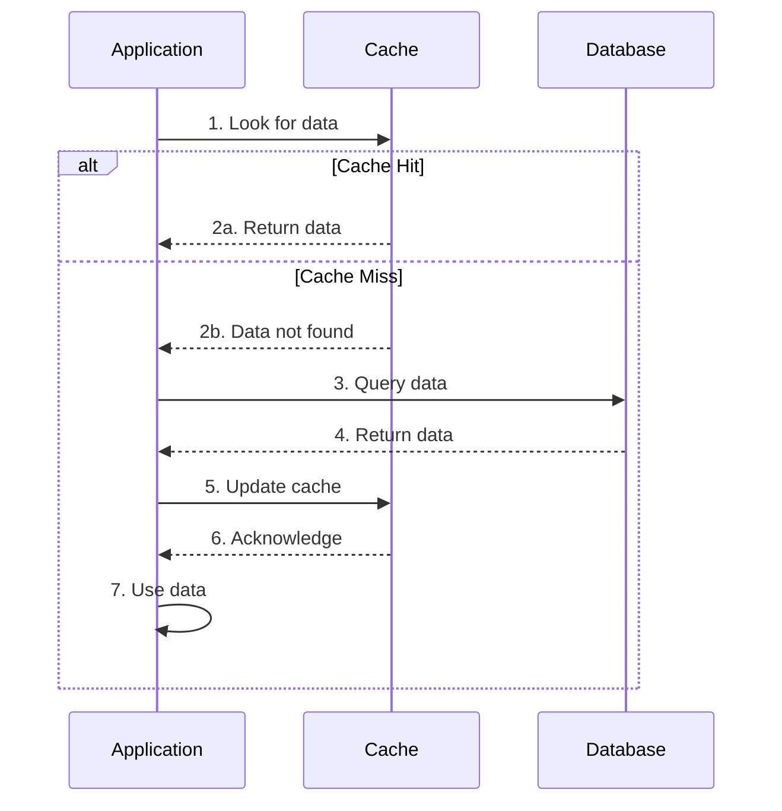

import Tabs from '@theme/Tabs';
import TabItem from '@theme/TabItem';

# 🚀 Cache-Aside Pattern Guide

## Overview

The Cache-Aside pattern (also known as Lazy Loading) is a caching strategy where the application first checks the cache for data, and only if it's not found (cache miss), retrieves it from the data store and adds it to the cache. Think of it like a librarian who first checks a quick-access shelf (cache) for frequently requested books before going to the main archive (database) to fetch them.



## 🔑 Key Concepts

### 1. Components
- Cache Store
- Data Store
- Cache Manager
- Data Access Layer

### 2. Operations
- Read-Through
- Cache Miss
- Cache Hit
- Cache Update
- Cache Invalidation

### 3. States
- Warm Cache
- Cold Cache
- Stale Cache
- Invalid Cache

## 💻 Implementation

### Cache-Aside Implementation

<Tabs>
  <TabItem value="java" label="Java">
```java
import org.springframework.cache.Cache;
import org.springframework.cache.CacheManager;
import org.springframework.stereotype.Service;
import java.util.Optional;
import java.util.concurrent.TimeUnit;

@Service
public class CacheAsideService<K, V> {
private final Cache cache;
private final DataStore<K, V> dataStore;
private final long expirationTime;
private final TimeUnit timeUnit;

    public CacheAsideService(
            CacheManager cacheManager,
            DataStore<K, V> dataStore,
            long expirationTime,
            TimeUnit timeUnit) {
        this.cache = cacheManager.getCache("mainCache");
        this.dataStore = dataStore;
        this.expirationTime = expirationTime;
        this.timeUnit = timeUnit;
    }

    public V get(K key) {
        // Try to get from cache first
        V value = cache.get(key, () -> {
            // Cache miss - get from data store
            Optional<V> data = dataStore.get(key);
            if (data.isPresent()) {
                // Store in cache and return
                cache.put(key, new CacheEntry<>(
                    data.get(),
                    System.currentTimeMillis() + timeUnit.toMillis(expirationTime)
                ));
                return data.get();
            }
            return null;
        });

        // Check if value is expired
        if (value instanceof CacheEntry) {
            CacheEntry<V> entry = (CacheEntry<V>) value;
            if (entry.isExpired()) {
                cache.evict(key);
                return get(key); // Recursive call to refresh
            }
            return entry.getValue();
        }

        return value;
    }

    public void put(K key, V value) {
        // Update data store
        dataStore.put(key, value);
        // Update cache
        cache.put(key, new CacheEntry<>(
            value,
            System.currentTimeMillis() + timeUnit.toMillis(expirationTime)
        ));
    }

    public void invalidate(K key) {
        cache.evict(key);
    }

    private static class CacheEntry<T> {
        private final T value;
        private final long expirationTime;

        public CacheEntry(T value, long expirationTime) {
            this.value = value;
            this.expirationTime = expirationTime;
        }

        public T getValue() {
            return value;
        }

        public boolean isExpired() {
            return System.currentTimeMillis() > expirationTime;
        }
    }
}
```
  </TabItem>
  <TabItem value="go" label="Go">
```go
package main

import (
    "sync"
    "time"
)

type CacheEntry[V any] struct {
    Value         V
    ExpirationTime time.Time
}

type DataStore[K comparable, V any] interface {
    Get(key K) (V, error)
    Put(key K, value V) error
}

type CacheAside[K comparable, V any] struct {
    cache      map[K]CacheEntry[V]
    dataStore  DataStore[K, V]
    mutex      sync.RWMutex
    expiration time.Duration
}

func NewCacheAside[K comparable, V any](
    dataStore DataStore[K, V],
    expiration time.Duration,
) *CacheAside[K, V] {
    return &CacheAside[K, V]{
        cache:      make(map[K]CacheEntry[V]),
        dataStore:  dataStore,
        expiration: expiration,
    }
}

func (c *CacheAside[K, V]) Get(key K) (V, error) {
    // Try cache first
    c.mutex.RLock()
    if entry, exists := c.cache[key]; exists {
        c.mutex.RUnlock()
        if time.Now().Before(entry.ExpirationTime) {
            return entry.Value, nil
        }
        // Expired - remove from cache
        c.invalidate(key)
    } else {
        c.mutex.RUnlock()
    }

    // Cache miss or expired - get from data store
    value, err := c.dataStore.Get(key)
    if err != nil {
        return value, err
    }

    // Store in cache
    c.put(key, value)
    return value, nil
}

func (c *CacheAside[K, V]) Put(key K, value V) error {
    // Update data store first
    if err := c.dataStore.Put(key, value); err != nil {
        return err
    }

    // Update cache
    c.put(key, value)
    return nil
}

func (c *CacheAside[K, V]) put(key K, value V) {
    c.mutex.Lock()
    defer c.mutex.Unlock()
    
    c.cache[key] = CacheEntry[V]{
        Value:         value,
        ExpirationTime: time.Now().Add(c.expiration),
    }
}

func (c *CacheAside[K, V]) invalidate(key K) {
    c.mutex.Lock()
    defer c.mutex.Unlock()
    delete(c.cache, key)
}

func (c *CacheAside[K, V]) Clear() {
    c.mutex.Lock()
    defer c.mutex.Unlock()
    c.cache = make(map[K]CacheEntry[V])
}
```
  </TabItem>
</Tabs>

## 🤝 Related Patterns

1. **Write-Through Cache**
    - Updates both cache and database simultaneously
    - Provides strong consistency
    - Higher write latency

2. **Write-Behind Cache**
    - Updates cache immediately
    - Asynchronously updates database
    - Better write performance

3. **Read-Through Cache**
    - Cache handles database interaction
    - Simpler application logic
    - Similar to Cache-Aside but encapsulated

## ⚙️ Best Practices

### Configuration
- Set appropriate TTL
- Configure cache size limits
- Use consistent serialization
- Implement monitoring

### Monitoring
- Track cache hit/miss ratios
- Monitor memory usage
- Watch for cache churn
- Monitor latency

### Testing
- Test cache miss scenarios
- Verify expiration behavior
- Check concurrent access
- Test failure scenarios

## 🚫 Common Pitfalls

1. **Cache Stampede**
    - Multiple simultaneous cache misses
    - Database overload
    - Solution: Implement request coalescing

2. **Cache Inconsistency**
    - Stale data
    - Write synchronization issues
    - Solution: Proper invalidation strategy

3. **Memory Leaks**
    - Unbounded cache growth
    - Poor eviction policies
    - Solution: Set size limits and TTL

## 🎯 Use Cases

### 1. Product Catalog
- Frequent reads
- Infrequent updates
- High traffic
- Performance critical

### 2. User Profiles
- Read-heavy workload
- Moderate updates
- Session management
- Personalization

### 3. Content Management
- Static content
- Media assets
- Configuration data
- API responses

## 🔍 Deep Dive Topics

### Thread Safety
- Concurrent access handling
- Read/write locks
- Atomic operations
- Cache synchronization

### Distributed Systems
- Distributed cache
- Consistency models
- Network partitioning
- Cache coherence

### Performance
- Hit ratio optimization
- Memory utilization
- Latency reduction
- Throughput improvement

## 📚 Additional Resources

### Documentation
- [Microsoft Cache-Aside Pattern](https://docs.microsoft.com/en-us/azure/architecture/patterns/cache-aside)
- [Redis Caching Strategies](https://redis.com/redis-enterprise/data-structures/caching-patterns/)
- [AWS Caching Best Practices](https://aws.amazon.com/caching/best-practices/)

### Tools
- Caching: Redis, Memcached
- Monitoring: Prometheus, Grafana
- Testing: JMeter, K6
- Distributed: Hazelcast, Apache Ignite

## ❓ FAQs

### When should I use Cache-Aside?
- Read-heavy workloads
- Tolerance for eventual consistency
- Need for fine-grained control
- Complex invalidation requirements

### How do I handle cache failures?
- Implement circuit breaker
- Fallback to database
- Monitor cache health
- Use cache timeouts

### What's the optimal TTL?
- Depends on data volatility
- Consider business requirements
- Balance freshness vs performance
- Monitor hit rates

### How to handle cache warming?
- Implement background warmup
- Use predictive loading
- Gradual population
- Monitor cold start impact