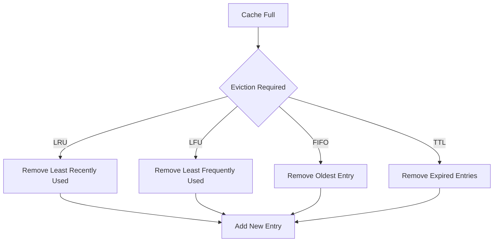

import Tabs from '@theme/Tabs';
import TabItem from '@theme/TabItem';

# 🗑️ Cache Eviction Strategies Guide

## Overview

Cache eviction is the process of removing entries from a cache when it reaches its capacity limit. Think of it like a limited-size bookshelf where you need to decide which books to remove when adding new ones. Different strategies (like removing the least recently used book or the oldest one) can be applied based on your needs.



## 🔑 Key Concepts

### 1. Eviction Policies
- Least Recently Used (LRU)
- Least Frequently Used (LFU)
- First In First Out (FIFO)
- Time-Based Expiration (TTL)
- Random Replacement

### 2. Components
- Eviction Manager
- Policy Selector
- Capacity Monitor
- Statistics Collector

### 3. States
- Cache Full
- Eviction Pending
- Entry Expired
- Entry Removed

## 💻 Implementation

### Cache with Eviction Policies Implementation

<Tabs>
  <TabItem value="java" label="Java">
```java
import java.util.*;
import java.util.concurrent.ConcurrentHashMap;
import java.util.concurrent.locks.ReadWriteLock;
import java.util.concurrent.locks.ReentrantReadWriteLock;

public class EvictableCache<K, V> {
private final int capacity;
private final EvictionPolicy policy;
private final Map<K, CacheEntry<V>> cache;
private final ReadWriteLock lock;
private final LinkedHashMap<K, Long> accessOrder;
private final Map<K, Integer> frequency;

    public EvictableCache(int capacity, EvictionPolicy policy) {
        this.capacity = capacity;
        this.policy = policy;
        this.cache = new ConcurrentHashMap<>();
        this.lock = new ReentrantReadWriteLock();
        this.accessOrder = new LinkedHashMap<>();
        this.frequency = new HashMap<>();
    }

    public void put(K key, V value, long ttlMillis) {
        lock.writeLock().lock();
        try {
            if (cache.size() >= capacity && !cache.containsKey(key)) {
                evict();
            }

            long expirationTime = ttlMillis > 0 
                ? System.currentTimeMillis() + ttlMillis 
                : Long.MAX_VALUE;

            cache.put(key, new CacheEntry<>(value, expirationTime));
            updateMetadata(key);
        } finally {
            lock.writeLock().unlock();
        }
    }

    public Optional<V> get(K key) {
        lock.readLock().lock();
        try {
            CacheEntry<V> entry = cache.get(key);
            if (entry == null || entry.isExpired()) {
                if (entry != null) {
                    remove(key);
                }
                return Optional.empty();
            }

            updateMetadata(key);
            return Optional.of(entry.getValue());
        } finally {
            lock.readLock().unlock();
        }
    }

    private void evict() {
        K keyToEvict = null;

        switch (policy) {
            case LRU:
                keyToEvict = accessOrder.keySet().iterator().next();
                break;
            case LFU:
                keyToEvict = frequency.entrySet().stream()
                    .min(Map.Entry.comparingByValue())
                    .map(Map.Entry::getKey)
                    .orElse(null);
                break;
            case FIFO:
                keyToEvict = cache.keySet().iterator().next();
                break;
            case RANDOM:
                List<K> keys = new ArrayList<>(cache.keySet());
                keyToEvict = keys.get(new Random().nextInt(keys.size()));
                break;
        }

        if (keyToEvict != null) {
            remove(keyToEvict);
        }
    }

    private void updateMetadata(K key) {
        switch (policy) {
            case LRU:
                accessOrder.remove(key);
                accessOrder.put(key, System.currentTimeMillis());
                break;
            case LFU:
                frequency.merge(key, 1, Integer::sum);
                break;
        }
    }

    private void remove(K key) {
        cache.remove(key);
        accessOrder.remove(key);
        frequency.remove(key);
    }

    public void cleanup() {
        lock.writeLock().lock();
        try {
            Iterator<Map.Entry<K, CacheEntry<V>>> it = cache.entrySet().iterator();
            while (it.hasNext()) {
                Map.Entry<K, CacheEntry<V>> entry = it.next();
                if (entry.getValue().isExpired()) {
                    K key = entry.getKey();
                    it.remove();
                    accessOrder.remove(key);
                    frequency.remove(key);
                }
            }
        } finally {
            lock.writeLock().unlock();
        }
    }

    private static class CacheEntry<V> {
        private final V value;
        private final long expirationTime;

        CacheEntry(V value, long expirationTime) {
            this.value = value;
            this.expirationTime = expirationTime;
        }

        V getValue() {
            return value;
        }

        boolean isExpired() {
            return System.currentTimeMillis() > expirationTime;
        }
    }

    public enum EvictionPolicy {
        LRU,
        LFU,
        FIFO,
        RANDOM
    }
}
```
  </TabItem>
  <TabItem value="go" label="Go">
```go
package main

import (
    "container/list"
    "math/rand"
    "sync"
    "time"
)

type EvictionPolicy int

const (
    LRU EvictionPolicy = iota
    LFU
    FIFO
    RANDOM
)

type CacheEntry[V any] struct {
    value         V
    expirationTime time.Time
}

type EvictableCache[K comparable, V any] struct {
    capacity    int
    policy      EvictionPolicy
    cache       map[K]CacheEntry[V]
    accessList  *list.List
    accessMap   map[K]*list.Element
    frequency   map[K]int
    mu          sync.RWMutex
}

func NewEvictableCache[K comparable, V any](
    capacity int,
    policy EvictionPolicy,
) *EvictableCache[K, V] {
    return &EvictableCache[K, V]{
        capacity:    capacity,
        policy:      policy,
        cache:       make(map[K]CacheEntry[V]),
        accessList:  list.New(),
        accessMap:   make(map[K]*list.Element),
        frequency:   make(map[K]int),
    }
}

func (c *EvictableCache[K, V]) Put(key K, value V, ttl time.Duration) {
    c.mu.Lock()
    defer c.mu.Unlock()

    if len(c.cache) >= c.capacity && !c.exists(key) {
        c.evict()
    }

    expirationTime := time.Now()
    if ttl > 0 {
        expirationTime = expirationTime.Add(ttl)
    } else {
        expirationTime = expirationTime.Add(100 * 365 * 24 * time.Hour) // ~100 years
    }

    c.cache[key] = CacheEntry[V]{
        value:         value,
        expirationTime: expirationTime,
    }
    c.updateMetadata(key)
}

func (c *EvictableCache[K, V]) Get(key K) (V, bool) {
    c.mu.RLock()
    defer c.mu.RUnlock()

    entry, exists := c.cache[key]
    if !exists || time.Now().After(entry.expirationTime) {
        if exists {
            c.remove(key)
        }
        var zero V
        return zero, false
    }

    c.updateMetadata(key)
    return entry.value, true
}

func (c *EvictableCache[K, V]) evict() {
    var keyToEvict K
    var found bool

    switch c.policy {
    case LRU:
        if element := c.accessList.Front(); element != nil {
            keyToEvict = element.Value.(K)
            found = true
        }
    case LFU:
        minFreq := int(^uint(0) >> 1)
        for k, freq := range c.frequency {
            if freq < minFreq {
                minFreq = freq
                keyToEvict = k
                found = true
            }
        }
    case FIFO:
        for k := range c.cache {
            keyToEvict = k
            found = true
            break
        }
    case RANDOM:
        keys := make([]K, 0, len(c.cache))
        for k := range c.cache {
            keys = append(keys, k)
        }
        if len(keys) > 0 {
            keyToEvict = keys[rand.Intn(len(keys))]
            found = true
        }
    }

    if found {
        c.remove(keyToEvict)
    }
}

func (c *EvictableCache[K, V]) updateMetadata(key K) {
    switch c.policy {
    case LRU:
        if element, exists := c.accessMap[key]; exists {
            c.accessList.MoveToBack(element)
        } else {
            element := c.accessList.PushBack(key)
            c.accessMap[key] = element
        }
    case LFU:
        c.frequency[key]++
    }
}

func (c *EvictableCache[K, V]) remove(key K) {
    delete(c.cache, key)
    if element, exists := c.accessMap[key]; exists {
        c.accessList.Remove(element)
        delete(c.accessMap, key)
    }
    delete(c.frequency, key)
}

func (c *EvictableCache[K, V]) exists(key K) bool {
    _, exists := c.cache[key]
    return exists
}

func (c *EvictableCache[K, V]) Cleanup() {
    c.mu.Lock()
    defer c.mu.Unlock()

    now := time.Now()
    for key, entry := range c.cache {
        if now.After(entry.expirationTime) {
            c.remove(key)
        }
    }
}
```
  </TabItem>
</Tabs>

## 🤝 Related Patterns

1. **Cache-Aside Pattern**
    - Works with eviction
    - Handles cache misses
    - Reload strategies

2. **Write-Through Cache**
    - Consistent updates
    - Eviction coordination
    - Data integrity

3. **Read-Through Cache**
    - Auto-population
    - Miss handling
    - Load distribution

## ⚙️ Best Practices

### Configuration
- Set appropriate capacity
- Choose correct policy
- Configure TTLs
- Monitor eviction rate

### Monitoring
- Track hit/miss ratios
- Watch eviction frequency
- Monitor memory usage
- Alert on high eviction rates

### Testing
- Test capacity limits
- Verify eviction behavior
- Check concurrent access
- Validate TTL handling

## 🚫 Common Pitfalls

1. **Wrong Policy Choice**
    - Inefficient eviction
    - Poor cache utilization
    - Solution: Profile workload

2. **Memory Leaks**
    - Metadata accumulation
    - Reference holding
    - Solution: Proper cleanup

3. **Thundering Herd**
    - Mass eviction
    - Concurrent reloads
    - Solution: Staggered eviction

## 🎯 Use Cases

### 1. Web Application Cache
- Session data
- API responses
- Static resources
- User preferences

### 2. Database Query Cache
- Query results
- Computed values
- Aggregated data
- Frequent lookups

### 3. Content Delivery System
- Media files
- Page fragments
- User content
- Configuration data

## 🔍 Deep Dive Topics

### Thread Safety
- Concurrent eviction
- Lock strategies
- Race conditions
- Atomic operations

### Distributed Systems
- Coordinated eviction
- Cross-node consistency
- Network overhead
- Cluster synchronization

### Performance
- Eviction overhead
- Memory efficiency
- Hit rate optimization
- Load distribution

## 📚 Additional Resources

### Documentation
- [Caffeine Cache](https://github.com/ben-manes/caffeine)
- [Redis Eviction](https://redis.io/docs/manual/eviction/)
- [Memcached Eviction](https://github.com/memcached/memcached/wiki/Programming)

### Tools
- Caffeine
- Redis
- Ehcache
- Memcached

## ❓ FAQs

### Which policy should I choose?
- LRU for general use
- LFU for frequency-based
- FIFO for simplicity
- Random for low overhead

### How to set cache size?
- Consider memory limits
- Monitor usage patterns
- Balance hit ratio
- Test different sizes

### When to trigger cleanup?
- Schedule periodic cleanup
- Monitor memory usage
- Use TTL expiration
- Watch eviction rate

### How to handle eviction events?
- Log evictions
- Monitor patterns
- Implement callbacks
- Update statistics
