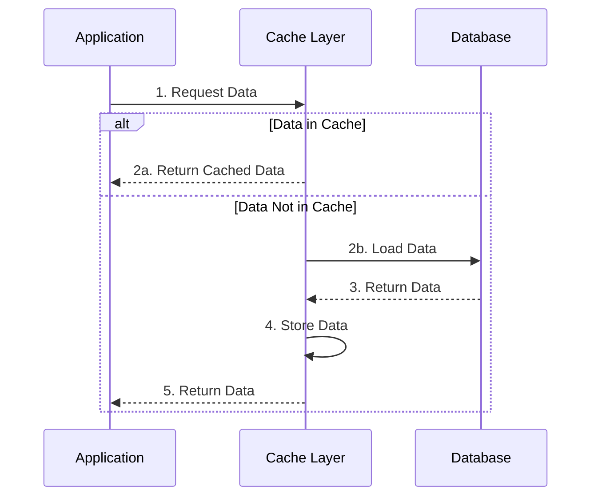

import Tabs from '@theme/Tabs';
import TabItem from '@theme/TabItem';

# 📖 Read-Through Caching Pattern Guide

## Overview

The Read-Through caching pattern is a caching strategy where the cache itself is responsible for loading data from the database. Think of it like a library assistant who has exclusive access to both the quick-access shelf (cache) and the main archive (database), managing all book retrievals transparently for visitors.



## 🔑 Key Concepts

### 1. Components
- Cache Service Layer
- Data Provider
- Loading Strategy
- Serialization Handler

### 2. Operations
- Synchronous Loading
- Transparent Retrieval
- Automatic Population
- Cache Management

### 3. States
- Cache Population
- Data Loading
- Cache Refresh
- Data Synchronization

## 💻 Implementation

### Read-Through Cache Implementation

<Tabs>
  <TabItem value="java" label="Java">
```java
import java.util.concurrent.CompletableFuture;
import java.util.concurrent.ConcurrentMap;
import java.util.concurrent.ConcurrentHashMap;
import java.util.function.Function;

public class ReadThroughCache<K, V> {
private final ConcurrentMap<K, CacheEntry<V>> cache;
private final Function<K, V> dataLoader;
private final long ttlMillis;

    public ReadThroughCache(Function<K, V> dataLoader, long ttlMillis) {
        this.cache = new ConcurrentHashMap<>();
        this.dataLoader = dataLoader;
        this.ttlMillis = ttlMillis;
    }

    public V get(K key) {
        CacheEntry<V> entry = cache.get(key);
        
        if (entry != null && !entry.isExpired()) {
            return entry.getValue();
        }

        // Synchronously load and cache
        return getAndCache(key);
    }

    public CompletableFuture<V> getAsync(K key) {
        CacheEntry<V> entry = cache.get(key);
        
        if (entry != null && !entry.isExpired()) {
            return CompletableFuture.completedFuture(entry.getValue());
        }

        // Asynchronously load and cache
        return CompletableFuture.supplyAsync(() -> getAndCache(key));
    }

    private synchronized V getAndCache(K key) {
        // Double-check if data was loaded by another thread
        CacheEntry<V> entry = cache.get(key);
        if (entry != null && !entry.isExpired()) {
            return entry.getValue();
        }

        // Load data through provider
        V value = dataLoader.apply(key);
        
        // Cache the loaded value
        cache.put(key, new CacheEntry<>(value, System.currentTimeMillis() + ttlMillis));
        
        return value;
    }

    public void invalidate(K key) {
        cache.remove(key);
    }

    public void clear() {
        cache.clear();
    }

    private static class CacheEntry<V> {
        private final V value;
        private final long expirationTime;

        public CacheEntry(V value, long expirationTime) {
            this.value = value;
            this.expirationTime = expirationTime;
        }

        public V getValue() {
            return value;
        }

        public boolean isExpired() {
            return System.currentTimeMillis() > expirationTime;
        }
    }
}
```
  </TabItem>
  <TabItem value="go" label="Go">
```go
package main

import (
    "sync"
    "time"
)

type CacheEntry[V any] struct {
    Value      V
    ExpiresAt time.Time
}

type ReadThroughCache[K comparable, V any] struct {
    cache      map[K]CacheEntry[V]
    dataLoader func(K) (V, error)
    ttl        time.Duration
    mu         sync.RWMutex
}

func NewReadThroughCache[K comparable, V any](
    dataLoader func(K) (V, error),
    ttl time.Duration,
) *ReadThroughCache[K, V] {
    return &ReadThroughCache[K, V]{
        cache:      make(map[K]CacheEntry[V]),
        dataLoader: dataLoader,
        ttl:        ttl,
    }
}

func (c *ReadThroughCache[K, V]) Get(key K) (V, error) {
    // Try to get from cache first
    c.mu.RLock()
    if entry, exists := c.cache[key]; exists && time.Now().Before(entry.ExpiresAt) {
        c.mu.RUnlock()
        return entry.Value, nil
    }
    c.mu.RUnlock()

    // Not in cache or expired, load through provider
    return c.getAndCache(key)
}

func (c *ReadThroughCache[K, V]) getAndCache(key K) (V, error) {
    c.mu.Lock()
    defer c.mu.Unlock()

    // Double-check if data was loaded by another goroutine
    if entry, exists := c.cache[key]; exists && time.Now().Before(entry.ExpiresAt) {
        return entry.Value, nil
    }

    // Load data through provider
    value, err := c.dataLoader(key)
    if err != nil {
        var empty V
        return empty, err
    }

    // Cache the loaded value
    c.cache[key] = CacheEntry[V]{
        Value:     value,
        ExpiresAt: time.Now().Add(c.ttl),
    }

    return value, nil
}

func (c *ReadThroughCache[K, V]) Invalidate(key K) {
    c.mu.Lock()
    defer c.mu.Unlock()
    delete(c.cache, key)
}

func (c *ReadThroughCache[K, V]) Clear() {
    c.mu.Lock()
    defer c.mu.Unlock()
    c.cache = make(map[K]CacheEntry[V])
}

func (c *ReadThroughCache[K, V]) RefreshAsync(key K, ch chan<- error) {
    go func() {
        _, err := c.getAndCache(key)
        if ch != nil {
            ch <- err
        }
    }()
}
```
  </TabItem>
</Tabs>

## 🤝 Related Patterns

1. **Cache-Aside Pattern**
    - Application manages cache interactions
    - More control over caching logic
    - Less abstraction than Read-Through

2. **Write-Through Cache**
    - Complementary to Read-Through
    - Ensures data consistency
    - Synchronous updates

3. **Write-Behind Cache**
    - Asynchronous updates
    - Better write performance
    - Can be combined with Read-Through

## ⚙️ Best Practices

### Configuration
- Set appropriate TTL
- Configure batch loading
- Implement retry policies
- Use proper serialization

### Monitoring
- Track cache hit ratios
- Monitor load times
- Watch memory usage
- Alert on failures

### Testing
- Test cache misses
- Verify loading behavior
- Check concurrency
- Test failure scenarios

## 🚫 Common Pitfalls

1. **Cache Flooding**
    - Too many simultaneous loads
    - Database overload
    - Solution: Implement request coalescing

2. **Stale Data**
    - Incorrect TTL settings
    - Missing invalidation
    - Solution: Proper expiration strategy

3. **Resource Exhaustion**
    - Memory overflow
    - Connection pool depletion
    - Solution: Set resource limits

## 🎯 Use Cases

### 1. Product Information System
- Frequent product lookups
- Relatively static data
- High read concurrency
- Performance critical

### 2. Configuration Management
- Global settings
- Feature flags
- Environment configurations
- Distributed systems

### 3. Content Delivery
- Blog posts
- Media metadata
- User preferences
- API responses

## 🔍 Deep Dive Topics

### Thread Safety
- Concurrent loading
- Cache synchronization
- Lock management
- Atomic operations

### Distributed Systems
- Cluster synchronization
- Network partitioning
- Cache coherence
- Distributed locking

### Performance
- Loading strategies
- Batch operations
- Memory management
- Response time optimization

## 📚 Additional Resources

### Documentation
- [Spring Cache Documentation](https://docs.spring.io/spring-framework/docs/current/reference/html/integration.html#cache)
- [Guava Caching](https://github.com/google/guava/wiki/CachesExplained)
- [Redis Documentation](https://redis.io/topics/cache)

### Tools
- Redis
- Caffeine
- Ehcache
- Hazelcast

## ❓ FAQs

### When should I use Read-Through?
- High-read workloads
- Need for abstraction
- Complex loading logic
- Distributed systems

### How to handle cache failures?
- Implement fallback strategy
- Circuit breaker pattern
- Monitoring and alerts
- Graceful degradation

### What's the ideal TTL?
- Based on data volatility
- Consider consistency needs
- Monitor hit ratios
- Test different values

### How to handle bulk operations?
- Implement batch loading
- Use request coalescing
- Consider prefetching
- Monitor batch sizes