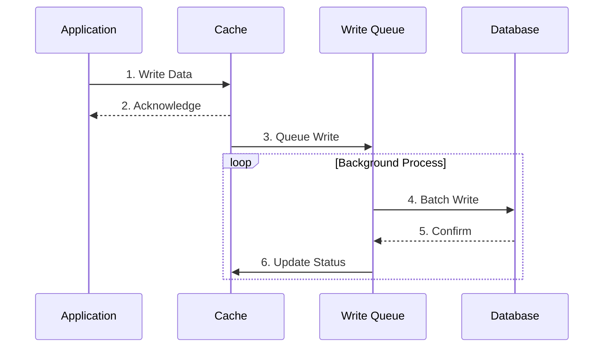

import Tabs from '@theme/Tabs';
import TabItem from '@theme/TabItem';

# 🚀 Write-Behind Caching Pattern Guide

## Overview

The Write-Behind pattern (also known as Write-Back) is a caching strategy where writes are first made to the cache and then asynchronously propagated to the underlying database. Think of it like a writer who quickly jots down notes in a notebook (cache) and later transcribes them into a formal document (database) when time permits.



## 🔑 Key Concepts

### 1. Components
- Write Queue
- Batch Processor
- Status Tracker
- Conflict Resolver

### 2. Operations
- Asynchronous Write
- Batch Processing
- Queue Management
- Status Tracking

### 3. States
- Pending Write
- Writing
- Completed
- Failed

## 💻 Implementation

### Write-Behind Cache Implementation

<Tabs>
  <TabItem value="java" label="Java">
```java
import java.util.concurrent.*;
import java.util.Map;
import java.util.Queue;
import java.util.LinkedList;

public class WriteBehindCache<K, V> {
private final ConcurrentMap<K, V> cache;
private final Queue<WriteOperation<K, V>> writeQueue;
private final DataStore<K, V> dataStore;
private final ScheduledExecutorService scheduler;
private final int batchSize;
private final long writeDelay;

    public WriteBehindCache(
            DataStore<K, V> dataStore,
            int batchSize,
            long writeDelay,
            TimeUnit timeUnit) {
        this.cache = new ConcurrentHashMap<>();
        this.writeQueue = new ConcurrentLinkedQueue<>();
        this.dataStore = dataStore;
        this.batchSize = batchSize;
        this.writeDelay = writeDelay;
        this.scheduler = Executors.newScheduledThreadPool(1);
        
        startWriteBehindProcessor(timeUnit);
    }
    
    private void startWriteBehindProcessor(TimeUnit timeUnit) {
        scheduler.scheduleWithFixedDelay(
            this::processBatch,
            writeDelay,
            writeDelay,
            timeUnit
        );
    }
    
    public void write(K key, V value) {
        cache.put(key, value);
        writeQueue.offer(new WriteOperation<>(key, value, OperationType.WRITE));
    }
    
    public void delete(K key) {
        cache.remove(key);
        writeQueue.offer(new WriteOperation<>(key, null, OperationType.DELETE));
    }
    
    public V read(K key) {
        return cache.get(key);
    }
    
    private void processBatch() {
        int count = 0;
        Map<K, V> batch = new ConcurrentHashMap<>();
        Set<K> deleteBatch = new HashSet<>();
        
        while (count < batchSize && !writeQueue.isEmpty()) {
            WriteOperation<K, V> operation = writeQueue.poll();
            if (operation != null) {
                if (operation.type == OperationType.WRITE) {
                    batch.put(operation.key, operation.value);
                } else {
                    deleteBatch.add(operation.key);
                }
                count++;
            }
        }
        
        if (!batch.isEmpty()) {
            try {
                dataStore.writeBatch(batch);
            } catch (Exception e) {
                // Handle failed writes
                requeue(batch);
                logError("Batch write failed", e);
            }
        }
        
        if (!deleteBatch.isEmpty()) {
            try {
                dataStore.deleteBatch(deleteBatch);
            } catch (Exception e) {
                // Handle failed deletes
                requeueDeletes(deleteBatch);
                logError("Batch delete failed", e);
            }
        }
    }
    
    private void requeue(Map<K, V> failed) {
        failed.forEach((k, v) -> 
            writeQueue.offer(new WriteOperation<>(k, v, OperationType.WRITE))
        );
    }
    
    private void requeueDeletes(Set<K> failed) {
        failed.forEach(k ->
            writeQueue.offer(new WriteOperation<>(k, null, OperationType.DELETE))
        );
    }
    
    public void shutdown() {
        scheduler.shutdown();
        try {
            processBatch(); // Process remaining items
            scheduler.awaitTermination(writeDelay * 2, TimeUnit.MILLISECONDS);
        } catch (InterruptedException e) {
            Thread.currentThread().interrupt();
        }
    }
    
    private static class WriteOperation<K, V> {
        final K key;
        final V value;
        final OperationType type;
        
        WriteOperation(K key, V value, OperationType type) {
            this.key = key;
            this.value = value;
            this.type = type;
        }
    }
    
    private enum OperationType {
        WRITE,
        DELETE
    }
}
```
  </TabItem>
  <TabItem value="go" label="Go">
```go
package main

import (
    "context"
    "sync"
    "time"
)

type OperationType int

const (
    Write OperationType = iota
    Delete
)

type WriteOperation[K comparable, V any] struct {
    Key   K
    Value V
    Type  OperationType
}

type WriteBehindCache[K comparable, V any] struct {
    cache      map[K]V
    writeQueue chan WriteOperation[K, V]
    dataStore  DataStore[K, V]
    batchSize  int
    mu         sync.RWMutex
    ctx        context.Context
    cancel     context.CancelFunc
}

func NewWriteBehindCache[K comparable, V any](
    dataStore DataStore[K, V],
    batchSize int,
    writeDelay time.Duration,
) *WriteBehindCache[K, V] {
    ctx, cancel := context.WithCancel(context.Background())
    cache := &WriteBehindCache[K, V]{
        cache:      make(map[K]V),
        writeQueue: make(chan WriteOperation[K, V], batchSize*2),
        dataStore:  dataStore,
        batchSize:  batchSize,
        ctx:        ctx,
        cancel:     cancel,
    }
    
    go cache.startWriteBehindProcessor(writeDelay)
    return cache
}

func (c *WriteBehindCache[K, V]) Write(key K, value V) {
    c.mu.Lock()
    c.cache[key] = value
    c.mu.Unlock()
    
    c.writeQueue <- WriteOperation[K, V]{
        Key:   key,
        Value: value,
        Type:  Write,
    }
}

func (c *WriteBehindCache[K, V]) Delete(key K) {
    c.mu.Lock()
    delete(c.cache, key)
    c.mu.Unlock()
    
    c.writeQueue <- WriteOperation[K, V]{
        Key:  key,
        Type: Delete,
    }
}

func (c *WriteBehindCache[K, V]) Read(key K) (V, bool) {
    c.mu.RLock()
    defer c.mu.RUnlock()
    value, exists := c.cache[key]
    return value, exists
}

func (c *WriteBehindCache[K, V]) startWriteBehindProcessor(writeDelay time.Duration) {
    ticker := time.NewTicker(writeDelay)
    defer ticker.Stop()

    for {
        select {
        case <-c.ctx.Done():
            return
        case <-ticker.C:
            c.processBatch()
        }
    }
}

func (c *WriteBehindCache[K, V]) processBatch() {
    batch := make(map[K]V)
    deleteBatch := make(map[K]struct{})
    count := 0

    // Collect batch of operations
    for count < c.batchSize {
        select {
        case op := <-c.writeQueue:
            if op.Type == Write {
                batch[op.Key] = op.Value
            } else {
                deleteBatch[op.Key] = struct{}{}
            }
            count++
        default:
            goto ProcessBatch
        }
    }

ProcessBatch:
    if len(batch) > 0 {
        if err := c.dataStore.WriteBatch(c.ctx, batch); err != nil {
            // Handle failed writes
            c.requeue(batch)
        }
    }

    if len(deleteBatch) > 0 {
        if err := c.dataStore.DeleteBatch(c.ctx, deleteBatch); err != nil {
            // Handle failed deletes
            c.requeueDeletes(deleteBatch)
        }
    }
}

func (c *WriteBehindCache[K, V]) requeue(failed map[K]V) {
    for k, v := range failed {
        c.writeQueue <- WriteOperation[K, V]{
            Key:   k,
            Value: v,
            Type:  Write,
        }
    }
}

func (c *WriteBehindCache[K, V]) requeueDeletes(failed map[K]struct{}) {
    for k := range failed {
        c.writeQueue <- WriteOperation[K, V]{
            Key:  k,
            Type: Delete,
        }
    }
}

func (c *WriteBehindCache[K, V]) Shutdown() {
    c.cancel()
    c.processBatch() // Process remaining items
    close(c.writeQueue)
}
```
  </TabItem>
</Tabs>

## 🤝 Related Patterns

1. **Write-Through Cache**
    - Synchronous writes
    - Stronger consistency
    - Higher write latency

2. **Read-Through Cache**
    - Complementary pattern
    - Handles read operations
    - Cache population

3. **Cache-Aside**
    - Application-managed cache
    - More control
    - Less abstraction

## ⚙️ Best Practices

### Configuration
- Set appropriate batch sizes
- Configure write delays
- Implement retry policies
- Monitor queue size

### Monitoring
- Track write latency
- Monitor queue length
- Watch error rates
- Alert on failures

### Testing
- Test batch processing
- Verify data consistency
- Check error handling
- Test shutdown behavior

## 🚫 Common Pitfalls

1. **Data Loss**
    - Queue overflow
    - Process crashes
    - Solution: Persistent queues

2. **Inconsistency Window**
    - Stale reads
    - Write conflicts
    - Solution: Version tracking

3. **Resource Exhaustion**
    - Memory overflow
    - Queue buildup
    - Solution: Backpressure mechanisms

## 🎯 Use Cases

### 1. Logging Systems
- High-volume logs
- Performance critical
- Eventual consistency
- Batch processing

### 2. Analytics Platform
- Event tracking
- Metrics collection
- User behavior
- Performance data

### 3. Social Media Platform
- Status updates
- User interactions
- Content moderation
- Activity feeds

## 🔍 Deep Dive Topics

### Thread Safety
- Queue synchronization
- Cache consistency
- Lock management
- Atomic operations

### Distributed Systems
- Queue distribution
- Failure recovery
- Network partitioning
- Consistency models

### Performance
- Batch optimization
- Queue management
- Memory efficiency
- Write coalescing

## 📚 Additional Resources

### Documentation
- [Microsoft Write-Behind Pattern](https://docs.microsoft.com/en-us/azure/architecture/patterns/cache-aside)
- [Redis Write-Behind](https://redis.io/topics/persistence)
- [Hazelcast Write-Behind](https://docs.hazelcast.com/hazelcast/latest/data-structures/implementing-map-store)

### Tools
- Redis
- Apache Kafka
- RabbitMQ
- Apache Cassandra

## ❓ FAQs

### When should I use Write-Behind?
- High-write workloads
- Performance priority
- Eventual consistency acceptable
- Batch processing beneficial

### How to handle failures?
- Implement retry logic
- Use persistent queues
- Monitor error rates
- Have recovery procedures

### What's the optimal batch size?
- Consider write patterns
- Monitor performance
- Balance latency/throughput
- Test different sizes

### How to maintain consistency?
- Version tracking
- Conflict resolution
- Regular reconciliation
- Monitor drift

