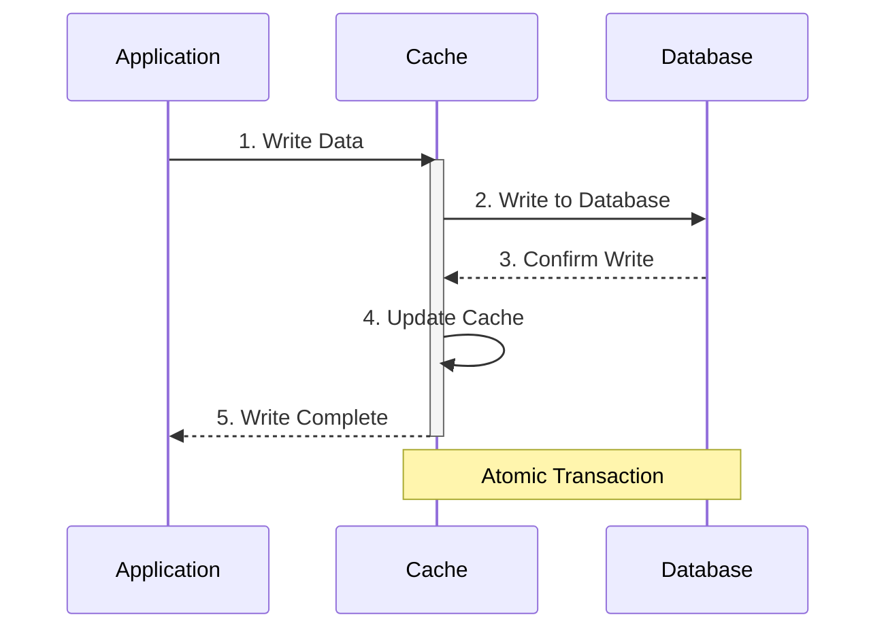

import Tabs from '@theme/Tabs';
import TabItem from '@theme/TabItem';

# 📝 Write-Through Caching Pattern Guide

## Overview

The Write-Through caching pattern ensures that data is written to both the cache and the underlying database in a single transaction. Think of it like a bank teller who simultaneously updates both the computer system (cache) and the official ledger (database) when processing a transaction, ensuring perfect consistency between both records.



## 🔑 Key Concepts

### 1. Core Components
- Cache Manager
- Write Coordinator
- Transaction Manager
- Data Validator

### 2. Operations
- Synchronized Writes
- Atomic Transactions
- Data Validation
- Write Confirmation

### 3. States
- Write Pending
- Write Complete
- Write Failed
- Cache Synchronized

## 💻 Implementation

### Write-Through Cache Implementation

<Tabs>
  <TabItem value="java" label="Java">
```java
import java.util.concurrent.ConcurrentHashMap;
import java.util.concurrent.locks.ReadWriteLock;
import java.util.concurrent.locks.ReentrantReadWriteLock;

public class WriteThroughCache<K, V> {
private final ConcurrentHashMap<K, V> cache;
private final DataStore<K, V> dataStore;
private final ReadWriteLock lock;

    public WriteThroughCache(DataStore<K, V> dataStore) {
        this.cache = new ConcurrentHashMap<>();
        this.dataStore = dataStore;
        this.lock = new ReentrantReadWriteLock();
    }
    
    public void write(K key, V value) throws Exception {
        lock.writeLock().lock();
        try {
            // Write to database first
            dataStore.write(key, value);
            // Then update cache
            cache.put(key, value);
        } finally {
            lock.writeLock().unlock();
        }
    }
    
    public V read(K key) throws Exception {
        lock.readLock().lock();
        try {
            // Try cache first
            V value = cache.get(key);
            if (value != null) {
                return value;
            }
            
            // If not in cache, get from store
            value = dataStore.read(key);
            if (value != null) {
                cache.put(key, value);
            }
            return value;
        } finally {
            lock.readLock().unlock();
        }
    }
    
    public void writeBatch(Map<K, V> entries) throws Exception {
        lock.writeLock().lock();
        try {
            // Write all entries to database
            dataStore.writeBatch(entries);
            // Update cache with all entries
            cache.putAll(entries);
        } finally {
            lock.writeLock().unlock();
        }
    }
    
    public void delete(K key) throws Exception {
        lock.writeLock().lock();
        try {
            // Delete from database first
            dataStore.delete(key);
            // Then remove from cache
            cache.remove(key);
        } finally {
            lock.writeLock().unlock();
        }
    }
    
    public void invalidate(K key) {
        lock.writeLock().lock();
        try {
            cache.remove(key);
        } finally {
            lock.writeLock().unlock();
        }
    }
    
    public void clear() {
        lock.writeLock().lock();
        try {
            cache.clear();
        } finally {
            lock.writeLock().unlock();
        }
    }
}

interface DataStore<K, V> {
void write(K key, V value) throws Exception;
V read(K key) throws Exception;
void writeBatch(Map<K, V> entries) throws Exception;
void delete(K key) throws Exception;
}
```
  </TabItem>
  <TabItem value="go" label="Go">
```go
package main

import (
    "context"
    "sync"
)

type DataStore[K comparable, V any] interface {
    Write(ctx context.Context, key K, value V) error
    Read(ctx context.Context, key K) (V, error)
    WriteBatch(ctx context.Context, entries map[K]V) error
    Delete(ctx context.Context, key K) error
}

type WriteThroughCache[K comparable, V any] struct {
    cache     map[K]V
    dataStore DataStore[K, V]
    mu        sync.RWMutex
}

func NewWriteThroughCache[K comparable, V any](dataStore DataStore[K, V]) *WriteThroughCache[K, V] {
    return &WriteThroughCache[K, V]{
        cache:     make(map[K]V),
        dataStore: dataStore,
    }
}

func (c *WriteThroughCache[K, V]) Write(ctx context.Context, key K, value V) error {
    c.mu.Lock()
    defer c.mu.Unlock()

    // Write to database first
    if err := c.dataStore.Write(ctx, key, value); err != nil {
        return err
    }

    // Then update cache
    c.cache[key] = value
    return nil
}

func (c *WriteThroughCache[K, V]) Read(ctx context.Context, key K) (V, error) {
    c.mu.RLock()
    // Try cache first
    if value, exists := c.cache[key]; exists {
        c.mu.RUnlock()
        return value, nil
    }
    c.mu.RUnlock()

    // If not in cache, get from store
    value, err := c.dataStore.Read(ctx, key)
    if err != nil {
        var zero V
        return zero, err
    }

    // Update cache
    c.mu.Lock()
    c.cache[key] = value
    c.mu.Unlock()

    return value, nil
}

func (c *WriteThroughCache[K, V]) WriteBatch(ctx context.Context, entries map[K]V) error {
    c.mu.Lock()
    defer c.mu.Unlock()

    // Write all entries to database
    if err := c.dataStore.WriteBatch(ctx, entries); err != nil {
        return err
    }

    // Update cache with all entries
    for k, v := range entries {
        c.cache[k] = v
    }

    return nil
}

func (c *WriteThroughCache[K, V]) Delete(ctx context.Context, key K) error {
    c.mu.Lock()
    defer c.mu.Unlock()

    // Delete from database first
    if err := c.dataStore.Delete(ctx, key); err != nil {
        return err
    }

    // Then remove from cache
    delete(c.cache, key)
    return nil
}

func (c *WriteThroughCache[K, V]) Invalidate(key K) {
    c.mu.Lock()
    defer c.mu.Unlock()
    delete(c.cache, key)
}

func (c *WriteThroughCache[K, V]) Clear() {
    c.mu.Lock()
    defer c.mu.Unlock()
    c.cache = make(map[K]V)
}
```
  </TabItem>
</Tabs>

## 🤝 Related Patterns

1. **Write-Behind Cache**
    - Asynchronous database updates
    - Better write performance
    - Less consistency guarantees

2. **Read-Through Cache**
    - Complements Write-Through
    - Handles read operations
    - Cache population strategy

3. **Cache-Aside**
    - Application manages cache
    - More flexible
    - Less consistency

## ⚙️ Best Practices

### Configuration
- Use transactional writes
- Set appropriate timeouts
- Configure retry policies
- Implement circuit breakers

### Monitoring
- Track write latency
- Monitor consistency
- Watch error rates
- Alert on failures

### Testing
- Test transaction atomicity
- Verify consistency
- Check failure handling
- Test concurrent writes

## 🚫 Common Pitfalls

1. **Performance Impact**
    - Slower writes
    - Resource contention
    - Solution: Batch operations

2. **Transaction Failures**
    - Partial updates
    - Inconsistent state
    - Solution: Proper error handling

3. **Resource Lock**
    - Write bottlenecks
    - Deadlock potential
    - Solution: Optimized locking

## 🎯 Use Cases

### 1. Financial Systems
- Account balances
- Transaction records
- Audit logs
- Real-time reporting

### 2. Inventory Management
- Stock levels
- Order processing
- Price updates
- Availability tracking

### 3. User Profile System
- Profile updates
- Preference changes
- Security settings
- Session management

## 🔍 Deep Dive Topics

### Thread Safety
- Transaction isolation
- Lock management
- Race condition prevention
- Deadlock avoidance

### Distributed Systems
- Distributed transactions
- Consistency protocols
- Network partitioning
- Failure handling

### Performance
- Write optimization
- Batch processing
- Connection pooling
- Resource management

## 📚 Additional Resources

### Documentation
- [Spring Cache Documentation](https://docs.spring.io/spring-framework/docs/current/reference/html/integration.html#cache)
- [Redis Write-Through](https://redis.io/docs/manual/patterns/write-through/)
- [Hazelcast Write-Through](https://docs.hazelcast.com/hazelcast/latest/data-structures/implementing-map-store)

### Tools
- Redis
- Hazelcast
- Apache Ignite
- Coherence

## ❓ FAQs

### When should I use Write-Through?
- Strong consistency needed
- Critical data accuracy
- Can tolerate write latency
- Transactional systems

### How to handle write failures?
- Implement retry logic
- Use circuit breakers
- Roll back transactions
- Log all failures

### What about write performance?
- Use batch operations
- Optimize transactions
- Monitor latency
- Scale resources

### How to maintain consistency?
- Use transactions
- Implement locks
- Handle failures
- Verify writes

