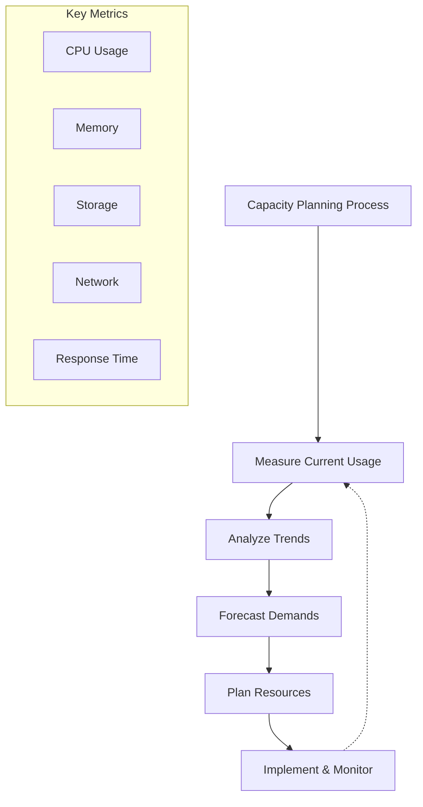

import Tabs from '@theme/Tabs';
import TabItem from '@theme/TabItem';

# 📊 Capacity Planning Guide

## Overview

Capacity planning is the process of determining and planning the system resources required to meet future demands. Think of it like planning a city's infrastructure: you need to predict population growth, traffic patterns, and utility usage to ensure the city can handle future demands without wasting resources on overbuilding.



## 🔑 Key Concepts

### 1. Resource Metrics
- CPU Utilization
- Memory Usage
- Storage Capacity
- Network Bandwidth
- Response Times

### 2. Planning Horizons
- Short-term (1-3 months)
- Medium-term (3-12 months)
- Long-term (1+ years)

### 3. Planning Methods
- Trend Analysis
- Predictive Modeling
- Workload Analysis
- Performance Modeling

## 💻 Implementation

### Capacity Monitoring System

<Tabs>
  <TabItem value="java" label="Java">
```java
import java.util.concurrent.ScheduledExecutorService;
import java.util.concurrent.ScheduledFuture;
import java.util.concurrent.TimeUnit;
import java.util.ArrayList;
import java.util.List;

public class CapacityMonitor {
private final List<MetricCollector> collectors;
private final ScheduledExecutorService scheduler;
private final MetricStorage storage;

    public CapacityMonitor(ScheduledExecutorService scheduler, MetricStorage storage) {
        this.collectors = new ArrayList<>();
        this.scheduler = scheduler;
        this.storage = storage;
    }
    
    public void addCollector(MetricCollector collector) {
        collectors.add(collector);
    }
    
    public void startMonitoring(long period, TimeUnit unit) {
        for (MetricCollector collector : collectors) {
            scheduler.scheduleAtFixedRate(
                () -> collectAndStore(collector),
                0,
                period,
                unit
            );
        }
    }
    
    private void collectAndStore(MetricCollector collector) {
        try {
            MetricData data = collector.collect();
            storage.store(data);
            
            if (data.getValue() > data.getThreshold()) {
                handleThresholdExceeded(data);
            }
        } catch (Exception e) {
            // Handle exception
        }
    }
    
    private void handleThresholdExceeded(MetricData data) {
        // Implement threshold handling logic
        notifyAdministrators(data);
        triggerScaling(data);
    }
    
    public CapacityForecast generateForecast(String metricType, int daysAhead) {
        List<MetricData> historicalData = storage.getHistoricalData(metricType);
        return new CapacityForecast(historicalData, daysAhead);
    }
}

interface MetricCollector {
MetricData collect();
}

class MetricData {
private String type;
private double value;
private double threshold;
private long timestamp;

    // Constructor and getters/setters
}

class CapacityForecast {
private List<MetricData> predictions;
private double confidence;

    // Constructor and methods
}
```
  </TabItem>
  <TabItem value="go" label="Go">
```go
package main

import (
    "sync"
    "time"
)

type MetricData struct {
    Type      string
    Value     float64
    Threshold float64
    Timestamp time.Time
}

type MetricCollector interface {
    Collect() (MetricData, error)
}

type CapacityMonitor struct {
    collectors []MetricCollector
    storage    MetricStorage
    stopChan   chan struct{}
    wg         sync.WaitGroup
}

func NewCapacityMonitor(storage MetricStorage) *CapacityMonitor {
    return &CapacityMonitor{
        collectors: make([]MetricCollector, 0),
        storage:    storage,
        stopChan:   make(chan struct{}),
    }
}

func (cm *CapacityMonitor) AddCollector(collector MetricCollector) {
    cm.collectors = append(cm.collectors, collector)
}

func (cm *CapacityMonitor) StartMonitoring(period time.Duration) {
    for _, collector := range cm.collectors {
        cm.wg.Add(1)
        go cm.monitorMetric(collector, period)
    }
}

func (cm *CapacityMonitor) monitorMetric(collector MetricCollector, period time.Duration) {
    defer cm.wg.Done()
    ticker := time.NewTicker(period)
    defer ticker.Stop()

    for {
        select {
        case <-ticker.C:
            cm.collectAndStore(collector)
        case <-cm.stopChan:
            return
        }
    }
}

func (cm *CapacityMonitor) collectAndStore(collector MetricCollector) {
    data, err := collector.Collect()
    if err != nil {
        // Handle error
        return
    }

    err = cm.storage.Store(data)
    if err != nil {
        // Handle error
        return
    }

    if data.Value > data.Threshold {
        cm.handleThresholdExceeded(data)
    }
}

func (cm *CapacityMonitor) handleThresholdExceeded(data MetricData) {
    // Implement threshold handling logic
    cm.notifyAdministrators(data)
    cm.triggerScaling(data)
}

func (cm *CapacityMonitor) GenerateForecast(metricType string, daysAhead int) (*CapacityForecast, error) {
    historicalData, err := cm.storage.GetHistoricalData(metricType)
    if err != nil {
        return nil, err
    }
    return NewCapacityForecast(historicalData, daysAhead), nil
}

type CapacityForecast struct {
    Predictions []MetricData
    Confidence  float64
}

func NewCapacityForecast(historicalData []MetricData, daysAhead int) *CapacityForecast {
    // Implement forecasting logic
    return &CapacityForecast{
        Predictions: make([]MetricData, daysAhead),
        Confidence:  calculateConfidence(historicalData),
    }
}
```
  </TabItem>
</Tabs>

## 🤝 Related Patterns

1. **Throttling Pattern**
    - Controls resource consumption
    - Prevents system overload
    - Complements capacity planning

2. **Queue-Based Load Leveling**
    - Smooths out workload spikes
    - Helps in capacity estimation
    - Improves resource utilization

3. **Circuit Breaker Pattern**
    - Prevents system overload
    - Helps maintain stability
    - Supports capacity management

## ⚙️ Best Practices

### Configuration
- Set clear monitoring intervals
- Define appropriate thresholds
- Configure alerting rules
- Implement automation

### Monitoring
- Track all critical metrics
- Use historical data analysis
- Monitor trends and patterns
- Implement predictive analytics

### Testing
- Load testing scenarios
- Capacity validation
- Performance benchmarking
- Stress testing

## 🚫 Common Pitfalls

1. **Inadequate Data Collection**
    - Missing critical metrics
    - Insufficient history
    - Solution: Comprehensive monitoring

2. **Poor Forecasting**
    - Ignoring seasonal patterns
    - Over-simplifying trends
    - Solution: Advanced analytics

3. **Reactive Planning**
    - Late response to needs
    - Crisis management
    - Solution: Proactive monitoring

## 🎯 Use Cases

### 1. Cloud Infrastructure
- Resource allocation
- Cost optimization
- Performance management
- Scaling decisions

### 2. Database Systems
- Storage planning
- Query performance
- Backup capacity
- Replication needs

### 3. Microservices
- Container sizing
- Service scaling
- Resource allocation
- Network capacity

## 🔍 Deep Dive Topics

### Thread Safety
- Concurrent monitoring
- Resource locking
- Data consistency
- Race condition prevention

### Distributed Systems
- Cross-node monitoring
- Aggregated metrics
- Network planning
- Data replication

### Performance
- Response time analysis
- Resource utilization
- Throughput planning
- Bottleneck identification

## 📚 Additional Resources

### Documentation
- [AWS Capacity Planning](https://aws.amazon.com/blogs/architecting/capacity-planning-guidelines/)
- [Google Cloud Capacity Planning](https://cloud.google.com/architecture/capacity-planning)
- [Microsoft Azure Capacity Planning](https://docs.microsoft.com/en-us/azure/architecture/framework/scalability/capacity-planning)

### Tools
- Monitoring: Prometheus, Grafana
- Analytics: Elasticsearch, Kibana
- Testing: Apache JMeter, K6
- Forecasting: Prophet, TensorFlow

## ❓ FAQs

### How far ahead should I plan?
- Short-term: 3-6 months
- Medium-term: 6-12 months
- Long-term: 1-3 years
- Depends on business growth

### What metrics are most important?
- CPU utilization
- Memory usage
- Storage capacity
- Network bandwidth
- Response times
- Error rates

### How often should I review capacity?
- Weekly for critical systems
- Monthly for normal operations
- Quarterly for long-term planning
- Immediately after incidents

### How do I handle unexpected growth?
- Maintain buffer capacity
- Use auto-scaling
- Have emergency procedures
- Monitor leading indicators
