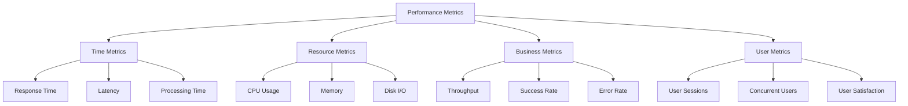

import Tabs from '@theme/Tabs';
import TabItem from '@theme/TabItem';

# 📊 Performance Metrics Guide

## Overview

Performance metrics are quantifiable measures that assess a system's behavior, efficiency, and health. Think of them as your system's vital signs - just like a doctor monitors heart rate, blood pressure, and temperature to assess a patient's health, engineers monitor response time, throughput, and resource utilization to evaluate system performance.



## 🔑 Key Concepts

### 1. Time-Based Metrics
- Response Time
- Latency
- Processing Time
- Time to First Byte (TTFB)
- Time to Interactive (TTI)

### 2. Resource Metrics
- CPU Utilization
- Memory Usage
- Disk I/O
- Network Throughput
- Cache Hit Ratio

### 3. Business Metrics
- Requests per Second (RPS)
- Transactions per Second (TPS)
- Error Rate
- Success Rate
- Availability

## 💻 Implementation

### Performance Metrics Collector

<Tabs>
  <TabItem value="java" label="Java">
```java
import java.util.concurrent.ConcurrentHashMap;
import java.util.concurrent.atomic.AtomicLong;
import java.time.Instant;
import java.util.Map;

public class PerformanceMetricsCollector {
private final ConcurrentHashMap<String, MetricData> metrics;
private final AtomicLong requestCount;
private final AtomicLong errorCount;

    public PerformanceMetricsCollector() {
        this.metrics = new ConcurrentHashMap<>();
        this.requestCount = new AtomicLong(0);
        this.errorCount = new AtomicLong(0);
    }
    
    public void recordResponseTime(String endpoint, long responseTime) {
        metrics.compute(endpoint, (key, existingData) -> {
            if (existingData == null) {
                return new MetricData(responseTime);
            }
            existingData.updateWith(responseTime);
            return existingData;
        });
    }
    
    public void incrementRequestCount() {
        requestCount.incrementAndGet();
    }
    
    public void incrementErrorCount() {
        errorCount.incrementAndGet();
    }
    
    public double getErrorRate() {
        long totalRequests = requestCount.get();
        return totalRequests == 0 ? 0 : 
            (double) errorCount.get() / totalRequests * 100;
    }
    
    public MetricsSummary getMetricsSummary(String endpoint) {
        MetricData data = metrics.get(endpoint);
        if (data == null) {
            return new MetricsSummary();
        }
        
        return new MetricsSummary(
            data.getAverageResponseTime(),
            data.getMinResponseTime(),
            data.getMaxResponseTime(),
            data.getRequestCount(),
            getErrorRate()
        );
    }
    
    static class MetricData {
        private final AtomicLong totalTime;
        private final AtomicLong count;
        private final AtomicLong minTime;
        private final AtomicLong maxTime;
        
        public MetricData(long initialTime) {
            this.totalTime = new AtomicLong(initialTime);
            this.count = new AtomicLong(1);
            this.minTime = new AtomicLong(initialTime);
            this.maxTime = new AtomicLong(initialTime);
        }
        
        public void updateWith(long newTime) {
            totalTime.addAndGet(newTime);
            count.incrementAndGet();
            updateMin(newTime);
            updateMax(newTime);
        }
        
        private void updateMin(long newTime) {
            minTime.updateAndGet(current -> Math.min(current, newTime));
        }
        
        private void updateMax(long newTime) {
            maxTime.updateAndGet(current -> Math.max(current, newTime));
        }
        
        // Getters
        public double getAverageResponseTime() {
            return (double) totalTime.get() / count.get();
        }
        
        public long getMinResponseTime() {
            return minTime.get();
        }
        
        public long getMaxResponseTime() {
            return maxTime.get();
        }
        
        public long getRequestCount() {
            return count.get();
        }
    }
}
```
  </TabItem>
  <TabItem value="go" label="Go">
```go
package main

import (
    "sync"
    "sync/atomic"
    "time"
)

type MetricData struct {
    totalTime int64
    count     int64
    minTime   int64
    maxTime   int64
    mu        sync.RWMutex
}

type PerformanceMetricsCollector struct {
    metrics      map[string]*MetricData
    requestCount int64
    errorCount   int64
    mu          sync.RWMutex
}

func NewPerformanceMetricsCollector() *PerformanceMetricsCollector {
    return &PerformanceMetricsCollector{
        metrics: make(map[string]*MetricData),
    }
}

func (pmc *PerformanceMetricsCollector) RecordResponseTime(endpoint string, responseTime int64) {
    pmc.mu.Lock()
    defer pmc.mu.Unlock()

    if data, exists := pmc.metrics[endpoint]; exists {
        data.updateWith(responseTime)
    } else {
        pmc.metrics[endpoint] = &MetricData{
            totalTime: responseTime,
            count:     1,
            minTime:   responseTime,
            maxTime:   responseTime,
        }
    }
}

func (pmc *PerformanceMetricsCollector) IncrementRequestCount() {
    atomic.AddInt64(&pmc.requestCount, 1)
}

func (pmc *PerformanceMetricsCollector) IncrementErrorCount() {
    atomic.AddInt64(&pmc.errorCount, 1)
}

func (pmc *PerformanceMetricsCollector) GetErrorRate() float64 {
    totalRequests := atomic.LoadInt64(&pmc.requestCount)
    if totalRequests == 0 {
        return 0
    }
    errors := atomic.LoadInt64(&pmc.errorCount)
    return float64(errors) / float64(totalRequests) * 100
}

type MetricsSummary struct {
    AverageResponseTime float64
    MinResponseTime     int64
    MaxResponseTime     int64
    RequestCount        int64
    ErrorRate          float64
}

func (pmc *PerformanceMetricsCollector) GetMetricsSummary(endpoint string) MetricsSummary {
    pmc.mu.RLock()
    defer pmc.mu.RUnlock()

    data, exists := pmc.metrics[endpoint]
    if !exists {
        return MetricsSummary{}
    }

    data.mu.RLock()
    defer data.mu.RUnlock()

    return MetricsSummary{
        AverageResponseTime: float64(data.totalTime) / float64(data.count),
        MinResponseTime:     data.minTime,
        MaxResponseTime:     data.maxTime,
        RequestCount:        data.count,
        ErrorRate:          pmc.GetErrorRate(),
    }
}

func (md *MetricData) updateWith(newTime int64) {
    md.mu.Lock()
    defer md.mu.Unlock()

    md.totalTime += newTime
    md.count++
    if newTime < md.minTime {
        md.minTime = newTime
    }
    if newTime > md.maxTime {
        md.maxTime = newTime
    }
}
```
  </TabItem>
</Tabs>

## 🤝 Related Patterns

1. **Circuit Breaker Pattern**
    - Uses performance metrics for decisions
    - Prevents system overload
    - Monitors failure rates

2. **Bulkhead Pattern**
    - Isolates performance issues
    - Resource usage monitoring
    - Failure containment

3. **Throttling Pattern**
    - Controls request rates
    - Uses metrics for decisions
    - Prevents overload

## ⚙️ Best Practices

### Collection
- Use atomic operations
- Implement thread-safe collectors
- Minimize overhead
- Sample when appropriate

### Monitoring
- Set proper baselines
- Use percentiles, not averages
- Monitor trends
- Set up alerts

### Analysis
- Correlate metrics
- Use statistical analysis
- Track historical data
- Identify patterns

## 🚫 Common Pitfalls

1. **Metric Overload**
    - Too many metrics
    - Analysis paralysis
    - Solution: Focus on key indicators

2. **Poor Sampling**
    - Inaccurate data
    - Missing important events
    - Solution: Proper sampling strategies

3. **Wrong Aggregation**
    - Using averages instead of percentiles
    - Missing outliers
    - Solution: Use appropriate statistical methods

## 🎯 Use Cases

### 1. E-commerce Platform
- Response time tracking
- Order processing metrics
- Payment gateway performance
- Inventory system metrics

### 2. Video Streaming Service
- Buffering metrics
- Quality switches
- Playback errors
- Bandwidth usage

### 3. Financial Trading System
- Transaction latency
- Order execution time
- System throughput
- Error rates

## 🔍 Deep Dive Topics

### Thread Safety
- Atomic operations
- Lock strategies
- Concurrent collections
- Race condition prevention

### Distributed Systems
- Cross-node metrics
- Network latency
- Clock synchronization
- Aggregation strategies

### Performance
- Collection overhead
- Storage optimization
- Query performance
- Real-time analysis

## 📚 Additional Resources

### Documentation
- [OpenTelemetry Metrics](https://opentelemetry.io/docs/concepts/signals/metrics/)
- [Prometheus Best Practices](https://prometheus.io/docs/practices/naming/)
- [Grafana Metrics](https://grafana.com/docs/grafana/latest/basics/timeseries/)

### Tools
- Metrics Collection: Prometheus, StatsD
- Visualization: Grafana, Kibana
- APM: New Relic, Datadog
- Tracing: Jaeger, Zipkin

## ❓ FAQs

### Which metrics should I collect first?
- Response time
- Error rate
- Resource utilization
- Throughput
- User satisfaction metrics

### How often should I collect metrics?
- Real-time for critical metrics
- Every minute for important metrics
- Every 5-15 minutes for general metrics
- Hourly for long-term trends

### How long should I store metrics?
- Real-time: 24 hours
- High resolution: 7-30 days
- Aggregated: 6-12 months
- Historical: 1+ years

### How do I handle metric spikes?
- Set up proper alerting
- Use percentiles
- Implement automatic scaling
- Have incident response plans