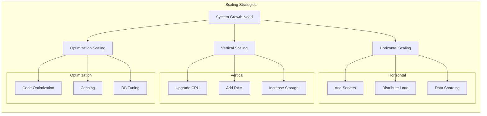

import Tabs from '@theme/Tabs';
import TabItem from '@theme/TabItem';

# 🚀 Scaling Strategies Guide

## Overview

Scaling strategies are systematic approaches to handle growing system demands. Think of it like managing a growing restaurant chain: you can either make each kitchen bigger (vertical scaling), open new locations (horizontal scaling), or optimize your cooking process (optimization scaling).



## 🔑 Key Concepts

### 1. Vertical Scaling (Scale Up)
- Resource Enhancement
   - CPU upgrades
   - RAM increases
   - Storage expansion
   - Network capacity improvement

### 2. Horizontal Scaling (Scale Out)
- Infrastructure Expansion
   - Server addition
   - Load distribution
   - Data sharding
   - Region replication

### 3. Optimization Scaling
- System Optimization
   - Code efficiency
   - Caching implementation
   - Database tuning
   - Resource utilization

## 💻 Implementation

### Vertical Scaling Implementation

<Tabs>
  <TabItem value="java" label="Java">
```java
import java.util.concurrent.ExecutorService;
import java.util.concurrent.Executors;

public class VerticalScaling {
private final ExecutorService executor;
private final int maxThreads;
private final int maxMemory;

    public VerticalScaling(int maxThreads, int maxMemory) {
        this.maxThreads = maxThreads;
        this.maxMemory = maxMemory;
        this.executor = Executors.newFixedThreadPool(maxThreads);
    }

    public void scaleCompute() {
        // Scale compute resources
        Runtime runtime = Runtime.getRuntime();
        runtime.gc(); // Request garbage collection
        long maxMemory = runtime.maxMemory();
        
        // Adjust thread pool if needed
        if (this.executor.isTerminated()) {
            return;
        }
        
        // Add more compute-intensive tasks
        for (int i = 0; i < maxThreads; i++) {
            executor.submit(this::processTask);
        }
    }

    private void processTask() {
        // Simulate compute-intensive task
        try {
            Thread.sleep(100);
        } catch (InterruptedException e) {
            Thread.currentThread().interrupt();
        }
    }

    public void shutdown() {
        executor.shutdown();
    }
}
```
  </TabItem>
  <TabItem value="go" label="Go">
```go
package main

import (
    "runtime"
    "sync"
)

type VerticalScaling struct {
    maxWorkers int
    maxMemory  int64
    workPool   chan struct{}
    wg         sync.WaitGroup
}

func NewVerticalScaling(maxWorkers int, maxMemory int64) *VerticalScaling {
    return &VerticalScaling{
        maxWorkers: maxWorkers,
        maxMemory:  maxMemory,
        workPool:   make(chan struct{}, maxWorkers),
    }
}

func (vs *VerticalScaling) ScaleCompute() {
    // Set max processors
    runtime.GOMAXPROCS(vs.maxWorkers)

    // Scale memory
    var mem runtime.MemStats
    runtime.ReadMemStats(&mem)

    // Process tasks using worker pool
    for i := 0; i < vs.maxWorkers; i++ {
        vs.wg.Add(1)
        go vs.processTask()
    }
}

func (vs *VerticalScaling) processTask() {
    defer vs.wg.Done()
    vs.workPool <- struct{}{} // Acquire token
    defer func() { <-vs.workPool }() // Release token

    // Simulate work
    runtime.Gosched()
}

func (vs *VerticalScaling) Shutdown() {
    vs.wg.Wait()
    close(vs.workPool)
}
```
  </TabItem>
</Tabs>

### Horizontal Scaling Implementation

<Tabs>
  <TabItem value="java" label="Java">
```java
import java.util.ArrayList;
import java.util.List;
import java.util.concurrent.atomic.AtomicInteger;

public class HorizontalScaling {
private final List<Server> servers;
private final AtomicInteger currentServerIndex;
private final int maxServers;

    public HorizontalScaling(int initialServers, int maxServers) {
        this.servers = new ArrayList<>();
        this.currentServerIndex = new AtomicInteger(0);
        this.maxServers = maxServers;

        for (int i = 0; i < initialServers; i++) {
            addServer();
        }
    }

    public void addServer() {
        if (servers.size() < maxServers) {
            Server server = new Server(servers.size() + 1);
            servers.add(server);
        }
    }

    public void removeServer() {
        if (!servers.isEmpty()) {
            Server server = servers.remove(servers.size() - 1);
            server.shutdown();
        }
    }

    public Server getNextServer() {
        int index = currentServerIndex.getAndIncrement() % servers.size();
        return servers.get(index);
    }

    static class Server {
        private final int id;
        private boolean active;

        public Server(int id) {
            this.id = id;
            this.active = true;
        }

        public void shutdown() {
            this.active = false;
        }
    }
}
```
  </TabItem>
  <TabItem value="go" label="Go">
```go
package main

import (
    "sync"
    "sync/atomic"
)

type Server struct {
    id     int
    active bool
    mu     sync.RWMutex
}

type HorizontalScaling struct {
    servers          []*Server
    currentIndex    uint64
    maxServers      int
    mu              sync.RWMutex
}

func NewHorizontalScaling(initialServers, maxServers int) *HorizontalScaling {
    hs := &HorizontalScaling{
        servers:     make([]*Server, 0, maxServers),
        maxServers:  maxServers,
    }

    for i := 0; i < initialServers; i++ {
        hs.AddServer()
    }

    return hs
}

func (hs *HorizontalScaling) AddServer() error {
    hs.mu.Lock()
    defer hs.mu.Unlock()

    if len(hs.servers) >= hs.maxServers {
        return fmt.Errorf("max servers limit reached")
    }

    server := &Server{
        id:     len(hs.servers) + 1,
        active: true,
    }
    hs.servers = append(hs.servers, server)
    return nil
}

func (hs *HorizontalScaling) RemoveServer() error {
    hs.mu.Lock()
    defer hs.mu.Unlock()

    if len(hs.servers) == 0 {
        return fmt.Errorf("no servers to remove")
    }

    lastIdx := len(hs.servers) - 1
    hs.servers[lastIdx].Shutdown()
    hs.servers = hs.servers[:lastIdx]
    return nil
}

func (hs *HorizontalScaling) GetNextServer() *Server {
    hs.mu.RLock()
    defer hs.mu.RUnlock()

    if len(hs.servers) == 0 {
        return nil
    }

    idx := atomic.AddUint64(&hs.currentIndex, 1)
    return hs.servers[idx%uint64(len(hs.servers))]
}

func (s *Server) Shutdown() {
    s.mu.Lock()
    defer s.mu.Unlock()
    s.active = false
}
```
  </TabItem>
</Tabs>

## 🤝 Related Patterns

1. **Circuit Breaker Pattern**
   - Prevents system overload
   - Works with both scaling types
   - Handles failure gracefully

2. **Saga Pattern**
   - Manages distributed transactions
   - Supports horizontal scaling
   - Ensures data consistency

3. **CQRS Pattern**
   - Separates read/write operations
   - Enables independent scaling
   - Optimizes resource usage

## ⚙️ Best Practices

### Configuration
- Use configuration management tools
- Implement feature flags
- Maintain scaling thresholds
- Document scaling decisions

### Monitoring
- Track system metrics
- Monitor resource usage
- Implement alerts
- Use distributed tracing

### Testing
- Load testing
- Stress testing
- Failover testing
- Performance testing

## 🚫 Common Pitfalls

1. **Over-scaling**
   - Unnecessary resource allocation
   - Increased costs
   - Solution: Set clear scaling metrics

2. **Under-scaling**
   - Performance bottlenecks
   - System crashes
   - Solution: Regular capacity planning

3. **Poor Monitoring**
   - Missed scaling triggers
   - Late response to issues
   - Solution: Comprehensive monitoring

## 🎯 Use Cases

### 1. E-commerce Platform
- Holiday season traffic spikes
- Flash sales handling
- Inventory management
- Order processing

### 2. Video Streaming Service
- Peak viewing hours
- Content delivery
- User authentication
- Quality adaptation

### 3. Gaming Platform
- Player matchmaking
- Game state management
- Real-time communication
- Leaderboard updates

## 🔍 Deep Dive Topics

### Thread Safety in Scaling
- Concurrency management
- Resource locking
- State synchronization
- Race condition prevention

### Distributed Systems
- Data consistency
- Network latency
- Failover strategies
- Service discovery

### Performance Optimization
- Resource utilization
- Response time
- Throughput metrics
- Cost efficiency

## 📚 Additional Resources

### Documentation
- [AWS Auto Scaling](https://aws.amazon.com/autoscaling/)
- [Kubernetes Scaling](https://kubernetes.io/docs/concepts/workloads/controllers/replicaset/)
- [Azure Scale Sets](https://docs.microsoft.com/en-us/azure/virtual-machine-scale-sets/)

### Tools
- Infrastructure: Terraform, Ansible
- Monitoring: Prometheus, Grafana
- Testing: JMeter, K6
- Automation: Jenkins, GitHub Actions

## ❓ FAQs

### When should I choose vertical scaling?
- Single application optimization needed
- Simple architecture preferred
- Budget allows for hardware upgrades
- Short-term solution required

### How do I determine scaling thresholds?
- Monitor current usage patterns
- Analyze historical data
- Set buffer for unexpected spikes
- Consider cost constraints

### What metrics should I monitor?
- CPU utilization
- Memory usage
- Response times
- Error rates
- Network throughput

### How to handle database scaling?
- Consider read replicas
- Implement sharding
- Use connection pooling
- Optimize queries
