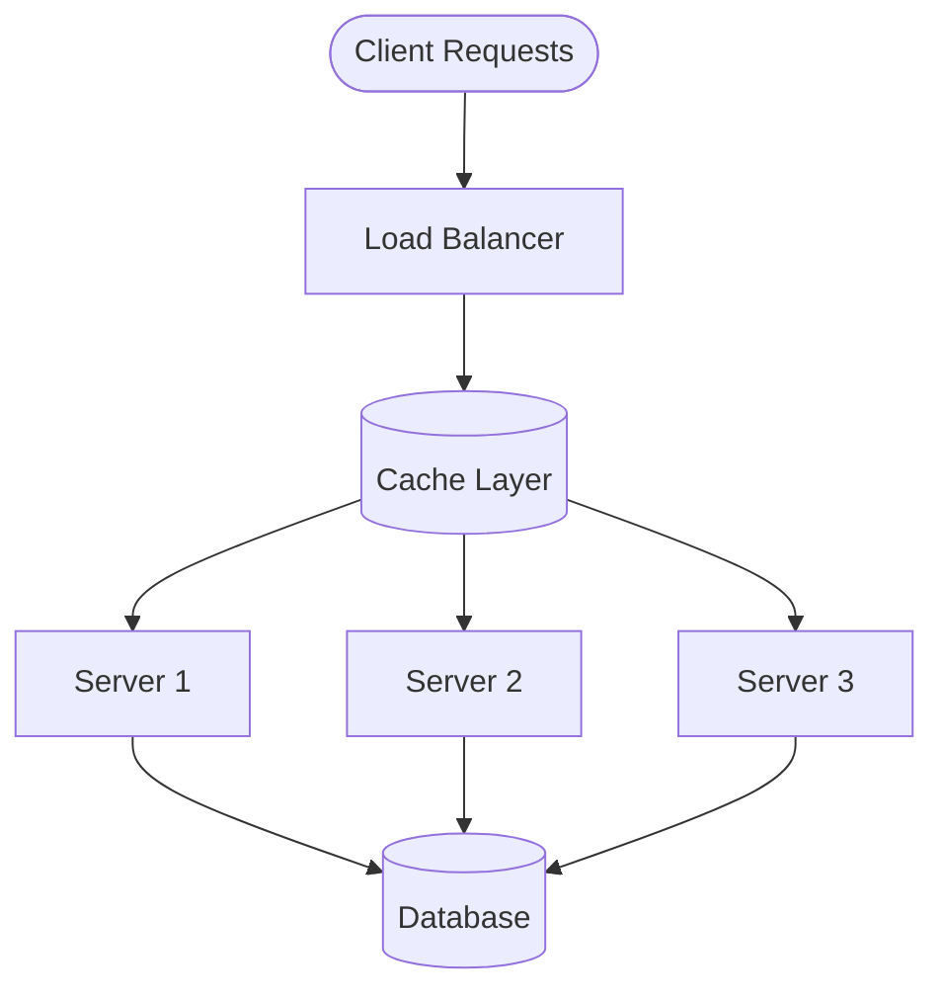

import Tabs from '@theme/Tabs';
import TabItem from '@theme/TabItem';

# 🚀 Introduction to System Scalability

## Overview

Scalability is a system's ability to handle growing workloads by adding resources effectively. Think of it like a restaurant: during peak hours, you can either make your kitchen bigger (vertical scaling), add more kitchen locations (horizontal scaling), or optimize your cooking process (caching).



## 🔑 Key Concepts

### 1. Scaling Strategies

#### Vertical Scaling (Scale Up) ⬆️
- Adding more power to existing machines
- Increasing CPU, RAM, or storage
- Simpler but has hardware limits

#### Horizontal Scaling (Scale Out) ➡️
- Adding more machines to your pool of resources
- Distributing load across multiple servers
- More complex but highly scalable

#### Caching Strategies 💾
- In-memory caching
- Distributed caching
- CDN caching
- Database caching

### 2. Load Balancing 🔄

Load balancing distributes incoming traffic across multiple servers to ensure no single server bears too much load.

Common algorithms:
- Round Robin
- Least Connections
- IP Hash
- Weighted Round Robin

## 💻 Implementation

### Basic Caching Implementation

<Tabs>
  <TabItem value="java" label="Java">
```java
import org.springframework.cache.annotation.Cacheable;
import org.springframework.stereotype.Service;

@Service
public class UserService {
private final UserRepository userRepository;

    public UserService(UserRepository userRepository) {
        this.userRepository = userRepository;
    }
    
    @Cacheable(value = "users", key = "#id")
    public User getUserById(Long id) {
        // This result will be cached
        return userRepository.findById(id)
            .orElseThrow(() -> new UserNotFoundException(id));
    }
}
```
  </TabItem>
  <TabItem value="go" label="Go">
```go
package main

import (
    "sync"
    "time"
)

type Cache struct {
    mu    sync.RWMutex
    items map[string]Item
}

type Item struct {
    Value      interface{}
    Expiration int64
}

func NewCache() *Cache {
    return &Cache{
        items: make(map[string]Item),
    }
}

func (c *Cache) Set(key string, value interface{}, duration time.Duration) {
    c.mu.Lock()
    defer c.mu.Unlock()

    c.items[key] = Item{
        Value:      value,
        Expiration: time.Now().Add(duration).UnixNano(),
    }
}

func (c *Cache) Get(key string) (interface{}, bool) {
    c.mu.RLock()
    defer c.mu.RUnlock()

    item, found := c.items[key]
    if !found {
        return nil, false
    }

    if time.Now().UnixNano() > item.Expiration {
        return nil, false
    }

    return item.Value, true
}
```
  </TabItem>
</Tabs>

### Load Balancer Implementation

<Tabs>
  <TabItem value="java" label="Java">
```java
import java.util.List;
import java.util.concurrent.atomic.AtomicInteger;

public class LoadBalancer {
private final List<Server> servers;
private final AtomicInteger currentIndex;

    public LoadBalancer(List<Server> servers) {
        this.servers = servers;
        this.currentIndex = new AtomicInteger(0);
    }

    // Round-robin load balancing
    public Server getNextServer() {
        int index = currentIndex.getAndIncrement() % servers.size();
        return servers.get(index);
    }

    public void handleRequest(Request request) {
        Server server = getNextServer();
        server.process(request);
    }
}
```
  </TabItem>
  <TabItem value="go" label="Go">
```go
package main

import (
    "sync"
    "sync/atomic"
)

type LoadBalancer struct {
    servers     []Server
    currentIdx  uint64
    mutex       sync.RWMutex
}

func NewLoadBalancer(servers []Server) *LoadBalancer {
    return &LoadBalancer{
        servers: servers,
    }
}

// Round-robin load balancing
func (lb *LoadBalancer) GetNextServer() Server {
    idx := atomic.AddUint64(&lb.currentIdx, 1)
    return lb.servers[idx%uint64(len(lb.servers))]
}

func (lb *LoadBalancer) HandleRequest(request Request) {
    server := lb.GetNextServer()
    server.Process(request)
}
```
  </TabItem>
</Tabs>

## 🤝 Related Patterns

1. **Circuit Breaker Pattern**
   - Prevents cascading failures
   - Complements load balancing
   - Essential for distributed systems

2. **Bulkhead Pattern**
   - Isolates components
   - Prevents resource exhaustion
   - Works with horizontal scaling

3. **CQRS Pattern**
   - Separates read and write operations
   - Enables independent scaling
   - Complements caching strategies

## ⚙️ Best Practices

### Caching
- Use appropriate cache invalidation strategies
- Implement cache warming
- Monitor cache hit rates
- Use multiple cache layers

### Load Balancing
- Implement health checks
- Use sticky sessions when needed
- Configure proper timeouts
- Monitor server health

### Scaling
- Start with vertical scaling for simplicity
- Move to horizontal scaling when needed
- Automate scaling decisions
- Use containerization

## 🚫 Common Pitfalls

1. **Cache-Related Issues**
   - Cache invalidation errors
   - Cache stampede
   - Over-caching
   - Solution: Implement proper TTL and invalidation strategies

2. **Load Balancing Issues**
   - Uneven load distribution
   - Session persistence problems
   - Timeout misconfiguration
   - Solution: Regular monitoring and adjustment

3. **Scaling Issues**
   - Premature optimization
   - Not considering data consistency
   - Ignoring network latency
   - Solution: Start simple, scale based on metrics

## 🎯 Use Cases

### 1. E-commerce Platform
- High traffic during sales
- Product catalog caching
- Session management
- Order processing scaling

### 2. Social Media Application
- Content delivery
- Real-time updates
- User data caching
- Media processing

### 3. Financial System
- Transaction processing
- Real-time reporting
- Data consistency
- High availability requirements

## 🔍 Deep Dive Topics

### Thread Safety
- Concurrent access handling
- Lock mechanisms
- Atomic operations
- Thread pool management

### Distributed Systems
- CAP theorem implications
- Consistency patterns
- Network partitioning
- Data replication

### Performance
- Response time optimization
- Resource utilization
- Monitoring metrics
- Bottleneck identification

## 📚 Additional Resources

### Documentation
- [AWS Well-Architected Framework](https://aws.amazon.com/architecture/well-architected/)
- [Microsoft Azure Architecture Center](https://docs.microsoft.com/en-us/azure/architecture/)
- [Google Cloud Architecture Framework](https://cloud.google.com/architecture/framework)

### Tools
- Monitoring: Prometheus, Grafana
- Caching: Redis, Memcached
- Load Balancing: HAProxy, NGINX
- Containerization: Docker, Kubernetes

## ❓ FAQs

### When should I start scaling?
Monitor your system metrics and start scaling when you observe:
- High CPU/memory utilization
- Increased response times
- Growing request queue

### Vertical vs Horizontal scaling?
- Start with vertical scaling for simplicity
- Move to horizontal scaling when:
   - Reaching hardware limits
   - Need for high availability
   - Cost optimization required

### Which caching strategy should I use?
Depends on your use case:
- In-memory cache for frequent access
- Distributed cache for scalability
- CDN for static content
- Database cache for query optimization

### How to handle session persistence?
Options include:
- Sticky sessions
- Distributed session storage
- Token-based authentication
- Client-side storage