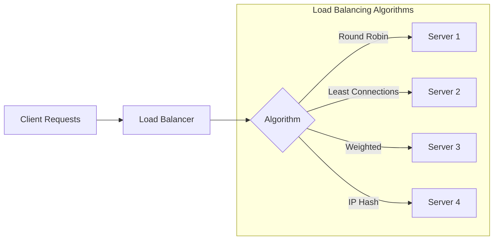

import Tabs from '@theme/Tabs';
import TabItem from '@theme/TabItem';

# ⚖️ Load Balancing Algorithms Guide

## Overview

Load balancing algorithms are methods to distribute incoming network traffic or workload across multiple servers. Think of it like a traffic controller at a busy intersection directing vehicles to different lanes to prevent congestion and ensure smooth flow.



## 🔑 Key Concepts

### 1. Core Algorithms
- Round Robin
- Weighted Round Robin
- Least Connections
- Weighted Least Connections
- IP Hash
- URL Hash
- Random
- Least Response Time

### 2. Key Components
- Algorithm Selector
- Health Checker
- Session Tracker
- Performance Monitor

### 3. States
- Server Available
- Server Overloaded
- Server Down
- Connection Active

## 💻 Implementation

### Load Balancing Algorithm Implementation

<Tabs>
  <TabItem value="java" label="Java">
```java
import java.util.List;
import java.util.Map;
import java.util.concurrent.ConcurrentHashMap;
import java.util.concurrent.atomic.AtomicInteger;
import java.security.MessageDigest;

public class LoadBalancer {
private final List<Server> servers;
private final LoadBalancingAlgorithm algorithm;
private final Map<String, Integer> serverConnections;
private final AtomicInteger roundRobinCounter;
private final Map<String, Server> ipHashMap;

    public LoadBalancer(List<Server> servers, LoadBalancingAlgorithm algorithm) {
        this.servers = servers;
        this.algorithm = algorithm;
        this.serverConnections = new ConcurrentHashMap<>();
        this.roundRobinCounter = new AtomicInteger(0);
        this.ipHashMap = new ConcurrentHashMap<>();
        
        // Initialize connection counter for each server
        servers.forEach(server -> serverConnections.put(server.getId(), 0));
    }

    public Server getNextServer(String clientIp) {
        switch (algorithm) {
            case ROUND_ROBIN:
                return getRoundRobinServer();
            case LEAST_CONNECTIONS:
                return getLeastConnectionsServer();
            case WEIGHTED_ROUND_ROBIN:
                return getWeightedRoundRobinServer();
            case IP_HASH:
                return getIpHashServer(clientIp);
            default:
                return getRandomServer();
        }
    }

    private Server getRoundRobinServer() {
        int index = roundRobinCounter.getAndIncrement() % servers.size();
        return servers.get(index);
    }

    private Server getLeastConnectionsServer() {
        return servers.stream()
            .filter(Server::isAvailable)
            .min((s1, s2) -> {
                int conn1 = serverConnections.getOrDefault(s1.getId(), 0);
                int conn2 = serverConnections.getOrDefault(s2.getId(), 0);
                return Integer.compare(conn1, conn2);
            })
            .orElseThrow(() -> new RuntimeException("No available servers"));
    }

    private Server getWeightedRoundRobinServer() {
        int totalWeight = servers.stream()
            .mapToInt(Server::getWeight)
            .sum();
            
        int position = roundRobinCounter.getAndIncrement() % totalWeight;
        int weightSum = 0;
        
        for (Server server : servers) {
            weightSum += server.getWeight();
            if (position < weightSum) {
                return server;
            }
        }
        
        return servers.get(0);
    }

    private Server getIpHashServer(String clientIp) {
        return ipHashMap.computeIfAbsent(clientIp, ip -> {
            try {
                MessageDigest md = MessageDigest.getInstance("MD5");
                byte[] digest = md.digest(ip.getBytes());
                int hash = Math.abs(ByteBuffer.wrap(digest).getInt());
                return servers.get(hash % servers.size());
            } catch (Exception e) {
                return getRandomServer();
            }
        });
    }

    private Server getRandomServer() {
        int index = ThreadLocalRandom.current().nextInt(servers.size());
        return servers.get(index);
    }

    public void incrementConnections(Server server) {
        serverConnections.computeIfPresent(server.getId(), (id, count) -> count + 1);
    }

    public void decrementConnections(Server server) {
        serverConnections.computeIfPresent(server.getId(), (id, count) -> Math.max(0, count - 1));
    }

    public enum LoadBalancingAlgorithm {
        ROUND_ROBIN,
        LEAST_CONNECTIONS,
        WEIGHTED_ROUND_ROBIN,
        IP_HASH,
        RANDOM
    }

    public static class Server {
        private final String id;
        private final int weight;
        private volatile boolean available;

        public Server(String id, int weight) {
            this.id = id;
            this.weight = weight;
            this.available = true;
        }

        // Getters and setters
    }
}
```
  </TabItem>
  <TabItem value="go" label="Go">
```go
package main

import (
    "crypto/md5"
    "encoding/binary"
    "math/rand"
    "sync"
    "sync/atomic"
)

type LoadBalancingAlgorithm int

const (
    RoundRobin LoadBalancingAlgorithm = iota
    LeastConnections
    WeightedRoundRobin
    IPHash
    Random
)

type Server struct {
    ID        string
    Weight    int
    Available bool
    mu        sync.RWMutex
}

type LoadBalancer struct {
    servers          []*Server
    algorithm        LoadBalancingAlgorithm
    connections     map[string]int64
    roundRobinCount uint64
    ipHashMap       map[string]*Server
    mu              sync.RWMutex
}

func NewLoadBalancer(servers []*Server, algorithm LoadBalancingAlgorithm) *LoadBalancer {
    lb := &LoadBalancer{
        servers:     servers,
        algorithm:   algorithm,
        connections: make(map[string]int64),
        ipHashMap:   make(map[string]*Server),
    }
    
    for _, server := range servers {
        lb.connections[server.ID] = 0
    }
    
    return lb
}

func (lb *LoadBalancer) GetNextServer(clientIP string) (*Server, error) {
    switch lb.algorithm {
    case RoundRobin:
        return lb.getRoundRobinServer()
    case LeastConnections:
        return lb.getLeastConnectionsServer()
    case WeightedRoundRobin:
        return lb.getWeightedRoundRobinServer()
    case IPHash:
        return lb.getIPHashServer(clientIP)
    default:
        return lb.getRandomServer()
    }
}

func (lb *LoadBalancer) getRoundRobinServer() (*Server, error) {
    count := atomic.AddUint64(&lb.roundRobinCount, 1)
    index := int(count % uint64(len(lb.servers)))
    return lb.servers[index], nil
}

func (lb *LoadBalancer) getLeastConnectionsServer() (*Server, error) {
    lb.mu.RLock()
    defer lb.mu.RUnlock()

    var selectedServer *Server
    minConnections := int64(^uint64(0) >> 1)

    for _, server := range lb.servers {
        server.mu.RLock()
        if server.Available {
            connections := lb.connections[server.ID]
            if connections < minConnections {
                minConnections = connections
                selectedServer = server
            }
        }
        server.mu.RUnlock()
    }

    if selectedServer == nil {
        return nil, errors.New("no available servers")
    }
    return selectedServer, nil
}

func (lb *LoadBalancer) getWeightedRoundRobinServer() (*Server, error) {
    lb.mu.RLock()
    defer lb.mu.RUnlock()

    totalWeight := 0
    for _, server := range lb.servers {
        totalWeight += server.Weight
    }

    count := atomic.AddUint64(&lb.roundRobinCount, 1)
    position := int(count % uint64(totalWeight))
    weightSum := 0

    for _, server := range lb.servers {
        weightSum += server.Weight
        if position < weightSum {
            return server, nil
        }
    }

    return lb.servers[0], nil
}

func (lb *LoadBalancer) getIPHashServer(clientIP string) (*Server, error) {
    lb.mu.RLock()
    if server, exists := lb.ipHashMap[clientIP]; exists {
        lb.mu.RUnlock()
        return server, nil
    }
    lb.mu.RUnlock()

    hash := md5.Sum([]byte(clientIP))
    index := int(binary.BigEndian.Uint32(hash[:4]) % uint32(len(lb.servers)))

    lb.mu.Lock()
    lb.ipHashMap[clientIP] = lb.servers[index]
    lb.mu.Unlock()

    return lb.servers[index], nil
}

func (lb *LoadBalancer) getRandomServer() (*Server, error) {
    index := rand.Intn(len(lb.servers))
    return lb.servers[index], nil
}

func (lb *LoadBalancer) IncrementConnections(server *Server) {
    lb.mu.Lock()
    defer lb.mu.Unlock()
    lb.connections[server.ID]++
}

func (lb *LoadBalancer) DecrementConnections(server *Server) {
    lb.mu.Lock()
    defer lb.mu.Unlock()
    if lb.connections[server.ID] > 0 {
        lb.connections[server.ID]--
    }
}
```
  </TabItem>
</Tabs>

## 🤝 Related Patterns

1. **Circuit Breaker**
   - Failure detection
   - Server protection
   - Automatic recovery

2. **Service Discovery**
   - Dynamic server registration
   - Health monitoring
   - Configuration updates

3. **Rate Limiting**
   - Traffic control
   - Server protection
   - Resource management

## ⚙️ Best Practices

### Configuration
- Set appropriate weights
- Configure health checks
- Define connection limits
- Implement failover

### Monitoring
- Track server health
- Monitor connections
- Watch response times
- Alert on failures

### Testing
- Load testing
- Failover testing
- Performance testing
- Algorithm validation

## 🚫 Common Pitfalls

1. **Sticky Sessions Issues**
   - Session persistence
   - Server imbalance
   - Solution: Session affinity

2. **Algorithm Mismatch**
   - Wrong choice for workload
   - Poor performance
   - Solution: Profile traffic

3. **Health Check Problems**
   - False positives
   - Slow detection
   - Solution: Multiple checks

## 🎯 Use Cases

### 1. Web Applications
- HTTP traffic
- API requests
- Static content
- Dynamic content

### 2. Database Clusters
- Read replicas
- Write distribution
- Query routing
- Connection pooling

### 3. Microservices
- Service routing
- API gateway
- Request distribution
- Service mesh

## 🔍 Deep Dive Topics

### Thread Safety
- Concurrent requests
- State management
- Lock strategies
- Atomic operations

### Distributed Systems
- Cluster awareness
- Data consistency
- Network partitioning
- Cross-region balancing

### Performance
- Algorithm efficiency
- Response time
- Resource utilization
- Throughput optimization

## 📚 Additional Resources

### Documentation
- [NGINX Load Balancing](https://docs.nginx.com/nginx/admin-guide/load-balancer/http-load-balancer/)
- [HAProxy Configuration](http://docs.haproxy.org/2.4/configuration.html)
- [AWS ELB](https://docs.aws.amazon.com/elasticloadbalancing/)

### Tools
- NGINX
- HAProxy
- AWS ELB
- Traefik

## ❓ FAQs

### Which algorithm should I choose?
- Round Robin for simple cases
- Least Connections for varying loads
- IP Hash for session persistence
- Weighted for heterogeneous servers

### How to handle server failures?
- Implement health checks
- Use circuit breakers
- Configure failover
- Monitor recovery

### What about session persistence?
- Use IP hashing
- Configure sticky sessions
- Implement distributed sessions
- Consider client affinity

### How to scale load balancers?
- Use DNS round-robin
- Implement HA pairs
- Consider cloud services
- Monitor capacity

