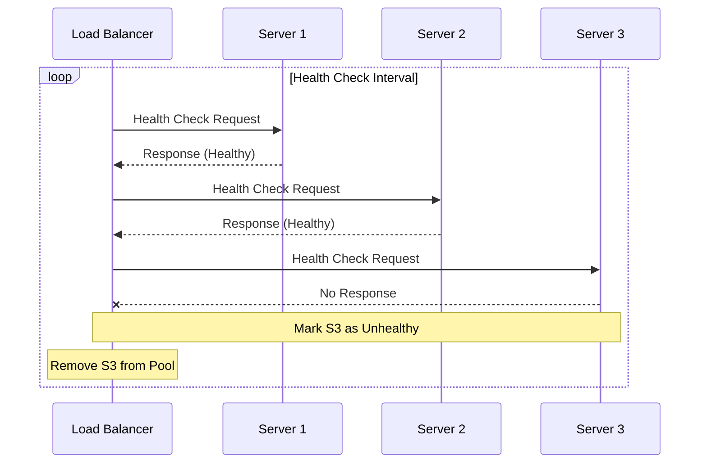

import Tabs from '@theme/Tabs';
import TabItem from '@theme/TabItem';

# 🏥 Load Balancer Health Checks Guide

## Overview

Health checks are monitoring mechanisms that assess the availability and performance of backend servers in a load-balanced system. Think of them like a hospital's vital signs monitoring system - continuously checking patients' conditions to ensure they're healthy and capable of handling their responsibilities.



## 🔑 Key Concepts

### 1. Check Types
- TCP Connection
- HTTP/HTTPS Endpoint
- Custom Script
- Application-Specific
- Database Connection

### 2. Health States
- Healthy
- Unhealthy
- Degraded
- In Transition
- Under Maintenance

### 3. Check Components
- Probe Handler
- Status Monitor
- Result Aggregator
- Alert Manager

## 💻 Implementation

### Health Check System Implementation

<Tabs>
  <TabItem value="java" label="Java">
```java
import java.net.http.HttpClient;
import java.net.http.HttpRequest;
import java.net.http.HttpResponse;
import java.time.Duration;
import java.util.concurrent.*;
import java.util.Map;

public class HealthChecker {
private final ExecutorService executor;
private final ScheduledExecutorService scheduler;
private final Map<String, ServerHealth> serverHealth;
private final HttpClient httpClient;
private final long checkInterval;
private final int unhealthyThreshold;
private final int healthyThreshold;
private final AlertManager alertManager;

    public HealthChecker(
            int threadPoolSize,
            long checkInterval,
            int unhealthyThreshold,
            int healthyThreshold,
            AlertManager alertManager) {
        this.executor = Executors.newFixedThreadPool(threadPoolSize);
        this.scheduler = Executors.newScheduledThreadPool(1);
        this.serverHealth = new ConcurrentHashMap<>();
        this.httpClient = HttpClient.newBuilder()
            .connectTimeout(Duration.ofSeconds(5))
            .build();
        this.checkInterval = checkInterval;
        this.unhealthyThreshold = unhealthyThreshold;
        this.healthyThreshold = healthyThreshold;
        this.alertManager = alertManager;
    }

    public void startHealthChecks(List<Server> servers) {
        servers.forEach(server -> 
            serverHealth.put(server.getId(), new ServerHealth(server)));

        scheduler.scheduleAtFixedRate(
            () -> checkAllServers(servers),
            0,
            checkInterval,
            TimeUnit.MILLISECONDS
        );
    }

    private void checkAllServers(List<Server> servers) {
        List<CompletableFuture<Void>> futures = servers.stream()
            .map(server -> CompletableFuture.runAsync(
                () -> checkServer(server), executor))
            .collect(Collectors.toList());

        CompletableFuture.allOf(futures.toArray(new CompletableFuture[0]));
    }

    private void checkServer(Server server) {
        ServerHealth health = serverHealth.get(server.getId());
        try {
            HealthStatus status = performHealthCheck(server);
            updateServerHealth(server, health, status);
        } catch (Exception e) {
            handleHealthCheckFailure(server, health);
        }
    }

    private HealthStatus performHealthCheck(Server server) throws Exception {
        // Perform different types of health checks based on configuration
        switch (server.getHealthCheckType()) {
            case HTTP:
                return performHttpCheck(server);
            case TCP:
                return performTcpCheck(server);
            case CUSTOM:
                return performCustomCheck(server);
            default:
                throw new IllegalStateException("Unknown health check type");
        }
    }

    private HealthStatus performHttpCheck(Server server) throws Exception {
        HttpRequest request = HttpRequest.newBuilder()
            .uri(URI.create(server.getHealthCheckEndpoint()))
            .timeout(Duration.ofSeconds(5))
            .build();

        HttpResponse<String> response = httpClient.send(
            request, HttpResponse.BodyHandlers.ofString());

        return evaluateHttpResponse(response);
    }

    private void updateServerHealth(
            Server server,
            ServerHealth health,
            HealthStatus status) {
        health.lock.lock();
        try {
            if (status == HealthStatus.HEALTHY) {
                health.consecutiveSuccesses++;
                health.consecutiveFailures = 0;
                if (health.consecutiveSuccesses >= healthyThreshold &&
                    health.currentStatus != HealthStatus.HEALTHY) {
                    health.currentStatus = HealthStatus.HEALTHY;
                    alertManager.serverBecameHealthy(server);
                }
            } else {
                health.consecutiveFailures++;
                health.consecutiveSuccesses = 0;
                if (health.consecutiveFailures >= unhealthyThreshold &&
                    health.currentStatus == HealthStatus.HEALTHY) {
                    health.currentStatus = HealthStatus.UNHEALTHY;
                    alertManager.serverBecameUnhealthy(server);
                }
            }
        } finally {
            health.lock.unlock();
        }
    }

    private static class ServerHealth {
        private final Server server;
        private HealthStatus currentStatus;
        private int consecutiveSuccesses;
        private int consecutiveFailures;
        private final Lock lock;

        public ServerHealth(Server server) {
            this.server = server;
            this.currentStatus = HealthStatus.UNKNOWN;
            this.consecutiveSuccesses = 0;
            this.consecutiveFailures = 0;
            this.lock = new ReentrantLock();
        }
    }

    public enum HealthStatus {
        HEALTHY,
        UNHEALTHY,
        DEGRADED,
        UNKNOWN
    }
}
```
  </TabItem>
  <TabItem value="go" label="Go">
```go
package main

import (
    "context"
    "net/http"
    "sync"
    "time"
)

type HealthStatus int

const (
    Healthy HealthStatus = iota
    Unhealthy
    Degraded
    Unknown
)

type ServerHealth struct {
    server              *Server
    currentStatus       HealthStatus
    consecutiveSuccesses int
    consecutiveFailures  int
    mu                  sync.RWMutex
}

type HealthChecker struct {
    serverHealth       map[string]*ServerHealth
    checkInterval      time.Duration
    unhealthyThreshold int
    healthyThreshold   int
    httpClient        *http.Client
    alertManager      *AlertManager
    mu                sync.RWMutex
    ctx               context.Context
    cancel            context.CancelFunc
}

func NewHealthChecker(
    checkInterval time.Duration,
    unhealthyThreshold int,
    healthyThreshold int,
    alertManager *AlertManager,
) *HealthChecker {
    ctx, cancel := context.WithCancel(context.Background())
    
    return &HealthChecker{
        serverHealth:       make(map[string]*ServerHealth),
        checkInterval:      checkInterval,
        unhealthyThreshold: unhealthyThreshold,
        healthyThreshold:   healthyThreshold,
        httpClient:        &http.Client{
            Timeout: time.Second * 5,
        },
        alertManager:      alertManager,
        ctx:              ctx,
        cancel:           cancel,
    }
}

func (hc *HealthChecker) StartHealthChecks(servers []*Server) {
    // Initialize health status for all servers
    for _, server := range servers {
        hc.serverHealth[server.ID] = &ServerHealth{
            server:        server,
            currentStatus: Unknown,
        }
    }

    // Start periodic health checks
    go hc.healthCheckLoop(servers)
}

func (hc *HealthChecker) healthCheckLoop(servers []*Server) {
    ticker := time.NewTicker(hc.checkInterval)
    defer ticker.Stop()

    for {
        select {
        case <-hc.ctx.Done():
            return
        case <-ticker.C:
            hc.checkAllServers(servers)
        }
    }
}

func (hc *HealthChecker) checkAllServers(servers []*Server) {
    var wg sync.WaitGroup
    for _, server := range servers {
        wg.Add(1)
        go func(s *Server) {
            defer wg.Done()
            hc.checkServer(s)
        }(server)
    }
    wg.Wait()
}

func (hc *HealthChecker) checkServer(server *Server) {
    health := hc.serverHealth[server.ID]
    status, err := hc.performHealthCheck(server)
    
    if err != nil {
        hc.handleHealthCheckFailure(server, health)
        return
    }

    hc.updateServerHealth(server, health, status)
}

func (hc *HealthChecker) performHealthCheck(server *Server) (HealthStatus, error) {
    switch server.HealthCheckType {
    case "HTTP":
        return hc.performHttpCheck(server)
    case "TCP":
        return hc.performTcpCheck(server)
    case "Custom":
        return hc.performCustomCheck(server)
    default:
        return Unknown, fmt.Errorf("unknown health check type")
    }
}

func (hc *HealthChecker) performHttpCheck(server *Server) (HealthStatus, error) {
    ctx, cancel := context.WithTimeout(context.Background(), time.Second*5)
    defer cancel()

    req, err := http.NewRequestWithContext(ctx, "GET", server.HealthCheckEndpoint, nil)
    if err != nil {
        return Unhealthy, err
    }

    resp, err := hc.httpClient.Do(req)
    if err != nil {
        return Unhealthy, err
    }
    defer resp.Body.Close()

    if resp.StatusCode < 200 || resp.StatusCode >= 300 {
        return Unhealthy, nil
    }

    return Healthy, nil
}

func (hc *HealthChecker) updateServerHealth(
    server *Server,
    health *ServerHealth,
    status HealthStatus,
) {
    health.mu.Lock()
    defer health.mu.Unlock()

    if status == Healthy {
        health.consecutiveSuccesses++
        health.consecutiveFailures = 0
        if health.consecutiveSuccesses >= hc.healthyThreshold &&
            health.currentStatus != Healthy {
            health.currentStatus = Healthy
            hc.alertManager.ServerBecameHealthy(server)
        }
    } else {
        health.consecutiveFailures++
        health.consecutiveSuccesses = 0
        if health.consecutiveFailures >= hc.unhealthyThreshold &&
            health.currentStatus == Healthy {
            health.currentStatus = Unhealthy
            hc.alertManager.ServerBecameUnhealthy(server)
        }
    }
}

func (hc *HealthChecker) Stop() {
    hc.cancel()
}
```
  </TabItem>
</Tabs>

## 🤝 Related Patterns

1. **Circuit Breaker**
    - Failure detection
    - Service protection
    - Graceful degradation

2. **Service Discovery**
    - Dynamic registration
    - Service location
    - Configuration updates

3. **Retry Pattern**
    - Transient failures
    - Recovery handling
    - Backoff strategies

## ⚙️ Best Practices

### Configuration
- Set appropriate intervals
- Configure thresholds
- Define timeout values
- Implement graceful degradation

### Monitoring
- Track success rates
- Monitor response times
- Watch failure patterns
- Alert on status changes

### Testing
- Simulate failures
- Test recovery
- Verify thresholds
- Check alerts

## 🚫 Common Pitfalls

1. **False Positives**
    - Network issues
    - Timeouts too short
    - Solution: Multiple checks

2. **Thundering Herd**
    - Simultaneous checks
    - Resource exhaustion
    - Solution: Stagger checks

3. **Check Overhead**
    - Too frequent checks
    - Heavy check logic
    - Solution: Optimize intervals

## 🎯 Use Cases

### 1. Microservices Architecture
- Service health
- Dependencies
- API endpoints
- Resource usage

### 2. Cloud Infrastructure
- Instance health
- Container status
- Network connectivity
- Resource availability

### 3. Database Clusters
- Connection checks
- Replication status
- Query performance
- Resource utilization

## 🔍 Deep Dive Topics

### Thread Safety
- Concurrent checks
- State management
- Lock strategies
- Race conditions

### Distributed Systems
- Cross-region checks
- Network partitioning
- Consensus protocols
- Split-brain prevention

### Performance
- Check optimization
- Resource usage
- Network efficiency
- Response time

## 📚 Additional Resources

### Documentation
- [AWS Health Checks](https://docs.aws.amazon.com/elasticloadbalancing/latest/application/target-group-health-checks.html)
- [Kubernetes Probes](https://kubernetes.io/docs/tasks/configure-pod-container/configure-liveness-readiness-startup-probes/)
- [NGINX Health Checks](https://docs.nginx.com/nginx/admin-guide/load-balancer/http-health-check/)

### Tools
- Prometheus
- Grafana
- Datadog
- New Relic

## ❓ FAQs

### How often should I check?
- Balance frequency vs overhead
- Consider service criticality
- Monitor resource impact
- Adjust based on patterns

### What should I check?
- Critical dependencies
- Core functionality
- Resource availability
- Custom metrics

### How to handle flapping?
- Implement thresholds
- Use grace periods
- Track patterns
- Alert on trends

### What about custom checks?
- Define clear criteria
- Keep checks lightweight
- Monitor performance
- Handle timeouts
