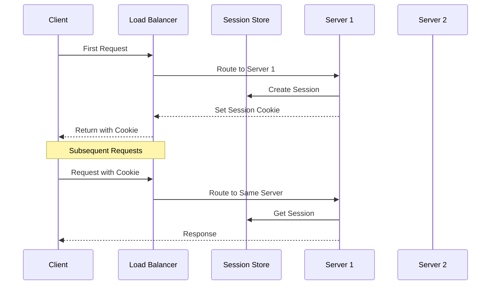

import Tabs from '@theme/Tabs';
import TabItem from '@theme/TabItem';

# 🔄 Session Persistence Guide

## Overview

Session persistence (also known as "sticky sessions") ensures that a client's requests are always routed to the same server where their session was initially created. Think of it like being assigned a specific bank teller who remembers your transaction history, rather than having to explain your situation to a new teller each time.



## 🔑 Key Concepts

### 1. Session Tracking Methods
- Cookie-Based
- URL Rewriting
- Client IP Affinity
- Server-Side Session Store

### 2. Components
- Session Manager
- Persistence Store
- Cookie Handler
- Failover Manager

### 3. States
- Session Created
- Session Active
- Session Expired
- Session Failed Over

## 💻 Implementation

### Session Persistence Implementation

<Tabs>
  <TabItem value="java" label="Java">
```java
import java.util.Map;
import java.util.concurrent.ConcurrentHashMap;
import java.util.UUID;
import java.time.Instant;

public class SessionPersistenceManager {
private final Map<String, SessionInfo> sessions;
private final LoadBalancer loadBalancer;
private final SessionStore sessionStore;
private final long sessionTimeout;

    public SessionPersistenceManager(LoadBalancer loadBalancer, SessionStore sessionStore, long sessionTimeout) {
        this.sessions = new ConcurrentHashMap<>();
        this.loadBalancer = loadBalancer;
        this.sessionStore = sessionStore;
        this.sessionTimeout = sessionTimeout;
    }

    public Server getServerForRequest(Request request) {
        String sessionId = getSessionId(request);
        if (sessionId != null) {
            SessionInfo sessionInfo = sessions.get(sessionId);
            if (sessionInfo != null && !sessionInfo.isExpired()) {
                if (sessionInfo.getServer().isAvailable()) {
                    return sessionInfo.getServer();
                } else {
                    // Handle failover
                    return handleFailover(sessionId, sessionInfo);
                }
            }
        }
        return createNewSession(request);
    }

    private String getSessionId(Request request) {
        // Try cookie first
        String sessionId = request.getCookie("SESSIONID");
        if (sessionId == null) {
            // Try URL parameter
            sessionId = request.getParameter("sessionId");
        }
        return sessionId;
    }

    private Server createNewSession(Request request) {
        Server server = loadBalancer.getNextServer();
        String sessionId = UUID.randomUUID().toString();
        SessionInfo sessionInfo = new SessionInfo(sessionId, server);
        
        sessions.put(sessionId, sessionInfo);
        sessionStore.store(sessionId, sessionInfo);
        
        // Set cookie in response
        request.getResponse().addCookie("SESSIONID", sessionId);
        
        return server;
    }

    private Server handleFailover(String sessionId, SessionInfo sessionInfo) {
        Server newServer = loadBalancer.getNextServer();
        sessionInfo.setServer(newServer);
        
        // Replicate session data to new server
        sessionStore.replicate(sessionId, newServer);
        
        return newServer;
    }

    public void cleanup() {
        Instant now = Instant.now();
        sessions.entrySet().removeIf(entry -> 
            entry.getValue().getLastAccessTime().plusMillis(sessionTimeout).isBefore(now));
    }

    private static class SessionInfo {
        private final String sessionId;
        private Server server;
        private Instant lastAccessTime;
        private final Map<String, Object> data;

        public SessionInfo(String sessionId, Server server) {
            this.sessionId = sessionId;
            this.server = server;
            this.lastAccessTime = Instant.now();
            this.data = new ConcurrentHashMap<>();
        }

        public boolean isExpired() {
            return lastAccessTime.plusMillis(sessionTimeout).isBefore(Instant.now());
        }

        // Getters and setters
    }
}
```
  </TabItem>
  <TabItem value="go" label="Go">
```go
package main

import (
    "sync"
    "time"
)

type SessionInfo struct {
    SessionID      string
    Server         *Server
    LastAccessTime time.Time
    Data           map[string]interface{}
    mu            sync.RWMutex
}

type SessionPersistenceManager struct {
    sessions       map[string]*SessionInfo
    loadBalancer   *LoadBalancer
    sessionStore   SessionStore
    sessionTimeout time.Duration
    mu            sync.RWMutex
}

func NewSessionPersistenceManager(
    loadBalancer *LoadBalancer,
    sessionStore SessionStore,
    sessionTimeout time.Duration,
) *SessionPersistenceManager {
    spm := &SessionPersistenceManager{
        sessions:       make(map[string]*SessionInfo),
        loadBalancer:   loadBalancer,
        sessionStore:   sessionStore,
        sessionTimeout: sessionTimeout,
    }
    
    // Start cleanup routine
    go spm.cleanupRoutine()
    return spm
}

func (spm *SessionPersistenceManager) GetServerForRequest(r *Request) (*Server, error) {
    sessionID := spm.getSessionID(r)
    if sessionID != "" {
        spm.mu.RLock()
        sessionInfo, exists := spm.sessions[sessionID]
        spm.mu.RUnlock()

        if exists && !spm.isExpired(sessionInfo) {
            sessionInfo.mu.RLock()
            server := sessionInfo.Server
            sessionInfo.mu.RUnlock()

            if server.IsAvailable() {
                return server, nil
            }
            // Handle failover
            return spm.handleFailover(sessionID, sessionInfo)
        }
    }
    return spm.createNewSession(r)
}

func (spm *SessionPersistenceManager) getSessionID(r *Request) string {
    // Try cookie first
    if cookie := r.Cookie("SESSIONID"); cookie != "" {
        return cookie
    }
    // Try URL parameter
    return r.URLParam("sessionId")
}

func (spm *SessionPersistenceManager) createNewSession(r *Request) (*Server, error) {
    server, err := spm.loadBalancer.GetNextServer()
    if err != nil {
        return nil, err
    }

    sessionID := generateUUID()
    sessionInfo := &SessionInfo{
        SessionID:      sessionID,
        Server:         server,
        LastAccessTime: time.Now(),
        Data:          make(map[string]interface{}),
    }

    spm.mu.Lock()
    spm.sessions[sessionID] = sessionInfo
    spm.mu.Unlock()

    if err := spm.sessionStore.Store(sessionID, sessionInfo); err != nil {
        return nil, err
    }

    // Set cookie in response
    r.SetCookie("SESSIONID", sessionID)
    return server, nil
}

func (spm *SessionPersistenceManager) handleFailover(
    sessionID string,
    sessionInfo *SessionInfo,
) (*Server, error) {
    newServer, err := spm.loadBalancer.GetNextServer()
    if err != nil {
        return nil, err
    }

    sessionInfo.mu.Lock()
    sessionInfo.Server = newServer
    sessionInfo.mu.Unlock()

    // Replicate session data to new server
    if err := spm.sessionStore.Replicate(sessionID, newServer); err != nil {
        return nil, err
    }

    return newServer, nil
}

func (spm *SessionPersistenceManager) isExpired(si *SessionInfo) bool {
    si.mu.RLock()
    defer si.mu.RUnlock()
    return time.Since(si.LastAccessTime) > spm.sessionTimeout
}

func (spm *SessionPersistenceManager) cleanupRoutine() {
    ticker := time.NewTicker(spm.sessionTimeout / 2)
    defer ticker.Stop()

    for range ticker.C {
        spm.cleanup()
    }
}

func (spm *SessionPersistenceManager) cleanup() {
    spm.mu.Lock()
    defer spm.mu.Unlock()

    now := time.Now()
    for sessionID, sessionInfo := range spm.sessions {
        sessionInfo.mu.RLock()
        if now.Sub(sessionInfo.LastAccessTime) > spm.sessionTimeout {
            delete(spm.sessions, sessionID)
            spm.sessionStore.Delete(sessionID)
        }
        sessionInfo.mu.RUnlock()
    }
}
```
  </TabItem>
</Tabs>

## 🤝 Related Patterns

1. **Distributed Cache**
    - Session storage
    - Data replication
    - High availability

2. **Circuit Breaker**
    - Failover handling
    - Server health
    - Error management

3. **Gateway Routing**
    - Request routing
    - Path-based routing
    - Version management

## ⚙️ Best Practices

### Configuration
- Set appropriate timeouts
- Configure failover
- Use secure cookies
- Enable replication

### Monitoring
- Track session count
- Monitor server health
- Watch memory usage
- Alert on failures

### Testing
- Failover scenarios
- Session replication
- Load testing
- Security testing

## 🚫 Common Pitfalls

1. **Memory Leaks**
    - Session accumulation
    - Poor cleanup
    - Solution: Proper timeout management

2. **Failover Issues**
    - Lost sessions
    - Replication delays
    - Solution: Distributed session store

3. **Performance Impact**
    - High memory usage
    - Network overhead
    - Solution: Session optimization

## 🎯 Use Cases

### 1. E-commerce Platforms
- Shopping carts
- User preferences
- Checkout process
- Payment flows

### 2. Banking Applications
- User transactions
- Account details
- Security context
- Multi-step processes

### 3. SaaS Applications
- User workspaces
- Application state
- User settings
- Multi-page workflows

## 🔍 Deep Dive Topics

### Thread Safety
- Concurrent access
- Race conditions
- Lock management
- Atomic operations

### Distributed Systems
- Session replication
- Data consistency
- Failover handling
- Network partitioning

### Performance
- Memory optimization
- Network efficiency
- Cache strategies
- Load distribution

## 📚 Additional Resources

### Documentation
- [AWS Sticky Sessions](https://docs.aws.amazon.com/elasticloadbalancing/latest/application/sticky-sessions.html)
- [NGINX Session Persistence](https://docs.nginx.com/nginx/admin-guide/load-balancer/http-load-balancer/#sticky)
- [HAProxy Sticky Sessions](http://docs.haproxy.org/2.4/configuration.html#stick-table)

### Tools
- Redis Session Store
- Memcached
- Hazelcast
- Apache Ignite

## ❓ FAQs

### When should I use sticky sessions?
- Stateful applications
- Complex workflows
- Security requirements
- Session-dependent features

### How to handle session timeout?
- Set appropriate timeouts
- Implement cleanup
- Notify users
- Save important data

### What about server failures?
- Use session replication
- Implement failover
- Store sessions externally
- Monitor server health

### How to scale sticky sessions?
- Use distributed cache
- Implement replication
- Configure backup servers
- Monitor session distribution