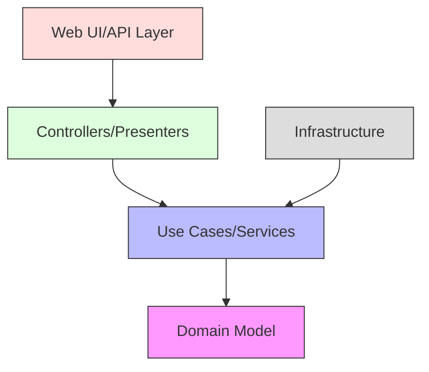
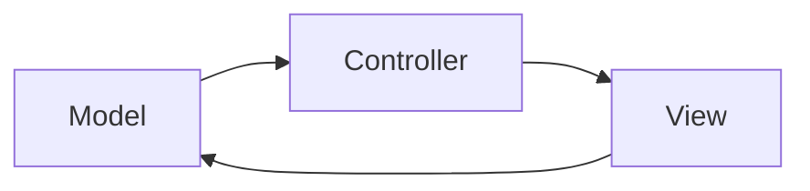

import Tabs from '@theme/Tabs';
import TabItem from '@theme/TabItem';

# 🌐 Clean Architecture Web Application Example

## Overview

This document demonstrates a complete web application implementation using Clean Architecture principles. We'll build an e-commerce platform that showcases common web application features while maintaining clean separation of concerns and following architectural boundaries.

### Real World Analogy
Think of a department store. The storefront (UI) interacts with customers, the sales staff (controllers) handles requests, the inventory management (use cases) processes operations, and the warehouse (domain) contains the core business rules. Each department operates independently but cooperates through well-defined interfaces.

## 🎯 Key Concepts

### Architecture Overview



### Core Components

1. **Presentation Layer**
   - Web Controllers
   - API Endpoints
   - View Templates/UI Components

2. **Application Layer**
   - Use Cases
   - DTOs
   - Input/Output Ports

3. **Domain Layer**
   - Entities
   - Value Objects
   - Domain Services

4. **Infrastructure Layer**
   - Repositories
   - External Services
   - Framework Components

## 💻 Implementation

### E-commerce Application Example

<Tabs>
  <TabItem value="java" label="Java">
```java
// Domain Layer
package com.example.domain;

@Value
public class Product {
ProductId id;
String name;
Money price;
int stockQuantity;

    public boolean isAvailable() {
        return stockQuantity > 0;
    }

    public void decreaseStock(int quantity) {
        if (quantity > stockQuantity) {
            throw new InsufficientStockException(id, quantity, stockQuantity);
        }
        stockQuantity -= quantity;
    }
}

// Application Layer - Use Cases
package com.example.application;

@UseCase
public class AddToCartUseCase {
private final CartRepository cartRepository;
private final ProductRepository productRepository;
private final CartDomainService cartService;

    public AddToCartUseCase(
            CartRepository cartRepository,
            ProductRepository productRepository,
            CartDomainService cartService) {
        this.cartRepository = cartRepository;
        this.productRepository = productRepository;
        this.cartService = cartService;
    }

    @Transactional
    public void execute(AddToCartCommand command) {
        Cart cart = cartRepository.findByCustomerId(command.getCustomerId())
            .orElseGet(() -> Cart.createEmpty(command.getCustomerId()));

        Product product = productRepository.findById(command.getProductId())
            .orElseThrow(() -> new ProductNotFoundException(command.getProductId()));

        cartService.addItem(cart, product, command.getQuantity());
        cartRepository.save(cart);
    }
}

// Web Layer - Controllers
@Controller
@RequestMapping("/products")
public class ProductController {
private final GetProductsUseCase getProductsUseCase;
private final AddToCartUseCase addToCartUseCase;
private final ProductViewMapper mapper;

    @GetMapping
    public String listProducts(Model model, 
                             @PageableDefault(size = 20) Pageable pageable) {
        Page<Product> products = getProductsUseCase.execute(pageable);
        model.addAttribute("products", mapper.toViewModels(products));
        return "products/list";
    }

    @PostMapping("/{id}/add-to-cart")
    @ResponseBody
    public ResponseEntity<Void> addToCart(
            @PathVariable ProductId id,
            @Valid @RequestBody AddToCartRequest request) {
        AddToCartCommand command = new AddToCartCommand(
            getCurrentCustomerId(),
            id,
            request.getQuantity()
        );
        addToCartUseCase.execute(command);
        return ResponseEntity.ok().build();
    }
}

// Infrastructure Layer - Repositories
@Repository
public class JpaProductRepository implements ProductRepository {
private final SpringDataProductRepository repository;
private final ProductMapper mapper;

    @Override
    public Optional<Product> findById(ProductId id) {
        return repository.findById(id.getValue())
            .map(mapper::toDomain);
    }

    @Override
    @Transactional
    public void save(Product product) {
        ProductEntity entity = mapper.toEntity(product);
        repository.save(entity);
    }
}

// View Templates (Thymeleaf)
<!DOCTYPE html>
<html xmlns:th="http://www.thymeleaf.org">
<head>
    <title>Products</title>
</head>
<body>
    <div class="container">
        <h1>Products</h1>
        <div class="product-grid">
            <div th:each="product : ${products}" class="product-card">
                <h3 th:text="${product.name}">Product Name</h3>
                <p th:text="${product.price}">Price</p>
                <form th:action="@{/products/{id}/add-to-cart(id=${product.id})}"
                      method="post">
                    <input type="number" name="quantity" value="1" min="1"/>
                    <button type="submit">Add to Cart</button>
                </form>
            </div>
        </div>
    </div>
</body>
</html>
```
  </TabItem>
  <TabItem value="go" label="Go">
```go
// Domain Layer
package domain

type Product struct {
ID            ProductID
Name          string
Price         Money
StockQuantity int
}

func (p *Product) IsAvailable() bool {
return p.StockQuantity > 0
}

func (p *Product) DecreaseStock(quantity int) error {
if quantity > p.StockQuantity {
return NewInsufficientStockError(p.ID, quantity, p.StockQuantity)
}
p.StockQuantity -= quantity
return nil
}

// Application Layer - Use Cases
package application

type AddToCartUseCase struct {
cartRepo    CartRepository
productRepo ProductRepository
cartService CartDomainService
}

func NewAddToCartUseCase(
cartRepo CartRepository,
productRepo ProductRepository,
cartService CartDomainService) *AddToCartUseCase {

    return &AddToCartUseCase{
        cartRepo:    cartRepo,
        productRepo: productRepo,
        cartService: cartService,
    }
}

func (uc *AddToCartUseCase) Execute(cmd AddToCartCommand) error {
cart, err := uc.cartRepo.FindByCustomerID(cmd.CustomerID)
if err == ErrNotFound {
cart = NewCart(cmd.CustomerID)
} else if err != nil {
return err
}

    product, err := uc.productRepo.FindByID(cmd.ProductID)
    if err == ErrNotFound {
        return NewProductNotFoundError(cmd.ProductID)
    } else if err != nil {
        return err
    }

    if err := uc.cartService.AddItem(cart, product, cmd.Quantity); err != nil {
        return err
    }

    return uc.cartRepo.Save(cart)
}

// Web Layer - Handlers
package web

type ProductHandler struct {
getProducts GetProductsUseCase
addToCart   AddToCartUseCase
mapper      ProductViewMapper
}

func NewProductHandler(
getProducts GetProductsUseCase,
addToCart AddToCartUseCase,
mapper ProductViewMapper) *ProductHandler {

    return &ProductHandler{
        getProducts: getProducts,
        addToCart:   addToCart,
        mapper:      mapper,
    }
}

func (h *ProductHandler) ListProducts(w http.ResponseWriter, r *http.Request) {
pagination := NewPagination(r)
products, err := h.getProducts.Execute(pagination)
if err != nil {
http.Error(w, err.Error(), http.StatusInternalServerError)
return
}

    data := map[string]interface{}{
        "products": h.mapper.ToViewModels(products),
    }
    render.Template(w, "products/list", data)
}

func (h *ProductHandler) AddToCart(w http.ResponseWriter, r *http.Request) {
var req AddToCartRequest
if err := json.NewDecoder(r.Body).Decode(&req); err != nil {
http.Error(w, err.Error(), http.StatusBadRequest)
return
}

    if err := h.validator.Struct(req); err != nil {
        http.Error(w, err.Error(), http.StatusBadRequest)
        return
    }

    cmd := AddToCartCommand{
        CustomerID: GetCurrentCustomerID(r.Context()),
        ProductID:  chi.URLParam(r, "id"),
        Quantity:   req.Quantity,
    }

    if err := h.addToCart.Execute(cmd); err != nil {
        HandleError(w, err)
        return
    }

    w.WriteHeader(http.StatusOK)
}

// Infrastructure Layer - Repositories
package infrastructure

type PostgresProductRepository struct {
db     *sql.DB
mapper ProductMapper
}

func NewPostgresProductRepository(
db *sql.DB,
mapper ProductMapper) *PostgresProductRepository {
return &PostgresProductRepository{
db:     db,
mapper: mapper,
}
}

func (r *PostgresProductRepository) FindByID(
id ProductID) (*Product, error) {

    row := r.db.QueryRow(`
        SELECT id, name, price, stock_quantity 
        FROM products WHERE id = $1
    `, id)

    var entity ProductEntity
    if err := row.Scan(
        &entity.ID, 
        &entity.Name, 
        &entity.Price, 
        &entity.StockQuantity,
    ); err != nil {
        if err == sql.ErrNoRows {
            return nil, ErrNotFound
        }
        return nil, err
    }

    return r.mapper.ToDomain(&entity), nil
}

// Templates (html/template)
{{define "products/list"}}
<!DOCTYPE html>
<html>
<head>
    <title>Products</title>
</head>
<body>
    <div class="container">
        <h1>Products</h1>
        <div class="product-grid">
            {{range .products}}
            <div class="product-card">
                <h3>{{.Name}}</h3>
                <p>{{.Price}}</p>
                <form action="/products/{{.ID}}/add-to-cart" method="post">
                    <input type="number" name="quantity" value="1" min="1"/>
                    <button type="submit">Add to Cart</button>
                </form>
            </div>
            {{end}}
        </div>
    </div>
</body>
</html>
{{end}}
```
  </TabItem>
</Tabs>


## 🔄 Related Patterns

1. **MVC Pattern**
   - Complements Clean Architecture
   - Handles web presentation
   - Maps to outer layers



2. **CQRS Pattern**
   - Separates read/write operations
   - Improves scalability
   - Fits use case layer

3. **Repository Pattern**
   - Handles data persistence
   - Abstracts data access
   - Implements ports

## ✅ Best Practices

### Configuration
1. **Environment-Based Config**
```yaml
application:
  name: clean-web-app
  profiles:
    active: ${ENVIRONMENT:dev}
  datasource:
    url: ${DATABASE_URL}
    username: ${DATABASE_USER}
    password: ${DATABASE_PASSWORD}
```

2. **Feature Toggles**
```java
@Configuration
public class FeatureConfig {
    @Bean
    public FeatureManager featureManager(
            @Value("${features.new-cart}") boolean newCart) {
        return new FeatureManager()
            .enable("new-cart", newCart);
    }
}
```

### Monitoring
1. **Health Checks**
```java
@Component
public class DatabaseHealthCheck implements HealthIndicator {
    @Override
    public Health health() {
        try {
            // Check database connection
            return Health.up().build();
        } catch (Exception e) {
            return Health.down()
                .withException(e)
                .build();
        }
    }
}
```

2. **Metrics Collection**
```java
@Aspect
@Component
public class MetricsAspect {
    private final MeterRegistry registry;
    
    @Around("@annotation(Monitored)")
    public Object measureExecutionTime(ProceedingJoinPoint joinPoint) 
            throws Throwable {
        Timer.Sample sample = Timer.start(registry);
        try {
            return joinPoint.proceed();
        } finally {
            sample.stop(Timer.builder("method.execution")
                .tag("class", joinPoint.getSignature().getDeclaringTypeName())
                .tag("method", joinPoint.getSignature().getName())
                .register(registry));
        }
    }
}
```

## ⚠️ Common Pitfalls

1. **Business Logic in Controllers**
   - Symptom: Complex controller methods
   - Solution: Move to use cases

2. **Anemic Domain Model**
   - Symptom: Models without behavior
   - Solution: Add domain logic to entities

3. **Infrastructure Coupling**
   - Symptom: Framework annotations in domain
   - Solution: Use clean interfaces

4. **Missing Error Handling**
   - Symptom: Uncaught exceptions
   - Solution: Implement proper error boundaries

## 🎯 Use Cases

### 1. E-commerce Platform
- Product catalog
- Shopping cart
- Order processing
- Payment integration

### 2. Customer Portal
- User registration
- Profile management
- Document uploads
- Notifications

### 3. Admin Dashboard
- User management
- Content management
- Analytics
- System configuration

## 🔍 Deep Dive Topics

### Thread Safety

1. **Session Management**
```java
@ThreadSafe
public class SessionManager {
    private final ConcurrentMap<String, UserSession> sessions
        = new ConcurrentHashMap<>();
    
    public Optional<UserSession> getSession(String token) {
        cleanExpiredSessions();
        return Optional.ofNullable(sessions.get(token));
    }
    
    private void cleanExpiredSessions() {
        sessions.entrySet().removeIf(entry -> 
            entry.getValue().isExpired());
    }
}
```

2. **Cache Management**
```java
@Configuration
public class CacheConfig {
    @Bean
    public CacheManager cacheManager() {
        return new ConcurrentMapCacheManager()
            .builder()
            .withExpiry(Duration.ofMinutes(10))
            .build();
    }
}
```

### Performance Optimization

1. **Response Caching**
```java
@GetMapping("/products/{id}")
@Cacheable(value = "products", key = "#id")
public ProductResponse getProduct(@PathVariable String id) {
    return productService.getProduct(id);
}
```

2. **Query Optimization**
```java
@Repository
public class OptimizedProductRepository implements ProductRepository {
    @QueryHints({@QueryHint(name = "org.hibernate.cacheable", value = "true")})
    @Override
    public List<Product> findByCategory(CategoryId categoryId) {
        return entityManager
            .createQuery("SELECT p FROM Product p " +
                        "JOIN FETCH p.category " +
                        "WHERE p.category.id = :categoryId",
                        Product.class)
            .setParameter("categoryId", categoryId)
            .getResultList();
    }
}
```

## 📚 Additional Resources

### Tools and Frameworks
1. Spring Boot (Java)
2. Gin/Chi (Go)
3. React/Angular (Frontend)
4. Docker/Kubernetes
5. Prometheus/Grafana

### Books
1. "Clean Architecture" by Robert C. Martin
2. "Building Microservices" by Sam Newman
3. "Domain-Driven Design" by Eric Evans

### References
1. [Spring Boot Documentation](https://docs.spring.io/spring-boot/docs/current/reference/html/)
2. [Go Web Examples](https://gowebexamples.com/)
3. [Clean Architecture Blog](https://blog.cleancoder.com/)

## ❓ FAQs

### Q: How to handle file uploads?
A: Use multipart form data and implement a dedicated FileStorage port/adapter.

### Q: Should we use ORMs?
A: Yes, but keep them in the infrastructure layer and map to domain entities.

### Q: How to manage user sessions?
A: Implement stateless authentication using JWT or similar tokens.

### Q: How to handle form validation?
A: Validate at both UI and server levels, using dedicated validation objects.

### Q: How to implement search functionality?
A: Create dedicated search use cases and consider using search engines for complex queries.