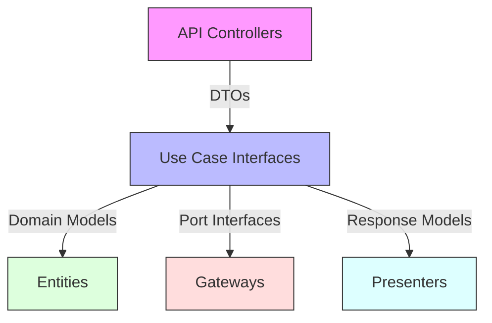

# 🔌 Clean Architecture API Design Documentation

## Overview and Problem Statement <a name="overview"></a>

### Definition
API design in Clean Architecture focuses on creating well-defined boundaries between layers while maintaining the Dependency Rule, ensuring that inner layers remain independent of outer layers.

### Problems Solved
- Layer coupling
- Dependency management
- Interface pollution
- Testing complexity
- Change management
- Contract consistency

### Business Value
- Reduced maintenance cost
- Improved system flexibility
- Better testability
- Faster development cycles
- Easier system evolution

## Detailed Solution/Architecture <a name="solution"></a>

### Core Concepts



### Interface Design Hierarchy

1. **Primary Ports (Driving)**
   - API Controllers
   - Use Case Interfaces
   - Request/Response Models

2. **Secondary Ports (Driven)**
   - Repository Interfaces
   - External Service Ports
   - Persistence Adapters

## Technical Implementation <a name="implementation"></a>

### API Layer Structure

```typescript
// 1. Request/Response DTOs
interface CreateOrderRequest {
    customerId: string;
    items: Array<{
        productId: string;
        quantity: number;
    }>;
}

interface CreateOrderResponse {
    orderId: string;
    status: OrderStatus;
    total: Money;
    createdAt: Date;
}

// 2. Use Case Interface
interface CreateOrderUseCase {
    execute(request: CreateOrderRequest): Promise<CreateOrderResponse>;
}

// 3. API Controller
@Controller('/api/orders')
class OrderController {
    constructor(
        private readonly createOrder: CreateOrderUseCase,
        private readonly validator: CreateOrderValidator
    ) {}

    @Post()
    async createOrder(
        @Body() requestDto: CreateOrderRequest,
        @Headers() headers: RequestHeaders
    ): Promise<ApiResponse<CreateOrderResponse>> {
        try {
            // Validate request
            await this.validator.validate(requestDto);

            // Execute use case
            const result = await this.createOrder.execute(requestDto);

            // Return response
            return new ApiResponse({
                success: true,
                data: result,
                metadata: {
                    requestId: headers.requestId,
                    timestamp: new Date()
                }
            });
        } catch (error) {
            // Handle different error types
            return this.errorHandler.handle(error);
        }
    }
}
```

### API Response Wrapper

```typescript
class ApiResponse<T> {
    success: boolean;
    data?: T;
    error?: ApiError;
    metadata: {
        requestId: string;
        timestamp: Date;
        version: string;
    };

    constructor(params: ApiResponseParams<T>) {
        this.success = params.success;
        this.data = params.data;
        this.error = params.error;
        this.metadata = {
            requestId: params.metadata.requestId,
            timestamp: params.metadata.timestamp,
            version: API_VERSION
        };
    }

    static success<T>(data: T, metadata: ApiMetadata): ApiResponse<T> {
        return new ApiResponse({
            success: true,
            data,
            metadata
        });
    }

    static error<T>(error: ApiError, metadata: ApiMetadata): ApiResponse<T> {
        return new ApiResponse({
            success: false,
            error,
            metadata
        });
    }
}
```

### Error Handling

```typescript
class ApiErrorHandler {
    handle(error: Error): ApiResponse<never> {
        // Map domain errors to API responses
        if (error instanceof ValidationError) {
            return ApiResponse.error(
                new ApiError({
                    code: 'VALIDATION_ERROR',
                    message: error.message,
                    details: error.details
                }),
                this.getMetadata()
            );
        }

        if (error instanceof DomainError) {
            return ApiResponse.error(
                new ApiError({
                    code: 'BUSINESS_RULE_VIOLATION',
                    message: error.message
                }),
                this.getMetadata()
            );
        }

        // Handle unexpected errors
        logger.error('Unexpected error', error);
        return ApiResponse.error(
            new ApiError({
                code: 'INTERNAL_SERVER_ERROR',
                message: 'An unexpected error occurred'
            }),
            this.getMetadata()
        );
    }
}
```

## Best Practices & Guidelines <a name="best-practices"></a>

### 1. Input Validation

```typescript
class RequestValidator {
    validate<T>(schema: ValidationSchema, data: T): ValidationResult {
        return pipe(
            data,
            this.validateRequired,
            this.validateTypes,
            this.validateBusinessRules
        );
    }

    private validateRequired(data: unknown): ValidationResult {
        // Implementation
    }

    private validateTypes(data: unknown): ValidationResult {
        // Implementation
    }

    private validateBusinessRules(data: unknown): ValidationResult {
        // Implementation
    }
}
```

### 2. Versioning Strategy

```typescript
// Route versioning
@Controller('/api/v1/orders')
class OrderControllerV1 {
    // V1 implementation
}

@Controller('/api/v2/orders')
class OrderControllerV2 {
    // V2 implementation with breaking changes
}

// Content negotiation
@Controller('/api/orders')
class OrderController {
    @Get()
    @Header('Content-Type', 'application/vnd.company.api+json;version=1')
    getOrderV1(): OrderResponseV1 {
        // V1 implementation
    }

    @Get()
    @Header('Content-Type', 'application/vnd.company.api+json;version=2')
    getOrderV2(): OrderResponseV2 {
        // V2 implementation
    }
}
```

### 3. Authentication & Authorization

```typescript
@Injectable()
class AuthMiddleware implements NestMiddleware {
    async use(req: Request, res: Response, next: NextFunction) {
        const token = this.extractToken(req);
        
        try {
            const user = await this.authService.validateToken(token);
            req.user = user;
            next();
        } catch (error) {
            throw new UnauthorizedException();
        }
    }
}

@Controller('/api/orders')
@UseGuards(AuthGuard, RoleGuard)
class OrderController {
    @Post()
    @RequirePermissions(['create:orders'])
    async createOrder(@User() user: AuthUser, @Body() dto: CreateOrderRequest) {
        // Implementation
    }
}
```

## Anti-Patterns <a name="anti-patterns"></a>

### ❌ Common Mistakes

1. **Leaking Domain Models**
```typescript
// Bad: Exposing domain models directly
@Get('/:id')
async getOrder(@Param('id') id: string): Promise<Order> {
    return this.orderRepository.findById(id);
}
```

2. **Inconsistent Error Handling**
```typescript
// Bad: Inconsistent error responses
@Post()
async createOrder(@Body() dto: CreateOrderRequest) {
    try {
        return await this.orderService.create(dto);
    } catch (error) {
        if (error instanceof ValidationError) {
            throw new BadRequestException(error.message);
        }
        throw error; // Inconsistent error format
    }
}
```

### ✅ Correct Implementations

1. **Using DTOs and Mappers**
```typescript
@Get('/:id')
async getOrder(@Param('id') id: string): Promise<ApiResponse<OrderDTO>> {
    const order = await this.orderRepository.findById(id);
    return ApiResponse.success(
        this.orderMapper.toDTO(order),
        this.getMetadata()
    );
}
```

2. **Consistent Error Handling**
```typescript
@Post()
async createOrder(
    @Body() dto: CreateOrderRequest
): Promise<ApiResponse<OrderDTO>> {
    try {
        const result = await this.createOrder.execute(dto);
        return ApiResponse.success(result, this.getMetadata());
    } catch (error) {
        return this.errorHandler.handle(error);
    }
}
```

## Testing Strategies <a name="testing"></a>

### API Integration Tests

```typescript
describe('OrderController (e2e)', () => {
    let app: INestApplication;
    let authToken: string;

    beforeAll(async () => {
        app = await createTestingModule({
            imports: [AppModule],
        }).compile();

        await app.init();
        authToken = await getTestAuthToken();
    });

    describe('POST /api/orders', () => {
        it('should create order successfully', async () => {
            // Arrange
            const request = createValidOrderRequest();

            // Act
            const response = await request(app.getHttpServer())
                .post('/api/orders')
                .set('Authorization', `Bearer ${authToken}`)
                .send(request);

            // Assert
            expect(response.status).toBe(201);
            expect(response.body).toMatchObject({
                success: true,
                data: expect.objectContaining({
                    orderId: expect.any(String),
                    status: 'CREATED'
                })
            });
        });

        it('should handle validation errors', async () => {
            // Arrange
            const invalidRequest = createInvalidOrderRequest();

            // Act
            const response = await request(app.getHttpServer())
                .post('/api/orders')
                .set('Authorization', `Bearer ${authToken}`)
                .send(invalidRequest);

            // Assert
            expect(response.status).toBe(400);
            expect(response.body).toMatchObject({
                success: false,
                error: {
                    code: 'VALIDATION_ERROR',
                    details: expect.any(Array)
                }
            });
        });
    });
});
```

## Performance Metrics & Optimization <a name="performance"></a>

### Response Time Monitoring

```typescript
@Injectable()
class PerformanceInterceptor implements NestInterceptor {
    intercept(context: ExecutionContext, next: CallHandler): Observable<any> {
        const start = Date.now();
        const request = context.switchToHttp().getRequest();

        return next.handle().pipe(
            tap(() => {
                const duration = Date.now() - start;
                logger.info('API Request completed', {
                    path: request.path,
                    method: request.method,
                    duration,
                    statusCode: context.switchToHttp().getResponse().statusCode
                });

                metrics.recordResponseTime(
                    request.path,
                    request.method,
                    duration
                );
            })
        );
    }
}
```

## Real-world Use Cases <a name="real-world"></a>

### E-commerce API Example

```typescript
@Controller('/api/v1/orders')
class OrderController {
    @Post()
    @UseGuards(AuthGuard)
    async createOrder(
        @User() user: AuthUser,
        @Body() dto: CreateOrderRequest
    ): Promise<ApiResponse<CreateOrderResponse>> {
        // Authorization check
        await this.authorizationService.checkPermission(
            user,
            'create:orders'
        );

        // Validate request
        await this.validator.validate(dto);

        // Execute use case
        const result = await this.createOrder.execute({
            ...dto,
            userId: user.id
        });

        // Return response
        return ApiResponse.success(result, this.getMetadata());
    }

    @Get('/:id')
    @UseGuards(AuthGuard)
    async getOrder(
        @User() user: AuthUser,
        @Param('id') orderId: string
    ): Promise<ApiResponse<OrderDetailsResponse>> {
        // Authorization check
        await this.authorizationService.checkPermission(
            user,
            'read:orders'
        );

        // Execute use case
        const result = await this.getOrder.execute({
            orderId,
            userId: user.id
        });

        // Return response
        return ApiResponse.success(result, this.getMetadata());
    }
}
```

## FAQ Section <a name="faq"></a>

1. **Q: How to handle API versioning?**
   A: Choose between:
   - URL versioning (/api/v1/...)
   - Header versioning (Accept: application/vnd.api+json;version=1)
   - Query parameter versioning (?version=1)

2. **Q: How to implement pagination?**
   A: Use cursor-based pagination for large datasets:
   ```typescript
   interface PaginatedResponse<T> {
       items: T[];
       cursor: string;
       hasMore: boolean;
   }

   @Get()
   async getOrders(
       @Query('cursor') cursor?: string,
       @Query('limit') limit = 20
   ): Promise<ApiResponse<PaginatedResponse<OrderDTO>>> {
       const result = await this.getOrders.execute({
           cursor,
           limit
       });

       return ApiResponse.success(result, this.getMetadata());
   }
   ```

3. **Q: How to handle file uploads?**
   A: Use streaming for large files:
   ```typescript
   @Post('upload')
   @UseInterceptors(FileInterceptor('file'))
   async uploadFile(
       @UploadedFile() file: Express.Multer.File
   ): Promise<ApiResponse<FileUploadResponse>> {
       const result = await this.uploadFile.execute({
           filename: file.originalname,
           mimetype: file.mimetype,
           stream: file.buffer
       });

       return ApiResponse.success(result, this.getMetadata());
   }
   ```

## References <a name="references"></a>

### Books
- "REST API Design Rulebook" by Mark Masse
- "Building Microservices" by Sam Newman
- "Clean Architecture" by Robert C. Martin

### Standards
- OpenAPI Specification
- JSON:API Specification
- RFC 7231 (HTTP/1.1)

### Articles
- "REST API Best Practices"
- "API Security Guidelines"
- "API Performance Optimization"