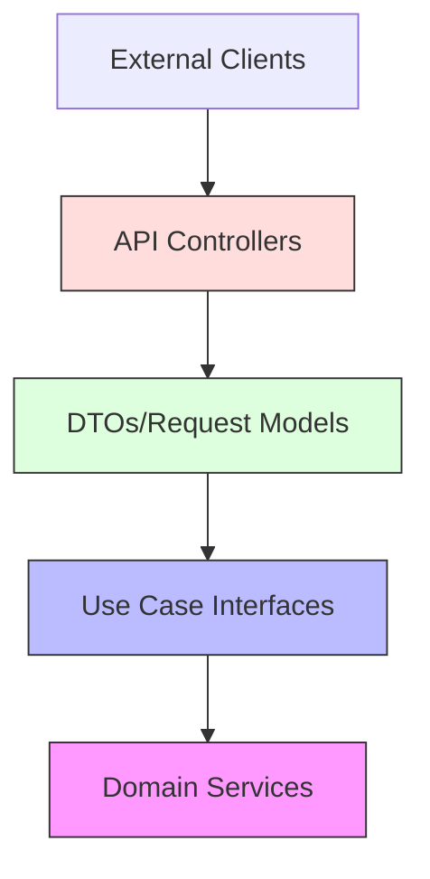
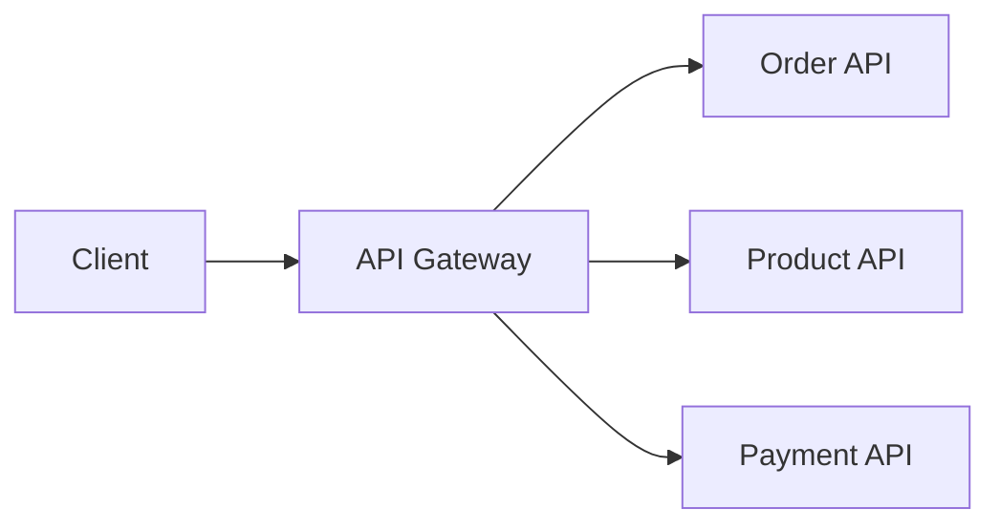

import Tabs from '@theme/Tabs';
import TabItem from '@theme/TabItem';

# 🔌 API Design in Clean Architecture

## Overview

API Design in Clean Architecture follows the principle of independence from frameworks and external agents while providing clean interfaces between layers. The API layer serves as a boundary adapter that translates external requests into internal use case calls and back.

### Real World Analogy
Think of a universal power adapter. Just as it provides a standard interface for different electrical systems worldwide while protecting devices from voltage differences, Clean Architecture APIs provide a standard interface to your application's core functionality while protecting the domain from external concerns.

## 🎯 Key Concepts

### API Architecture Layers



### Components

1. **API Controllers**
    - Request handling
    - Input validation
    - Response formatting

2. **Request/Response Models**
    - Data transfer objects
    - Input validation rules
    - Response mapping

3. **Use Case Interfaces**
    - Business operation contracts
    - Input/output ports
    - Error handling

4. **API Documentation**
    - OpenAPI/Swagger specs
    - Request/response examples
    - Error scenarios

## 💻 Implementation

### RESTful API Implementation

<Tabs>
  <TabItem value="java" label="Java">
```java
// API Models
package com.example.api.model;

@Data
@Builder
public class CreateOrderRequest {
@NotNull
private String customerId;

    @NotEmpty
    private List<OrderItemRequest> items;
    
    @Valid
    private PaymentDetails paymentDetails;
}

@Data
@Builder
public class OrderResponse {
private String orderId;
private String status;
private BigDecimal total;
private LocalDateTime createdAt;
}

// API Controller
package com.example.api.controller;

@RestController
@RequestMapping("/api/v1/orders")
@Tag(name = "Orders", description = "Order management API")
public class OrderController {
private final CreateOrderUseCase createOrderUseCase;
private final GetOrderUseCase getOrderUseCase;
private final OrderMapper mapper;

    @PostMapping
    @Operation(summary = "Create new order")
    @ApiResponse(responseCode = "201", description = "Order created")
    @ApiResponse(responseCode = "400", description = "Invalid input")
    public ResponseEntity<OrderResponse> createOrder(
            @Valid @RequestBody CreateOrderRequest request) {
        CreateOrderCommand command = mapper.toCommand(request);
        OrderId orderId = createOrderUseCase.createOrder(command);
        Order order = getOrderUseCase.getOrder(orderId);
        
        return ResponseEntity
            .status(HttpStatus.CREATED)
            .body(mapper.toResponse(order));
    }
    
    @GetMapping("/{orderId}")
    @Operation(summary = "Get order by ID")
    @ApiResponse(responseCode = "200", description = "Order found")
    @ApiResponse(responseCode = "404", description = "Order not found")
    public ResponseEntity<OrderResponse> getOrder(
            @PathVariable String orderId) {
        Order order = getOrderUseCase.getOrder(new OrderId(orderId));
        return ResponseEntity.ok(mapper.toResponse(order));
    }
    
    @ExceptionHandler(OrderNotFoundException.class)
    public ResponseEntity<ErrorResponse> handleOrderNotFound(
            OrderNotFoundException ex) {
        return ResponseEntity
            .status(HttpStatus.NOT_FOUND)
            .body(new ErrorResponse("Order not found", ex.getMessage()));
    }
}

// API Configuration
@Configuration
@EnableSwagger2
public class SwaggerConfig {
@Bean
public OpenAPI apiInfo() {
return new OpenAPI()
.info(new Info()
.title("Clean Architecture API")
.version("1.0.0")
.description("API documentation for Clean Architecture example"));
}
}

// API Security
@Configuration
@EnableWebSecurity
public class SecurityConfig extends WebSecurityConfigurerAdapter {
@Override
protected void configure(HttpSecurity http) throws Exception {
http.oauth2ResourceServer()
.jwt()
.and()
.authorizeRequests()
.antMatchers("/api/v1/**").authenticated()
.antMatchers("/swagger-ui/**").permitAll();
}
}
```
  </TabItem>
  <TabItem value="go" label="Go">
```go
// API Models
package api

type CreateOrderRequest struct {
    CustomerID     string                `json:"customerId" validate:"required"`
    Items         []OrderItemRequest    `json:"items" validate:"required,dive"`
    PaymentDetails PaymentDetails       `json:"paymentDetails" validate:"required"`
}

type OrderResponse struct {
    OrderID    string    `json:"orderId"`
    Status     string    `json:"status"`
    Total      float64   `json:"total"`
    CreatedAt  time.Time `json:"createdAt"`
}

// API Handler
package api

type OrderHandler struct {
    createOrder usecase.CreateOrderUseCase
    getOrder    usecase.GetOrderUseCase
    mapper      OrderMapper
    validator   *validator.Validate
}

func NewOrderHandler(
    createOrder usecase.CreateOrderUseCase,
    getOrder usecase.GetOrderUseCase,
    mapper OrderMapper) *OrderHandler {
    
    return &OrderHandler{
        createOrder: createOrder,
        getOrder:   getOrder,
        mapper:     mapper,
        validator:  validator.New(),
    }
}

func (h *OrderHandler) CreateOrder(w http.ResponseWriter, r *http.Request) {
    var req CreateOrderRequest
    if err := json.NewDecoder(r.Body).Decode(&req); err != nil {
        RespondWithError(w, http.StatusBadRequest, "Invalid request payload")
        return
    }
    
    if err := h.validator.Struct(req); err != nil {
        RespondWithError(w, http.StatusBadRequest, "Validation failed")
        return
    }
    
    command := h.mapper.ToCommand(req)
    orderID, err := h.createOrder.CreateOrder(r.Context(), command)
    if err != nil {
        HandleError(w, err)
        return
    }
    
    order, err := h.getOrder.GetOrder(r.Context(), orderID)
    if err != nil {
        HandleError(w, err)
        return
    }
    
    RespondWithJSON(w, http.StatusCreated, h.mapper.ToResponse(order))
}

// Router Configuration
func SetupRouter(handlers *Handlers) *chi.Mux {
    r := chi.NewRouter()
    
    r.Use(middleware.RequestID)
    r.Use(middleware.RealIP)
    r.Use(middleware.Logger)
    r.Use(middleware.Recoverer)
    r.Use(middleware.Timeout(60 * time.Second))
    
    r.Route("/api/v1", func(r chi.Router) {
        r.Use(Auth)
        
        r.Route("/orders", func(r chi.Router) {
            r.Post("/", handlers.Order.CreateOrder)
            r.Get("/{orderID}", handlers.Order.GetOrder)
        })
    })
    
    return r
}

// API Documentation
func SetupSwagger(r *chi.Mux) {
    swagger := &openapi.Swagger{
        Info: &openapi.Info{
            Title:       "Clean Architecture API",
            Version:     "1.0.0",
            Description: "API documentation for Clean Architecture example",
        },
    }
    
    r.Get("/swagger/*", httpSwagger.Handler(
        httpSwagger.URL("/swagger/doc.json"),
    ))
}
```
  </TabItem>
</Tabs>

## 🔄 Related Patterns

1. **Adapter Pattern**
    - Converts external requests to internal format
    - Handles protocol translations
    - Maintains clean boundaries

2. **Command Pattern**
    - Encapsulates API requests
    - Supports validation and logging
    - Enables request queueing

3. **DTO Pattern**
    - Separates API models from domain
    - Handles data transformation
    - Protects domain objects

## ✅ Best Practices

### API Design
1. Use versioning (e.g., /api/v1)
2. Follow REST principles
3. Implement proper error handling
4. Use consistent naming conventions

### Security
1. Implement authentication/authorization
2. Use HTTPS
3. Validate inputs
4. Rate limit requests

### Documentation
1. Use OpenAPI/Swagger
2. Provide examples
3. Document error scenarios
4. Maintain versioning

## ⚠️ Common Pitfalls

1. **Exposing Domain Models**
    - Symptom: Domain objects in API responses
    - Solution: Use DTOs

2. **Inconsistent Error Handling**
    - Symptom: Different error formats
    - Solution: Standardize error responses

3. **Missing Validation**
    - Symptom: Invalid data reaching domain
    - Solution: Implement request validation

4. **Tight Coupling**
    - Symptom: Direct domain dependencies
    - Solution: Use interfaces and adapters

## 🎯 Use Cases

### 1. E-commerce API


### 2. Banking API
- Account operations
- Transactions
- Balance queries

### 3. Healthcare API
- Patient records
- Appointments
- Medical history

## 🔍 Deep Dive Topics

### Performance

1. **Caching**
```java
@Cacheable(value = "orders", key = "#orderId")
public OrderResponse getOrder(String orderId) {
    return orderRepository
        .findById(orderId)
        .map(mapper::toResponse)
        .orElseThrow(OrderNotFoundException::new);
}
```

2. **Pagination**
```java
@GetMapping("/orders")
public Page<OrderResponse> getOrders(
        @PageableDefault(size = 20) Pageable pageable) {
    return orderRepository
        .findAll(pageable)
        .map(mapper::toResponse);
}
```

### Security

1. **Rate Limiting**
```java
@RateLimiter(name = "createOrder", fallbackMethod = "rateLimitExceeded")
public ResponseEntity<OrderResponse> createOrder(
        CreateOrderRequest request) {
    // Implementation
}
```

## 📚 Additional Resources

### Tools
1. Swagger/OpenAPI
2. Postman
3. Spring REST Docs
4. go-swagger

### Books
1. "REST API Design Rulebook"
2. "API Design Patterns"
3. "Clean Architecture"

### References
1. [Microsoft REST API Guidelines](https://github.com/microsoft/api-guidelines)
2. [Google API Design Guide](https://cloud.google.com/apis/design)

## ❓ FAQs

### Q: How to handle API versioning?
A: Use URL versioning (/v1) or content negotiation.

### Q: Should APIs be RESTful or RPC-style?
A: Choose based on use case. REST for resource operations, RPC for actions.

### Q: How to handle authentication?
A: Use OAuth2/JWT for larger applications, API keys for simpler cases.

### Q: What's the best way to document APIs?
A: Use OpenAPI/Swagger with detailed examples and error scenarios.

### Q: How to handle long-running operations?
A: Use async patterns with webhook callbacks or polling endpoints.


