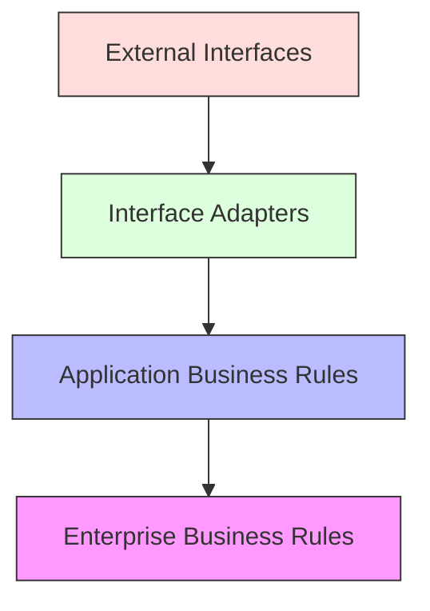
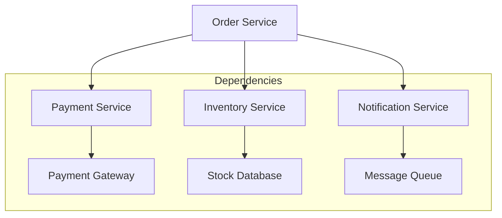

import Tabs from '@theme/Tabs';
import TabItem from '@theme/TabItem';

# 🔄 Dependency Management in Clean Architecture

## Overview

Dependency Management in Clean Architecture focuses on organizing and controlling dependencies between different layers while adhering to the Dependency Rule. The goal is to maintain a system where dependencies point inward, toward the core domain, ensuring that inner circles are independent of outer circles.

### Real World Analogy
Think of a modern hospital's organizational structure. The core medical staff (surgeons, doctors) doesn't depend on administrative systems, but administrative systems depend on medical staff information. Support services adapt to medical requirements, not vice versa. Similarly, in Clean Architecture, outer layers adapt to inner layers' needs.

## 🎯 Key Concepts

### Dependency Flow



### Core Principles

1. **Dependency Rule**
    - Inner layers know nothing about outer layers
    - Dependencies point inward
    - Crossing boundaries through interfaces

2. **Dependency Inversion**
    - High-level modules independent of low-level modules
    - Both depend on abstractions

3. **Interface Segregation**
    - Client-specific interfaces
    - Minimal dependencies

## 💻 Implementation

### Dependency Management Example

<Tabs>
  <TabItem value="java" label="Java">
```java
// Domain Layer (Innermost)
package com.example.domain;

public class Order {
private final OrderId id;
private final CustomerId customerId;
private final Money total;
private OrderStatus status;

    // Domain logic
}

// Application Layer Ports (Interfaces)
package com.example.application.port;

public interface OrderRepository {
void save(Order order);
Optional<Order> findById(OrderId id);
}

public interface PaymentGateway {
PaymentResult processPayment(Order order);
}

// Application Service
package com.example.application.service;

@UseCase
public class OrderProcessor {
private final OrderRepository orderRepository;
private final PaymentGateway paymentGateway;
private final EventPublisher eventPublisher;

    public OrderProcessor(
            OrderRepository orderRepository,
            PaymentGateway paymentGateway,
            EventPublisher eventPublisher) {
        this.orderRepository = orderRepository;
        this.paymentGateway = paymentGateway;
        this.eventPublisher = eventPublisher;
    }

    @Transactional
    public OrderId processOrder(CreateOrderCommand command) {
        // Implementation
    }
}

// Infrastructure Layer
package com.example.infrastructure.persistence;

@Repository
public class JpaOrderRepository implements OrderRepository {
private final JpaOrderEntityRepository jpaRepository;
private final OrderMapper mapper;

    public JpaOrderRepository(
            JpaOrderEntityRepository jpaRepository,
            OrderMapper mapper) {
        this.jpaRepository = jpaRepository;
        this.mapper = mapper;
    }

    @Override
    public void save(Order order) {
        OrderEntity entity = mapper.toEntity(order);
        jpaRepository.save(entity);
    }
}

// Configuration Management
@Configuration
public class ApplicationConfig {
@Bean
public OrderProcessor orderProcessor(
OrderRepository orderRepository,
PaymentGateway paymentGateway,
EventPublisher eventPublisher) {
return new OrderProcessor(
orderRepository,
paymentGateway,
eventPublisher
);
}

    @Bean
    public OrderRepository orderRepository(
            JpaOrderEntityRepository jpaRepository,
            OrderMapper mapper) {
        return new JpaOrderRepository(jpaRepository, mapper);
    }
}
```
  </TabItem>
  <TabItem value="go" label="Go">
```go
// Domain Layer
package domain

type Order struct {
    ID         OrderID
    CustomerID CustomerID
    Total      Money
    Status     OrderStatus
}

// Application Ports
package port

type OrderRepository interface {
    Save(order *domain.Order) error
    FindByID(id domain.OrderID) (*domain.Order, error)
}

type PaymentGateway interface {
    ProcessPayment(order *domain.Order) (*PaymentResult, error)
}

// Application Service
package application

type OrderProcessor struct {
    orderRepo  port.OrderRepository
    payment    port.PaymentGateway
    publisher  port.EventPublisher
}

func NewOrderProcessor(
    orderRepo port.OrderRepository,
    payment port.PaymentGateway,
    publisher port.EventPublisher) *OrderProcessor {
    
    return &OrderProcessor{
        orderRepo: orderRepo,
        payment:   payment,
        publisher: publisher,
    }
}

func (p *OrderProcessor) ProcessOrder(
    cmd CreateOrderCommand) (domain.OrderID, error) {
    // Implementation
}

// Infrastructure Layer
package infrastructure

type OrderRepository struct {
    db     *sql.DB
    mapper OrderMapper
}

func NewOrderRepository(
    db *sql.DB, 
    mapper OrderMapper) port.OrderRepository {
    
    return &OrderRepository{
        db:     db,
        mapper: mapper,
    }
}

func (r *OrderRepository) Save(
    order *domain.Order) error {
    entity := r.mapper.ToEntity(order)
    // Implementation
}

// Wire Configuration
package main

func setupApplication(cfg *Config) *application.OrderProcessor {
    db := initDatabase(cfg.Database)
    mapper := NewOrderMapper()
    
    orderRepo := infrastructure.NewOrderRepository(db, mapper)
    paymentGateway := infrastructure.NewPaymentGateway(cfg.Payment)
    eventPublisher := infrastructure.NewEventPublisher(cfg.Events)
    
    return application.NewOrderProcessor(
        orderRepo,
        paymentGateway,
        eventPublisher,
    )
}
```
  </TabItem>
</Tabs>

## 🔄 Related Patterns

1. **Dependency Injection Container**
    - Manages object creation and lifecycle
    - Resolves dependencies automatically
    - Supports testing through substitution

2. **Factory Pattern**
    - Creates complex objects
    - Hides implementation details
    - Supports dependency resolution

3. **Builder Pattern**
    - Constructs complex objects step by step
    - Manages optional dependencies
    - Supports immutable objects

## ✅ Best Practices

### Configuration
1. Use dependency injection
2. Configure at composition root
3. Externalize configuration
4. Use constructor injection

### Monitoring
1. Track dependency health
2. Monitor dependency lifecycles
3. Log dependency resolution
4. Implement circuit breakers

### Testing
1. Use mock dependencies
2. Test boundary interfaces
3. Verify dependency rules
4. Use test containers

## ⚠️ Common Pitfalls

1. **Circular Dependencies**
    - Symptom: Mutually dependent components
    - Solution: Redesign component boundaries

2. **Leaky Abstractions**
    - Symptom: Implementation details in interfaces
    - Solution: Design proper abstractions

3. **God Objects**
    - Symptom: Too many dependencies
    - Solution: Split responsibilities

4. **Hidden Dependencies**
    - Symptom: Dependencies created internally
    - Solution: Inject all dependencies

## 🎯 Use Cases

### 1. E-commerce Platform



### 2. Banking System
- Account management
- Transaction processing
- Reporting services

### 3. Healthcare Application
- Patient records
- Appointment scheduling
- Billing integration

## 🔍 Deep Dive Topics

### Thread Safety

1. **Thread-Safe Dependencies**
```java
@ThreadSafe
public class ThreadSafeService {
    private final ConcurrentMap<String, Dependency> dependencies;
    
    public Object process(String key) {
        return dependencies.computeIfAbsent(key, 
            this::createDependency);
    }
}
```

### Distributed Systems

1. **Remote Dependencies**
```java
public class RemoteServiceClient {
    private final CircuitBreaker circuitBreaker;
    private final RemoteService service;
    
    public Response execute(Request request) {
        return circuitBreaker.execute(() -> 
            service.process(request));
    }
}
```

### Performance

1. **Lazy Loading**
```java
public class LazyDependencyLoader {
    private volatile Dependency dependency;
    
    public Dependency get() {
        if (dependency == null) {
            synchronized (this) {
                if (dependency == null) {
                    dependency = createDependency();
                }
            }
        }
        return dependency;
    }
}
```

## 📚 Additional Resources

### Dependency Management Tools
1. Spring Framework (Java)
2. Wire (Go)
3. Guice (Java)
4. Fx (Go)

### Books
1. "Clean Architecture" by Robert C. Martin
2. "Dependency Injection" by Dhanji R. Prasanna
3. "Building Microservices" by Sam Newman

### References
1. [Martin Fowler - Inversion of Control](https://martinfowler.com/articles/injection.html)
2. [The Clean Architecture](https://blog.cleancoder.com/uncle-bob/2012/08/13/the-clean-architecture.html)

## ❓ FAQs

### Q: How to handle optional dependencies?
A: Use null object pattern or optional injection.

### Q: When to use service locator vs DI?
A: Prefer DI as it makes dependencies explicit.

### Q: How to manage transitive dependencies?
A: Use dependency injection containers and proper modularization.

### Q: Should I use field injection or constructor injection?
A: Prefer constructor injection for explicit dependencies and immutability.

### Q: How to handle dependency cycles?
A: Redesign components to remove cycles through abstractions or new boundaries.


