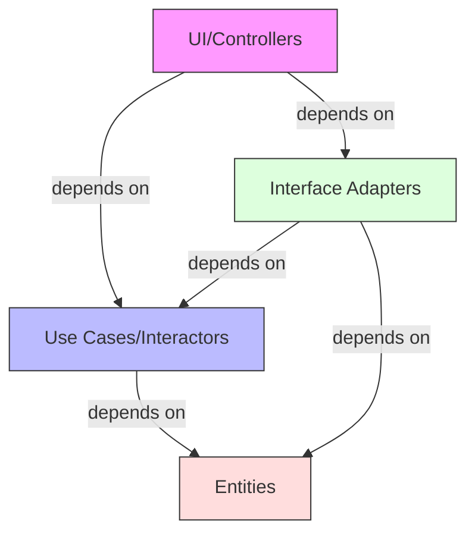

# 🔄 Clean Architecture Dependency Management Documentation

## Overview and Problem Statement <a name="overview"></a>

### Definition
Dependency Management in Clean Architecture focuses on organizing and controlling dependencies between different layers while adhering to the Dependency Rule: source code dependencies must point only inward, toward higher-level policies.

### Problems Solved
- Circular dependencies
- Tight coupling
- Testing complexity
- Change propagation
- Technical debt
- Framework lock-in

### Business Value
- Reduced maintenance costs
- Improved system flexibility
- Better testability
- Easier technology migrations
- Enhanced system longevity

## Detailed Solution/Architecture <a name="solution"></a>

### Dependency Flow Diagram



### Core Concepts

1. **Dependency Inversion Principle (DIP)**
2. **Interface Segregation**
3. **Dependency Injection**
4. **Ports and Adapters**

## Technical Implementation <a name="implementation"></a>

### 1. Dependency Container Setup

```typescript
// 1. Container configuration
class Container {
    private static instance: Container;
    private container: Map<string, Provider>;

    private constructor() {
        this.container = new Map();
    }

    static getInstance(): Container {
        if (!Container.instance) {
            Container.instance = new Container();
        }
        return Container.instance;
    }

    register<T>(token: string, provider: Provider<T>): void {
        this.container.set(token, provider);
    }

    resolve<T>(token: string): T {
        const provider = this.container.get(token);
        if (!provider) {
            throw new Error(`No provider found for ${token}`);
        }
        return provider.get();
    }
}

// 2. Provider implementations
interface Provider<T> {
    get(): T;
}

class SingletonProvider<T> implements Provider<T> {
    private instance: T | null = null;
    
    constructor(private factory: () => T) {}
    
    get(): T {
        if (!this.instance) {
            this.instance = this.factory();
        }
        return this.instance;
    }
}

class TransientProvider<T> implements Provider<T> {
    constructor(private factory: () => T) {}
    
    get(): T {
        return this.factory();
    }
}
```

### 2. Layer-specific Dependencies

```typescript
// 1. Entities (core domain) - No dependencies
class Order {
    constructor(
        public readonly id: string,
        public readonly items: OrderItem[],
        public readonly total: Money,
        public status: OrderStatus
    ) {}

    validateState(): boolean {
        return this.items.length > 0 && this.total.amount > 0;
    }
}

// 2. Use Cases - Depends on Entities and Ports
interface OrderRepository {
    save(order: Order): Promise<Order>;
    findById(id: string): Promise<Order | null>;
}

class CreateOrderUseCase {
    constructor(
        private readonly orderRepository: OrderRepository,
        private readonly paymentService: PaymentService
    ) {}

    async execute(request: CreateOrderRequest): Promise<CreateOrderResponse> {
        // Implementation
    }
}

// 3. Interface Adapters - Depends on Use Cases
class OrderRepositoryImpl implements OrderRepository {
    constructor(private readonly database: Database) {}

    async save(order: Order): Promise<Order> {
        // Implementation
    }

    async findById(id: string): Promise<Order | null> {
        // Implementation
    }
}

// 4. Frameworks - Depends on Interface Adapters
class OrderController {
    constructor(
        private readonly createOrder: CreateOrderUseCase,
        private readonly getOrder: GetOrderUseCase
    ) {}

    async createOrder(req: Request, res: Response): Promise<void> {
        // Implementation
    }
}
```

### 3. Dependency Registration

```typescript
// Application bootstrap
class ApplicationBootstrap {
    private container: Container;

    constructor() {
        this.container = Container.getInstance();
        this.registerDependencies();
    }

    private registerDependencies(): void {
        // Register infrastructure dependencies
        this.container.register(
            'Database',
            new SingletonProvider(() => new PostgresDatabase())
        );

        // Register repositories
        this.container.register(
            'OrderRepository',
            new SingletonProvider(() => 
                new OrderRepositoryImpl(
                    this.container.resolve('Database')
                )
            )
        );

        // Register use cases
        this.container.register(
            'CreateOrderUseCase',
            new TransientProvider(() => 
                new CreateOrderUseCase(
                    this.container.resolve('OrderRepository'),
                    this.container.resolve('PaymentService')
                )
            )
        );

        // Register controllers
        this.container.register(
            'OrderController',
            new SingletonProvider(() => 
                new OrderController(
                    this.container.resolve('CreateOrderUseCase'),
                    this.container.resolve('GetOrderUseCase')
                )
            )
        );
    }
}
```

## Best Practices & Guidelines <a name="best-practices"></a>

### 1. Interface Definition

```typescript
// 1. Keep interfaces focused and cohesive
interface OrderRepository {
    save(order: Order): Promise<Order>;
    findById(id: string): Promise<Order | null>;
    findByUserId(userId: string): Promise<Order[]>;
    delete(id: string): Promise<void>;
}

// 2. Use interface segregation
interface OrderReader {
    findById(id: string): Promise<Order | null>;
    findByUserId(userId: string): Promise<Order[]>;
}

interface OrderWriter {
    save(order: Order): Promise<Order>;
    delete(id: string): Promise<void>;
}

class OrderRepositoryImpl implements OrderReader, OrderWriter {
    // Implementation
}
```

### 2. Factory Pattern Usage

```typescript
// Abstract factory for creating use cases
interface UseCaseFactory {
    createOrderUseCase(): CreateOrderUseCase;
    getOrderUseCase(): GetOrderUseCase;
}

class UseCaseFactoryImpl implements UseCaseFactory {
    constructor(
        private readonly orderRepository: OrderRepository,
        private readonly paymentService: PaymentService
    ) {}

    createOrderUseCase(): CreateOrderUseCase {
        return new CreateOrderUseCase(
            this.orderRepository,
            this.paymentService
        );
    }

    getOrderUseCase(): GetOrderUseCase {
        return new GetOrderUseCase(this.orderRepository);
    }
}
```

## Anti-Patterns <a name="anti-patterns"></a>

### ❌ Common Mistakes

1. **Direct Framework Dependencies**
```typescript
// Bad: Domain logic depending on framework
class Order {
    async save() {
        const db = new MongoDB(); // Direct framework dependency
        await db.collection('orders').insertOne(this);
    }
}
```

2. **Circular Dependencies**
```typescript
// Bad: Circular dependency between modules
// order.service.ts
import { UserService } from './user.service';

export class OrderService {
    constructor(private userService: UserService) {}
}

// user.service.ts
import { OrderService } from './order.service';

export class UserService {
    constructor(private orderService: OrderService) {}
}
```

### ✅ Correct Implementations

1. **Clean Dependencies**
```typescript
// Good: Using dependency injection
class Order {
    // Domain logic only
    calculateTotal(): Money {
        return this.items.reduce(
            (total, item) => total.add(item.price),
            Money.zero()
        );
    }
}

class OrderRepository {
    constructor(private readonly database: Database) {}

    async save(order: Order): Promise<void> {
        await this.database.save('orders', order);
    }
}
```

2. **Breaking Circular Dependencies**
```typescript
// Good: Using events to break circular dependencies
interface OrderCreatedEvent {
    orderId: string;
    userId: string;
    total: Money;
}

class OrderService {
    constructor(
        private eventBus: EventBus,
        private orderRepository: OrderRepository
    ) {}

    async createOrder(data: CreateOrderData): Promise<Order> {
        const order = await this.orderRepository.save(data);
        this.eventBus.publish('OrderCreated', {
            orderId: order.id,
            userId: order.userId,
            total: order.total
        });
        return order;
    }
}

class UserService {
    constructor(private eventBus: EventBus) {
        this.eventBus.subscribe('OrderCreated', this.handleOrderCreated);
    }

    private handleOrderCreated(event: OrderCreatedEvent): void {
        // Handle order creation
    }
}
```

## Testing Strategies <a name="testing"></a>

### Unit Testing with Dependencies

```typescript
describe('CreateOrderUseCase', () => {
    let useCase: CreateOrderUseCase;
    let orderRepository: jest.Mocked<OrderRepository>;
    let paymentService: jest.Mocked<PaymentService>;

    beforeEach(() => {
        orderRepository = {
            save: jest.fn(),
            findById: jest.fn()
        };

        paymentService = {
            processPayment: jest.fn()
        };

        useCase = new CreateOrderUseCase(
            orderRepository,
            paymentService
        );
    });

    it('should create order successfully', async () => {
        // Arrange
        const request = createTestOrderRequest();
        const expectedOrder = createTestOrder();
        orderRepository.save.mockResolvedValue(expectedOrder);
        paymentService.processPayment.mockResolvedValue({
            success: true
        });

        // Act
        const result = await useCase.execute(request);

        // Assert
        expect(result.orderId).toBe(expectedOrder.id);
        expect(orderRepository.save).toHaveBeenCalledWith(
            expect.objectContaining({
                items: request.items
            })
        );
    });
});
```

## Real-world Use Cases <a name="real-world"></a>

### E-commerce System Example

```typescript
// 1. Module definition
@Module({
    imports: [
        DatabaseModule,
        PaymentModule,
        NotificationModule
    ],
    providers: [
        {
            provide: 'OrderRepository',
            useClass: OrderRepositoryImpl
        },
        {
            provide: 'PaymentService',
            useClass: PaymentServiceImpl
        },
        {
            provide: CreateOrderUseCase,
            useFactory: (orderRepo, paymentService) => {
                return new CreateOrderUseCase(orderRepo, paymentService);
            },
            inject: ['OrderRepository', 'PaymentService']
        }
    ],
    controllers: [OrderController]
})
export class OrderModule {}

// 2. Use case implementation
class CreateOrderUseCase {
    constructor(
        @Inject('OrderRepository')
        private readonly orderRepository: OrderRepository,
        @Inject('PaymentService')
        private readonly paymentService: PaymentService,
        @Inject('NotificationService')
        private readonly notificationService: NotificationService
    ) {}

    async execute(request: CreateOrderRequest): Promise<CreateOrderResponse> {
        // Create order
        const order = await this.orderRepository.save(
            new Order(request)
        );

        // Process payment
        const payment = await this.paymentService.processPayment({
            orderId: order.id,
            amount: order.total
        });

        // Send notification
        await this.notificationService.notify({
            type: 'ORDER_CREATED',
            orderId: order.id,
            userId: order.userId
        });

        return {
            orderId: order.id,
            status: order.status,
            paymentId: payment.id
        };
    }
}
```

## FAQ Section <a name="faq"></a>

1. **Q: How to handle cross-cutting concerns?**
   A: Use decorators or middleware:
   ```typescript
   @Injectable()
   class LoggingDecorator implements UseCase<Request, Response> {
       constructor(
           @Inject(forwardRef(() => UseCase))
           private useCase: UseCase<Request, Response>,
           private logger: Logger
       ) {}

       async execute(request: Request): Promise<Response> {
           this.logger.info('Starting use case', { request });
           const response = await this.useCase.execute(request);
           this.logger.info('Completed use case', { response });
           return response;
       }
   }
   ```

2. **Q: How to manage configuration dependencies?**
   A: Use configuration providers:
   ```typescript
   @Injectable()
   class ConfigurationProvider {
       private config: Configuration;

       constructor() {
           this.config = this.loadConfiguration();
       }

       get<T>(key: string): T {
           return this.config[key];
       }

       private loadConfiguration(): Configuration {
           // Load from environment variables, files, etc.
       }
   }
   ```

## References <a name="references"></a>

### Books
- "Clean Architecture" by Robert C. Martin
- "Dependency Injection Principles, Practices, and Patterns" by Steven van Deursen & Mark Seemann
- "Building Microservices" by Sam Newman

### Articles
- "Dependency Injection in Clean Architecture"
- "Managing Dependencies in Large Scale Applications"
- "Clean Architecture: Dependencies Management"

### Online Resources
- Clean Architecture GitHub Examples
- Dependency Injection Patterns
- Clean Code Principles