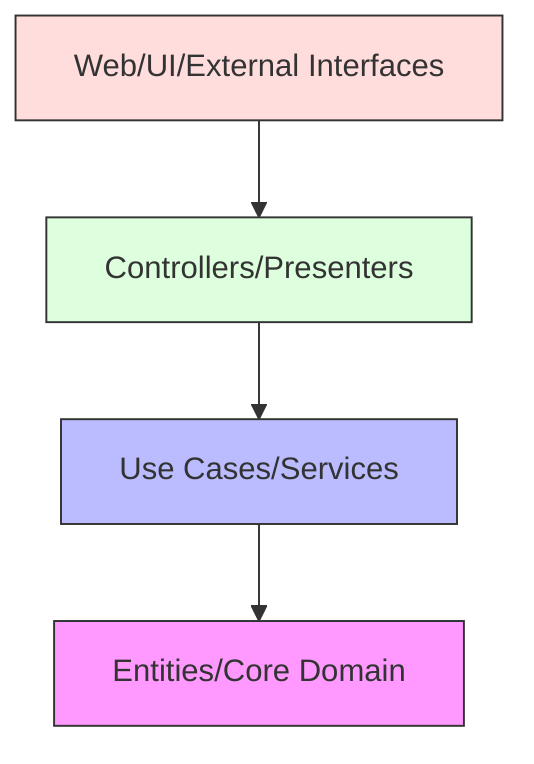
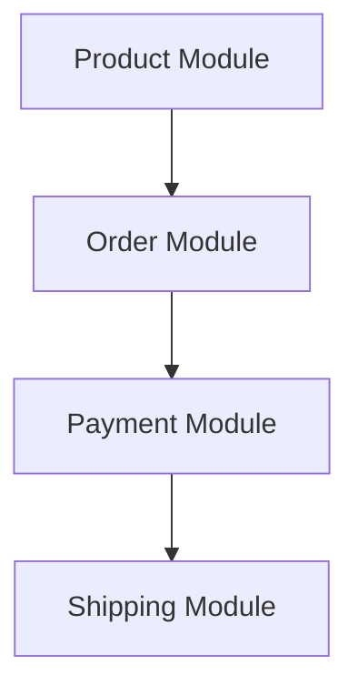

import Tabs from '@theme/Tabs';
import TabItem from '@theme/TabItem';

# 📁 Clean Architecture Project Structure

## Overview

Clean Architecture project structure organizes code in a way that emphasizes separation of concerns, maintainability, and testability. The structure follows the dependency rule, with dependencies pointing inward toward the core business logic.

### Real World Analogy
Think of a large city's urban planning. At the center is the historical district (core domain), surrounded by residential areas (use cases), then commercial zones (interfaces), and finally the outer infrastructure (frameworks). Each zone has specific rules and purposes, with clear boundaries and controlled access between them.

## 🎯 Key Concepts

### Architectural Layers



### Directory Structure

```
src/
├── domain/           # Enterprise Business Rules
│   ├── entity/
│   ├── model/
│   └── value/
├── application/      # Application Business Rules
│   ├── usecase/
│   ├── port/
│   └── service/
├── interface/        # Interface Adapters
│   ├── controller/
│   ├── presenter/
│   └── repository/
├── infrastructure/   # Frameworks & Drivers
│   ├── config/
│   ├── persistence/
│   └── external/
└── main/            # Entry Point & Configuration
```

## 💻 Implementation

### Project Structure Example

<Tabs>
  <TabItem value="java" label="Java">
```java
// Domain Layer
package com.example.domain.entity;

public class User {
private final UserId id;
private String name;
private Email email;

    // Domain logic and behavior
}

// Application Layer
package com.example.application.port.in;

public interface CreateUserUseCase {
UserId createUser(CreateUserCommand command);
}

package com.example.application.port.out;

public interface UserRepository {
void save(User user);
Optional<User> findById(UserId id);
}

package com.example.application.service;

@Service
@Transactional
public class CreateUserService implements CreateUserUseCase {
private final UserRepository userRepository;
private final PasswordEncoder passwordEncoder;

    public UserId createUser(CreateUserCommand command) {
        // Application logic
    }
}

// Interface Layer
package com.example.interface.controller;

@RestController
@RequestMapping("/api/users")
public class UserController {
private final CreateUserUseCase createUserUseCase;

    @PostMapping
    public ResponseEntity<UserResponse> createUser(@RequestBody UserRequest request) {
        // Controller logic
    }
}

package com.example.interface.repository;

@Repository
public class JpaUserRepository implements UserRepository {
private final SpringDataUserRepository repository;
private final UserMapper mapper;

    @Override
    public void save(User user) {
        // Repository implementation
    }
}

// Infrastructure Layer
package com.example.infrastructure.config;

@Configuration
public class PersistenceConfig {
@Bean
public DataSource dataSource() {
// Configuration
}
}

// Main Application
package com.example;

@SpringBootApplication
public class Application {
public static void main(String[] args) {
SpringApplication.run(Application.class, args);
}
}
```
  </TabItem>
  <TabItem value="go" label="Go">
```go
// Domain Layer
package domain

type User struct {
    ID    UserID
    Name  string
    Email Email
}

// Application Layer
package port

type CreateUserUseCase interface {
    CreateUser(cmd CreateUserCommand) (UserID, error)
}

type UserRepository interface {
    Save(user *domain.User) error
    FindByID(id UserID) (*domain.User, error)
}

package service

type CreateUserService struct {
    userRepo    port.UserRepository
    passEncoder port.PasswordEncoder
}

func NewCreateUserService(
    repo port.UserRepository,
    encoder port.PasswordEncoder) *CreateUserService {
    return &CreateUserService{
        userRepo:    repo,
        passEncoder: encoder,
    }
}

func (s *CreateUserService) CreateUser(
    cmd CreateUserCommand) (UserID, error) {
    // Application logic
}

// Interface Layer
package handler

type UserHandler struct {
    createUser port.CreateUserUseCase
}

func NewUserHandler(createUser port.CreateUserUseCase) *UserHandler {
    return &UserHandler{
        createUser: createUser,
    }
}

func (h *UserHandler) CreateUser(w http.ResponseWriter, r *http.Request) {
    // Handler logic
}

package repository

type UserRepository struct {
    db     *sql.DB
    mapper UserMapper
}

func (r *UserRepository) Save(user *domain.User) error {
    // Repository implementation
}

// Infrastructure Layer
package config

type Config struct {
    DB   DatabaseConfig
    HTTP HTTPConfig
}

func LoadConfig() (*Config, error) {
    // Configuration loading
}

// Main Application
package main

func main() {
    cfg := config.MustLoad()
    
    db := initDB(cfg.DB)
    repo := repository.NewUserRepository(db)
    service := service.NewCreateUserService(repo)
    handler := handler.NewUserHandler(service)
    
    server := NewServer(handler)
    server.Start()
}
```
  </TabItem>
</Tabs>

## 🔄 Related Patterns

1. **Hexagonal Architecture (Ports and Adapters)**
    - Similar layering concept
    - Focus on ports and adapters
    - Complements Clean Architecture structure

2. **DDD Layered Architecture**
    - Domain-centric approach
    - Strategic and tactical patterns
    - Natural fit with Clean Architecture

3. **CQRS Pattern**
    - Separates read and write operations
    - Can be implemented within Clean Architecture
    - Enhances scalability

## ✅ Best Practices

### Project Organization
1. Follow consistent naming conventions
2. Maintain clear package boundaries
3. Use meaningful directory names
4. Keep related files together

### Module Dependencies
1. Enforce dependency rules
2. Use interfaces for abstraction
3. Implement proper dependency injection
4. Maintain modular independence

### Code Organization
1. Group by feature within layers
2. Use consistent file naming
3. Implement clean interfaces
4. Maintain proper visibility

## ⚠️ Common Pitfalls

1. **Circular Dependencies**
    - Symptom: Layers depending on each other
    - Solution: Enforce dependency rule strictly

2. **Feature Scatter**
    - Symptom: Related code spread across layers
    - Solution: Organize by feature within layers

3. **Leaky Abstractions**
    - Symptom: Implementation details in interfaces
    - Solution: Design proper abstractions

4. **Over-engineering**
    - Symptom: Too many layers/abstractions
    - Solution: Keep it simple, follow YAGNI

## 🎯 Use Cases

### 1. E-commerce Platform


### 2. Banking System
- Account management
- Transaction processing
- Reporting system

### 3. Healthcare Application
- Patient records
- Appointment scheduling
- Billing system

## 🔍 Deep Dive Topics

### Module Communication

1. **Event-Based Communication**
```java
// Domain Events
public interface DomainEvent {}

public class UserCreatedEvent implements DomainEvent {
    private final UserId userId;
    
    // Event details
}

// Event Publisher
public interface EventPublisher {
    void publish(DomainEvent event);
}

// Event Handler
@Component
public class UserCreatedHandler {
    @EventListener
    public void handle(UserCreatedEvent event) {
        // Handle event
    }
}
```

### Dependency Management

1. **Module Dependencies**
```xml
<!-- Maven module structure -->
<modules>
    <module>domain</module>
    <module>application</module>
    <module>interface</module>
    <module>infrastructure</module>
</modules>
```

### Performance Considerations

1. **Package Organization for Performance**
```java
// Feature-based package structure
com.example.user
    ├── domain
    ├── application
    ├── interface
    └── infrastructure
```

## 📚 Additional Resources

### Build Tools
1. Maven (Java)
2. Gradle
3. Go Modules
4. Make

### Project Templates
1. Spring Boot Clean Architecture template
2. Go Clean Architecture template
3. Project generator tools

### References
1. [Clean Architecture Book](https://blog.cleancoder.com/uncle-bob/2012/08/13/the-clean-architecture.html)
2. [Implementing Clean Architecture](https://www.freecodecamp.org/news/implementing-clean-architecture-using-spring-boot/)

## ❓ FAQs

### Q: How strict should package boundaries be?
A: Very strict. Dependencies should only point inward.

### Q: Where should configuration files go?
A: In the infrastructure layer, with interfaces in application layer.

### Q: How to handle cross-cutting concerns?
A: Use aspects or decorators at appropriate layer boundaries.

### Q: Should I create separate modules for each layer?
A: Yes, for large projects. Small projects can use packages.

### Q: How to handle shared code?
A: Create a shared kernel or common module while maintaining dependency rules.
