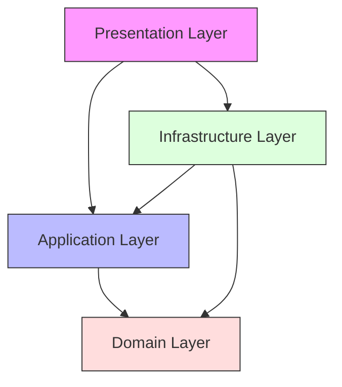

# 📁 Clean Architecture Project Structure Documentation

## Overview and Project Organization <a name="overview"></a>

### Core Principles
- Separation of concerns
- Independence of frameworks
- Dependency rule compliance
- Testability
- Maintainability
- Scalability

### Project Layers


## Directory Structure <a name="structure"></a>

### Base Structure

```plaintext
src/
├── domain/                 # Enterprise business rules
│   ├── entities/          # Business objects
│   ├── value-objects/     # Immutable values
│   └── interfaces/        # Core interfaces
│
├── application/           # Application business rules
│   ├── use-cases/        # Business operations
│   ├── interfaces/       # Port definitions
│   └── dto/              # Data transfer objects
│
├── infrastructure/        # External interfaces
│   ├── database/         # Database implementations
│   ├── external/         # External services
│   └── persistence/      # Repository implementations
│
├── presentation/         # UI/API Layer
│   ├── api/             # REST API controllers
│   ├── graphql/         # GraphQL resolvers
│   └── web/             # Web controllers
│
├── common/              # Shared utilities
│   ├── errors/         # Custom errors
│   ├── types/          # Type definitions
│   └── utils/          # Utility functions
│
└── config/             # Configuration management
    ├── env/           # Environment configs
    └── di/            # Dependency injection
```

### Detailed Domain Layer Structure

```plaintext
domain/
├── entities/
│   ├── user/
│   │   ├── user.entity.ts
│   │   ├── user.types.ts
│   │   └── user.spec.ts
│   └── order/
│       ├── order.entity.ts
│       ├── order.types.ts
│       └── order.spec.ts
│
├── value-objects/
│   ├── money.vo.ts
│   ├── email.vo.ts
│   └── address.vo.ts
│
├── interfaces/
│   ├── repositories/
│   │   ├── user.repository.ts
│   │   └── order.repository.ts
│   └── services/
│       ├── payment.service.ts
│       └── notification.service.ts
│
└── events/
    ├── order-created.event.ts
    └── user-registered.event.ts
```

### Application Layer Organization

```plaintext
application/
├── use-cases/
│   ├── user/
│   │   ├── create-user/
│   │   │   ├── create-user.usecase.ts
│   │   │   ├── create-user.dto.ts
│   │   │   └── create-user.spec.ts
│   │   └── update-user/
│   │       ├── update-user.usecase.ts
│   │       ├── update-user.dto.ts
│   │       └── update-user.spec.ts
│   └── order/
│       ├── create-order/
│       └── cancel-order/
│
├── interfaces/
│   ├── repositories/
│   └── services/
│
└── dto/
    ├── user.dto.ts
    └── order.dto.ts
```

## Module Organization <a name="modules"></a>

### Feature Module Structure

```typescript
// users/user.module.ts
@Module({
    imports: [
        TypeOrmModule.forFeature([UserEntity]),
        CommonModule
    ],
    providers: [
        {
            provide: 'UserRepository',
            useClass: UserRepositoryImpl
        },
        {
            provide: CreateUserUseCase,
            useFactory: (userRepo) => new CreateUserUseCase(userRepo),
            inject: ['UserRepository']
        },
        {
            provide: UpdateUserUseCase,
            useFactory: (userRepo) => new UpdateUserUseCase(userRepo),
            inject: ['UserRepository']
        }
    ],
    controllers: [UserController],
    exports: ['UserRepository']
})
export class UserModule {}
```

### Domain Module Example

```typescript
// domain/user/user.module.ts
export interface User {
    id: string;
    email: Email;
    name: string;
    status: UserStatus;
}

export class UserEntity implements User {
    constructor(
        public readonly id: string,
        public readonly email: Email,
        public name: string,
        public status: UserStatus
    ) {}

    activate(): void {
        if (this.status === UserStatus.PENDING) {
            this.status = UserStatus.ACTIVE;
        } else {
            throw new InvalidOperationError(
                'User must be in PENDING status to activate'
            );
        }
    }

    update(data: Partial<User>): void {
        Object.assign(this, data);
    }
}

export interface UserRepository {
    save(user: User): Promise<User>;
    findById(id: string): Promise<User | null>;
    findByEmail(email: Email): Promise<User | null>;
}
```

### Use Case Module Example

```typescript
// application/use-cases/user/create-user/create-user.usecase.ts
export interface CreateUserRequest {
    email: string;
    name: string;
    password: string;
}

export interface CreateUserResponse {
    id: string;
    email: string;
    name: string;
    status: UserStatus;
}

export class CreateUserUseCase implements UseCase<CreateUserRequest, CreateUserResponse> {
    constructor(
        private readonly userRepository: UserRepository,
        private readonly passwordHasher: PasswordHasher,
        private readonly eventBus: EventBus
    ) {}

    async execute(request: CreateUserRequest): Promise<CreateUserResponse> {
        // Validate email format
        const email = new Email(request.email);

        // Check if user exists
        const existingUser = await this.userRepository.findByEmail(email);
        if (existingUser) {
            throw new UserAlreadyExistsError(email.value);
        }

        // Create user entity
        const user = new UserEntity({
            id: generateId(),
            email,
            name: request.name,
            status: UserStatus.PENDING,
            passwordHash: await this.passwordHasher.hash(request.password)
        });

        // Save user
        const savedUser = await this.userRepository.save(user);

        // Publish event
        await this.eventBus.publish(new UserCreatedEvent(savedUser));

        // Return response
        return {
            id: savedUser.id,
            email: savedUser.email.value,
            name: savedUser.name,
            status: savedUser.status
        };
    }
}
```

### Infrastructure Module Example

```typescript
// infrastructure/persistence/user/user.repository.ts
@Injectable()
export class UserRepositoryImpl implements UserRepository {
    constructor(
        @InjectRepository(UserEntity)
        private readonly repository: Repository<UserEntity>
    ) {}

    async save(user: User): Promise<User> {
        const userEntity = this.repository.create(user);
        return this.repository.save(userEntity);
    }

    async findById(id: string): Promise<User | null> {
        const user = await this.repository.findOne({ where: { id } });
        return user ? this.toDomain(user) : null;
    }

    private toDomain(entity: UserEntity): User {
        return new User({
            id: entity.id,
            email: new Email(entity.email),
            name: entity.name,
            status: entity.status
        });
    }
}
```

## Configuration Management <a name="configuration"></a>

### Environment Configuration

```typescript
// config/env/env.config.ts
@Injectable()
export class EnvironmentConfig {
    private readonly config: Record<string, any>;

    constructor() {
        this.config = {
            database: {
                host: process.env.DB_HOST,
                port: parseInt(process.env.DB_PORT || '5432'),
                username: process.env.DB_USERNAME,
                password: process.env.DB_PASSWORD,
                database: process.env.DB_NAME
            },
            app: {
                port: parseInt(process.env.APP_PORT || '3000'),
                env: process.env.NODE_ENV || 'development'
            }
        };
    }

    get<T>(key: string): T {
        return get(this.config, key);
    }
}
```

### Dependency Injection Configuration

```typescript
// config/di/container.config.ts
export const container = new Container();

// Register core services
container.register(
    'Logger',
    { useClass: LoggerService },
    { lifecycle: Lifecycle.Singleton }
);

container.register(
    'EventBus',
    { useClass: EventBusService },
    { lifecycle: Lifecycle.Singleton }
);

// Register repositories
container.register(
    'UserRepository',
    { useClass: UserRepositoryImpl },
    { lifecycle: Lifecycle.Singleton }
);

// Register use cases
container.register(
    'CreateUserUseCase',
    {
        useFactory: (container) => {
            return new CreateUserUseCase(
                container.resolve('UserRepository'),
                container.resolve('PasswordHasher'),
                container.resolve('EventBus')
            );
        }
    },
    { lifecycle: Lifecycle.Transient }
);
```

## Best Practices & Guidelines <a name="best-practices"></a>

### 1. File Naming Conventions

```plaintext
# Pattern: <name>.<type>.<extension>

✅ Good Examples:
user.entity.ts
create-user.usecase.ts
user.repository.ts
user-created.event.ts

❌ Bad Examples:
user.ts
createUser.ts
UserRepo.ts
userCreated.ts
```

### 2. Module Organization

```typescript
// Feature-based organization
feature/
├── domain/
│   └── feature.entity.ts
├── application/
│   └── use-cases/
│       └── feature.usecase.ts
├── infrastructure/
│   └── feature.repository.ts
└── presentation/
    └── feature.controller.ts

// Layer-based organization
src/
├── domain/
│   └── feature/
│       └── feature.entity.ts
├── application/
│   └── feature/
│       └── feature.usecase.ts
└── infrastructure/
    └── feature/
        └── feature.repository.ts
```

## Anti-Patterns <a name="anti-patterns"></a>

### ❌ Common Mistakes

1. **Mixed Layer Dependencies**
```typescript
// Bad: Domain entity depending on infrastructure
import { Column, Entity } from 'typeorm';

@Entity()
export class User {
    @Column()
    email: string;
}
```

2. **Direct Framework Usage**
```typescript
// Bad: Use case directly using framework
export class CreateUserUseCase {
    @Inject()
    private userRepository: UserRepository;
}
```

### ✅ Correct Implementations

1. **Clean Layer Separation**
```typescript
// Domain Entity
export class User {
    constructor(
        public readonly id: string,
        public readonly email: Email,
        public readonly name: string
    ) {}
}

// Infrastructure
@Entity('users')
export class UserSchema {
    @Column()
    email: string;

    toDomain(): User {
        return new User(this.id, new Email(this.email), this.name);
    }
}
```

2. **Proper Dependency Injection**
```typescript
export class CreateUserUseCase {
    constructor(
        private readonly userRepository: UserRepository,
        private readonly eventBus: EventBus
    ) {}
}
```

## Real-world Examples <a name="examples"></a>

### E-commerce System Structure

```plaintext
src/
├── modules/
│   ├── orders/
│   │   ├── domain/
│   │   │   ├── order.entity.ts
│   │   │   ├── line-item.entity.ts
│   │   │   └── order-status.enum.ts
│   │   ├── application/
│   │   │   ├── create-order/
│   │   │   │   ├── create-order.usecase.ts
│   │   │   │   └── create-order.dto.ts
│   │   │   └── cancel-order/
│   │   ├── infrastructure/
│   │   │   ├── order.repository.ts
│   │   │   └── order.schema.ts
│   │   └── presentation/
│   │       └── order.controller.ts
│   └── products/
│       └── ...
│
├── shared/
│   ├── domain/
│   │   ├── value-objects/
│   │   └── interfaces/
│   ├── infrastructure/
│   │   ├── database/
│   │   └── messaging/
│   └── utils/
│
└── config/
    ├── database.config.ts
    └── app.config.ts
```

## FAQ Section <a name="faq"></a>

1. **Q: How to handle shared code between modules?**
   A: Create a shared module:
   ```plaintext
   shared/
   ├── domain/
   │   └── value-objects/
   ├── infrastructure/
   │   └── common-services/
   └── utils/
   ```

2. **Q: Where to put validation logic?**
   A:
   - Domain validation in entities
   - Input validation in use cases
   - Schema validation in controllers

3. **Q: How to organize tests?**
   A: Follow the same structure as source code:
   ```plaintext
   src/
   ├── domain/
   │   └── __tests__/
   ├── application/
   │   └── __tests__/
   └── infrastructure/
       └── __tests__/
   ```

## References <a name="references"></a>

### Books
- "Clean Architecture" by Robert C. Martin
- "Implementing Domain-Driven Design" by Vaughn Vernon
- "Domain-Driven Design" by Eric Evans

### Articles
- "Clean Architecture Project Structure"
- "Organizing Code in Clean Architecture"
- "Module Organization Patterns"

### Online Resources
- Clean Architecture GitHub Examples
- DDD Sample Projects
- Enterprise Architecture Patterns