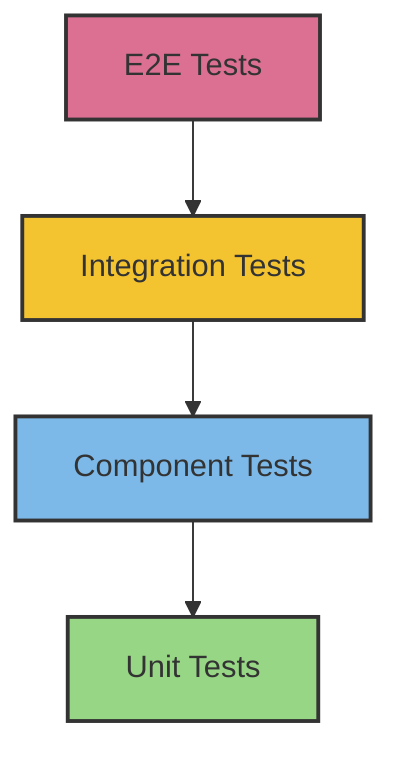
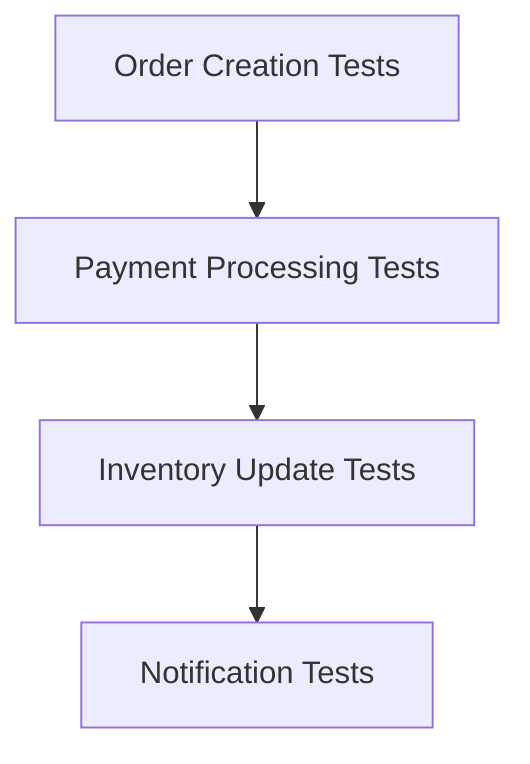

import Tabs from '@theme/Tabs';
import TabItem from '@theme/TabItem';

# 🧪 Testing Strategy in Clean Architecture

## Overview

A Clean Architecture testing strategy ensures that each architectural layer is properly tested while maintaining the dependency rule. Tests are organized to match the architecture's layers, with specific testing approaches for each level.

### Real World Analogy
Think of quality control in car manufacturing. Each component is tested individually (unit tests), then assemblies are tested together (integration tests), and finally the complete car is road-tested (end-to-end tests). Just as a car manufacturer needs different testing approaches for different parts, Clean Architecture requires specific testing strategies for each layer.

## 🎯 Key Concepts

### Testing Pyramid



### Test Types by Layer

1. **Domain Layer Tests**
    - Pure unit tests
    - No dependencies
    - Business rule validation

2. **Use Case Tests**
    - Integration tests
    - Mocked dependencies
    - Business flow validation

3. **Interface Adapter Tests**
    - Component tests
    - Contract testing
    - Integration testing

4. **Framework Layer Tests**
    - Integration tests
    - Configuration testing
    - External system testing

## 💻 Implementation

### Testing Examples by Layer

<Tabs>
  <TabItem value="java" label="Java">
```java
// Domain Entity Tests
package com.example.domain;

@DisplayName("Order Entity Tests")
class OrderTest {
@Test
void shouldCalculateTotal() {
Order order = new Order(new CustomerId("123"));
order.addItem(new Product("P1", Money.of(10)), 2);
order.addItem(new Product("P2", Money.of(20)), 1);

        assertEquals(Money.of(40), order.getTotal());
    }
    
    @Test
    void shouldNotAllowNegativeQuantity() {
        Order order = new Order(new CustomerId("123"));
        assertThrows(IllegalArgumentException.class,
            () -> order.addItem(new Product("P1", Money.of(10)), -1));
    }
}

// Use Case Tests
@ExtendWith(MockitoExtension.class)
class CreateOrderUseCaseTest {
@Mock
private OrderRepository orderRepository;

    @Mock
    private PaymentGateway paymentGateway;
    
    @InjectMocks
    private CreateOrderUseCase useCase;
    
    @Test
    void shouldCreateOrder() {
        // Arrange
        CreateOrderCommand command = new CreateOrderCommand(
            "123", Arrays.asList(new OrderItem("P1", 2)));
        
        // Act
        OrderId result = useCase.createOrder(command);
        
        // Assert
        verify(orderRepository).save(any(Order.class));
        verify(paymentGateway).processPayment(any(Payment.class));
        assertNotNull(result);
    }
}

// Controller Tests
@WebMvcTest(OrderController.class)
class OrderControllerTest {
@Autowired
private MockMvc mockMvc;

    @MockBean
    private CreateOrderUseCase createOrderUseCase;
    
    @Test
    void shouldCreateOrder() throws Exception {
        // Arrange
        OrderRequest request = new OrderRequest();
        when(createOrderUseCase.createOrder(any()))
            .thenReturn(new OrderId("123"));
        
        // Act & Assert
        mockMvc.perform(post("/api/orders")
            .contentType(MediaType.APPLICATION_JSON)
            .content(objectMapper.writeValueAsString(request)))
            .andExpect(status().isCreated())
            .andExpect(jsonPath("$.orderId").value("123"));
    }
}

// Integration Tests
@SpringBootTest
class OrderFlowIntegrationTest {
@Autowired
private OrderRepository orderRepository;

    @Autowired
    private CreateOrderUseCase createOrderUseCase;
    
    @Test
    void shouldCreateAndStoreOrder() {
        // Arrange
        CreateOrderCommand command = new CreateOrderCommand(
            "123", Arrays.asList(new OrderItem("P1", 2)));
        
        // Act
        OrderId orderId = createOrderUseCase.createOrder(command);
        
        // Assert
        Optional<Order> storedOrder = orderRepository.findById(orderId);
        assertTrue(storedOrder.isPresent());
        assertEquals(2, storedOrder.get().getItems().size());
    }
}
```
  </TabItem>
  <TabItem value="go" label="Go">
```go
// Domain Entity Tests
package domain_test

func TestOrder_CalculateTotal(t *testing.T) {
    // Arrange
    order := domain.NewOrder("123")
    order.AddItem(domain.NewProduct("P1", money.New(10)), 2)
    order.AddItem(domain.NewProduct("P2", money.New(20)), 1)
    
    // Act
    total := order.GetTotal()
    
    // Assert
    assert.Equal(t, money.New(40), total)
}

func TestOrder_NegativeQuantity(t *testing.T) {
    // Arrange
    order := domain.NewOrder("123")
    
    // Act & Assert
    assert.Panics(t, func() {
        order.AddItem(domain.NewProduct("P1", money.New(10)), -1)
    })
}

// Use Case Tests
type CreateOrderUseCaseTest struct {
    useCase       *usecase.CreateOrderUseCase
    orderRepo     *mocks.OrderRepository
    paymentGateway *mocks.PaymentGateway
}

func TestCreateOrderUseCase(t *testing.T) {
    // Arrange
    ctrl := gomock.NewController(t)
    defer ctrl.Finish()
    
    orderRepo := mocks.NewMockOrderRepository(ctrl)
    paymentGateway := mocks.NewMockPaymentGateway(ctrl)
    useCase := usecase.NewCreateOrderUseCase(orderRepo, paymentGateway)
    
    // Expect
    orderRepo.EXPECT().Save(gomock.Any()).Return(nil)
    paymentGateway.EXPECT().ProcessPayment(gomock.Any()).Return(nil)
    
    // Act
    result, err := useCase.CreateOrder(CreateOrderCommand{
        CustomerID: "123",
        Items: []OrderItem{{ProductID: "P1", Quantity: 2}},
    })
    
    // Assert
    assert.NoError(t, err)
    assert.NotEmpty(t, result)
}

// Handler Tests
func TestOrderHandler_CreateOrder(t *testing.T) {
    // Arrange
    ctrl := gomock.NewController(t)
    defer ctrl.Finish()
    
    useCase := mocks.NewMockCreateOrderUseCase(ctrl)
    handler := handler.NewOrderHandler(useCase)
    
    useCase.EXPECT().CreateOrder(gomock.Any()).Return("123", nil)
    
    // Create test server
    router := chi.NewRouter()
    router.Post("/orders", handler.CreateOrder)
    
    // Create test request
    request := OrderRequest{
        CustomerID: "123",
        Items: []OrderItem{{ProductID: "P1", Quantity: 2}},
    }
    body, _ := json.Marshal(request)
    
    // Act
    w := httptest.NewRecorder()
    r := httptest.NewRequest("POST", "/orders", bytes.NewReader(body))
    router.ServeHTTP(w, r)
    
    // Assert
    assert.Equal(t, http.StatusCreated, w.Code)
    
    var response map[string]string
    json.Unmarshal(w.Body.Bytes(), &response)
    assert.Equal(t, "123", response["orderId"])
}

// Integration Tests
func TestOrderFlow_Integration(t *testing.T) {
    // Skip in short mode
    if testing.Short() {
        t.Skip()
    }
    
    // Setup
    db := setupTestDatabase(t)
    orderRepo := postgres.NewOrderRepository(db)
    useCase := usecase.NewCreateOrderUseCase(orderRepo)
    
    // Act
    orderId, err := useCase.CreateOrder(CreateOrderCommand{
        CustomerID: "123",
        Items: []OrderItem{{ProductID: "P1", Quantity: 2}},
    })
    
    // Assert
    assert.NoError(t, err)
    
    storedOrder, err := orderRepo.FindByID(orderId)
    assert.NoError(t, err)
    assert.NotNil(t, storedOrder)
    assert.Len(t, storedOrder.Items, 2)
}
```
  </TabItem>
</Tabs>

## 🔄 Related Patterns

1. **Test Double Patterns**
    - Mocks for external dependencies
    - Stubs for predetermined responses
    - Spies for behavior verification

2. **Builder Pattern for Test Data**
    - Creates test objects
    - Maintains test readability
    - Supports test maintenance

3. **Test Container Pattern**
    - Manages test dependencies
    - Provides isolation
    - Supports integration testing

## ✅ Best Practices

### Test Organization
1. Mirror production code structure
2. Group tests by feature
3. Use descriptive test names
4. Maintain test independence

### Test Design
1. Follow AAA pattern (Arrange-Act-Assert)
2. Use test data builders
3. Keep tests focused
4. Test behavior, not implementation

### Test Configuration
1. Use separate test configurations
2. Manage test data properly
3. Clean up test resources
4. Use appropriate test scopes

## ⚠️ Common Pitfalls

1. **Test Coupling**
    - Symptom: Tests depend on each other
    - Solution: Ensure test independence

2. **Brittle Tests**
    - Symptom: Tests break with minor changes
    - Solution: Test behavior, not implementation

3. **Slow Tests**
    - Symptom: Long test execution time
    - Solution: Proper test categorization and optimization

4. **Test Data Management**
    - Symptom: Inconsistent test data
    - Solution: Use test data builders and cleanup

## 🎯 Use Cases

### 1. E-commerce Order Processing


### 2. User Authentication System
- Registration flow testing
- Login verification
- Permission checks

### 3. Financial Transaction System
- Transaction validation
- Balance updates
- Audit logging

## 🔍 Deep Dive Topics

### Thread Safety Testing

1. **Concurrent Access Testing**
```java
@Test
void shouldHandleConcurrentAccess() {
    CountDownLatch latch = new CountDownLatch(10);
    ExecutorService executor = Executors.newFixedThreadPool(10);
    
    for (int i = 0; i < 10; i++) {
        executor.submit(() -> {
            try {
                service.process();
            } finally {
                latch.countDown();
            }
        });
    }
    
    latch.await(5, TimeUnit.SECONDS);
    // Verify results
}
```

### Performance Testing

1. **Load Testing**
```java
@Test
void shouldHandleHighLoad() {
    var timer = new Timer();
    IntStream.range(0, 1000)
        .parallel()
        .forEach(i -> {
            timer.start();
            service.process();
            timer.stop();
        });
    
    assertThat(timer.getP99()).isLessThan(Duration.ofMillis(100));
}
```

## 📚 Additional Resources

### Testing Tools
1. JUnit/TestNG (Java)
2. Mockito
3. Testify (Go)
4. Gomock
5. JMeter/Gatling

### Books
1. "Clean Code" by Robert C. Martin
2. "Test Driven Development" by Kent Beck
3. "Growing Object-Oriented Software" by Steve Freeman

### References
1. [Clean Architecture Testing Guide](https://blog.cleancoder.com/uncle-bob/2017/05/05/TestDefinitions.html)
2. [Martin Fowler - Test Pyramid](https://martinfowler.com/articles/practical-test-pyramid.html)

## ❓ FAQs

### Q: How many tests should each layer have?
A: Follow the testing pyramid: more unit tests, fewer integration and E2E tests.

### Q: How to handle external dependencies in tests?
A: Use test doubles (mocks, stubs) for unit tests and test containers for integration tests.

### Q: Should I test private methods?
A: Generally no, test the public behavior that uses those private methods.

### Q: How to maintain test data?
A: Use test data builders and maintain test data as code.

### Q: When to use integration vs unit tests?
A: Unit tests for business logic, integration tests for boundary interactions.


