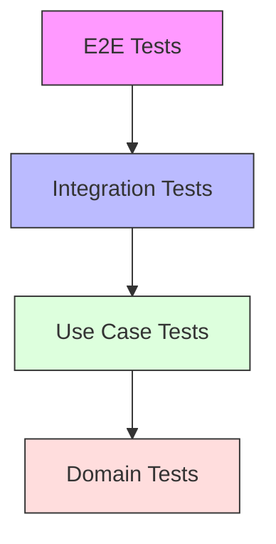

# 🧪 Clean Architecture Testing Strategy Documentation

## Overview and Testing Philosophy <a name="overview"></a>

### Testing Objectives
- Ensure business rules integrity
- Validate layer boundaries
- Verify dependency contracts
- Maintain system reliability
- Support refactoring
- Document behavior

### Testing Structure



## Testing Pyramid <a name="pyramid"></a>

### Test Distribution

| Layer | Coverage Target | Test Types |
|-------|----------------|------------|
| Domain | 100% | Unit Tests |
| Use Cases | 90% | Integration Tests |
| Infrastructure | 80% | Integration Tests |
| Presentation | 70% | E2E Tests |

## Layer-Specific Testing Strategies <a name="layers"></a>

### 1. Domain Layer Testing

```typescript
// 1. Entity Testing
describe('Order Entity', () => {
    let order: Order;

    beforeEach(() => {
        order = new Order({
            id: 'order-1',
            userId: 'user-1',
            items: [
                new OrderItem('product-1', 2, new Money(100)),
                new OrderItem('product-2', 1, new Money(50))
            ]
        });
    });

    describe('calculateTotal', () => {
        it('should calculate correct total', () => {
            // Act
            const total = order.calculateTotal();

            // Assert
            expect(total.amount).toBe(250);
        });
    });

    describe('addItem', () => {
        it('should add item and recalculate total', () => {
            // Arrange
            const newItem = new OrderItem('product-3', 1, new Money(75));

            // Act
            order.addItem(newItem);

            // Assert
            expect(order.items).toHaveLength(3);
            expect(order.calculateTotal().amount).toBe(325);
        });

        it('should throw error when adding duplicate item', () => {
            // Arrange
            const duplicateItem = new OrderItem('product-1', 1, new Money(100));

            // Act & Assert
            expect(() => order.addItem(duplicateItem))
                .toThrow(DuplicateOrderItemError);
        });
    });
});

// 2. Value Object Testing
describe('Email Value Object', () => {
    it('should create valid email', () => {
        // Arrange & Act
        const email = new Email('test@example.com');

        // Assert
        expect(email.value).toBe('test@example.com');
    });

    it('should throw error for invalid email', () => {
        // Act & Assert
        expect(() => new Email('invalid-email'))
            .toThrow(InvalidEmailError);
    });
});
```

### 2. Use Case Testing

```typescript
describe('CreateOrderUseCase', () => {
    let useCase: CreateOrderUseCase;
    let orderRepository: MockOrderRepository;
    let paymentService: MockPaymentService;
    let eventBus: MockEventBus;

    beforeEach(() => {
        orderRepository = new MockOrderRepository();
        paymentService = new MockPaymentService();
        eventBus = new MockEventBus();

        useCase = new CreateOrderUseCase(
            orderRepository,
            paymentService,
            eventBus
        );
    });

    describe('execute', () => {
        it('should create order successfully', async () => {
            // Arrange
            const request = createValidOrderRequest();
            orderRepository.findById.mockResolvedValue(null);
            orderRepository.save.mockResolvedValue(createOrderEntity());
            paymentService.process.mockResolvedValue({ success: true });

            // Act
            const result = await useCase.execute(request);

            // Assert
            expect(result.orderId).toBeDefined();
            expect(orderRepository.save).toHaveBeenCalledWith(
                expect.objectContaining({
                    userId: request.userId,
                    items: expect.arrayContaining([
                        expect.objectContaining({
                            productId: request.items[0].productId
                        })
                    ])
                })
            );
            expect(eventBus.publish).toHaveBeenCalledWith(
                expect.objectContaining({
                    type: 'OrderCreated'
                })
            );
        });

        it('should handle payment failure', async () => {
            // Arrange
            const request = createValidOrderRequest();
            paymentService.process.mockRejectedValue(
                new PaymentFailedError('Insufficient funds')
            );

            // Act & Assert
            await expect(useCase.execute(request))
                .rejects
                .toThrow(PaymentFailedError);
        });
    });
});
```

### 3. Infrastructure Layer Testing

```typescript
describe('OrderRepositoryImpl', () => {
    let repository: OrderRepositoryImpl;
    let database: MockDatabase;

    beforeEach(async () => {
        database = new MockDatabase();
        repository = new OrderRepositoryImpl(database);
    });

    describe('save', () => {
        it('should persist order', async () => {
            // Arrange
            const order = createTestOrder();
            database.insert.mockResolvedValue({ id: 'new-id' });

            // Act
            const savedOrder = await repository.save(order);

            // Assert
            expect(database.insert).toHaveBeenCalledWith(
                'orders',
                expect.objectContaining({
                    userId: order.userId,
                    status: order.status
                })
            );
            expect(savedOrder.id).toBe('new-id');
        });
    });

    describe('findById', () => {
        it('should return null for non-existent order', async () => {
            // Arrange
            database.findOne.mockResolvedValue(null);

            // Act
            const result = await repository.findById('non-existent');

            // Assert
            expect(result).toBeNull();
        });

        it('should map database record to domain entity', async () => {
            // Arrange
            const dbRecord = createTestDbRecord();
            database.findOne.mockResolvedValue(dbRecord);

            // Act
            const result = await repository.findById(dbRecord.id);

            // Assert
            expect(result).toBeInstanceOf(Order);
            expect(result?.id).toBe(dbRecord.id);
            expect(result?.status).toBe(OrderStatus.PENDING);
        });
    });
});
```

### 4. Integration Testing

```typescript
describe('Order Management Integration', () => {
    let app: TestApplication;
    let database: TestDatabase;
    let messageBus: TestMessageBus;

    beforeAll(async () => {
        app = await TestApplication.create({
            database: TestDatabase.create(),
            messageBus: TestMessageBus.create()
        });
    });

    afterAll(async () => {
        await app.shutdown();
    });

    beforeEach(async () => {
        await database.clear();
        await messageBus.clear();
    });

    describe('Order Creation Flow', () => {
        it('should handle complete order creation flow', async () => {
            // Arrange
            const request = createOrderRequest();

            // Act
            const response = await app.executeUseCase(
                'CreateOrder',
                request
            );

            // Assert
            // 1. Check response
            expect(response.orderId).toBeDefined();
            expect(response.status).toBe('PENDING');

            // 2. Verify database state
            const savedOrder = await database.findOrder(response.orderId);
            expect(savedOrder).toBeDefined();
            expect(savedOrder.status).toBe('PENDING');

            // 3. Verify events
            const publishedEvents = await messageBus.getPublishedEvents();
            expect(publishedEvents).toContainEqual(
                expect.objectContaining({
                    type: 'OrderCreated',
                    payload: expect.objectContaining({
                        orderId: response.orderId
                    })
                })
            );
        });
    });
});
```

### 5. End-to-End Testing

```typescript
describe('Order API', () => {
    let app: INestApplication;
    let authToken: string;

    beforeAll(async () => {
        app = await createTestApplication();
        authToken = await getTestUserToken();
    });

    afterAll(async () => {
        await app.close();
    });

    describe('POST /api/orders', () => {
        it('should create order successfully', async () => {
            // Arrange
            const request = createValidOrderRequest();

            // Act
            const response = await request(app.getHttpServer())
                .post('/api/orders')
                .set('Authorization', `Bearer ${authToken}`)
                .send(request);

            // Assert
            expect(response.status).toBe(201);
            expect(response.body).toMatchObject({
                success: true,
                data: {
                    orderId: expect.any(String),
                    status: 'PENDING'
                }
            });

            // Verify order creation in database
            const order = await getOrderFromDatabase(
                response.body.data.orderId
            );
            expect(order).toBeDefined();
            expect(order.status).toBe('PENDING');
        });
    });
});
```

## Test Infrastructure Setup <a name="infrastructure"></a>

### 1. Test Container

```typescript
class TestContainer {
    private container: Map<string, any> = new Map();

    register<T>(token: string, implementation: T): void {
        this.container.set(token, implementation);
    }

    resolve<T>(token: string): T {
        const implementation = this.container.get(token);
        if (!implementation) {
            throw new Error(`No implementation found for ${token}`);
        }
        return implementation;
    }

    registerMock<T>(token: string): jest.Mocked<T> {
        const mock = this.createMock<T>();
        this.register(token, mock);
        return mock;
    }

    private createMock<T>(): jest.Mocked<T> {
        return {
            [Symbol.iterator]: jest.fn(),
        } as jest.Mocked<T>;
    }
}
```

### 2. Test Database

```typescript
class TestDatabase {
    private connection: Connection;

    static async create(): Promise<TestDatabase> {
        const database = new TestDatabase();
        await database.connect();
        return database;
    }

    async connect(): Promise<void> {
        this.connection = await createConnection({
            type: 'sqlite',
            database: ':memory:',
            entities: ['src/**/*.entity.ts'],
            synchronize: true
        });
    }

    async clear(): Promise<void> {
        const entities = this.connection.entityMetadatas;
        for (const entity of entities) {
            const repository = this.connection.getRepository(entity.name);
            await repository.clear();
        }
    }

    async close(): Promise<void> {
        await this.connection.close();
    }
}
```

## Best Practices & Guidelines <a name="best-practices"></a>

### 1. Test Organization

```typescript
// Group tests by feature
describe('Order Management', () => {
    describe('Order Creation', () => {
        // Happy path scenarios
        describe('when valid request', () => {
            it('should create order successfully');
            it('should generate order number');
            it('should calculate total correctly');
        });

        // Error scenarios
        describe('when invalid request', () => {
            it('should reject empty order');
            it('should validate product existence');
            it('should check stock availability');
        });
    });

    describe('Order Cancellation', () => {
        // Test scenarios...
    });
});
```

### 2. Test Data Factories

```typescript
class OrderTestFactory {
    static createOrder(overrides: Partial<OrderProps> = {}): Order {
        return new Order({
            id: 'test-order-1',
            userId: 'test-user-1',
            items: [
                new OrderItem('product-1', 2, new Money(100))
            ],
            status: OrderStatus.PENDING,
            ...overrides
        });
    }

    static createOrderRequest(
        overrides: Partial<CreateOrderRequest> = {}
    ): CreateOrderRequest {
        return {
            userId: 'test-user-1',
            items: [
                {
                    productId: 'product-1',
                    quantity: 2
                }
            ],
            ...overrides
        };
    }
}
```

## Anti-Patterns <a name="anti-patterns"></a>

### ❌ Common Mistakes

1. **Testing Implementation Details**
```typescript
// Bad: Testing private methods
describe('OrderService', () => {
    it('should call private method', () => {
        const service = new OrderService();
        // @ts-ignore accessing private method
        expect(service.calculateDiscount()).toBe(10);
    });
});
```

2. **Mocking Everything**
```typescript
// Bad: Excessive mocking
describe('CreateOrderUseCase', () => {
    it('should create order', async () => {
        // Mocking every single dependency
        const orderRepo = mock<OrderRepository>();
        const userRepo = mock<UserRepository>();
        const productRepo = mock<ProductRepository>();
        const paymentService = mock<PaymentService>();
        const emailService = mock<EmailService>();
        const logger = mock<Logger>();
    });
});
```

### ✅ Correct Implementations

1. **Testing Behavior**
```typescript
// Good: Testing observable behavior
describe('Order', () => {
    it('should calculate total with discounts', () => {
        const order = OrderTestFactory.createOrder({
            items: [
                new OrderItem('product-1', 2, new Money(100)),
                new OrderItem('product-2', 1, new Money(50))
            ]
        });

        const total = order.calculateTotal();

        expect(total.amount).toBe(250);
    });
});
```

2. **Smart Mocking**
```typescript
// Good: Minimal mocking
describe('CreateOrderUseCase', () => {
    it('should create order', async () => {
        const orderRepo = mock<OrderRepository>();
        // Only mock what's needed for the test
        orderRepo.save.mockResolvedValue(
            OrderTestFactory.createOrder()
        );

        const useCase = new CreateOrderUseCase(orderRepo);
        const result = await useCase.execute(
            OrderTestFactory.createOrderRequest()
        );

        expect(result.orderId).toBeDefined();
    });
});
```

## Real-world Examples <a name="examples"></a>

### E-commerce Testing Suite

```typescript
describe('E-commerce System', () => {
    describe('Shopping Cart Management', () => {
        let cartService: ShoppingCartService;
        let productRepository: MockProductRepository;

        beforeEach(() => {
            productRepository = new MockProductRepository();
            cartService = new ShoppingCartService(productRepository);
        });

        describe('Adding Items', () => {
            it('should add item to empty cart', async () => {
                // Arrange
                const cart = new ShoppingCart('user-1');
                const product = ProductTestFactory.create();
                productRepository.findById.mockResolvedValue(product);