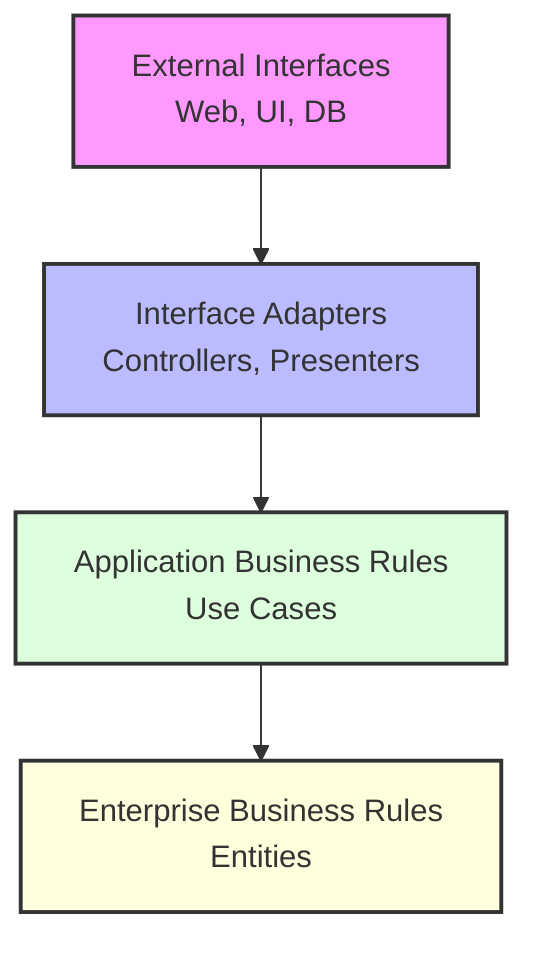
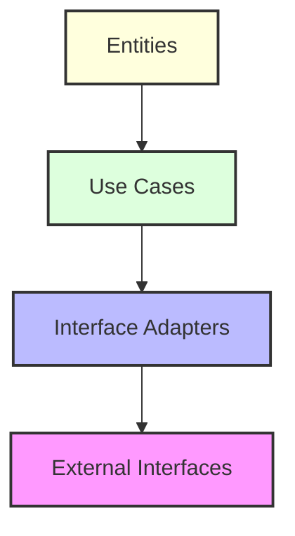

# 🏛️ Introduction to Clean Architecture

## 1. Overview and Problem Statement

### Definition
Clean Architecture is a software design philosophy that separates concerns into concentric layers, emphasizing independence of business rules from frameworks, databases, and interface details. It was introduced by Robert C. Martin ("Uncle Bob") and builds upon earlier layered architecture patterns.

### Problems Solved
- Coupling to frameworks and technologies
- Difficulty in testing
- Mixed business and technical concerns
- Complex maintenance and evolution
- Dependency management challenges
- System comprehension and navigation

### Business Value
- Reduced long-term maintenance costs
- Easier technology migrations
- Improved testability
- Better team organization
- Faster onboarding
- Enhanced system longevity

## 2. 🏗️ Architectural Layers



### Core Layers

1. **Entities** (Enterprise Business Rules)
   - Core business rules
   - Pure domain objects
   - Framework independent
   - Highest level abstractions

2. **Use Cases** (Application Business Rules)
   - Application-specific business rules
   - Orchestration of entities
   - Implementation of business operations
   - Pure business logic

3. **Interface Adapters**
   - Controllers
   - Presenters
   - Gateways
   - Data transformers

4. **Frameworks & Drivers**
   - Web frameworks
   - Databases
   - UI components
   - External services

## 3. 💻 Implementation Example

### Domain Entity Layer

```java
// Core domain entity - most stable, innermost layer
public class User {
    private final UserId id;
    private Email email;
    private Name name;
    private Password password;

    public User(UserId id, Email email, Name name, Password password) {
        this.id = id;
        this.email = email;
        this.name = name;
        this.password = password;
    }

    public void updateEmail(Email newEmail) {
        // Business rule: Email format validation
        if (!newEmail.isValid()) {
            throw new InvalidEmailException();
        }
        this.email = newEmail;
    }

    // Domain behavior methods
    public boolean authenticate(Password password) {
        return this.password.matches(password);
    }
}

// Value Objects
public record Email(String value) {
    public Email {
        if (!isValid(value)) {
            throw new InvalidEmailException(value);
        }
    }

    public boolean isValid() {
        return value != null && 
               value.matches("^[A-Za-z0-9+_.-]+@(.+)$");
    }
}
```

### Use Case Layer

```java
// Use case implementation
public class CreateUserUseCase implements CreateUser {
    private final UserRepository userRepository;
    private final PasswordEncoder passwordEncoder;
    private final UserPresenter presenter;

    public CreateUserUseCase(
            UserRepository userRepository,
            PasswordEncoder passwordEncoder,
            UserPresenter presenter) {
        this.userRepository = userRepository;
        this.passwordEncoder = passwordEncoder;
        this.presenter = presenter;
    }

    @Override
    public void execute(CreateUserRequest request) {
        // 1. Business rules validation
        validateRequest(request);

        // 2. Create domain entity
        User user = new User(
            new UserId(),
            new Email(request.getEmail()),
            new Name(request.getName()),
            passwordEncoder.encode(request.getPassword())
        );

        // 3. Persist entity
        try {
            userRepository.save(user);
            presenter.presentSuccess(new CreateUserResponse(user));
        } catch (Exception e) {
            presenter.presentError(e);
        }
    }
}

// Use case boundary
public interface CreateUser {
    void execute(CreateUserRequest request);
}

// Input/Output data structures
public record CreateUserRequest(
    String email,
    String name,
    String password
) {}

public record CreateUserResponse(
    String id,
    String email,
    String name
) {}
```

### Interface Adapters Layer

```java
// Controller
@RestController
public class UserController {
    private final CreateUser createUser;
    private final GetUser getUser;

    public UserController(CreateUser createUser, GetUser getUser) {
        this.createUser = createUser;
        this.getUser = getUser;
    }

    @PostMapping("/users")
    public ResponseEntity<CreateUserResponse> createUser(@RequestBody CreateUserRequest request) {
        return createUserUseCase.execute(request);
    }
}

// Repository Interface (in domain)
public interface UserRepository {
    User save(User user);
    Optional<User> findById(UserId id);
    void delete(UserId id);
}

// Repository Implementation (in infrastructure)
@Repository
public class JpaUserRepository implements UserRepository {
    private final JpaUserEntityRepository jpaRepository;
    private final UserMapper mapper;

    @Override
    public User save(User user) {
        UserEntity entity = mapper.toEntity(user);
        UserEntity saved = jpaRepository.save(entity);
        return mapper.toDomain(saved);
    }
}
```

### Infrastructure Layer

```java
// Database Entity
@Entity
@Table(name = "users")
public class UserEntity {
    @Id
    private String id;
    
    @Column(unique = true)
    private String email;
    
    private String name;
    private String passwordHash;
    
    // JPA required
    protected UserEntity() {}
    
    // Constructor and getters
}

// Mapper between domain and persistence
public class UserMapper {
    public UserEntity toEntity(User user) {
        return new UserEntity(
            user.getId().toString(),
            user.getEmail().value(),
            user.getName().value(),
            user.getPassword().hash()
        );
    }
    
    public User toDomain(UserEntity entity) {
        return new User(
            new UserId(entity.getId()),
            new Email(entity.getEmail()),
            new Name(entity.getName()),
            Password.fromHash(entity.getPasswordHash())
        );
    }
}
```

## 4. 🤔 Dependency Rule

### The Fundamental Rule
Dependencies can only point inward, toward higher-level policies (core business rules).



### Dependency Inversion Examples

```java
// Domain layer defines interface
public interface PasswordEncoder {
    Password encode(String rawPassword);
    boolean matches(String rawPassword, Password encoded);
}

// Infrastructure layer implements it
public class BCryptPasswordEncoder implements PasswordEncoder {
    private final BCrypt.Hasher hasher;
    
    @Override
    public Password encode(String rawPassword) {
        String hash = hasher.hash(rawPassword);
        return Password.fromHash(hash);
    }
}
```

## 5. ⚡ Key Principles

### SOLID in Clean Architecture

1. **Single Responsibility**
```java
// Good: Focused responsibility
public class UserRegistrationUseCase {
    public void registerUser(RegistrationRequest request) {
        // Only handles user registration logic
    }
}

// Bad: Mixed responsibilities
public class UserService {
    public void registerUser() { }
    public void sendEmail() { }
    public void updateProfile() { }
}
```

2. **Open/Closed**
```java
// Extensible through interfaces
public interface NotificationSender {
    void send(Notification notification);
}

// New implementations without modifying existing code
public class EmailNotifier implements NotificationSender { }
public class SMSNotifier implements NotificationSender { }
```

## 6. 📊 Testing Strategy

### Testing Pyramid in Clean Architecture

```java
// 1. Domain Entity Tests
@Test
void userShouldValidateEmail() {
    assertThrows(InvalidEmailException.class, 
        () -> new User(new Email("invalid")));
}

// 2. Use Case Tests
@Test
void createUserShouldSucceed() {
    CreateUserRequest request = new CreateUserRequest("test@email.com", "Test User", "password");
    createUserUseCase.execute(request);
    
    verify(userRepository).save(any(User.class));
    verify(presenter).presentSuccess(any(CreateUserResponse.class));
}

// 3. Integration Tests
@SpringBootTest
class UserControllerIntegrationTest {
    @Test
    void shouldCreateUser() {
        webTestClient.post().uri("/users")
            .bodyValue(new CreateUserRequest("test@email.com", "Test", "password"))
            .exchange()
            .expectStatus().isCreated();
    }
}
```

## 7. ❌ Common Anti-patterns

### Violations to Avoid

1. **Exposing Domain Objects**
```java
// Wrong: Exposing domain objects
@GetMapping("/users/{id}")
public User getUser(@PathVariable String id) {
    return userRepository.findById(id);
}

// Better: Using dedicated DTOs
@GetMapping("/users/{id}")
public UserResponse getUser(@PathVariable String id) {
    User user = userRepository.findById(id);
    return mapper.toResponse(user);
}
```

2. **Dependency Rule Violations**
```java
// Wrong: Domain depending on framework
@Entity
public class User {
    @Id
    private Long id;
}

// Better: Pure domain model
public class User {
    private final UserId id;
}
```

## 8. 🌟 Real-world Examples

### E-commerce System Example
```java
// Domain Entity
public class Order {
    private OrderId id;
    private CustomerId customerId;
    private List<OrderItem> items;
    private OrderStatus status;
    
    public Money calculateTotal() {
        return items.stream()
            .map(OrderItem::getSubtotal)
            .reduce(Money.zero(), Money::add);
    }
    
    public void addItem(Product product, int quantity) {
        validateQuantity(quantity);
        items.add(new OrderItem(product, quantity));
    }
}

// Use Case
public class PlaceOrderUseCase {
    private final OrderRepository orderRepository;
    private final PaymentGateway paymentGateway;
    
    public void execute(PlaceOrderRequest request) {
        Order order = new Order(request.getCustomerId());
        request.getItems().forEach(item -> 
            order.addItem(item.getProduct(), item.getQuantity()));
            
        orderRepository.save(order);
        paymentGateway.processPayment(order);
    }
}
```

## 9. 📚 Resources and References

### Books
- "Clean Architecture" by Robert C. Martin
- "Get Your Hands Dirty on Clean Architecture" by Tom Hombergs
- "Implementing Domain-Driven Design" by Vaughn Vernon

### Articles
- [The Clean Architecture](https://blog.cleancoder.com/uncle-bob/2012/08/13/the-clean-architecture.html)
- [Clean Architecture with Spring Boot](https://www.baeldung.com/spring-boot-clean-architecture)

### Tools and Frameworks
- [ArchUnit](https://www.archunit.org/) - Architecture testing
- [Spring Boot](https://spring.io/projects/spring-boot)
- [Quarkus](https://quarkus.io/)