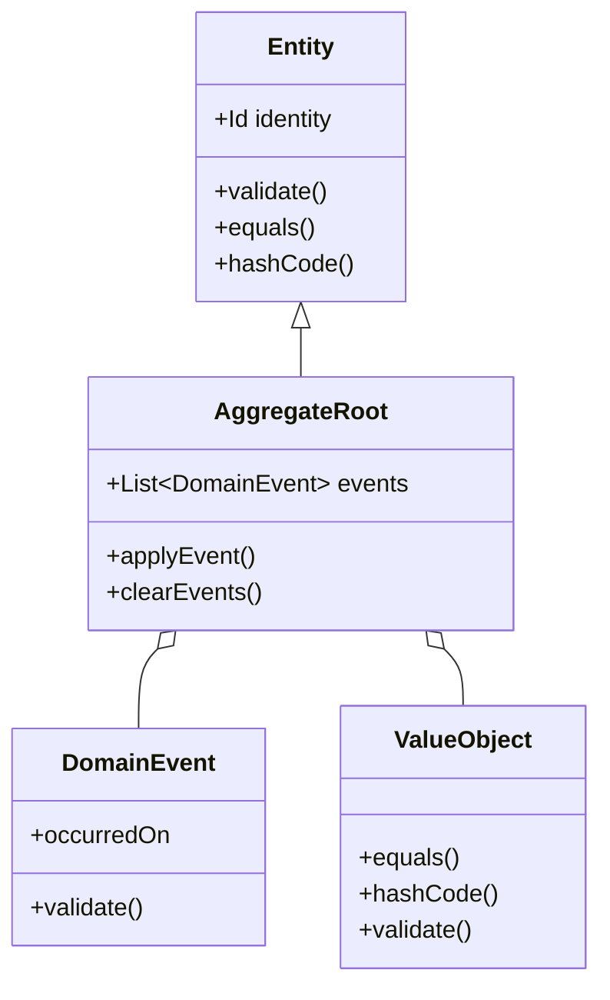

# 🏛️ Entities Layer in Clean Architecture

## 1. Overview and Purpose

### Definition
The Entities layer represents enterprise-wide business rules and contains the core business objects of the application. These objects encapsulate the most general and high-level rules that the business operates with.

### Key Characteristics
- Independent of application specifics
- Pure business logic
- No framework dependencies
- High stability
- Rich behavior
- Self-contained validation

### Business Value
- Consistent business rules
- Reduced duplication
- Better maintainability
- Clear domain model
- Enhanced testability
- Business-driven design

## 2. 🏗️ Core Components



## 3. 💻 Implementation Examples

### Entity Implementation

```java
// Base Entity Class
public abstract class Entity<ID extends Identifier> {
    protected final ID id;
    
    protected Entity(ID id) {
        this.id = Objects.requireNonNull(id, "ID must not be null");
    }
    
    @Override
    public boolean equals(Object o) {
        if (this == o) return true;
        if (o == null || getClass() != o.getClass()) return false;
        Entity<?> entity = (Entity<?>) o;
        return id.equals(entity.id);
    }
    
    @Override
    public int hashCode() {
        return Objects.hash(id);
    }
}

// User Entity
public class User extends Entity<UserId> {
    private Email email;
    private Name name;
    private Password password;
    private Role role;
    private UserStatus status;
    
    private User(UserId id, Email email, Name name, Password password) {
        super(id);
        this.email = Objects.requireNonNull(email);
        this.name = Objects.requireNonNull(name);
        this.password = Objects.requireNonNull(password);
        this.role = Role.USER;
        this.status = UserStatus.ACTIVE;
        validate();
    }
    
    // Factory method
    public static User create(Email email, Name name, Password password) {
        return new User(UserId.generate(), email, name, password);
    }
    
    // Business methods
    public void changePassword(Password currentPassword, Password newPassword) {
        if (!this.password.matches(currentPassword)) {
            throw new InvalidPasswordException();
        }
        this.password = newPassword;
    }
    
    public void deactivate() {
        if (this.status == UserStatus.INACTIVE) {
            throw new UserAlreadyInactiveException();
        }
        this.status = UserStatus.INACTIVE;
    }
    
    // Validation
    private void validate() {
        if (email == null || name == null || password == null) {
            throw new InvalidUserException("Required fields cannot be null");
        }
    }
}
```

### Value Objects

```java
// Email Value Object
public record Email(String value) {
    public Email {
        Objects.requireNonNull(value, "Email value must not be null");
        if (!isValid(value)) {
            throw new InvalidEmailException(value);
        }
    }
    
    private static boolean isValid(String email) {
        return email.matches("^[A-Za-z0-9+_.-]+@(.+)$");
    }
}

// Money Value Object
public record Money(BigDecimal amount, Currency currency) {
    public Money {
        Objects.requireNonNull(amount, "Amount must not be null");
        Objects.requireNonNull(currency, "Currency must not be null");
        if (amount.scale() > currency.getDefaultFractionDigits()) {
            throw new InvalidMoneyException("Invalid scale for currency");
        }
    }
    
    public static Money of(BigDecimal amount, Currency currency) {
        return new Money(amount, currency);
    }
    
    public static Money zero(Currency currency) {
        return new Money(BigDecimal.ZERO, currency);
    }
    
    public Money add(Money other) {
        if (!this.currency.equals(other.currency)) {
            throw new CurrencyMismatchException();
        }
        return new Money(this.amount.add(other.amount), this.currency);
    }
    
    public Money subtract(Money other) {
        if (!this.currency.equals(other.currency)) {
            throw new CurrencyMismatchException();
        }
        return new Money(this.amount.subtract(other.amount), this.currency);
    }
    
    public Money multiply(BigDecimal multiplier) {
        return new Money(this.amount.multiply(multiplier), this.currency);
    }
}
```

### Aggregate Root

```java
public class Order extends AggregateRoot<OrderId> {
    private CustomerId customerId;
    private List<OrderLine> orderLines;
    private OrderStatus status;
    private Money total;
    private Instant createdAt;
    
    private Order(OrderId id, CustomerId customerId) {
        super(id);
        this.customerId = customerId;
        this.orderLines = new ArrayList<>();
        this.status = OrderStatus.DRAFT;
        this.total = Money.zero(Currency.getInstance("USD"));
        this.createdAt = Instant.now();
    }
    
    public static Order create(CustomerId customerId) {
        Order order = new Order(OrderId.generate(), customerId);
        order.addDomainEvent(new OrderCreatedEvent(order.id));
        return order;
    }
    
    public void addLine(ProductId productId, int quantity, Money unitPrice) {
        validateOrderIsModifiable();
        OrderLine line = new OrderLine(productId, quantity, unitPrice);
        orderLines.add(line);
        recalculateTotal();
        addDomainEvent(new OrderLineAddedEvent(id, line));
    }
    
    public void submit() {
        validateCanSubmit();
        this.status = OrderStatus.SUBMITTED;
        addDomainEvent(new OrderSubmittedEvent(id));
    }
    
    private void validateCanSubmit() {
        if (status != OrderStatus.DRAFT) {
            throw new InvalidOrderStateException(
                "Only draft orders can be submitted"
            );
        }
        if (orderLines.isEmpty()) {
            throw new InvalidOrderException(
                "Cannot submit empty order"
            );
        }
    }
    
    private void recalculateTotal() {
        this.total = orderLines.stream()
            .map(OrderLine::getTotal)
            .reduce(Money.zero(Currency.getInstance("USD")), Money::add);
    }
}

// Domain Events
public record OrderCreatedEvent(OrderId orderId) 
    implements DomainEvent {}

public record OrderLineAddedEvent(OrderId orderId, OrderLine line) 
    implements DomainEvent {}

public record OrderSubmittedEvent(OrderId orderId) 
    implements DomainEvent {}
```

### Domain Services

```java
// Domain Service Interface
public interface PricingService {
    Money calculatePrice(Product product, int quantity);
    Money applyDiscount(Money price, Discount discount);
}

// Domain Service Implementation
public class DefaultPricingService implements PricingService {
    @Override
    public Money calculatePrice(Product product, int quantity) {
        Money unitPrice = product.getPrice();
        return unitPrice.multiply(BigDecimal.valueOf(quantity));
    }
    
    @Override
    public Money applyDiscount(Money price, Discount discount) {
        BigDecimal discountFactor = BigDecimal.ONE.subtract(
            discount.percentage().divide(
                BigDecimal.valueOf(100),
                2,
                RoundingMode.HALF_UP
            )
        );
        return price.multiply(discountFactor);
    }
}
```

## 4. 🧪 Testing Entities

```java
public class OrderTest {
    private Order order;
    private CustomerId customerId;
    
    @BeforeEach
    void setUp() {
        customerId = CustomerId.generate();
        order = Order.create(customerId);
    }
    
    @Test
    void shouldCreateOrderSuccessfully() {
        assertNotNull(order.getId());
        assertEquals(customerId, order.getCustomerId());
        assertEquals(OrderStatus.DRAFT, order.getStatus());
        assertTrue(order.getOrderLines().isEmpty());
        assertEquals(Money.zero(Currency.getInstance("USD")), order.getTotal());
    }
    
    @Test
    void shouldAddLineSuccessfully() {
        // Arrange
        ProductId productId = ProductId.generate();
        Money unitPrice = Money.of(BigDecimal.TEN, Currency.getInstance("USD"));
        
        // Act
        order.addLine(productId, 2, unitPrice);
        
        // Assert
        assertEquals(1, order.getOrderLines().size());
        assertEquals(Money.of(BigDecimal.valueOf(20), Currency.getInstance("USD")), 
                    order.getTotal());
    }
    
    @Test
    void shouldNotSubmitEmptyOrder() {
        assertThrows(InvalidOrderException.class, () -> 
            order.submit()
        );
    }
}
```

## 5. 🎯 Best Practices

### 1. Encapsulation

```java
// Good: Proper encapsulation
public class Product {
    private final ProductId id;
    private Money price;
    private int stockLevel;
    
    public void adjustStock(int quantity) {
        if (stockLevel + quantity < 0) {
            throw new InsufficientStockException();
        }
        stockLevel += quantity;
    }
}

// Bad: Exposed internals
public class Product {
    public int stockLevel;  // Direct field access
    
    public void setStockLevel(int level) {  // No validation
        this.stockLevel = level;
    }
}
```

### 2. Rich Domain Model

```java
// Good: Rich behavior
public class Order {
    public void cancel() {
        validateCanBeCancelled();
        this.status = OrderStatus.CANCELLED;
        this.cancelledAt = Instant.now();
        addDomainEvent(new OrderCancelledEvent(this.id));
    }
    
    private void validateCanBeCancelled() {
        if (status == OrderStatus.DELIVERED) {
            throw new InvalidOrderStateException(
                "Delivered orders cannot be cancelled"
            );
        }
    }
}

// Bad: Anemic domain model
public class Order {
    private OrderStatus status;
    private Instant cancelledAt;
    
    // Just getters and setters, no behavior
    public void setStatus(OrderStatus status) {
        this.status = status;
    }
    
    public void setCancelledAt(Instant cancelledAt) {
        this.cancelledAt = cancelledAt;
    }
}
```

### 3. Immutable Value Objects

```java
// Good: Immutable value object
public record Address(
    String street,
    String city,
    String country,
    String postalCode
) {
    public Address {
        Objects.requireNonNull(street, "Street must not be null");
        Objects.requireNonNull(city, "City must not be null");
        Objects.requireNonNull(country, "Country must not be null");
        Objects.requireNonNull(postalCode, "Postal code must not be null");
    }
    
    public Address withStreet(String newStreet) {
        return new Address(newStreet, city, country, postalCode);
    }
}

// Bad: Mutable value object
public class Address {
    private String street;
    private String city;
    
    public void setStreet(String street) {
        this.street = street;
    }
}
```

## 6. 🚫 Anti-patterns

### Common Mistakes to Avoid

1. **Framework Dependencies**
```java
// Wrong: Framework dependency in entity
@Entity
@Table(name = "users")
public class User {
    @Id
    @GeneratedValue
    private Long id;
    
    @Column(nullable = false)
    private String email;
}

// Better: Pure domain entity
public class User extends Entity<UserId> {
    private final Email email;
    
    private User(UserId id, Email email) {
        super(id);
        this.email = email;
    }
}
```

2. **Business Logic Outside Entities**
```java
// Wrong: Business logic in service
public class OrderService {
    public void cancelOrder(Order order) {
        if (order.getStatus() == OrderStatus.DELIVERED) {
            throw new InvalidOrderStateException();
        }
        order.setStatus(OrderStatus.CANCELLED);
        order.setCancelledAt(Instant.now());
    }
}

// Better: Business logic in entity
public class Order extends Entity<OrderId> {
    public void cancel() {
        validateCanBeCancelled();
        this.status = OrderStatus.CANCELLED;
        this.cancelledAt = Instant.now();
    }
}
```

## 7. 📚 References

### Books
- "Domain-Driven Design" by Eric Evans
- "Clean Architecture" by Robert C. Martin
- "Implementing Domain-Driven Design" by Vaughn Vernon

### Articles
- [Entity vs Value Object](https://enterprisecraftsmanship.com/posts/entity-vs-value-object-the-ultimate-list-of-differences/)
- [DDD Aggregates](https://martinfowler.com/bliki/DDD_Aggregate.html)