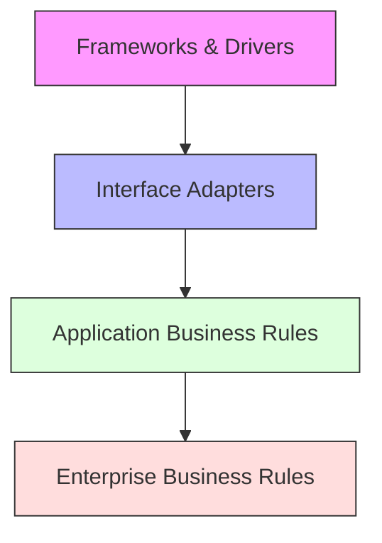

# 🏗️ Clean Architecture Frameworks Documentation

## Overview and Problem Statement <a name="overview"></a>

### Definition
The Frameworks layer in Clean Architecture represents the outermost layer that contains frameworks, tools, and external resources that your application interacts with. This layer includes databases, web frameworks, UI frameworks, and any third-party dependencies.

### Problems Solved
- Dependency management and isolation
- Technology lock-in prevention
- System maintainability
- Testing complexity
- System evolution and adaptation

### Business Value
- Reduced maintenance costs
- Easier technology migrations
- Improved system longevity
- Better testing capabilities
- Faster onboarding of new developers

## Detailed Solution/Architecture <a name="solution"></a>

### Core Concepts
1. **Dependency Rule**: Dependencies always point inward
2. **Framework Independence**: Business logic remains independent of frameworks
3. **Pluggability**: Frameworks are plug-in architectures
4. **Isolation**: Framework code is isolated from domain logic

### Key Components


### Implementation Types
1. **Database Frameworks**
   - ORM layers
   - Database drivers
   - Connection pools

2. **Web Frameworks**
   - Request handling
   - Routing
   - Middleware

3. **UI Frameworks**
   - View rendering
   - State management
   - Component lifecycle

## Technical Implementation <a name="implementation"></a>

### Database Framework Example

```typescript
// Framework Layer - Database Implementation
import { DatabaseFramework } from 'database-framework';

export class PostgresDatabase implements DatabaseGateway {
    private db: DatabaseFramework;
    
    constructor(config: DbConfig) {
        this.db = new DatabaseFramework(config);
    }
    
    async findUser(id: string): Promise<User> {
        // Framework-specific implementation
        const result = await this.db.query(
            'SELECT * FROM users WHERE id = $1',
            [id]
        );
        
        // Map to domain model
        return this.mapToDomainModel(result);
    }
    
    private mapToDomainModel(raw: any): User {
        return new User({
            id: raw.id,
            name: raw.name,
            email: raw.email
        });
    }
}
```

### Web Framework Example

```typescript
// Framework Layer - Web Framework Implementation
import { Express } from 'express';
import { UserController } from './controllers/UserController';

export class WebFrameworkAdapter {
    private app: Express;
    private userController: UserController;
    
    constructor(app: Express, userController: UserController) {
        this.app = app;
        this.userController = userController;
        this.setupRoutes();
    }
    
    private setupRoutes(): void {
        this.app.get('/users/:id', async (req, res) => {
            try {
                const user = await this.userController.getUser(req.params.id);
                res.json(user);
            } catch (error) {
                res.status(500).json({ error: error.message });
            }
        });
    }
}
```

## Decision Criteria & Evaluation <a name="decision-criteria"></a>

### Framework Selection Matrix

| Criteria | Weight | Description |
|----------|---------|------------|
| Maturity | High | Framework stability and community support |
| Integration Ease | Medium | Effort required to integrate with clean architecture |
| Performance | High | Resource usage and response times |
| Maintenance | Medium | Long-term maintenance requirements |
| Community | Medium | Size and activity of community |

### Limitations and Constraints
1. **Performance Overhead**
   - Additional mapping layers
   - Cross-boundary translations
   - Memory usage

2. **Development Complexity**
   - More boilerplate code
   - Steeper learning curve
   - Additional abstraction layers

## Anti-Patterns <a name="anti-patterns"></a>

### Common Mistakes

❌ **Wrong**: Direct domain logic in framework layer
```typescript
// Anti-pattern: Business logic in framework layer
app.post('/users', (req, res) => {
    if (req.body.age < 18) {
        res.status(400).json({ error: 'User must be adult' });
        return;
    }
    // Direct database operation
    db.users.create(req.body);
});
```

✅ **Correct**: Proper separation of concerns
```typescript
// Framework layer only handles HTTP concerns
app.post('/users', async (req, res) => {
    try {
        const result = await userController.createUser(req.body);
        res.status(201).json(result);
    } catch (error) {
        res.status(error.statusCode || 500).json({ error: error.message });
    }
});
```

## Best Practices & Guidelines <a name="best-practices"></a>

### Design Principles
1. **Dependency Inversion**
   - Framework dependencies should point inward
   - Use interfaces for framework integration
   - Avoid framework leakage into domain

2. **Interface Segregation**
   - Create specific interfaces for framework integration
   - Keep framework-specific code isolated
   - Use adapters for framework communication

### Security Considerations
1. **Framework Security**
   - Keep frameworks updated
   - Follow security best practices
   - Implement proper error handling

2. **Data Protection**
   - Validate input at framework boundaries
   - Sanitize data before domain processing
   - Implement proper logging

## Testing Strategies <a name="testing"></a>

### Framework Testing Approach

```typescript
describe('PostgresDatabase', () => {
    let database: PostgresDatabase;
    let mockDb: jest.Mocked<DatabaseFramework>;
    
    beforeEach(() => {
        mockDb = {
            query: jest.fn()
        } as any;
        
        database = new PostgresDatabase(mockDb);
    });
    
    it('should map database result to domain model', async () => {
        // Arrange
        const rawData = {
            id: '1',
            name: 'John',
            email: 'john@example.com'
        };
        
        mockDb.query.mockResolvedValue([rawData]);
        
        // Act
        const result = await database.findUser('1');
        
        // Assert
        expect(result).toBeInstanceOf(User);
        expect(result.id).toBe('1');
        expect(result.name).toBe('John');
    });
});
```

## Real-world Use Cases <a name="use-cases"></a>

### E-commerce Platform Example
- **Framework**: Express.js + TypeORM
- **Architecture Implementation**:
   - Framework Layer: HTTP routing, database access
   - Interface Adapters: Controllers, repositories
   - Use Cases: Order processing, inventory management
   - Entities: Order, Product, Customer

### Success Story
Major e-commerce platform successfully migrated from monolithic architecture to clean architecture:
- 50% reduction in bug reports
- 30% faster feature development
- Successful database migration with minimal downtime
- Improved team autonomy and parallel development

## References <a name="references"></a>

### Books
- "Clean Architecture" by Robert C. Martin
- "Get Your Hands Dirty on Clean Architecture" by Tom Hombergs

### Online Resources
- [Clean Architecture Blog](https://blog.cleancoder.com)
- [Martin Fowler's Architecture Guide](https://martinfowler.com/architecture)
- [Clean Architecture GitHub Examples](https://github.com/topics/clean-architecture)

### Community Resources
- Clean Architecture Discord Server
- Stack Overflow Tags: clean-architecture, framework-integration
- GitHub Discussions and Issues